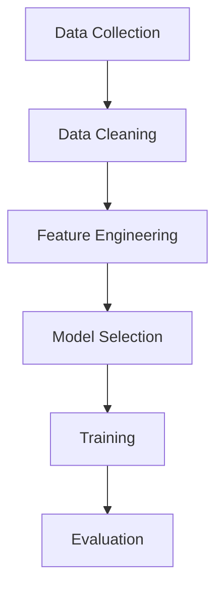

# Artificial Intelligence


## AI Evolution  (2010–2025)


### **2010–2012 | Deep Learning Revival**

**Core Papers:** Hinton et al. (2006–2012), “Deep Belief Networks,” AlexNet (2012)

**Problem solved:**

* Traditional ML (SVM, decision trees) plateaued on complex data like images, speech.
* Shallow neural networks couldn’t model hierarchical patterns.

**Efficiency gain:**

* **GPUs** and **ReLU activations** drastically improved convergence and reduced vanishing gradient problems.
* Deep Belief Networks (unsupervised layer-wise pretraining) reduced the need for manual feature engineering.

**Shortcoming:**

* Training still data-hungry and computationally expensive.
* Networks unstable for deeper layers → needed architectural innovations (ResNet, BatchNorm).


---
### About classification:


###  Classification Paradigms 

| **Aspect**                                       | **Binary Classification**                                                | **Multi-Class Classification**                                             | **Multi-Label Classification**                                                                      | **Hierarchical Multi-Label Classification (HMC)**                                                               |
| ------------------------------------------------ | ------------------------------------------------------------------------ | -------------------------------------------------------------------------- | --------------------------------------------------------------------------------------------------- | --------------------------------------------------------------------------------------------------------------- |
| **Definition**                                   | Predict **one of two** possible classes.                                 | Predict **one class** out of **three or more** mutually exclusive classes. | Predict **one or more classes simultaneously** (non-mutually exclusive).                            | Predict **one or more labels**, organized in a **class hierarchy/tree structure** (parent-child relationships). |
| **Output type**                                  | Single binary output: {0,1} or {Yes,No}.                                 | One categorical output (e.g., {A,B,C,...}).                                | A **binary vector** (e.g., [1,0,1,0]) — each element represents presence/absence of label.          | A **structured label vector/tree** — includes dependencies (e.g., selecting “Dog” implies “Animal”).            |
| **Model output layer**                           | 1 neuron with **sigmoid** activation.                                    | N neurons with **softmax** activation (probabilities sum to 1).            | N neurons with **sigmoid** activation (independent probabilities per label).                        | N neurons with **sigmoid** + constraint mechanism (enforces hierarchical consistency).                          |
| **Loss function**                                | Binary Cross-Entropy (Log Loss).                                         | Categorical Cross-Entropy.                                                 | Binary Cross-Entropy (per label).                                                                   | Hierarchical loss (e.g., weighted BCE or hierarchical cross-entropy that penalizes parent-child violations).    |
| **Evaluation metrics**                           | Accuracy, Precision, Recall, F1-score, ROC-AUC.                          | Accuracy, Macro/Micro-F1, Confusion Matrix.                                | Hamming Loss, Precision@k, Recall@k, F1-micro/macro, Subset Accuracy.                               | Hierarchical Precision/Recall/F1, Tree-induced loss, Path-based accuracy.                                       |
| **Independence assumption**                      | Two classes are **mutually exclusive**.                                  | Classes are **mutually exclusive** (only one correct).                     | Labels are **independent** — multiple may be correct.                                               | Labels are **dependent** — follow a **taxonomy or DAG** (Directed Acyclic Graph).                               |
| **Example**                                      | Spam vs. Not Spam email.                                                 | Predicting type of animal: {cat, dog, horse}.                              | Predicting movie genres: {action, comedy, drama}.                                                   | Predicting news topic hierarchy: {Politics → Election → US Presidential}.                                       |
| **Problem formulation**                          | ( y \in {0,1} )                                                          | ( y \in {1,2,...,K} )                                                      | ( y \in {0,1}^K )                                                                                   | ( y \in {0,1}^K ) with hierarchical constraints                                                                 |
| **Training data requirement**                    | Balanced or reweighted binary samples.                                   | Large, diverse labeled data covering all classes.                          | Each instance annotated with multiple labels.                                                       | Each instance labeled with multiple levels of hierarchy.                                                        |
| **Model examples**                               | Logistic Regression, SVM (binary), Decision Tree, Neural Net (1 output). | Softmax Regression, CNN classifier, Random Forest, BERT fine-tuning.       | Sigmoid-based neural network, Problem Transformation methods (Binary Relevance, Classifier Chains). | Graph Neural Networks, Hierarchical Attention Networks, Ontology-based classifiers.                             |
| **Decision boundary**                            | Linear or nonlinear separating 2 classes.                                | Multiple decision regions partitioning feature space.                      | Multiple overlapping decision boundaries — one per label.                                           | Hierarchy-aware decision boundaries (must satisfy parent-child rules).                                          |
| **Complexity**                                   | O(1) classifier.                                                         | O(K) classes → single classifier handling all.                             | O(K) binary sub-problems or one large sigmoid network.                                              | O(K) but hierarchical dependency increases computational complexity.                                            |
| **Interpretability**                             | High (easy to visualize).                                                | Moderate.                                                                  | Moderate–low (multi-dimensional outputs).                                                           | Low–complex, but interpretable via tree structure.                                                              |
| **Typical libraries / frameworks**               | scikit-learn (`LogisticRegression`)                                      | scikit-learn, TensorFlow/Keras softmax models                              | scikit-learn’s `MultiOutputClassifier`, `BinaryRelevance` from `scikit-multilearn`                  | `sklearn-hierarchical`, `keras-hmc`, ontology-based ML pipelines                                                |
| **Use cases**                                    | Credit approval, disease diagnosis (positive/negative).                  | Image classification, language identification.                             | Tag recommendation, music genre detection, toxic comment classification.                            | Document categorization with taxonomy (e.g., Wikipedia categories, product catalogs).                           |
| **Shortcomings**                                 | Limited to 2 outcomes.                                                   | Cannot assign multiple valid labels.                                       | Ignores label correlations unless modeled.                                                          | Complex to train and evaluate; label imbalance across hierarchy.                                                |
| **Improvement over predecessor**                 | —                                                                        | Extends binary to >2 classes.                                              | Removes exclusivity assumption.                                                                     | Adds semantic structure and dependency awareness.                                                               |
| **Example output (for document classification)** | “Spam”                                                                   | “Sports”                                                                   | “Sports”, “Health”                                                                                  | “News → Sports → Cricket”                                                                                       |
| **Common model architecture**                    | Single sigmoid neuron                                                    | Softmax dense layer                                                        | Multi-sigmoid output layer                                                                          | Multi-sigmoid + constraint propagation network                                                                  |
| **Evaluation difficulty**                        | Simple                                                                   | Moderate                                                                   | Hard (multi-dimensional)                                                                            | Very hard (hierarchical structure, dependency penalties)                                                        |


```
Binary Classification
     ↓
Multi-Class Classification
     ↓
Multi-Label Classification
     ↓
Hierarchical Multi-Label Classification
```


Each step generalizes the previous one:

* Binary → only 2 labels
* Multi-class → more than 2, but mutually exclusive
* Multi-label → multiple independent labels
* Hierarchical → multiple dependent labels (tree/DAG relationships)


| Scenario                          | Classification Type      | Example                       |
| --------------------------------- | ------------------------ | ----------------------------- |
| Email: Spam or Not                | Binary                   | Spam detection                |
| Image: Cat / Dog / Bird           | Multi-Class              | Vision classifier             |
| Song: Rock + Jazz + Blues         | Multi-Label              | Music genre tagging           |
| News: World → Politics → Election | Hierarchical Multi-Label | Taxonomy-based classification |

### Regression 
[ Read about Regression](machine_learning/Regression)
---


---

### **2012 | Convolutional Neural Networks (CNNs) — AlexNet**

**Core paper:** Krizhevsky et al., *ImageNet Classification with Deep CNNs (2012)*

**Problem solved:**

* Automated **feature extraction** from raw pixels.
* Eliminated need for handcrafted features (SIFT, HOG).

**Efficiency gain:**

* 10× better accuracy on ImageNet.
* Parallelized convolution on GPU hardware.
* ReLU activation → faster convergence than sigmoid/tanh.

### About Deep Belief Networks 

A **Deep Belief Network (DBN)** is a type of **generative deep learning model** composed of multiple layers of **Restricted Boltzmann Machines (RBMs)** stacked on top of each other. Each RBM learns to represent statistical dependencies between visible and hidden features in an unsupervised manner, and the layers are trained **greedily one at a time**, with each layer learning higher-level abstractions of the data. The lower layers capture simple patterns (like edges or textures), while deeper layers capture more complex structures (like shapes or semantic concepts). After this unsupervised pre-training, the entire network can be fine-tuned using supervised learning techniques such as backpropagation. DBNs were among the first architectures to successfully train **deep neural networks** before GPUs and modern activation functions made deep learning mainstream. They solved the **vanishing gradient problem** prevalent in deep networks at the time by using layer-wise unsupervised initialization. However, they became **less common** after 2012, when models like **deep feedforward networks, CNNs, and autoencoders** achieved better performance and scalability with simpler end-to-end training.


### About CNN

**Automated feature extraction using Convolutional Neural Networks (CNNs)** is a core innovation in modern deep learning, allowing models to learn meaningful visual patterns directly from raw pixel data without manual feature engineering. Instead of explicitly designing features like edges, corners, or textures, CNNs automatically discover them through **convolutional filters** that slide over input images to capture local spatial patterns. In early layers, CNNs detect low-level features (edges, colors, gradients), while deeper layers progressively learn higher-level abstractions (object parts, shapes, and complete objects). This hierarchical feature learning enables CNNs to handle complex visual recognition tasks with minimal human intervention. The network’s ability to **optimize feature representations during training** via backpropagation makes it far more efficient and scalable than traditional computer vision approaches. As a result, CNN-based automated feature extraction has become foundational in applications such as **image classification, object detection, facial recognition, and medical imaging**, effectively replacing handcrafted feature techniques like SIFT, HOG, and SURF.

As CNNs grew deeper (20, 50, 100+ layers), researchers observed:

Training error started increasing after a certain depth (not just test error).

This wasn’t due to overfitting but because deeper networks were harder to optimize.

Gradients became too small (vanished) during backpropagation, preventing earlier layers from learning effectively.

Even though deeper CNNs should learn more complex representations, in practice, they often performed worse than shallower ones.

### About ResNet 

Residual Network, introduced by He et al. (2015), modifies CNN architecture by adding shortcut (skip) connections that “bypass” one or more layers.

Instead of learning a direct mapping

it learns a residual mapping

In simple terms:
The network learns the difference (residual) between the input and the desired output — not the output itself.

**Shortcomings:**

* CNNs had local receptive fields → poor understanding of **global context**.
* Poor generalization outside training distribution.
* Required large labeled datasets.

→ Led to: **Residual Networks (ResNet)** and **Transfer Learning**.

---

### **2013–2014 | Word2Vec and Embeddings**

**Core papers:** Mikolov et al. (Google)

**Problem solved:**

* NLP models used one-hot encoding — sparse, high-dimensional, semantically empty.
* No notion of similarity between words.

**Efficiency gain:**

* Learned dense vector embeddings capturing semantic relations (e.g., king - man + woman ≈ queen).
* Enabled downstream tasks (NER, sentiment analysis) with simpler models (LSTMs, CNNs).

**Shortcomings:**

* Static embeddings → same vector for “bank” (riverbank / financial bank).
* Couldn’t model **context dependency** or word order.

→ Led to: **Contextual embeddings** like **ELMo** and **BERT**.

---

### **2014 | Generative Adversarial Networks (GANs)**

**Core paper:** Goodfellow et al. (2014)

**Problem solved:**

* Prior generative models (VAEs, RBMs) produced blurry outputs.
* Needed sharper, realistic sample generation.

**Efficiency gain:**

* Two-network adversarial setup (Generator vs Discriminator) improved realism.
* Generated high-resolution images, art, and synthetic data.

**Shortcomings:**

* **Training instability** — mode collapse, oscillations.
* Hard to evaluate output quality (no proper likelihood).
* Poor control over output attributes.

→ Led to: **Diffusion Models** (stable, probabilistic generation).

---

### **2014–2015 | Deep Reinforcement Learning**

**Core paper:** DeepMind’s DQN (2015)

**Problem solved:**

* Traditional RL couldn’t handle raw sensory input (pixels, high dimensions).
* Combined **deep learning for perception** with **Q-learning for control**.

**Efficiency gain:**

* Achieved human-level performance in Atari games.
* Learned directly from pixels → no feature engineering.

**Shortcomings:**

* Sample inefficient (needs millions of interactions).
* Poor stability and reproducibility.
* Limited generalization between environments.

→ Led to: **Policy gradient methods**, **AlphaGo (2016)**, and later **self-play + model-based RL**.

---

### **2015 | ResNet (Residual Networks)**

**Core paper:** He et al. (2015)

**Problem solved:**

* Deep networks suffered **vanishing gradients** beyond 20–30 layers.
* Training accuracy degraded with depth.

**Efficiency gain:**

* Skip connections allowed backpropagation through very deep networks (100+ layers).
* Achieved state-of-the-art image classification accuracy.

**Shortcomings:**

* Still domain-specific (vision).
* Heavy compute cost → motivated **parameter-efficient architectures** (MobileNet, EfficientNet).

→ Led to: **Vision Transformers (ViT)**.

---

### **2016 | Seq2Seq + Attention Mechanism**

**Core papers:** Bahdanau et al. (2014), Google (2016)

**Problem solved:**

* RNNs and LSTMs couldn’t handle long-term dependencies in translation or text generation.

**Efficiency gain:**

* Introduced **attention mechanism** — dynamically focuses on relevant parts of input.
* Better accuracy and interpretability in translation.

**Shortcomings:**

* Sequential processing → poor parallelization.
* Hard to scale to long sequences.

→ Led to: **Transformer architecture** (2017).

---

### **2017 | Transformers**

**Core paper:** *Attention Is All You Need* (Vaswani et al., 2017)

**Problem solved:**

* RNNs/Seq2Seq limited by sequential computation.
* Long dependency modeling inefficient.

**Efficiency gain:**

* Self-attention computes relationships between all tokens in parallel.
* Scales linearly with sequence length (O(n²) in time, but GPU-friendly).
* Trained faster, with richer context understanding.

**Shortcomings:**

* High memory use (quadratic in sequence length).
* Hard to apply to long documents or real-time systems.

→ Led to: **Sparse / efficient Transformers**, **LLMs** (GPT, BERT).

---

### **2018 | BERT (Bidirectional Transformers)**

**Core paper:** Devlin et al. (Google, 2018)

**Problem solved:**

* Previous models (GPT, ELMo) understood context only one-way.
* Needed bidirectional understanding for question answering, NER.

**Efficiency gain:**

* Pretrained on masked language modeling → general language understanding.
* Massive accuracy jumps on GLUE, SQuAD.

**Shortcomings:**

* Heavy compute and fine-tuning overhead for each task.
* Poor generative capability (encoder-only).

→ Led to: **GPT decoder-only models**.

---

### **2019–2020 | GPT-2 / GPT-3 (Large Language Models)**

**Core papers:** OpenAI (2019, 2020)

**Problem solved:**

* Task-specific fine-tuning cumbersome.
* Needed **general-purpose models** capable of few-shot learning.

**Efficiency gain:**

* Trained on web-scale data → emergent reasoning.
* Unified tasks under next-token prediction objective.
* GPT-3 (175B params) demonstrated **in-context learning**.

**Shortcomings:**

* Hallucinations, poor factual grounding.
* Black-box nature, massive energy cost.
* Static training (no online updates).

→ Led to: **Instruction-tuned**, **RLHF** models (ChatGPT, InstructGPT).

---

### **2020–2022 | Diffusion Models**

**Core papers:** Ho et al. (DDPM 2020), Nichol, Dhariwal (OpenAI 2021)

**Problem solved:**

* GANs unstable and hard to control.
* Needed better probabilistic control over generation.

**Efficiency gain:**

* Learned to reverse a noise process → stable training, high-quality outputs.
* Better diversity and control (e.g., text-to-image with CLIP guidance).

**Shortcomings:**

* Slow sampling (hundreds of denoising steps).
* Computationally heavy for real-time use.

→ Led to: **Optimized diffusion (Latent Diffusion, Stable Diffusion)**.

---

### **2022 | ChatGPT (LLM + RLHF)**

**Core innovation:** Reinforcement Learning from Human Feedback

**Problem solved:**

* GPT-3 outputs incoherent or unhelpful text.
* Needed alignment with human intent.

**Efficiency gain:**

* Combined supervised fine-tuning + RLHF → conversational, safe, context-aware models.
* Became foundation for consumer and enterprise AI.

**Shortcomings:**

* Still hallucinations, lacks reasoning transparency.
* No true memory or long-term planning.

→ Led to: **AI Agents**, **Retrieval-Augmented Generation (RAG)**.

---

### **2023–2024 | AI Agents & Tool-Augmented LLMs**

**Core tools:** LangChain, AutoGPT, LangGraph

**Problem solved:**

* LLMs lacked **persistence, autonomy, and multi-step reasoning**.
* Needed ability to call APIs, browse, plan, and recall.

**Efficiency gain:**

* Integrated with external tools (search, code execution, DBs).
* Achieved multi-step problem solving.

**Shortcomings:**

* Brittle planning, poor coordination between agents.
* High latency and token overhead.

→ Led to: **Multi-Agent Systems / Orchestration frameworks (2025)**.

---

### **2024–2025 | Multimodal & Multi-Agent Foundation Models**

**Examples:** GPT-4o, Gemini, Claude 3, Mistral, xAI’s Grok

**Problem solved:**

* Need unified models that understand **text, image, audio, video, and actions**.
* Move from **conversation to cognition**.

**Efficiency gain:**

* Shared embedding spaces across modalities.
* Agents can reason, perceive, and act.

**Shortcomings (emerging):**

* Lack of interpretability in multimodal fusion.
* Costly training (trillion-token scale).

→ Next step: **Neural-Symbolic Systems**, **Neuromorphic AI**, and **Continual Learning**.

---

## ⚙️ **Summary of the Evolution**

| Era       | Key Breakthrough    | Solved Problem            | Improvement                  | Led To                  |
| --------- | ------------------- | ------------------------- | ---------------------------- | ----------------------- |
| 2010–2012 | Deep Nets + GPUs    | Manual feature extraction | Hierarchical learning        | CNNs                    |
| 2012–2016 | CNNs                | Vision understanding      | Feature learning from pixels | Transformers for vision |
| 2013–2018 | Word Embeddings     | Sparse NLP                | Semantic understanding       | Contextual Transformers |
| 2015–2017 | Attention           | Long dependencies         | Parallel sequence modeling   | Transformers            |
| 2017–2020 | Transformers        | Sequence limits           | Scalable, global context     | LLMs                    |
| 2020–2022 | Diffusion           | GAN instability           | Probabilistic stability      | Text-to-image models    |
| 2022–2023 | RLHF + ChatGPT      | Human alignment           | Conversational reliability   | Agents                  |
| 2023–2025 | Multimodal + Agents | LLM autonomy              | Cross-domain intelligence    | Future AI orchestration |


### Timeline

```txt

Word to Vec → BERT → GPT → ChatGPT → Agents → Multi-Agent Systems

```


## Machine Learning 

### Stages



### Supervised 
- Labelled Data

 |   Models | Type | Use |
 | ------ | ------ | ------ |
 |  Logistic Regression  | **`Classification`** | |
 |  Support Vector Machines (SVMs) | **`Classification`** | |
 |  Random Forest  | **`Classification`** | |
 |  K-Nearest Neighbors (KNN)  | **`Classification`** | |
 |  Naive Bayes  | **`Classification`** | |
 |  Linear Regression | **`Regression`** | |
 |  Polynomial Regression |**`Regression`** | | 
 |  Support Vector Regression | **`Regression`** | | 
 |  Decision Tree  |  **`Regression`** **`Classification`**| |
 |  Ridge Regression | **`Regression`** | |
 |  Lasso Regression |**`Regression`** | | 


### Self Supervised
- Unlabelled Data
  
 | Models |
 | ------ |
 | Foundation |


 

### Unsupervised 
- Unlabelled Data
  
 |   Models | Type | Details | Use | 
 | ------ | ------ | ------ | ------ |
 | K-Means | Clustering | | |
 | Hierarchical | Clustering | | |
 | Apriori Algorithm | Association | | |
 | Principal Component Analysis (PCA) |  Dimensionality Reduction | | |
 | Autoencoders | Dimensionality Reduction | | |
 | Generative Adversarial Networks (GAN) | Generative Models | Consists of 2  Neural Network : Generator and Discriminator <br> competing with each other| Deep Fakes , Image Generator ,AI
 | Variational Autoencoders (VAE) | Generative Models | |


## Reinforced 
- Dynamic data
- Unlabelled Data
- Feedbacks , Rewards


