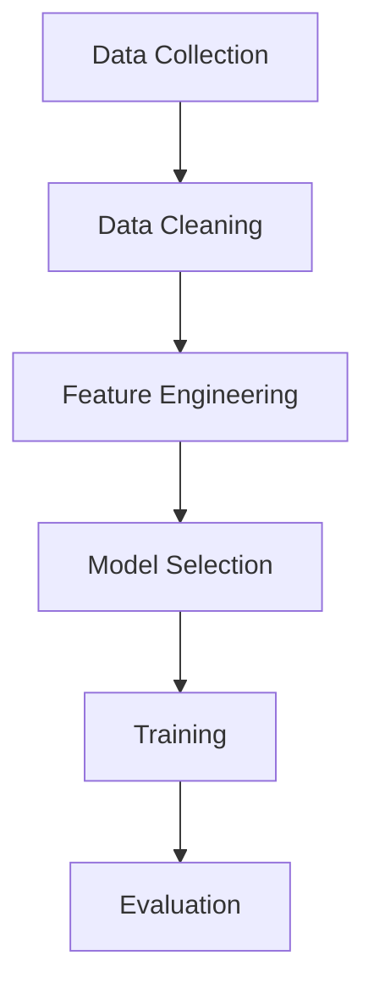

# Artificial Intelligence

- [Evolution](Evolution.md)

## Machine Learning 

### Stages

### Supervised 
works with Labelled Data
- [Classification](machine_learning/classifier/)
- [Regression](machine_learning/Regression)

 |   Models | Type | Use |
 | ------ | ------ | ------ |
 |  Logistic Regression  | **`Classification`** | |
 |  Support Vector Machines (SVMs) | **`Classification`** | |
 |  Random Forest  | **`Classification`** | |
 |  K-Nearest Neighbors (KNN)  | **`Classification`** | |
 |  Naive Bayes  | **`Classification`** | |
 |  Linear Regression | **`Regression`** | |
 |  Polynomial Regression |**`Regression`** | | 
 |  Support Vector Regression | **`Regression`** | | 
 |  Decision Tree  |  **`Regression`** **`Classification`**| |
 |  Ridge Regression | **`Regression`** | |
 |  Lasso Regression |**`Regression`** | | 

### Self Supervised
- Unlabelled Data
  
 | Models |
 | ------ |
 | Foundation |

 

### Unsupervised 
- Unlabelled Data
  
 |   Models | Type | Details | Use | 
 | ------ | ------ | ------ | ------ |
 | K-Means | Clustering | | |
 | Hierarchical | Clustering | | |
 | Apriori Algorithm | Association | | |
 | Principal Component Analysis (PCA) |  Dimensionality Reduction | | |
 | Autoencoders | Dimensionality Reduction | | |
 | Generative Adversarial Networks (GAN) | Generative Models | Consists of 2  Neural Network : Generator and Discriminator   competing with each other| Deep Fakes , Image Generator ,AI
 | Variational Autoencoders (VAE) | Generative Models | |

### Reinforced 
- Dynamic data
- Unlabelled Data
- Feedbacks , Rewards

###  Foundation Models 

* A **foundation model** is a large pre-trained model that learns general knowledge from massive data and can be adapted to many tasks.

### Multi Model 

* A **multimodal model** is a model that can process and relate multiple data types (text, image, audio, video).
* A foundation model can be unimodal or multimodal; multimodality is a **capability**, not a category.

