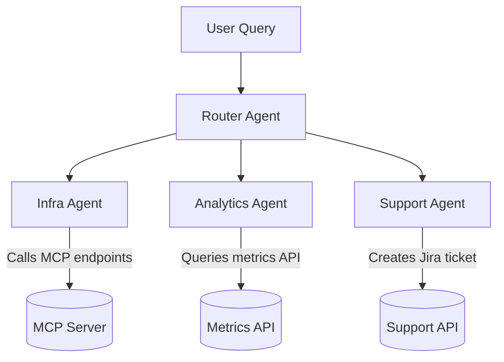

# Agents

## Types of Agents

###  1. `zero-shot-react-description`

* **Description:**
  This is the *default* and most commonly used LangChain agent.
  It uses a **ReAct (Reason + Act)** prompting strategy — the model “thinks” (reasoning trace) and then “acts” (calls a tool) — **without examples** (“zero-shot”).
* **Use case:**
  When you describe tools with natural language and want the agent to decide which one to use purely based on their descriptions.
* **Flow:**

  1. Model reads your query and available tool descriptions.
  2. It reasons in text (thoughts), decides the next action (tool call), observes results, and repeats until it finds an answer.

  **Example:**

  ```python
  agent = initialize_agent(
      tools,
      llm,
      agent_type="zero-shot-react-description"
  )
  ```

  Think of it as:
    “Figure it out using tool descriptions and logic.”

---

###   2. `react-docstore`

* **Description:**
  Uses the ReAct pattern but specifically for **retrieval** from a **Docstore** (document storage or knowledge base).
* **Use case:**
  When you want the agent to search within a knowledge base, then reason over the retrieved docs.
* **Flow:**
  It alternates between **“Search/Lookup” actions** and reasoning steps.

---

###   3. `self-ask-with-search`

* **Description:**
  A **question-decomposition** agent: it breaks complex questions into simpler ones and performs web or knowledge base lookups.
* **Use case:**
  When you want the model to reason step-by-step by asking itself sub-questions, like:

  > “Who was the president of France when Apple released the iPhone 6?”
* **Flow:**
  Ask → Search → Answer sub-questions → Combine into final result.

---

###   4. `conversational-react-description`

* **Description:**
  Similar to `zero-shot-react-description`, but designed for **multi-turn conversations** where context (previous chat turns) matters.
* **Use case:**
  Chatbots or assistants that maintain memory across interactions.
* **Key difference:**
  It automatically feeds the previous conversation history into the prompt.

---

###   5. `structured-chat-zero-shot-react-description`

* **Description:**
  A more structured ReAct agent that formats tool invocations as **JSON-like blocks**, making it easier to parse programmatically.
* **Use case:**
  When integrating with systems that require structured outputs (e.g., OpenAI function calling, JSON schemas).

---

###   6. `openai-functions` / `openai-tools`

* **Description:**
  These use the **OpenAI Function Calling API** or **Tools API** directly.
* **Use case:**
  When your model is a modern OpenAI model (like GPT-4-turbo or GPT-4o) and tools are defined as functions.
* **Flow:**
  Instead of generating text like “Action: use_tool,” the model outputs structured JSON that directly triggers a function call.

---

###   7. `plan-and-execute`

* **Description:**
  Two-phase agent:

  1. **Planner:** creates a detailed plan (series of subtasks).
  2. **Executor:** executes each subtask step-by-step.
* **Use case:**
  Long or multi-step workflows, e.g., “Scrape data → analyze → summarize → email report.”
* **Advantage:**
  Better for long reasoning tasks since it separates planning from execution.

---

###   8. `chat-zero-shot-react-description`

* **Description:**
  Like `zero-shot-react-description`, but uses chat-based prompting (for Chat models like GPT-4 chat models).
* **Use case:**
  When using conversational LLMs that prefer chat-style input rather than completion-style.

---

###  Summary Table

| Agent Type                                    | Strategy                 | Key Use Case                         | Notes                                    |
| --------------------------------------------- | ------------------------ | ------------------------------------ | ---------------------------------------- |
| `zero-shot-react-description`                 | ReAct, no examples       | General-purpose reasoning with tools | Most common                              |
| `react-docstore`                              | ReAct + retrieval        | Answering from document stores       | Alternates between “Search” and “Lookup” |
| `self-ask-with-search`                        | Decomposition + search   | Complex question answering           | Asks itself sub-questions                |
| `conversational-react-description`            | ReAct + memory           | Conversational agents                | Keeps chat history                       |
| `structured-chat-zero-shot-react-description` | Structured ReAct         | JSON outputs, API integration        | Easier parsing                           |
| `openai-functions` / `openai-tools`           | Function calling         | OpenAI models with tool schema       | Uses structured API calls                |
| `plan-and-execute`                            | Two-phase plan-execution | Multi-step reasoning tasks           | Planner + executor                       |
| `chat-zero-shot-react-description`            | Chat-based ReAct         | Chat models                          | Chat-format prompting                    |

---

## Architecture

###   Option 1 — **One Agent with All Tools**

###   **Pros**

1. **Single unified reasoning loop**
   The LLM can decide which tool to use — even chain multiple tools — within one coherent context.
   → Example:
   “List all MCP tools, then call the restart API for tool X.”

2. **Simplicity in orchestration**
   You manage one agent executor; easy to integrate with a single chatbot endpoint or UI.

3. **Dynamic flexibility**
   You can describe all tools in natural language, and the model learns which one to use for which type of request.

---

###   **Cons**

1. **Tool explosion → prompt bloat**
   Each tool’s description and schema is injected into the prompt.
   If you have 20–30 tools, your prompt context becomes huge → cost ↑, latency ↑, reasoning confusion ↑.

2. **Cross-domain confusion**
   If tools come from different domains (e.g., DevOps, HR, Analytics), the LLM may “hallucinate” tool usage or pick irrelevant ones.

3. **Difficult debugging**
   Hard to track which tool was used for what, especially if multiple tools interact incorrectly.

---

###   Option 2 — **Multiple Agents, Each with a Subset of Tools**

###   **Pros**

1. **Domain isolation (modularity)**
   Each agent specializes in one functional area — like microservices:

   * `infra_agent`: restart servers, list MCP tools
   * `analytics_agent`: query logs, get metrics
   * `support_agent`: raise cases, notify Slack

2. **Smaller context → faster, cheaper, cleaner**
   Each agent only sees the subset of tools it needs.

3. **Easier testing and auditing**
   You can unit test each agent’s logic (and its prompt) independently.

4. **Composable orchestration**
   A higher-level “super agent” (or **router agent**) can route requests to the correct specialized agent automatically.

---

###   **Cons**

1. **Extra orchestration layer needed**
   You must either:

   * route manually (based on intent detection), or
   * use LangChain’s `MultiAgentExecutor`, `RouterChain`, or your own orchestration logic.

2. **Cross-domain reasoning requires chaining**
   If a task spans multiple domains, you need coordination — e.g., one agent produces output another consumes.

---

##   Recommendation (Based on Real-world Systems)

| Scenario                                                            | Recommended Approach                      | Why                                    |
| ------------------------------------------------------------------- | ----------------------------------------- | -------------------------------------- |
|   Prototype or simple assistant (few tools, < 10)                  | **One agent with all tools**              | Easier to build and debug              |
|   Multiple distinct domains (e.g., MCP tools, monitoring, support) | **Multiple agents, each domain-specific** | Reduces confusion, keeps prompts clean |
|   Multi-step reasoning across domains                              | **Router agent + specialized sub-agents** | Modular, scalable                      |
|   High volume production system                                    | **Domain agents with registry / router**  | Controlled latency and cost            |

---

 



* **Router Agent:**
  Uses intent classification (or LLM reasoning) to pick the correct sub-agent.
* Each sub-agent has **only 2–5 relevant tools**.

---

##  Example Code Skeleton

```python
from langchain.agents import initialize_agent, AgentType
from langchain_openai import ChatOpenAI

llm = ChatOpenAI(model="gpt-4o", temperature=0)

infra_agent = initialize_agent(infra_tools, llm, agent_type=AgentType.OPENAI_FUNCTIONS)
analytics_agent = initialize_agent(analytics_tools, llm, agent_type=AgentType.OPENAI_FUNCTIONS)

# Router logic (simple example)
def route(query: str):
    if "metric" in query or "usage" in query:
        return analytics_agent
    return infra_agent

# Usage
query = "List all available MCP tools"
agent = route(query)
response = agent.run(query)
print(response)
```

---

  **TL;DR**

| Approach                        | When to Use            | Notes                      |
| ------------------------------- | ---------------------- | -------------------------- |
| **Single agent with all tools** | <10 tools, same domain | Simpler, less overhead     |
| **Multiple domain agents**      | Many tools or domains  | Modular, scalable, clearer |
| **Router + Sub-agents**         | Complex workflows      | Best of both worlds        |

---

Would you like me to show how to **build a Router Agent** in LangChain that automatically picks the correct specialized agent (e.g., MCP, Metrics, or Support) based on natural-language queries?

