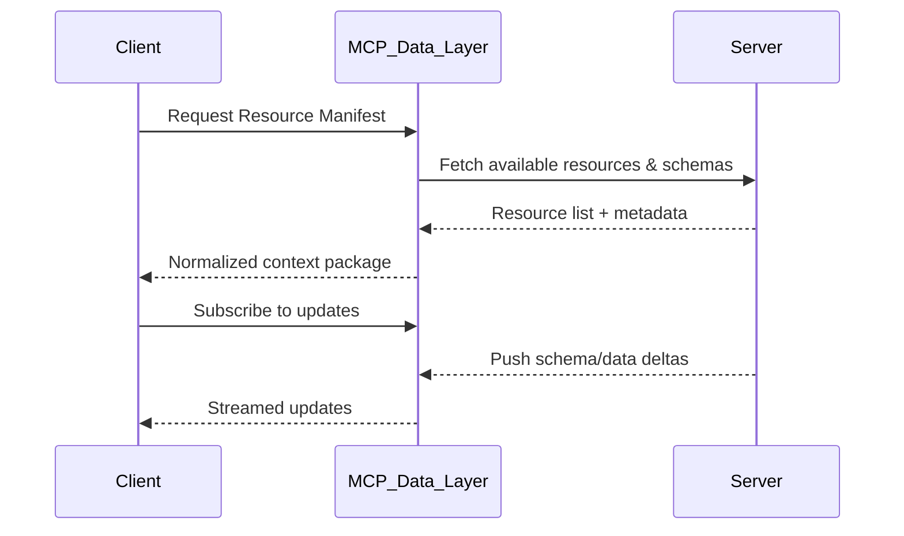

Got it — you’re asking about **Data Layer Protocols in the context of MCP (Model Context Protocol)** — not OSI networking.
Let’s go over that clearly 👇

---

## 🧠 What MCP’s Data Layer Protocol Means

In **OpenAI’s MCP (Model Context Protocol)** architecture, the **Data Layer Protocol** defines *how data is exchanged, stored, and synchronized* between **the model** (like GPT-5) and **external tools, servers, or contexts** (for example, a database, file system, or application API).

It’s analogous to how in networking the “data link layer” defines *how bits travel between two connected nodes*, but here it defines *how structured contextual data is transported between the model and clients or servers*.

---

### ⚙️ **Core Idea**

The **MCP Data Layer Protocol** defines the **transport and exchange semantics** between:

* The **MCP client** (e.g., ChatGPT app or another orchestrator)
* The **MCP server** (which provides tools, documents, or data resources)

It’s responsible for:

* Reliable **serialization / deserialization** of data
* **Versioning** of schema or resources
* **Consistency** of model context
* **Streaming updates** (push/pull of changes)

---

### 📦 **MCP Layered Architecture**

You can think of MCP as having three logical layers:

| Layer                   | Description                                                                                                  | Example                                             |
| ----------------------- | ------------------------------------------------------------------------------------------------------------ | --------------------------------------------------- |
| **Transport Layer**     | Handles the connection, message delivery, and framing (e.g., WebSocket, HTTP/2).                             | JSON-RPC over WebSocket                             |
| **Data Layer Protocol** | Defines the *format* and *semantics* of the exchanged information — context, resources, tool inputs/outputs. | Resource sync, tool definitions, context updates    |
| **Model Layer**         | Handles interpretation of the exchanged data by the LLM.                                                     | GPT reads tool schema, documents, or executes calls |

---

### 🧩 **Example of Data Layer Protocol in Action**

Suppose your MCP server exposes a **PostgreSQL database** as a resource.

1. **Client** (e.g., ChatGPT or your AI app) connects via MCP.
2. **Server** advertises resources like:

   ```json
   {
     "type": "resource",
     "uri": "db://employees",
     "schema": "Employee { id: int, name: string, dept: string }"
   }
   ```
3. **Data Layer Protocol** ensures:

   * The schema version is synchronized.
   * The data access API (query, insert, update) is well-defined.
   * The model knows *how to serialize queries* and *interpret results*.

When the LLM runs a query:

```json
{
  "op": "read",
  "uri": "db://employees",
  "filter": { "dept": "Engineering" }
}
```

…the **Data Layer Protocol** ensures it’s valid, transmitted, and returned with the proper structure.

---

### 🧱 **Conceptual Analogy**

| Networking OSI    | MCP Equivalent              | Description                               |
| ----------------- | --------------------------- | ----------------------------------------- |
| Physical Layer    | Transport (WebSocket, HTTP) | Message transport                         |
| Data Link Layer   | **Data Layer Protocol**     | Defines structure and exchange semantics  |
| Network Layer     | Context Routing             | Determines which resource/tool to talk to |
| Application Layer | Model Context               | AI interprets and acts on results         |

---

### 💡 Example: Resource Synchronization Flow (Mermaid Diagram)



---

### 🧩 **In Short**

| Term                    | Meaning in MCP                                                                                       |
| ----------------------- | ---------------------------------------------------------------------------------------------------- |
| **Data Layer Protocol** | Defines how data and schemas are serialized, transmitted, and synchronized between model and server. |
| **Transport Layer**     | Carries these messages (WebSocket, HTTP).                                                            |
| **Resource**            | Logical entity like a file, API, or database table.                                                  |
| **Tool**                | Action the model can invoke (like `query_database`).                                                 |
| **Manifest**            | Description of resources, tools, and schemas provided by the server.                                 |

---

Would you like me to show a **visual diagram of all MCP layers (Transport, Data, Model)** with their roles in context exchange?
