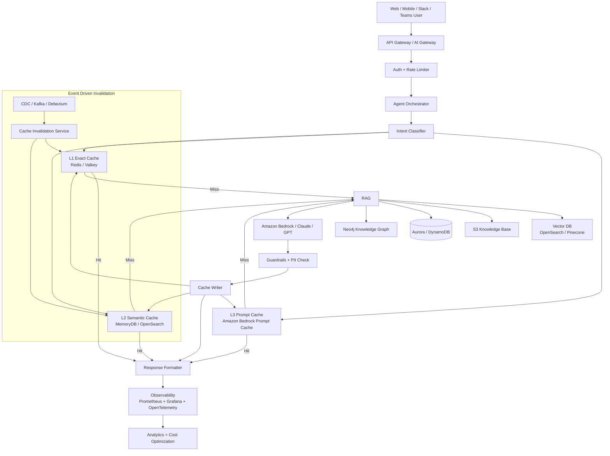
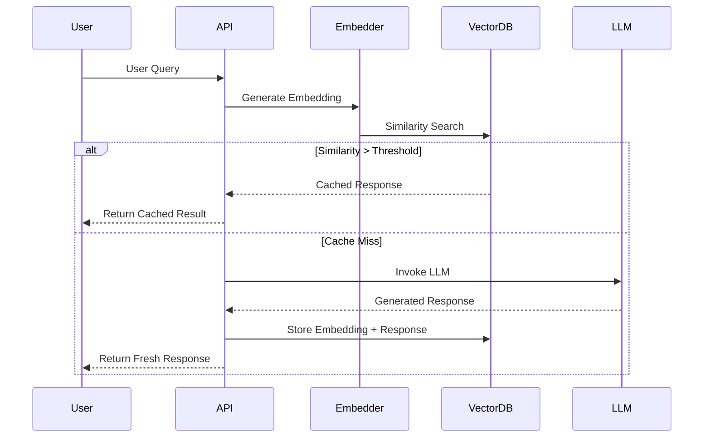
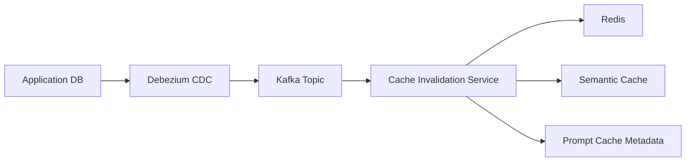

A strong production architecture is to combine **multi-layer caching** with **LLM routing**, **RAG**, and **event-driven invalidation**.

The AWS blog mainly discusses:

* Prompt caching
* Request-response caching
* Semantic caching
* In-memory cache
* Distributed cache
* TTL + proactive invalidation
* Context-aware cache partitioning ([Amazon Web Services, Inc.][1])

Below is a realistic enterprise-grade architecture used for:

* Customer support copilots
* Banking assistants
* QE agentic workflows
* Internal enterprise search
* Supply chain AI agents
* E-commerce AI assistants

---

# Production LLM Application Architecture with Multi-Layer Caching



---

# Why Multiple Cache Layers?

## 1. L1 Exact Cache (Redis / Valkey)

Used for:

* Exact same prompt
* Frequently repeated FAQs
* Same agent requests

Example:

```text
"What is my leave balance?"
```

### Benefits

* Sub-millisecond latency
* Cheapest layer
* Highest throughput

### Technologies

* Amazon ElastiCache Redis
* Valkey
* MemoryDB

### TTL

Usually:

* 5 mins
* 15 mins
* 1 hour

---

# 2. L2 Semantic Cache

This is the most important production optimization.

Instead of exact string match:

```text
"Reset my password"
```

and

```text
"I forgot my password"
```

map to similar embeddings.

AWS specifically recommends semantic caching using vector search. ([Amazon Web Services, Inc.][1])

---

## Semantic Cache Flow



---

# Semantic Cache Components

| Layer             | Technology                       |
| ----------------- | -------------------------------- |
| Embeddings        | Titan Embeddings / OpenAI / bge  |
| Vector Store      | OpenSearch / pgvector / Pinecone |
| Hot Vector Cache  | MemoryDB                         |
| Similarity Search | cosine similarity                |
| Threshold         | 0.90–0.95                        |

---

# 3. Prompt Cache (Bedrock Prompt Cache)

AWS Bedrock prompt caching avoids recomputing:

* System prompts
* Persona
* Few-shot examples
* Long RAG context

AWS states this can reduce:

* Latency up to 85%
* Input token costs up to 90% ([Amazon Web Services, Inc.][1])

---

# Real Production Example

## QE Agentic Workflow Platform

You mentioned QE agentic workflows earlier.

This architecture fits perfectly there.

---

# Example: QE Failure Analysis Agent

## User Query

```text
Why did build #8472 fail?
```

---

# Flow

## Step 1 — L1 Exact Cache

Check Redis:

```text
hash(buildId + query)
```

If already analyzed recently:
→ return instantly.

---

## Step 2 — Semantic Cache

Search vector DB:

Similar questions:

* "Root cause for build 8472"
* "Pipeline failed at regression stage"

If similarity > 0.93:
→ reuse RCA response.

---

## Step 3 — Prompt Cache

The following remains static:

* QE instructions
* Jira schema
* Pipeline schema
* Failure taxonomy
* Agent rules

Bedrock prompt cache stores this prefix.

Only dynamic portion changes:

```text
Build logs
Latest stack trace
```

---

# Event-Driven Cache Invalidation

Critical in production.

---

# Example

New Jira ticket arrives:

```text
BUG-992 fixed
```

Then:

* Kafka event emitted
* Cache invalidation service triggered
* Related semantic cache entries removed

---

# Production Invalidation Architecture



---

# Cache Partitioning (Very Important)

AWS recommends context-specific segregation. ([Amazon Web Services, Inc.][1])

Never mix:

* Customer A cache
* Customer B cache
* Finance prompts
* HR prompts

---

# Production Namespace Strategy

```text
tenant:region:agentType:modelVersion
```

Example:

```text
amazon:us-east-1:qe-agent:v4
```

---

# Recommended AWS Stack

| Component          | AWS Service            |
| ------------------ | ---------------------- |
| API Gateway        | API Gateway            |
| Agent Orchestrator | ECS / EKS              |
| Exact Cache        | ElastiCache Redis      |
| Semantic Cache     | MemoryDB + OpenSearch  |
| Prompt Cache       | Bedrock Prompt Caching |
| Vector DB          | OpenSearch             |
| Knowledge Base     | S3                     |
| Event Streaming    | Kafka MSK              |
| Embeddings         | Bedrock Titan          |
| LLM                | Claude via Bedrock     |
| Observability      | CloudWatch + Grafana   |
| Guardrails         | Bedrock Guardrails     |

---

# Enterprise Optimization Pattern

Most mature companies use:

```text
L1 Exact Cache
    ↓
L2 Semantic Cache
    ↓
RAG Retrieval
    ↓
LLM Inference
```

Because:

* 30–60% traffic is repetitive
* Semantic cache drastically reduces inference cost
* LLM calls become fallback only

This pattern is repeatedly discussed in production semantic caching systems. ([Amazon Web Services, Inc.][1])

---

# Advanced Production Enhancements

## A. Adaptive TTL

Instead of fixed TTL:

| Data Type         | TTL    |
| ----------------- | ------ |
| FAQ               | 24h    |
| Product Pricing   | 5 min  |
| Stock Data        | 30 sec |
| QE Build Failures | 10 min |

---

## B. Similarity Threshold Routing

```text
similarity > 0.95
→ direct cache return

0.85–0.95
→ lightweight LLM refinement

< 0.85
→ full LLM generation
```

Research systems like TweakLLM use this routing model. ([arXiv][2])

---

# C. AI Gateway Layer

Production companies increasingly add:

* model routing
* semantic cache
* fallback
* observability
* rate limiting

before the LLM provider. ([Reddit][3])

---

# Expected Production Gains

| Optimization    | Improvement              |
| --------------- | ------------------------ |
| Exact cache     | <10ms latency            |
| Semantic cache  | 30–60% fewer LLM calls   |
| Prompt cache    | 85% lower prompt latency |
| Combined system | 50–90% cost reduction    |

AWS explicitly mentions up to 90% savings from effective caching. ([Amazon Web Services, Inc.][1])

---

# Best Use Cases

This architecture works best for:

* Customer support copilots
* Enterprise chatbots
* QE agents
* DevOps copilots
* RAG systems
* Supply chain agents
* Banking assistants
* Internal knowledge assistants
* IT helpdesk bots
* HR assistants

---

# Most Important Production Lesson

Do NOT rely on only one cache.

The winning architecture is:

```text
Exact Cache
+ Semantic Cache
+ Prompt Cache
+ Event-driven invalidation
+ Namespace isolation
```

That is what makes large-scale LLM systems economically viable in production.

[1]: https://aws.amazon.com/blogs/database/optimize-llm-response-costs-and-latency-with-effective-caching/?utm_source=chatgpt.com "Optimize LLM response costs and latency with effective caching | AWS Database Blog"
[2]: https://arxiv.org/abs/2507.23674?utm_source=chatgpt.com "TweakLLM: A Routing Architecture for Dynamic Tailoring of Cached Responses"
[3]: https://www.reddit.com/r/LLM_Gateways/comments/1qy6lfq/how_are_you_managing_llm_costs_and_latency_in/?utm_source=chatgpt.com "How are you managing LLM costs and latency in production?"
