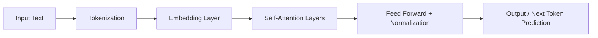

Great question — this is one of the core ideas behind **modern AI and NLP (Natural Language Processing)**. Let’s break it down clearly 👇

---

## 🧠 1. What is a Transformer?

A **Transformer** is a **deep learning architecture** introduced in the 2017 paper
👉 *“Attention Is All You Need”* by Vaswani et al. (Google).

It completely changed how machines understand and generate language by replacing older models like **RNNs (Recurrent Neural Networks)** and **LSTMs**.

---

### 🔑 Key Idea: *Self-Attention Mechanism*

Transformers use a mechanism called **self-attention**, which allows the model to:

* Look at **all words in a sentence at once** (not sequentially).
* Learn **relationships** between words, regardless of their position.
  → e.g., In “The cat, which was very hungry, ate the food,”
  the word *“cat”* is far from *“ate”*, but the transformer still understands the connection.

---

## ⚙️ 2. Structure of a Transformer

A transformer has two main parts:

| Component   | Purpose                          | Example          |
| ----------- | -------------------------------- | ---------------- |
| **Encoder** | Reads and understands input text | Used in **BERT** |
| **Decoder** | Generates output text            | Used in **GPT**  |

Each part consists of multiple **layers of self-attention + feed-forward networks**.

---

## 💬 3. Famous Transformer Models

### 🧩 **1. BERT (Bidirectional Encoder Representations from Transformers)**

* Developed by **Google (2018)**
* Uses **only the Encoder** part of the transformer.
* Reads text **bidirectionally** (both left and right context).
* Mainly used for **understanding** tasks:

  * Sentiment analysis
  * Question answering
  * Named Entity Recognition (NER)
  * Search ranking

📘 Example:

> BERT helps Google Search understand the meaning behind your queries, not just match keywords.

---

### 🤖 **2. GPT (Generative Pre-trained Transformer)**

* Developed by **OpenAI (2018–present)**
* Uses **only the Decoder** part of the transformer.
* Reads text **left-to-right (autoregressively)**.
* Trained to **predict the next word** given previous words.
* Used for **generation** tasks:

  * Chatbots (like ChatGPT 😄)
  * Text completion
  * Story writing
  * Code generation

📘 Example:

> “The weather is nice today, so I might…” → GPT predicts “go for a walk.”

---

### 🧠 **3. Other Notable Transformer Models**

| Model                                      | Organization              | Specialty                                                                       |
| ------------------------------------------ | ------------------------- | ------------------------------------------------------------------------------- |
| **T5 (Text-To-Text Transfer Transformer)** | Google                    | Converts every task (QA, translation, summarization) into a text-to-text format |
| **RoBERTa**                                | Meta                      | Optimized version of BERT                                                       |
| **XLNet**                                  | Google/CMU                | Combines BERT’s bidirectionality with GPT’s autoregression                      |
| **DistilBERT**                             | Hugging Face              | Smaller, faster BERT                                                            |
| **PaLM / Gemini**                          | Google DeepMind           | Large-scale transformer for reasoning & multimodal tasks                        |
| **LLaMA**                                  | Meta                      | Open-source large language model                                                |
| **Claude / Mistral / Falcon**              | Anthropic / Mistral / TII | Competing LLMs built on transformer architecture                                |

---

## 🧩 4. How They’re Trained

All transformer models go through two phases:

1. **Pretraining:** Learn general language understanding from massive text corpora.
2. **Fine-tuning:** Adapt to specific tasks (e.g., chatbot, translation, sentiment analysis).

---

## ⚡ 5. Visual Overview

---

## 🧭 6. Summary Table

| Model    | Uses               | Architecture Part | Direction     | Example Use                |
| -------- | ------------------ | ----------------- | ------------- | -------------------------- |
| **BERT** | Understanding      | Encoder           | Bidirectional | QA, Search                 |
| **GPT**  | Generation         | Decoder           | Left-to-right | Chat, Writing              |
| **T5**   | Text-to-text tasks | Encoder–Decoder   | Both          | Translation, Summarization |

---

Would you like me to show **how GPT and BERT differ internally** (with a simple diagram of encoder vs decoder blocks)?
