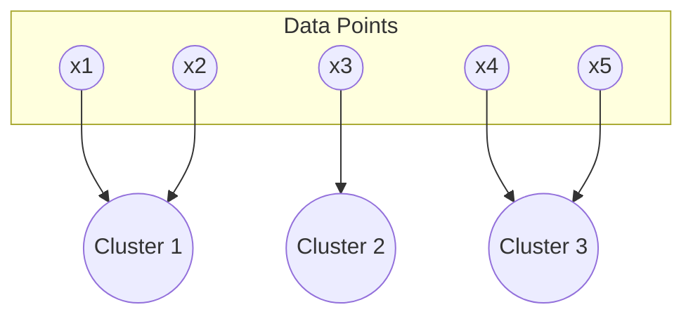

**Clustering** in Machine Learning is an **unsupervised learning technique** that groups similar data points together based on their features — without using labeled data. The goal is to ensure that data points in the same group (called a **cluster**) are more similar to each other than to those in other clusters.

---

### 🧩 **Key Idea**

Clustering finds **natural patterns** or **structures** in data.

For example:

* In marketing, customers can be clustered based on purchasing habits.
* In biology, genes can be clustered based on expression patterns.
* In anomaly detection, clusters reveal normal patterns, making outliers easy to detect.

---

### ⚙️ **Types of Clustering Algorithms**

| Algorithm                                     | Description                                                                  | Example Use Case           |
| --------------------------------------------- | ---------------------------------------------------------------------------- | -------------------------- |
| **K-Means**                                   | Divides data into *k* clusters by minimizing distance to cluster centroids.  | Customer segmentation      |
| **Hierarchical Clustering**                   | Builds a tree of clusters (dendrogram) using bottom-up or top-down approach. | Gene similarity analysis   |
| **DBSCAN (Density-Based Spatial Clustering)** | Groups closely packed points and marks outliers as noise.                    | Geospatial data clustering |
| **Mean Shift**                                | Finds clusters by locating dense areas of data points.                       | Image segmentation         |
| **Gaussian Mixture Models (GMM)**             | Assumes data comes from multiple Gaussian distributions.                     | Speech, signal modeling    |

---

### 🧠 **Clustering Process**

```mermaid
flowchart LR
    A[Input Data] --> B[Feature Extraction / Normalization]
    B --> C[Select Clustering Algorithm]
    C --> D[Compute Similarity (Distance Metrics)]
    D --> E[Form Clusters]
    E --> F[Evaluate and Visualize Results]
```

---

### 📏 **Distance Metrics**

Clustering depends on how you measure *similarity*:

* **Euclidean Distance** (for continuous data)
* **Manhattan Distance**
* **Cosine Similarity** (for text or vectors)
* **Jaccard Index** (for binary or categorical data)

---

### 📊 **Evaluation Metrics (Unsupervised)**

Since clustering doesn’t use labels, evaluation is trickier:

* **Silhouette Score** — how close each point is to its cluster vs others.
* **Davies–Bouldin Index** — average similarity between clusters.
* **Elbow Method** — used for selecting optimal *k* in K-Means.

---

### 🧠 Example: K-Means Clustering

1. Choose *k* (number of clusters)
2. Randomly initialize *k* centroids
3. Assign points to nearest centroid
4. Recalculate centroids as mean of assigned points
5. Repeat until convergence

---

### 🧩 Example Visualization



---

### 🚀 **Real-World Use Cases**

* **Customer segmentation** in marketing.
* **Recommender systems** (grouping similar items or users).
* **Image compression** (color quantization via K-Means).
* **Anomaly detection** (points far from any cluster).
* **Document/topic clustering** (text analytics).

---

Would you like me to extend this with a **real-world system design** example (like how Netflix or Spotify uses clustering)?
