```mermaid
sequenceDiagram
    participant Producer as Producer Apps
    participant LB as Load Balancer
    participant KafkaCluster as Kafka Broker Cluster
    participant Controller as Auto-scaling Controller
    participant ConsumerGroup as Consumer Group
    participant Monitoring as Metrics / Monitoring System

    Note over Producer,KafkaCluster: PRODUCER SIDE (Broker Auto Scaling)
    Producer->>LB: Send messages
    LB->>KafkaCluster: Route messages to brokers (Topic Partitions)
    Monitoring->>Controller: Report broker CPU / partition load
    Controller->>KafkaCluster: Add or remove brokers dynamically
    KafkaCluster->>Controller: Rebalance partitions among brokers

    Note over ConsumerGroup,KafkaCluster: CONSUMER SIDE (Consumer Auto Scaling)
    KafkaCluster->>ConsumerGroup: Provide messages to consumers
    Monitoring->>Controller: Report consumer lag & throughput
    Controller->>ConsumerGroup: Add or remove consumer instances
    ConsumerGroup->>KafkaCluster: Trigger partition rebalancing

    Note over Controller: Scaling Policies<br/>• Broker scale based on CPU/IO or topic load<br/>• Consumer scale based on lag<br/>• Both monitored by metrics system
```

Here’s a **Mermaid diagram** that visually explains **auto-scaling in Kafka**, showing how both **Kafka brokers** (producers’ side) and **Kafka consumers** scale automatically based on load and lag metrics 👇

---

---

### 🧠 **Explanation**

| Component                   | Role                                                                                                                     |
| --------------------------- | ------------------------------------------------------------------------------------------------------------------------ |
| **Producer Apps**           | Send data to Kafka topics.                                                                                               |
| **Kafka Broker Cluster**    | Manages topic partitions; brokers scale horizontally to handle load.                                                     |
| **Consumer Group**          | Multiple consumers process messages in parallel. Scaling adjusts consumer count.                                         |
| **Monitoring System**       | Tracks CPU usage, throughput, and consumer lag (via Prometheus/Grafana, etc.).                                           |
| **Auto-scaling Controller** | (E.g., Kubernetes HPA, custom script, or Confluent Control Center) — adds/removes brokers or consumers based on metrics. |

---

### ⚙️ **Typical Auto-Scaling Triggers**

| Metric                      | Scaling Target   | Description                    |
| --------------------------- | ---------------- | ------------------------------ |
| Broker CPU > 80%            | Add Kafka Broker | Indicates brokers overloaded.  |
| Partition Load > N msgs/sec | Add Broker       | Too many writes per partition. |
| Consumer Lag > Threshold    | Add Consumer     | Consumers can’t keep up.       |
| Consumer Lag = 0 for X min  | Remove Consumer  | Overprovisioned.               |

---

Would you like me to make this into a **diagram image** (e.g., PNG or SVG) you can use in documentation or slides?
