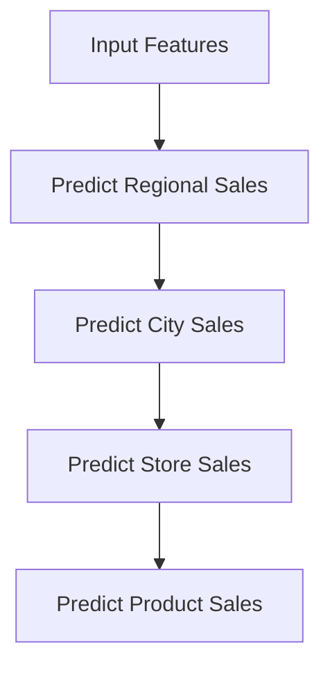

Excellent question — there **is indeed a parallel “flow” in regression problems**, much like classification evolves from simple binary → complex hierarchical setups.

Let’s look at how **regression problems scale in complexity and structure**, step by step — with **technical flow, relationships, and examples**.

---

### 🧩 Regression Flow Hierarchy (Simple → Complex)

| **Level**                                    | **Regression Type**                            | **Concept**                                                                                           | **Output Relationship**              | **Key Techniques / Models**                                  | **Example Use Case**                                                    |
| -------------------------------------------- | ---------------------------------------------- | ----------------------------------------------------------------------------------------------------- | ------------------------------------ | ------------------------------------------------------------ | ----------------------------------------------------------------------- |
| **1️⃣ Simple Regression**                    | **Simple Linear Regression**                   | One input feature predicts one continuous output.                                                     | 1 input → 1 output                   | Ordinary Least Squares (OLS)                                 | Predicting salary from years of experience                              |
| **2️⃣ Multiple Regression**                  | **Multiple Linear Regression**                 | Multiple independent variables predict one continuous output.                                         | n inputs → 1 output                  | OLS with multiple predictors                                 | Predicting house price using size, location, and age                    |
| **3️⃣ Polynomial / Nonlinear Regression**    | **Polynomial / Kernel / Nonlinear models**     | Nonlinear relationship between features and target.                                                   | n inputs → 1 nonlinear output        | Polynomial Regression, SVR, Neural Nets                      | Modeling curved trends, e.g., population growth                         |
| **4️⃣ Multivariate Regression**              | **Multiple Outputs (Multi-Output Regression)** | Predicts **multiple continuous variables simultaneously**.                                            | n inputs → m outputs                 | Multivariate Linear Regression, MLP, PLSR                    | Predicting temperature, humidity, and pressure together                 |
| **5️⃣ Hierarchical Regression**              | **Stepwise or Nested Regression**              | Regression performed in **hierarchical or dependent stages**, where one model’s output feeds another. | Sequential / conditional dependency  | Hierarchical Linear Models (HLM), Mixed-Effects Models       | Predicting student scores nested under schools, regions                 |
| **6️⃣ Structured / Multi-Task Regression**   | **Joint regression for related tasks**         | Learns **shared representations** across related regression tasks.                                    | Multiple tasks sharing parameters    | Multi-Task Lasso, Neural Multi-task Learning                 | Predicting related financial KPIs for different branches                |
| **7️⃣ Time-Series Regression**               | **Temporal / Sequential Dependency**           | Regression where **target depends on time and past values**.                                          | Autoregressive dependency            | ARIMA, LSTM, Prophet                                         | Predicting stock prices or demand forecasting                           |
| **8️⃣ Hierarchical Multi-Output Regression** | **Hierarchical structure + multiple outputs**  | Predicts multiple outputs where each output has **parent-child or dependency** relationships.         | Tree-like dependency between targets | Hierarchical Recurrent Nets, Multi-Output Gaussian Processes | Predicting KPIs across organizational levels (region → store → product) |

---

### 🔁 Comparison to Classification Flow

| **Classification Level**                    | **Regression Equivalent**                                          | **Relationship**                                   |
| ------------------------------------------- | ------------------------------------------------------------------ | -------------------------------------------------- |
| **Binary Classification**                   | Simple Linear Regression                                           | One input, one output (simplest form)              |
| **Multi-Class Classification**              | Multiple Regression (different models for each continuous outcome) | Multiple outputs but independent                   |
| **Multi-Label Classification**              | Multivariate / Multi-Output Regression                             | Multiple outputs possibly correlated               |
| **Hierarchical Multi-Label Classification** | Hierarchical Multi-Output Regression                               | Outputs have structured dependencies               |
| **Multi-Task Classification**               | Multi-Task Regression                                              | Shared parameters or representations between tasks |

---

### 🔬 Key Insights

* **As complexity increases**, relationships between **outputs** (not just inputs) begin to matter.
* **Multi-output regression** introduces **correlation learning** between targets.
* **Hierarchical or multi-task regression** brings in **parameter sharing** or **dependency constraints**.
* **Efficiency improves** when related regression tasks are modeled jointly instead of separately.

---

### ⚙️ Example (Hierarchical Multi-Output Regression Flow)

Each stage uses the parent’s output to improve prediction accuracy — similar to hierarchical multi-label classification.

---

Would you like me to extend this by showing **which ML algorithms support each regression level** (like which can do hierarchical, multi-task, etc.)?

That’s a brilliant and historically deep question — regression models have one of the **longest and most influential histories** in all of machine learning and statistics.

Let’s walk through a **timeline** showing:

* When key regression models were introduced,
* What problem they solved,
* How they improved over previous approaches,
* Why (or whether) they became obsolete or replaced.

---

## 🧭 Evolution Timeline of Regression Models

| **Era**          | **Regression Model / Family**                                            | **Introduced / Popularized**                                | **Problem It Solved**                                          | **Why It Was a Breakthrough**                                               | **Limitations / Why It Declined**                                  | **Status Today**                                                     |
| ---------------- | ------------------------------------------------------------------------ | ----------------------------------------------------------- | -------------------------------------------------------------- | --------------------------------------------------------------------------- | ------------------------------------------------------------------ | -------------------------------------------------------------------- |
| **1805–1877**    | **Ordinary Least Squares (OLS) Linear Regression**                       | *Adrien-Marie Legendre (1805)*, *Francis Galton (1877)*     | Fit a straight line to numeric data minimizing squared errors. | First systematic method for quantifying linear relationships.               | Assumes linearity, sensitive to outliers.                          | Still core model; baseline for all regression.                       |
| **1930s–1950s**  | **Multiple Linear Regression**                                           | *R.A. Fisher* and others                                    | Model multiple predictors at once.                             | Enabled multivariate analysis in social, economic, and biological sciences. | Still assumes linearity, collinearity issues.                      | Still used in econometrics and statistics.                           |
| **1958–1960s**   | **Logistic Regression**                                                  | *David Cox (1958)*                                          | Regression for binary categorical outcomes (classification).   | Brought probabilistic interpretation to regression.                         | Limited to linear decision boundaries.                             | Still heavily used in healthcare, finance, NLP.                      |
| **1970s–1980s**  | **Ridge (L2) and Lasso (L1) Regression**                                 | *Hoerl & Kennard (1970)*, *Tibshirani (1996)*               | Overfitting and multicollinearity in linear regression.        | Introduced **regularization**; stabilized coefficient estimates.            | Lasso struggles with correlated features; Ridge can underfit.      | Widely used in high-dimensional data.                                |
| **1980s–1990s**  | **Polynomial and Nonlinear Regression**                                  | Popularized through curve fitting and optimization methods. | Modeled non-linear trends.                                     | Added flexibility to linear regression.                                     | Overfitting, poor generalization to unseen data.                   | Still used for simple nonlinear patterns.                            |
| **1990s**        | **Generalized Linear Models (GLMs)**                                     | *Nelder & Wedderburn (1972)*, gained traction in 90s        | Unified framework for logistic, Poisson, and others.           | Generalized regression beyond Gaussian noise.                               | Complexity in interpretation and parameter estimation.             | Backbone of modern stats modeling.                                   |
| **1990s–2000s**  | **Support Vector Regression (SVR)**                                      | *Vapnik (1995)*                                             | Handle nonlinear regression with kernels.                      | Introduced margin-based, robust regression.                                 | Slow on large datasets; needs careful kernel choice.               | Replaced by tree-based and neural methods for large-scale data.      |
| **2000s**        | **Tree-Based Regression (CART, Random Forest, Gradient Boosting)**       | *Breiman (2001)*                                            | Handle nonlinear, complex, mixed-type features.                | No need for scaling; captures feature interactions automatically.           | Can overfit, black-box behavior.                                   | Still dominant in structured/tabular data (e.g., XGBoost, LightGBM). |
| **2010s**        | **Neural Network Regression / Deep Learning**                            | *Post-2012 (ImageNet era)*                                  | Complex high-dimensional nonlinear mappings.                   | Universal approximator; learns representations automatically.               | Requires huge data, computationally expensive, less interpretable. | Dominant in unstructured data (vision, text, speech).                |
| **2015–Present** | **Multi-Task & Hierarchical Regression**                                 | *Deep multitask learning frameworks*                        | Predict multiple related continuous outputs together.          | Shares knowledge across related tasks; improves data efficiency.            | Hard to train, interpret, and balance tasks.                       | Used in advanced analytics, finance, and healthcare.                 |
| **2017–Present** | **Bayesian & Probabilistic Regression (e.g., Gaussian Processes, BNNs)** | *Revival with probabilistic ML*                             | Provide uncertainty estimation, not just point prediction.     | Combines regression with uncertainty quantification.                        | Computationally heavy for large datasets.                          | Used in scientific modeling and ML interpretability.                 |

---

## 🧠 Observations & Transitions

| **Transition**                                   | **Motivation for Change**                        | **Outcome**                                      |
| ------------------------------------------------ | ------------------------------------------------ | ------------------------------------------------ |
| **Linear → Regularized Regression**              | Control overfitting, handle collinearity         | More stable, generalizable models                |
| **Regularized → Nonlinear (SVR, Polynomial)**    | Capture curvature and complexity                 | More flexible, less interpretable                |
| **Nonlinear → Tree-Based**                       | Handle mixed feature types, automate splits      | Boosted ensemble methods dominate tabular data   |
| **Tree-Based → Deep Learning**                   | Handle unstructured data, learn features         | Neural nets outperform others for vision, speech |
| **Deep → Multi-Task / Bayesian / Probabilistic** | Need interpretability, uncertainty, multitasking | More intelligent, risk-aware predictions         |

---

## 🧩 Why Regression Models Never Truly Became Obsolete

Even though newer models emerged, **traditional regression never disappeared** because:

* It’s **interpretable** and **mathematically elegant**.
* It serves as a **benchmark** for evaluating other models.
* It’s used in **feature importance, hypothesis testing, and explainability**.
* Modern deep models often **embed regression layers** for output (e.g., bounding box coordinates, forecasting).

---

### 🔚 Summary

* **1805–1950:** Foundation (Linear → Logistic).
* **1970–1990:** Regularization and Generalization.
* **2000–2010:** Nonlinear and Ensemble methods.
* **2010–2020+:** Deep, Probabilistic, and Multi-Task Regression.

Regression didn’t become obsolete — it **evolved**.
Each new generation added flexibility, scalability, or interpretability to the previous one.

---

Would you like me to follow this with a **diagram showing the evolution flow of regression → ensemble → neural → probabilistic models** (like a timeline tree)?
