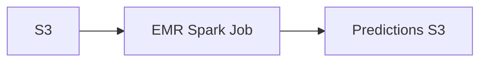
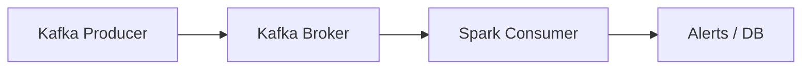
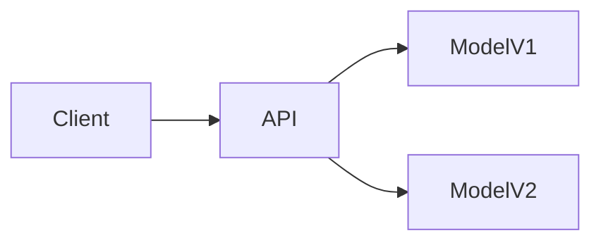
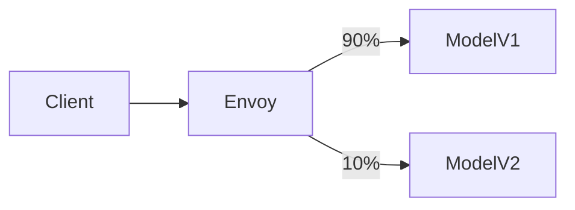
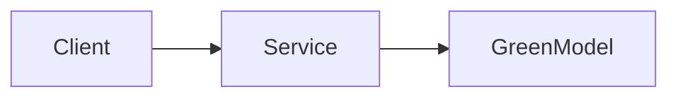
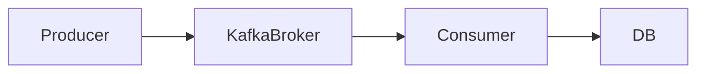

### What is Model Serving

Model serving is the process of making a trained machine learning model available for inference in production with defined latency, scalability, reliability, and monitoring guarantees.

---

### Online (Synchronous) Model Serving

Used when predictions are required immediately as part of a user or system request.

**Use case**
Fraud detection during payment, real-time anomaly detection from sensor data.

**How it works**

* Client sends request
* API layer forwards request to model service
* Model runs inference and returns response

**Components involved**

* Kubernetes: kube-apiserver, kubelet, HPA
* Java: JVM, Spring Boot DispatcherServlet
* Linux: epoll, TCP sockets
* ML runtime: ONNX Runtime / TensorFlow Serving

**Pseudo code**

```java
@PostMapping("/predict")
public Prediction predict(@RequestBody Input x) {
    return model.predict(x);
}
```

**Mermaid diagram**


---

### Batch Model Serving

Used when predictions are needed for large datasets without strict latency requirements.

**Use case**
Daily risk scoring, turbine health scoring overnight.

**How it works**

* Batch job reads data
* Runs inference on large datasets
* Writes predictions to storage

**Components involved**

* Spark: Driver, Executors
* Kubernetes: kubelet
* AWS: EMR, S3
* Linux: fork, mmap

**Pseudo code**

```python
df = spark.read.parquet("s3://features")
pred = model.transform(df)
pred.write.parquet("s3://predictions")
```

**Mermaid diagram**



---

### Streaming Model Serving

Used when data arrives continuously and predictions must be made in near real time.

**Use case**
IoT sensor anomaly detection, clickstream fraud detection.

**How it works**

* Stream ingestion
* Windowed feature computation
* Model inference per event/window

**Components involved**

* Kafka: producer, broker, consumer
* Spark Structured Streaming
* Kubernetes: kubelet
* Linux: poll, network stack

**Pseudo code**

```python
df = spark.readStream.format("kafka").load()
scored = df.map(lambda x: model.score(x))
```

**Mermaid diagram**



---

### Shadow Deployment (Dark Launch)

Used to test a new model in production without impacting users.

**Use case**
Compare new fraud model with existing production model.

**How it works**

* Same request sent to two models
* Only primary response used
* Secondary results logged

**Components involved**

* Kubernetes: Service, kube-proxy
* Java: JVM thread pool
* Linux: netfilter

**Pseudo code**

```java
Prediction p1 = modelV1.predict(x);
Prediction p2 = modelV2.predict(x);
log(p2);
return p1;
```

**Mermaid diagram**



---

### Canary Model Deployment

Used to gradually roll out a new model to a subset of traffic.

**Use case**
Reducing risk when deploying a new recommendation model.

**How it works**

* Small percentage routed to new model
* Metrics compared
* Gradual rollout

**Components involved**

* Kubernetes: Deployment, HPA, kube-proxy
* Service mesh: Istio Envoy
* Linux: iptables

**Pseudo code**

```yaml
trafficSplit:
  v1: 90
  v2: 10
```

**Mermaid diagram**



---

### Blue-Green Model Deployment

Used for instant rollback with zero downtime.

**Use case**
Mission-critical pricing or fraud systems.

**How it works**

* Two identical environments
* Traffic switches atomically

**Components involved**

* Kubernetes: Service selector
* Linux: conntrack

**Pseudo code**

```yaml
selector:
  version: green
```

**Mermaid diagram**



---

### Model Serving via Message Queue

Used for decoupled, resilient inference.

**Use case**
Asynchronous document classification.

**How it works**

* Producer publishes message
* Consumer performs inference
* Result stored or published

**Components involved**

* Kafka: producer, broker, consumer
* JVM: KafkaConsumer
* Linux: file descriptors

**Pseudo code**

```java
consumer.poll().forEach(msg -> model.predict(msg));
```

**Mermaid diagram**



 

### Edge Model Serving

Used when inference must happen near data source.

 

**How it works**

* Lightweight model deployed at edge
* Periodic sync with cloud

**Components involved**

* AWS Greengrass
* Linux kernel
* ONNX Runtime

**Pseudo code**

```python
score = edge_model.predict(sensor)
```

 


 

### Model Serving Pattern Selection Summary

| Pattern   | Latency   | Scale     | Complexity |
| --------- | --------- | --------- | ---------- |
| Online    | Low       | High      | Medium     |
| Batch     | High      | Very High | Low        |
| Streaming | Low       | Very High | High       |
| Canary    | Low       | High      | Medium     |
| Shadow    | Low       | Medium    | Medium     |
| Edge      | Ultra Low | Local     | Medium     |

 

### Key Interview Line

Model serving patterns define how ML models are deployed, scaled, monitored, and evolved in production systems based on latency, throughput, and reliability requirements.
