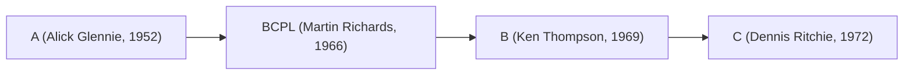
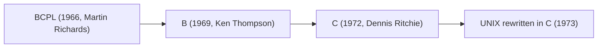

Great question — and a very historical one!
Let’s go back to the **1950s and 1960s**, when programming languages were still being invented.

---

## 🕰️ The Origins of A and B Languages

Before **C**, there were two predecessors — **B** and **BCPL**, and even before that, **A**.

---

### 🧩 **Language A (Around 1951–1953)**

#### 📘 Overview

* **Developed by:** Alick Glennie (at the University of Manchester)
* **Name:** Simply called **A**
* **Machine:** Ferranti Mark 1
* **Purpose:** To simplify machine coding on early computers

#### ⚙️ Key Characteristics

* **One of the first compiled languages** — predating even Fortran (1957).
* Allowed programmers to write symbolic instructions that were then translated into machine code.
* Not portable — it was machine-specific.

#### 🧠 Importance

* The compiler for language **A** is often considered the **first working compiler** ever written.
* It introduced the idea of automatically converting human-readable code into executable machine instructions.

---

### 🧩 **Language B (Around 1969–1970)**

#### 📘 Overview

* **Developed by:** Ken Thompson at Bell Labs
* **Derived from:** BCPL (Basic Combined Programming Language) by Martin Richards (1966)
* **Purpose:** To write utilities for the UNIX operating system on the DEC PDP-7.

#### ⚙️ Key Characteristics

* Typeless language — all data was word-sized.
* Used for system-level programming.
* Simpler and smaller than BCPL.
* Its compiler produced very compact code for early UNIX.

#### 🧠 Importance

* **B was the direct predecessor of C.**
* Dennis Ritchie later extended B with data types and structures, leading to **C (1972)**.

---

### 🧬 Evolution Lineage



---

### 📜 Timeline Summary

| Year  | Language | Creator         | Notable Feature                     | Influence                          |
| ----- | -------- | --------------- | ----------------------------------- | ---------------------------------- |
| ~1952 | **A**    | Alick Glennie   | First compiled language             | Pioneered compilation              |
| 1966  | **BCPL** | Martin Richards | Simple systems programming language | Influenced B                       |
| 1969  | **B**    | Ken Thompson    | Compact, typeless language for UNIX | Direct parent of C                 |
| 1972  | **C**    | Dennis Ritchie  | Structured, typed language          | Basis for modern systems languages |

---

### 💡 Fun Fact

The original **UNIX kernel** on the PDP-7 was written in **B**, and later rewritten in **C**, making it portable — a huge step in computing history.

---

Would you like me to show a **comparison table** of B vs. early C (syntax, data types, and compilation model)? It’s a fascinating transition showing how modern programming concepts were born.


Perfect 👏 — here’s a detailed **comparison between the B language and early C**, showing how Dennis Ritchie evolved B into C around 1971–1973 at Bell Labs.

---

## 🧬 **B vs Early C: The Evolution of a Language**

Below is a side-by-side breakdown of syntax, features, and design principles:

---

### 📋 **1. Overview**

| Feature             | **B Language (1969)**              | **Early C Language (1972–1973)**                   |
| ------------------- | ---------------------------------- | -------------------------------------------------- |
| **Creator**         | Ken Thompson                       | Dennis Ritchie                                     |
| **Origin**          | Derived from BCPL                  | Derived from B                                     |
| **Typing**          | Typeless (everything is a word)    | Statically typed (int, char, float, etc.)          |
| **Target Machine**  | DEC PDP-7                          | DEC PDP-11                                         |
| **Primary Use**     | Early UNIX utilities               | UNIX kernel, compilers, systems software           |
| **Compiler Output** | Machine code for specific hardware | Portable assembly-like code (via compiler backend) |

---

### ⚙️ **2. Data Types and Variables**

| Concept       | **B**                                          | **Early C**                                   |
| ------------- | ---------------------------------------------- | --------------------------------------------- |
| Basic Type    | Single word (machine-dependent)                | `char`, `int`, `float`, etc.                  |
| Pointers      | Supported, but not typed                       | Typed pointers: `int *p; char *s;`            |
| Arrays        | Implemented via pointer arithmetic             | True arrays with bounds known at compile time |
| Strings       | Null-terminated char arrays (manually handled) | Standardized `char[]` strings                 |
| Type Checking | None — all operations assumed same type        | Compile-time type checking introduced         |

---

### 🧱 **3. Syntax Example**

#### B Language:

```b
main() {
    auto a, b, c;
    a = 5;
    b = 10;
    c = a + b;
    putn(c);
}
```

#### Early C Language:

```c
int main() {
    int a, b, c;
    a = 5;
    b = 10;
    c = a + b;
    printf("%d\n", c);
    return 0;
}
```

> 🧠 Notice the move from `auto` (default storage class) to explicit **typed declarations** and standardized I/O functions.

---

### 🧩 **4. Control Structures**

| Structure                   | **B**            | **C**                       |
| --------------------------- | ---------------- | --------------------------- |
| `if`, `else`                | Yes              | Yes                         |
| `while`, `for`, `do`        | Yes              | Yes, improved syntax        |
| `switch`, `case`            | Introduced later | Fully implemented           |
| `goto`, `break`, `continue` | Yes              | Yes (same semantics)        |
| Function Definitions        | Yes              | Yes, with type declarations |

---

### 🧮 **5. Memory Model**

| Concept            | **B**                           | **C**                                      |
| ------------------ | ------------------------------- | ------------------------------------------ |
| Addressing         | All variables were memory words | Typed memory addressing (byte, word, etc.) |
| Pointer Arithmetic | Unchecked arithmetic            | Scaled arithmetic by data type size        |
| Stack              | Compiler-managed                | Compiler-managed + function frames         |
| Static Storage     | Limited                         | Fully supported (`static`, `extern`)       |

---

### ⚡ **6. Compilation & Portability**

| Aspect             | **B**                      | **C**                                          |
| ------------------ | -------------------------- | ---------------------------------------------- |
| Compilation Target | PDP-7 machine code         | Portable intermediate form (later to assembly) |
| Portability        | Low — machine-dependent    | High — recompiled for new hardware easily      |
| Toolchain          | Basic interpreter/compiler | Full compiler + assembler + linker             |

---

### 🧠 **7. Philosophical Differences**

| Design Principle | **B**                                 | **C**                                  |
| ---------------- | ------------------------------------- | -------------------------------------- |
| Simplicity       | Very minimal — good for small systems | Balanced simplicity + expressive power |
| Portability      | Limited — hardware-tied               | Core design goal of C                  |
| Type Safety      | None                                  | Stronger static typing                 |
| Performance      | High, but untyped risks               | High with safety guarantees            |
| Abstraction      | Direct machine manipulation           | Structured, modular programming        |

---

### 🧬 **8. Evolution Diagram**



---

### 💡 **Summary Insight**

| Feature Category        | What Changed from B → C           | Why It Mattered                          |
| ----------------------- | --------------------------------- | ---------------------------------------- |
| **Typing**              | Introduced static, explicit types | Prevented logical and memory errors      |
| **Pointer Semantics**   | Made type-aware                   | Safer memory manipulation                |
| **Compilation Model**   | Portable                          | Allowed UNIX to run on multiple machines |
| **Structures & Arrays** | Added                             | Enabled real data abstraction            |
| **Standard Library**    | Introduced                        | Unified I/O and memory operations        |

---

### 🔍 **Fun Historical Note**

When UNIX was first written in B on the PDP-7, it had to be manually ported to every new machine.
After Dennis Ritchie extended B into **C**, he **rewrote UNIX in C (1973)** — making it **portable for the first time**.
That single decision is why both **UNIX and C** spread worldwide.

---

Would you like me to extend this into a **timeline showing the evolution from Assembly → A → BCPL → B → C → C++ → Java** (with key milestones and design shifts)?
