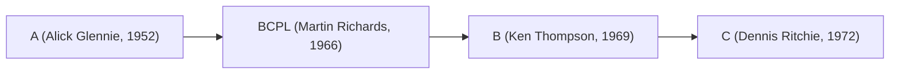
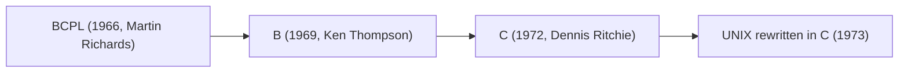

### 🧠 **Assembly Language — Overview**

**Creator:**
Assembly language wasn’t created by a single person — it **evolved in the early 1950s** as a more human-readable abstraction over machine code.
However, **Kathleen Booth (1947)** is widely credited with designing the **first assembly language** for the **ARC (Automatic Relay Computer)** at Birkbeck College, London.

---

### ⚙️ **Concepts**

1. **Low-level abstraction:**
   A thin layer above machine code — uses mnemonics (e.g., `MOV`, `ADD`, `JMP`) instead of binary opcodes.
2. **One-to-one mapping:**
   Each assembly instruction maps directly to a specific machine instruction.
3. **CPU architecture-dependent:**
   Each processor (x86, ARM, RISC-V, etc.) has its own assembly syntax and instruction set.
4. **Registers and memory addressing:**
   Operates directly on CPU registers and memory locations using addressing modes.
5. **Assembler:**
   Converts assembly source code into executable **machine code** via an **assembler program**.

---

### 🧩 **Main Components**

| Component                    | Description                                                                  |
| ---------------------------- | ---------------------------------------------------------------------------- |
| **Instructions (mnemonics)** | Symbolic representations of CPU operations, e.g., `MOV`, `ADD`, `SUB`.       |
| **Registers**                | Fast CPU storage locations (e.g., `AX`, `BX`, `R0`, `EAX`).                  |
| **Memory Addresses**         | Used for direct or indirect data access.                                     |
| **Directives**               | Commands to the assembler (not executed), e.g., `.data`, `.text`, `.global`. |
| **Labels**                   | Named memory locations or jump targets.                                      |
| **Operands**                 | Values or references used by instructions.                                   |

---

### 🚀 **Use Cases**

1. **Embedded systems programming** (e.g., microcontrollers, firmware).
2. **Performance-critical routines** (e.g., cryptography, signal processing).
3. **Operating system kernels and device drivers**.
4. **Reverse engineering and malware analysis**.
5. **Compiler backend development** (code generation).
6. **Hardware interfacing and instruction-level debugging**.

---

### 🧮 **Example (x86 Assembly)**

```asm
section .text
    global _start

_start:
    mov eax, 4          ; system call: write
    mov ebx, 1          ; file descriptor: stdout
    mov ecx, msg        ; message to write
    mov edx, len        ; message length
    int 0x80            ; call kernel

    mov eax, 1          ; system call: exit
    xor ebx, ebx        ; exit code 0
    int 0x80

section .data
msg db 'Hello, Assembly!', 0xA
len equ $ - msg
```


##  **How to Execute an Assembly Program (Linux x86 Example)**

1. **Write the code** in a file, e.g. `hello.asm`.

2. **Assemble** (convert to object code):

   ```bash
   nasm -f elf32 hello.asm -o hello.o
   ```

3. **Link** (combine object file with system libraries to make executable):

   ```bash
   ld -m elf_i386 hello.o -o hello
   ```

4. **Run** the executable:

   ```bash
   ./hello
   ```

Output:

```
Hello, Assembly!
```


##  **What is a Linker?**

A **linker** is a system tool that **combines one or more object files** (e.g., `hello.o`) into a **single executable program**.

### 🧩 **Key Responsibilities of the Linker**

| Function                  | Description                                                                         |
| ------------------------- | ----------------------------------------------------------------------------------- |
| **Symbol resolution**     | Matches function/variable references to their actual memory addresses.              |
| **Relocation**            | Adjusts code and data addresses so all parts of the program fit together in memory. |
| **Combining sections**    | Merges `.text` (code), `.data`, and `.bss` sections from multiple files.            |
| **Library linking**       | Connects your program to external libraries (e.g., libc).                           |
| **Executable generation** | Produces the final runnable binary (like `a.out` or `hello`).                       |

---

###  Flow

```text
Source (.asm)
   ↓  [Assembler]
Object File (.o)
   ↓  [Linker]
Executable File
   ↓  [Loader]
Running Program (in memory)
```
Excellent historical question 👏 — let’s clarify this with a timeline and explanation.

---

## 🕰️ **Interpreter — Before or After A?**

The concept of an **interpreter** actually came **before A**.

* Interpreters date back to **the 1940s–1950s**, used in **assembly monitors** and **early scripting systems**.
* The first major interpreted language was **Lisp (1958)** and then **BASIC (1964)**.
* **A (1960s)**, and its descendant **APL**, were initially **interpreted systems** themselves, allowing interactive array computation.

So  **interpreters existed before A** — A’s own early implementations were *interpreted*, not compiled in the modern sense.


   
   


3. The interpreter **translated the code into threaded machine instructions** and executed them directly — no separate linker was used.

---

### ⚙️ Summary Table

| Language                  | Year   | Execution Type        | Developer(s)            | How It Ran                          |
| ------------------------- | ------ | --------------------- | ----------------------- | ----------------------------------- |
| **Interpreter (concept)** | ~1940s | Interpreted           | Early computer pioneers | Interactive / monitor programs      |
| **A (APL precursor)**     | 1960s  | Interpreted initially | Kenneth Iverson         | APL system on IBM mainframes        |
| **B**                     | 1969   | Interpreted           | Ken Thompson            | `b` command on UNIX                 |
| **C**                     | 1972   | Compiled              | Dennis Ritchie          | `cc` compiler producing executables |

---


##  The Origins of A and B Languages

Before **C**, there were two predecessors — **B** and **BCPL**, and even before that, **A**.

---

### **Language A (Around 1951–1953)**

#### Overview

* **Developed by:** Alick Glennie (at the University of Manchester)
* **Name:** Simply called **A**
* **Machine:** Ferranti Mark 1
* **Purpose:** To simplify machine coding on early computers

####  Key Characteristics

* **One of the first compiled languages** — predating even Fortran (1957).
* Allowed programmers to write symbolic instructions that were then translated into machine code.
* Not portable — it was machine-specific.

* The compiler for language **A** is often considered the **first working compiler** ever written.
* It introduced the idea of automatically converting human-readable code into executable machine instructions.

Excellent question 🔍 — here’s a concise breakdown about the **A programming language** (the early one that influenced B and C):

---

## 🧠 **What Was the “A” Programming Language**

* **Developed by:** **Kenneth E. Iverson** in the **1960s** at Harvard (later evolved into **APL** — *A Programming Language*).
* It was **mathematical and array-oriented**, designed for **concise mathematical notation** rather than systems programming.
* Implemented mainly on **IBM mainframes**.


##  **What the A Compiler Does**

The **A language compiler**:

1. **Parses** the mathematical expressions written in A’s syntax.
2. **Converts** them into **intermediate code** or **machine instructions** for the target architecture (e.g., IBM System/360).
3. Performs **symbol resolution**, **expression evaluation**, and **array operation optimization**.
4. Produces executable object code — similar to how C compilers generate assembly/machine code.

In simpler terms, the **A compiler translated high-level mathematical notation into efficient low-level instructions** for scientific computation.


##  **How to Run an A Program (historically)**

1. Write the program in A language syntax (often using specialized terminals).
2. Submit it to the **A compiler** on a mainframe system (e.g., via punched cards or command line).
3. The compiler generates an **object file or executable**.
4. Execute the compiled program using the system’s **job control or interpreter** environment.

Example (conceptually, not actual code):

```
A ← (1 2 3) + (4 5 6)
```

Would compute element-wise addition of arrays.


###  Summary

| Step              | Role                                          |
| ----------------- | --------------------------------------------- |
| **Compiler**      | Converts high-level A notation → machine code |
| **Linker/Loader** | Combines and prepares executable              |
| **Runtime**       | Executes mathematical array operations        |


##  **Language B (Around 1969–1970)**


####  Overview

* **Developed by:** Ken Thompson at Bell Labs
* **Derived from:** BCPL (Basic Combined Programming Language) by Martin Richards (1966)
* **Purpose:** To write utilities for the UNIX operating system on the DEC PDP-7.

####  Key Characteristics

* Typeless language — all data was word-sized.
* Used for system-level programming.
* Simpler and smaller than BCPL.
* Its compiler produced very compact code for early UNIX.

#### 🧠 Importance

* **B was the direct predecessor of C.**
* Dennis Ritchie later extended B with data types and structures, leading to **C (1972)**.
### **How to Run a B Program**

**B** (developed by **Ken Thompson** around **1969–1970** at Bell Labs) was a **simplified descendant of BCPL** and the **predecessor of C**.

It was **interpreted**, not compiled — running on **UNIX** systems like the PDP-7 and PDP-11.

###  Steps to Run a B Program (on those systems)

1. **Write** a program (e.g., `hello.b`):
```b
main() {
       extrn putchar;
       auto i;
       i = 'H';
       putchar(i);
   }
```

**Invoke the B interpreter/compiler:**

   ```bash
   b hello.b
   ```
---

### 🧬 Evolution Lineage



---

### 📜 Timeline Summary

| Year  | Language | Creator         | Notable Feature                     | Influence                          |
| ----- | -------- | --------------- | ----------------------------------- | ---------------------------------- |
| ~1952 | **A**    | Alick Glennie   | First compiled language             | Pioneered compilation              |
| 1966  | **BCPL** | Martin Richards | Simple systems programming language | Influenced B                       |
| 1969  | **B**    | Ken Thompson    | Compact, typeless language for UNIX | Direct parent of C                 |
| 1972  | **C**    | Dennis Ritchie  | Structured, typed language          | Basis for modern systems languages |

---

### 💡 Fun Fact

The original **UNIX kernel** on the PDP-7 was written in **B**, and later rewritten in **C**, making it portable — a huge step in computing history.

---

Would you like me to show a **comparison table** of B vs. early C (syntax, data types, and compilation model)? It’s a fascinating transition showing how modern programming concepts were born.


Perfect 👏 — here’s a detailed **comparison between the B language and early C**, showing how Dennis Ritchie evolved B into C around 1971–1973 at Bell Labs.

---

## 🧬 **B vs Early C: The Evolution of a Language**

Below is a side-by-side breakdown of syntax, features, and design principles:

---

### 📋 **1. Overview**

| Feature             | **B Language (1969)**              | **Early C Language (1972–1973)**                   |
| ------------------- | ---------------------------------- | -------------------------------------------------- |
| **Creator**         | Ken Thompson                       | Dennis Ritchie                                     |
| **Origin**          | Derived from BCPL                  | Derived from B                                     |
| **Typing**          | Typeless (everything is a word)    | Statically typed (int, char, float, etc.)          |
| **Target Machine**  | DEC PDP-7                          | DEC PDP-11                                         |
| **Primary Use**     | Early UNIX utilities               | UNIX kernel, compilers, systems software           |
| **Compiler Output** | Machine code for specific hardware | Portable assembly-like code (via compiler backend) |

---

### ⚙️ **2. Data Types and Variables**

| Concept       | **B**                                          | **Early C**                                   |
| ------------- | ---------------------------------------------- | --------------------------------------------- |
| Basic Type    | Single word (machine-dependent)                | `char`, `int`, `float`, etc.                  |
| Pointers      | Supported, but not typed                       | Typed pointers: `int *p; char *s;`            |
| Arrays        | Implemented via pointer arithmetic             | True arrays with bounds known at compile time |
| Strings       | Null-terminated char arrays (manually handled) | Standardized `char[]` strings                 |
| Type Checking | None — all operations assumed same type        | Compile-time type checking introduced         |

---

### 🧱 **3. Syntax Example**

#### B Language:

```b
main() {
    auto a, b, c;
    a = 5;
    b = 10;
    c = a + b;
    putn(c);
}
```

#### Early C Language:

```c
int main() {
    int a, b, c;
    a = 5;
    b = 10;
    c = a + b;
    printf("%d\n", c);
    return 0;
}
```

> 🧠 Notice the move from `auto` (default storage class) to explicit **typed declarations** and standardized I/O functions.

---

### 🧩 **4. Control Structures**

| Structure                   | **B**            | **C**                       |
| --------------------------- | ---------------- | --------------------------- |
| `if`, `else`                | Yes              | Yes                         |
| `while`, `for`, `do`        | Yes              | Yes, improved syntax        |
| `switch`, `case`            | Introduced later | Fully implemented           |
| `goto`, `break`, `continue` | Yes              | Yes (same semantics)        |
| Function Definitions        | Yes              | Yes, with type declarations |

---

### 🧮 **5. Memory Model**

| Concept            | **B**                           | **C**                                      |
| ------------------ | ------------------------------- | ------------------------------------------ |
| Addressing         | All variables were memory words | Typed memory addressing (byte, word, etc.) |
| Pointer Arithmetic | Unchecked arithmetic            | Scaled arithmetic by data type size        |
| Stack              | Compiler-managed                | Compiler-managed + function frames         |
| Static Storage     | Limited                         | Fully supported (`static`, `extern`)       |

---

### ⚡ **6. Compilation & Portability**

| Aspect             | **B**                      | **C**                                          |
| ------------------ | -------------------------- | ---------------------------------------------- |
| Compilation Target | PDP-7 machine code         | Portable intermediate form (later to assembly) |
| Portability        | Low — machine-dependent    | High — recompiled for new hardware easily      |
| Toolchain          | Basic interpreter/compiler | Full compiler + assembler + linker             |

---

### 🧠 **7. Philosophical Differences**

| Design Principle | **B**                                 | **C**                                  |
| ---------------- | ------------------------------------- | -------------------------------------- |
| Simplicity       | Very minimal — good for small systems | Balanced simplicity + expressive power |
| Portability      | Limited — hardware-tied               | Core design goal of C                  |
| Type Safety      | None                                  | Stronger static typing                 |
| Performance      | High, but untyped risks               | High with safety guarantees            |
| Abstraction      | Direct machine manipulation           | Structured, modular programming        |

---

### 🧬 **8. Evolution Diagram**



---

### 💡 **Summary Insight**

| Feature Category        | What Changed from B → C           | Why It Mattered                          |
| ----------------------- | --------------------------------- | ---------------------------------------- |
| **Typing**              | Introduced static, explicit types | Prevented logical and memory errors      |
| **Pointer Semantics**   | Made type-aware                   | Safer memory manipulation                |
| **Compilation Model**   | Portable                          | Allowed UNIX to run on multiple machines |
| **Structures & Arrays** | Added                             | Enabled real data abstraction            |
| **Standard Library**    | Introduced                        | Unified I/O and memory operations        |

---

### 🔍 **Fun Historical Note**

When UNIX was first written in B on the PDP-7, it had to be manually ported to every new machine.
After Dennis Ritchie extended B into **C**, he **rewrote UNIX in C (1973)** — making it **portable for the first time**.
That single decision is why both **UNIX and C** spread worldwide.

---

Would you like me to extend this into a **timeline showing the evolution from Assembly → A → BCPL → B → C → C++ → Java** (with key milestones and design shifts)?
