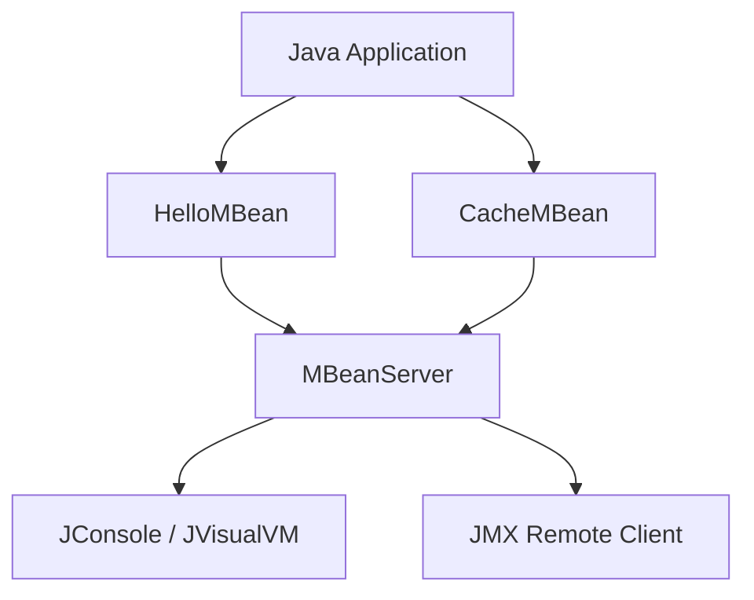

Great question 👍 — MBeans (**Managed Beans**) are the **core building blocks** of the **Java Management Extensions (JMX)** framework, which is built into the JDK. They provide a way to **monitor and manage Java applications** (both at runtime and remotely).

---

# 🔹 What are MBeans?

* **MBean** = *Managed Bean*, a special Java object that exposes:

  * **Attributes** (like fields → can be read/written)
  * **Operations** (like methods → can be invoked)
  * **Notifications** (events emitted by the MBean)

* They are registered with an **MBeanServer** (a core JMX component).

* Can be accessed via:

  * Local tools (e.g., **`jconsole`**, **`jvisualvm`**)
  * Remote JMX clients (over RMI, JMXMP, etc.)

---

# 🔹 Types of MBeans

1. **Standard MBeans**

   * Define an interface named `SomethingMBean`.
   * Implement it in a class `Something`.
   * Example:

   ```java
   // MBean interface
   public interface HelloMBean {
       void sayHello();
       int add(int x, int y);
       String getName();
       void setName(String name);
   }

   // Implementation
   public class Hello implements HelloMBean {
       private String name = "World";

       public void sayHello() {
           System.out.println("Hello, " + name + "!");
       }

       public int add(int x, int y) { return x + y; }

       public String getName() { return name; }
       public void setName(String name) { this.name = name; }
   }
   ```

   🔑 Rule: The management interface must be named `<ClassName>MBean`.

---

2. **Dynamic MBeans**

   * More flexible; attributes and operations are defined at runtime (not via interface).

3. **Open MBeans / Model MBeans**

   * Provide standard, generic ways of describing MBeans using metadata.
   * Model MBeans allow reusing a single implementation to represent many managed resources.

---

# 🔹 Registering an MBean

```java
import javax.management.*;
import java.lang.management.ManagementFactory;

public class Main {
    public static void main(String[] args) throws Exception {
        MBeanServer mbs = ManagementFactory.getPlatformMBeanServer();
        ObjectName name = new ObjectName("com.example:type=Hello");

        Hello mbean = new Hello();
        mbs.registerMBean(mbean, name);

        System.out.println("MBean registered. Press Enter to exit...");
        System.in.read();
    }
}
```

* Registers the `Hello` MBean with the **platform MBeanServer**.
* Tools like **JConsole** can now see it under `com.example:type=Hello`.

---

# 🔹 Why use MBeans?

✅ **Monitoring:**

* Track heap usage, thread count, open connections, etc.

✅ **Management:**

* Change application parameters at runtime (e.g., logging level, cache size).

✅ **Notifications:**

* Receive events from the application (e.g., threshold breaches).

✅ **Integration:**

* Used by application servers (Tomcat, JBoss, WebLogic, etc.) for configuration/monitoring.

---

# 🔹 Diagram of JMX with MBeans



---

# 🔑 Summary

* MBeans = managed objects that expose attributes, operations, and notifications.
* Registered in an `MBeanServer`.
* Accessed via JMX tools (`jconsole`, remote clients).
* Used for **runtime monitoring and management**.

---

👉 Do you want me to also show you how to **connect with JConsole** to view and invoke methods on the `HelloMBean` example above?
