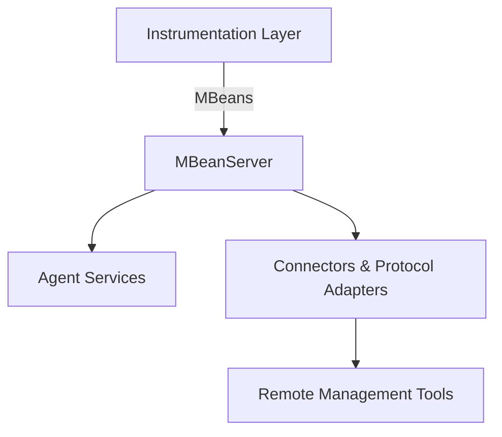

Good question 👍 Let’s carefully break down the **components of Java Management Extensions (JMX)** so you can see how they fit together.

---

## 🔹 JMX Architecture

JMX is divided into **three main layers**:

1. **Instrumentation Layer**
2. **Agent Layer**
3. **Distributed Layer (Remote Management Layer)**

---

## 1. **Instrumentation Layer**

This layer provides the actual *manageable resources*.

* **MBeans (Managed Beans):**

  * Special Java objects that represent resources (like memory pools, threads, applications, services).
  * Four main types:

    * **Standard MBeans** (simple get/set methods, operations)
    * **Dynamic MBeans** (metadata generated at runtime)
    * **Open MBeans** (for cross-platform interoperability)
    * **Model MBeans** (highly configurable, most flexible).

👉 Example: A `MemoryMonitor` MBean to monitor heap usage.

---

## 2. **Agent Layer**

This is the **core of JMX** inside the JVM. It provides the infrastructure for registering, managing, and monitoring MBeans.
Components:

* **MBeanServer**

  * A registry that holds MBeans.
  * Provides APIs to register/unregister/query MBeans.
  * Each JVM has at least one MBeanServer.

* **Agent Services** (optional helpers)

  * **Monitoring Service** – Tracks attribute values and notifies when thresholds are crossed.
  * **Timer Service** – Sends notifications at defined intervals.
  * **Dynamic Loading Service** – Loads new classes/MBeans at runtime.

---

## 3. **Distributed Layer (Remote Management Layer)**

Allows remote tools (like **JConsole**, **VisualVM**, or custom apps) to connect to the MBeanServer.
Components:

* **Connectors & Protocol Adapters**

  * **Connectors:** Allow remote clients to connect over protocols (RMI, JMXMP, REST, etc.).
  * **Protocol Adapters:** Convert JMX to a specific protocol (like SNMP, HTML).

👉 Example: JConsole connects via **JMX RMI Connector**.

---

## 📊 Diagram (Mermaid)

---

## ✅ Summary

* **Instrumentation Layer:** Defines *what* to monitor/manage (via MBeans).
* **Agent Layer:** Provides the *in-JVM registry* (MBeanServer) + services.
* **Distributed Layer:** Allows *remote management* (via connectors/adapters).

---

Would you like me to show you a **Java code example** where we create a simple MBean (say, `HelloMBean`) and then connect to it using **JConsole**? That way you’ll see these components in action.
