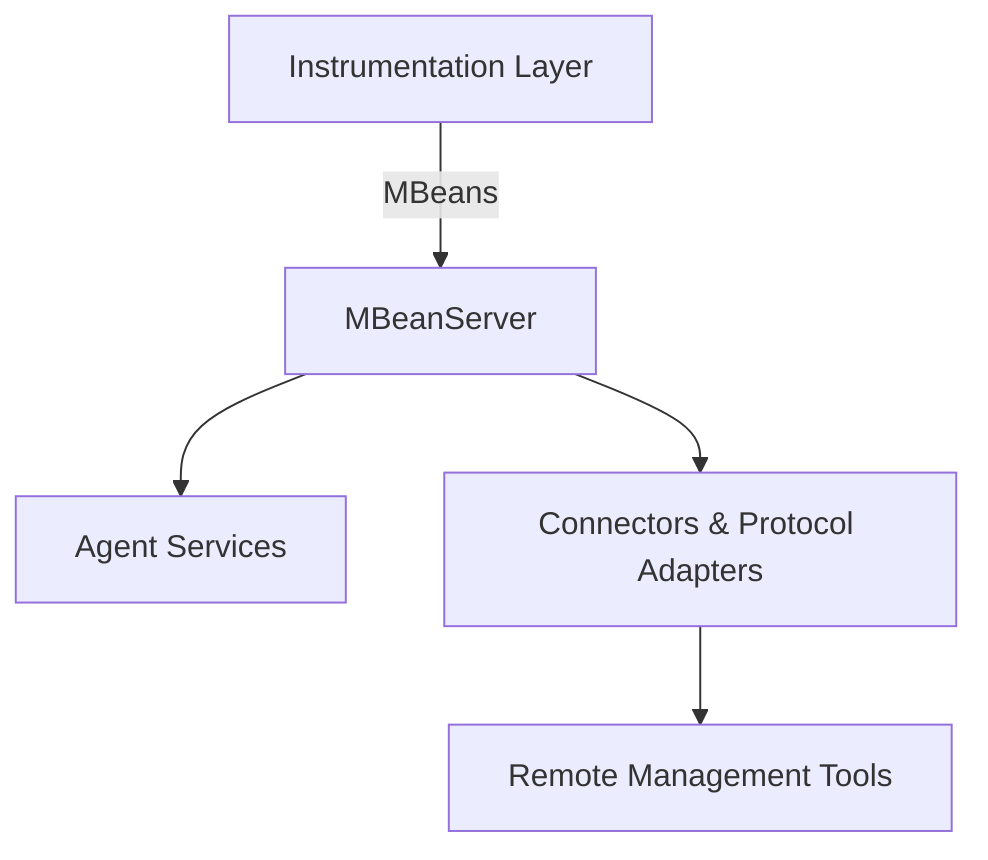

 **Components of Java Management Extensions (JMX)** 

---

## JMX Architecture

JMX is divided into **three main layers**:

1. **Instrumentation Layer**
2. **Agent Layer**
3. **Distributed Layer (Remote Management Layer)**

---

### 1. **Instrumentation Layer**

This layer provides the actual *manageable resources*.

* **MBeans (Managed Beans):**

  * Special Java objects that represent resources (like memory pools, threads, applications, services).
  * Four main types:

    * **Standard MBeans** (simple get/set methods, operations)
    * **Dynamic MBeans** (metadata generated at runtime)
    * **Open MBeans** (for cross-platform interoperability)
    * **Model MBeans** (highly configurable, most flexible).

For Example: A `MemoryMonitor` MBean to monitor heap usage.
###  Example: Instrumenting JVM Memory

```java
import java.lang.management.ManagementFactory;
import java.lang.management.MemoryMXBean;
import java.lang.management.MemoryUsage;

public class JMXInstrumentationExample {
    public static void main(String[] args) throws InterruptedException {
        // Get the MemoryMXBean from the ManagementFactory
        MemoryMXBean memoryBean = ManagementFactory.getMemoryMXBean();

        for (int i = 0; i < 3; i++) {
            // Fetch heap memory usage
            MemoryUsage heapUsage = memoryBean.getHeapMemoryUsage();
            long used = heapUsage.getUsed();
            long max = heapUsage.getMax();

            System.out.println("Heap Memory Used: " + used + " bytes");
            System.out.println("Heap Memory Max: " + max + " bytes");
            System.out.println("-----------------------------");

            // Simulate workload
            Thread.sleep(1000);
            byte[] load = new byte[10_000_0]; // allocate ~1MB
        }
    }
}
```

---

###   How it Works

1. `ManagementFactory.getMemoryMXBean()` → retrieves the **MemoryMXBean**, which is a management interface for the heap & non-heap memory system.
2. `getHeapMemoryUsage()` → gives live stats on current memory usage.
3. You can print/log this info → that’s **instrumentation** (monitoring internal JVM stats at runtime).
4. In a real system, you’d expose this via JMX or push it into a monitoring system (Prometheus, Grafana, etc.).

---

###  Sample Output

```
Heap Memory Used: 1572936 bytes
Heap Memory Max: 4294967296 bytes
-----------------------------
Heap Memory Used: 2582320 bytes
Heap Memory Max: 4294967296 bytes
-----------------------------
Heap Memory Used: 3629136 bytes
Heap Memory Max: 4294967296 bytes
-----------------------------
```
 

---

### 2. **Agent Layer**

This is the **core of JMX** inside the JVM. It provides the infrastructure for registering, managing, and monitoring MBeans.
Components:

* **MBeanServer**

  * A registry that holds MBeans.
  * Provides APIs to register/unregister/query MBeans.
  * Each JVM has at least one MBeanServer.

* **Agent Services** (optional helpers)

  * **Monitoring Service** – Tracks attribute values and notifies when thresholds are crossed.
  * **Timer Service** – Sends notifications at defined intervals.
  * **Dynamic Loading Service** – Loads new classes/MBeans at runtime.


There are **two different contexts** for “instrumentation JARs” in Java:

---

### 1. **Normal JAR on classpath**

If your JAR just uses `java.lang.management` (like the `MemoryMXBean`  ), then you don’t need anything special.
You just put it on the classpath:

```bash
java -cp myapp.jar com.example.Main
```

Instrumentation code will run as part of your app.  

---

### 2. **Agent JAR (special case with `java.lang.instrument`)**

For **instrumentation agents** (the `java.lang.instrument` package),  you can specify the agent JAR separately when launching your application.

An **agent JAR** is a JAR that has a manifest attribute:

```
Premain-Class: com.example.MyAgent
```

And then you start your app with:

```bash
java -javaagent:myagent.jar -jar myapp.jar
```
Agent code :
```java
package com.example;

import java.lang.instrument.Instrumentation;

public class MyAgent {
    // This runs *before* your main application
    public static void premain(String agentArgs, Instrumentation inst) {
        System.out.println("MyAgent loaded with args: " + agentArgs);

        // Register a simple class file transformer
        inst.addTransformer((loader, className, classBeingRedefined, protectionDomain, classfileBuffer) -> {
            System.out.println("Loading class: " + className);
            return null; // returning null means no modification
        });
    }
}
```

Here’s what happens:

* JVM loads `myagent.jar` **before** running your app.
* It calls the `premain(String args, Instrumentation inst)` method in your agent class.
* You can use the `Instrumentation` API to modify classes, add bytecode hooks, measure things, etc.

---

 **Summary**

* If you just use `java.lang.management` → no need for `-javaagent`, just run your app normally.
* If you want to use **bytecode instrumentation** (via `java.lang.instrument`) → yes, you must package your instrumentation into an **agent JAR** and attach it with `-javaagent`.

---

### 3. **Distributed Layer (Remote Management Layer)**

Allows remote tools (like **JConsole**, **VisualVM**, or custom apps) to connect to the MBeanServer.
Components:

* **Connectors & Protocol Adapters**

  * **Connectors:** Allow remote clients to connect over protocols (RMI, JMXMP, REST, etc.).
  * **Protocol Adapters:** Convert JMX to a specific protocol (like SNMP, HTML).

👉 Example: JConsole connects via **JMX RMI Connector**.

---




---

###   Summary

* **Instrumentation Layer:** Defines *what* to monitor/manage (via MBeans).
* **Agent Layer:** Provides the *in-JVM registry* (MBeanServer) + services.
* **Distributed Layer:** Allows *remote management* (via connectors/adapters).

---

