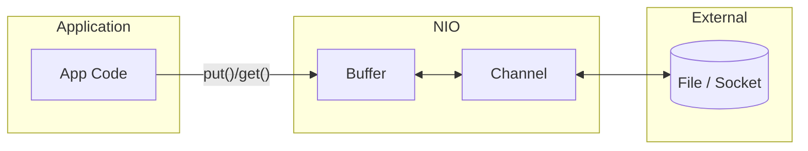
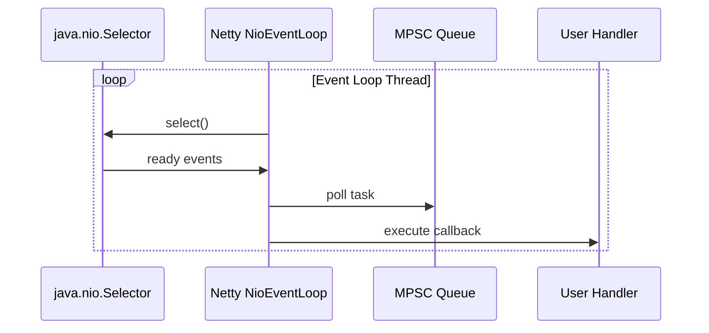

---

## 🔹 NIO Buffers

In **Java NIO (New I/O)**, a **Buffer** is a **container for data** that works closely with **Channels** to enable fast, non-blocking I/O operations.

Instead of reading/writing data one byte/char at a time (like old `InputStream` / `OutputStream`), NIO uses **Buffers** that:

* Store data in **contiguous memory blocks**.
* Allow **bulk transfers** between a Channel (file, socket, etc.) and memory.
* Provide efficient **read/write** with explicit position tracking.

---

## 🔹 Key Features

1. **Backed by an array** (e.g., `byte[]`, `char[]`) or **direct memory**.
2. Each buffer has:

   * `capacity` → maximum number of elements it can hold.
   * `position` → current index where data will be read/written.
   * `limit` → the boundary up to which data can be read/written.
   * `mark` → a saved position for later reset.
3. Buffers can be of different types:

   * `ByteBuffer` (most used, for binary data)
   * `CharBuffer`
   * `IntBuffer`, `LongBuffer`, `FloatBuffer`, etc.

---

## 🔹 Example Usage

```java
import java.nio.ByteBuffer;

public class BufferExample {
    public static void main(String[] args) {
        // Create a buffer of capacity 10
        ByteBuffer buffer = ByteBuffer.allocate(10);

        // Write data into buffer
        buffer.put((byte)65); // 'A'
        buffer.put((byte)66); // 'B'

        // Switch from writing to reading
        buffer.flip();

        // Read data
        while(buffer.hasRemaining()) {
            System.out.println((char) buffer.get());
        }
    }
}
```

**Output:**

```
A
B
```

---

## 🔹 Why Buffers?

* Old I/O (streams) = byte-by-byte or char-by-char → **slow**.
* NIO (buffers + channels) = block-oriented → **faster**.
* Especially useful for **file transfer, networking, and scalable servers**.

---
 **NIO Buffers are memory containers that store and manage data for efficient I/O operations, working hand-in-hand with Channels.**
---
Channel ↔ Buffer ↔ Application** to visualization 


---

###  NIO Data Flow



---

### Explanation of Flow

1. **Application ↔ Buffer**

   * Application writes data into the **Buffer** (`put()`) or reads from it (`get()`).
2. **Buffer ↔ Channel**

   * Channel reads data from the **Buffer** (`channel.write(buffer)`) or fills it (`channel.read(buffer)`).
3. **Channel ↔ External Resource**

   * Channel connects to **files, sockets, or devices**, transferring data in bulk.

---
 This separation (Application ↔ Buffer ↔ Channel) is what makes **NIO efficient** and scalable for large data transfers.

Would you like me to also explain the difference between a **Direct Buffer** and a **Non-Direct (Heap) Buffer** with another diagram?


Ah, now you’re touching a very important point about **Java NIO Buffers**, especially **Direct Buffers**, which are allocated **outside the JVM heap**. Let me explain carefully.

---

## 🔹 Types of Buffers

1. **Heap Buffer** (default with `ByteBuffer.allocate(capacity)`)

   * Allocated **inside JVM heap**.
   * Subject to normal **GC**.
   * Size limited by **heap size** (`-Xmx`).

2. **Direct Buffer** (allocated with `ByteBuffer.allocateDirect(capacity)`)

   * Allocated in **native memory (outside heap)**.
   * Not part of JVM heap → reduces GC overhead for large buffers.
   * Size limited by **OS memory**, not JVM heap.

> Direct buffers are useful for large, long-lived buffers, especially with **file I/O or network channels**, because the OS can access them directly without copying to heap.

---

## 🔹 Setting Buffer Size

### 1. Heap Buffer

```java
// Buffer of 16 KB inside JVM heap
ByteBuffer heapBuffer = ByteBuffer.allocate(16 * 1024);
```

* Limited by heap size (`-Xmx`), otherwise `OutOfMemoryError: Java heap space`.

---

### 2. Direct Buffer

```java
// Buffer of 16 MB in native memory
ByteBuffer directBuffer = ByteBuffer.allocateDirect(16 * 1024 * 1024);
```

* Uses **off-heap memory**, so you won’t hit JVM heap limit.
* Can still throw `OutOfMemoryError: Direct buffer memory` if OS memory is exhausted.
* **Max direct buffer memory** can be tuned with:

  ```text
  -XX:MaxDirectMemorySize=64m
  ```

  (Defaults to JVM max heap if not set.)

---

### 🔹 Important Notes

* Direct buffers are more expensive to create but faster for **I/O operations**.
* They **should be reused** if possible, rather than constantly allocating large buffers.
* The JVM **tracks direct buffer allocations** and will GC them eventually, but it is less predictable than heap objects.

---

### 🔹 Quick Summary Table

| Buffer Type   | Location                 | Tunable Size              | GC Managed        |
| ------------- | ------------------------ | ------------------------- | ----------------- |
| Heap Buffer   | JVM heap                 | `-Xmx` (max heap)         | Yes               |
| Direct Buffer | Native memory (off-heap) | `-XX:MaxDirectMemorySize` | Yes (but delayed) |

---

If you want, I can also draw a **mermaid diagram showing Heap vs Direct Buffer allocation and limits** — it’s very useful to visualize why NIO uses off-heap memory.

Do you want me to do that?


Here is a **concise, precise explanation** of **Event Loop in multithreading Java**, following your formatting rules (H3 headings only, no emojis, no separators).

### What Is an Event Loop in Java

An event loop is a **single-threaded task dispatcher** that continuously:

1. Waits for events or messages
2. Picks the next event from a queue
3. Executes the associated callback or task

It is widely used in **reactive Java frameworks** (Netty, Vert.x) but not a built-in JDK feature like in Node.js.

### Where It Exists in Java

In Java, the event loop pattern is implemented by:

* **Netty:** NioEventLoop, NioEventLoopGroup
* **Vert.x:** EventLoopContext
* **CompletableFuture** and **Virtual Threads** indirectly mimic event-driven scheduling but do not have a classic event loop thread.

### Internal Working

The event loop thread:

* Uses **java.nio.Selector** to monitor channels for readiness (read, write, accept, connect)
* Runs in a loop without blocking operations
* Dispatches I/O-ready tasks to the same thread to avoid synchronization

This design guarantees:

* No lock contention
* High throughput for network applications
* Deterministic concurrency for each connection

### Sequence Diagram of Event Loop



### Example Using Netty’s Event Loop

```java
EventLoopGroup group = new NioEventLoopGroup(1); // single-threaded event loop

Bootstrap bootstrap = new Bootstrap();
bootstrap.group(group)
         .channel(NioSocketChannel.class)
         .handler(new ChannelInitializer<Channel>() {
             @Override
             protected void initChannel(Channel ch) {
                 ch.pipeline().addLast(new SimpleChannelInboundHandler<String>() {
                     @Override
                     protected void channelRead0(ChannelHandlerContext ctx, String msg) {
                         // executed on event loop thread
                         System.out.println("Message: " + msg);
                     }
                 });
             }
         });
```

### Pseudo Code Showing Core Event Loop Logic

```pseudo
loop forever:
    readyKeys = selector.select()
    for key in readyKeys:
        if key.isReadable:
            callback = readHandlers[key]
            callback.run()
    while taskQueue not empty:
        task = taskQueue.poll()
        task.run()
```

### Key Features

* **Single-threaded for I/O tasks**
* **Thread-safe by design** (no shared state per channel)
* Uses **Selector + non-blocking I/O** (NIO)

### When To Use Event Loop

Use event loops when building:

* High-throughput network servers (Netty)
* Reactive microservices (Vert.x)
* WebSockets, TCP servers, HTTP servers
* Low-latency message brokers

If you want, I can also explain **difference between executor thread pool vs event loop** or **how Netty avoids context switching**.


In Java, blocking threads are threads that perform operations which may wait—such as I/O, sleep, locks, or network calls—causing the thread to pause until the operation completes. Non-blocking threads, such as those managed by Java’s NIO (Non-Blocking I/O) or reactive frameworks (Netty, Vert.x, Project Reactor), are designed to never wait; they rely on event loops and callbacks to handle work asynchronously.

If you block a non-blocking thread, such as the NIO Selector thread or a reactor event-loop thread, it stalls the entire event loop because these threads are single-threaded and responsible for handling many connections or events. Blocking them leads to delays, timeouts, throughput collapse, and the system can appear frozen because the event loop cannot process other tasks.


Blocking a blocking thread is normal.

Blocking a non-blocking event-loop thread causes performance degradation and defeats the purpose of non-blocking architecture.


the reason for the error “block(), blockFirst(), blockLast() are blocking, which is not supported in thread parallel-11


When using Project Reactor (used in Spring WebFlux), where certain threads—especially event-loop threads like parallel-11, reactor-http-nio, etc.—are non-blocking threads.

Calling:

block()

blockFirst()

blockLast()


forces the thread to wait synchronously, which is not allowed on Reactor’s non-blocking threads.

Reactor detects this and throws an error to prevent deadlocks.


parallel-11 is a thread from Reactor’s Parallel Scheduler, part of its non-blocking event-loop architecture.
These threads must stay free and quick, because they handle many tasks concurrently without waiting.


What happens if you block a non-blocking thread?

Blocking it causes:

Event-loop freeze

Requests piling up

Reduced throughput

Possible deadlocks

Timeouts under load


This is why Reactor explicitly prevents blocking.


Non-blocking threads cannot wait.

block() forces them to wait.

Reactor throws this error to prevent breaking the reactive model.


More :

How to convert blocking code to reactive

Safe ways to block on appropriate threads


