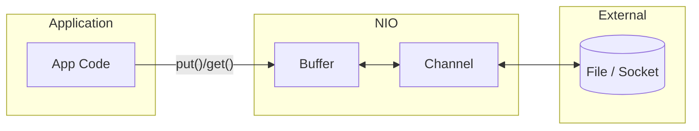

---

## 🔹 NIO Buffers

In **Java NIO (New I/O)**, a **Buffer** is a **container for data** that works closely with **Channels** to enable fast, non-blocking I/O operations.

Instead of reading/writing data one byte/char at a time (like old `InputStream` / `OutputStream`), NIO uses **Buffers** that:

* Store data in **contiguous memory blocks**.
* Allow **bulk transfers** between a Channel (file, socket, etc.) and memory.
* Provide efficient **read/write** with explicit position tracking.

---

## 🔹 Key Features

1. **Backed by an array** (e.g., `byte[]`, `char[]`) or **direct memory**.
2. Each buffer has:

   * `capacity` → maximum number of elements it can hold.
   * `position` → current index where data will be read/written.
   * `limit` → the boundary up to which data can be read/written.
   * `mark` → a saved position for later reset.
3. Buffers can be of different types:

   * `ByteBuffer` (most used, for binary data)
   * `CharBuffer`
   * `IntBuffer`, `LongBuffer`, `FloatBuffer`, etc.

---

## 🔹 Example Usage

```java
import java.nio.ByteBuffer;

public class BufferExample {
    public static void main(String[] args) {
        // Create a buffer of capacity 10
        ByteBuffer buffer = ByteBuffer.allocate(10);

        // Write data into buffer
        buffer.put((byte)65); // 'A'
        buffer.put((byte)66); // 'B'

        // Switch from writing to reading
        buffer.flip();

        // Read data
        while(buffer.hasRemaining()) {
            System.out.println((char) buffer.get());
        }
    }
}
```

**Output:**

```
A
B
```

---

## 🔹 Why Buffers?

* Old I/O (streams) = byte-by-byte or char-by-char → **slow**.
* NIO (buffers + channels) = block-oriented → **faster**.
* Especially useful for **file transfer, networking, and scalable servers**.

---
 **NIO Buffers are memory containers that store and manage data for efficient I/O operations, working hand-in-hand with Channels.**
---
Channel ↔ Buffer ↔ Application** to visualization 


---

###  NIO Data Flow



---

### Explanation of Flow

1. **Application ↔ Buffer**

   * Application writes data into the **Buffer** (`put()`) or reads from it (`get()`).
2. **Buffer ↔ Channel**

   * Channel reads data from the **Buffer** (`channel.write(buffer)`) or fills it (`channel.read(buffer)`).
3. **Channel ↔ External Resource**

   * Channel connects to **files, sockets, or devices**, transferring data in bulk.

---
 This separation (Application ↔ Buffer ↔ Channel) is what makes **NIO efficient** and scalable for large data transfers.

Would you like me to also explain the difference between a **Direct Buffer** and a **Non-Direct (Heap) Buffer** with another diagram?
