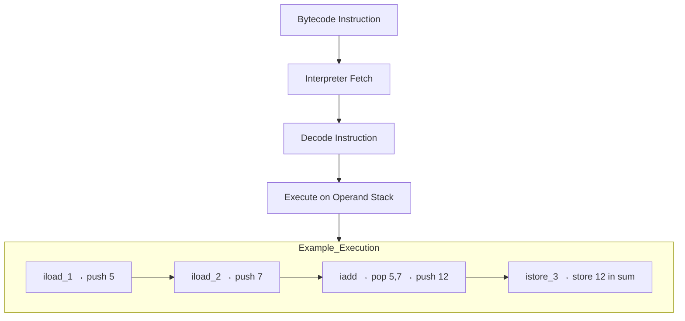
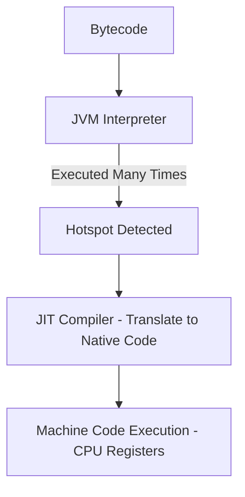

Let’s break this down carefully because **Interpreter Mode** and **Just-In-Time (JIT) Compilation** are at the heart of how the JVM executes Java code.

---

# 🔹 1. Interpreter Mode

* When you run a Java program, your `.java` source code is compiled into **bytecode** (`.class` files).
* The JVM interpreter reads this bytecode **line by line (instruction by instruction)** and executes it.

✅ Pros:

* Fast startup (no compilation overhead).
* Simple, predictable execution.

❌ Cons:

* Slower performance because every bytecode instruction must be **translated again and again** at runtime.

Example : 
```text
Byte Code 
5: iload_1       // load local var[1] (a=5) onto stack
6: iload_2       // load local var[2] (b=7) onto stack
7: iadd          // add top two ints
8: istore_3      // store result into local var[3] (sum)
```

| Step | Instruction | Operand Stack (before → after) | Local Vars         |
| ---- | ----------- | ------------------------------ | ------------------ |
| 5    | `iload_1`   | `[] → [5]`                     | `a=5, b=7, sum=?`  |
| 6    | `iload_2`   | `[5] → [5, 7]`                 | `a=5, b=7, sum=?`  |
| 7    | `iadd`      | `[5, 7] → [12]`                | `a=5, b=7, sum=?`  |
| 8    | `istore_3`  | `[12] → []`                    | `a=5, b=7, sum=12` |



---

# 🔹 2. Just-In-Time (JIT) Compiler

* JIT is part of the JVM that **compiles bytecode into native machine code** at runtime.
* Instead of interpreting every instruction repeatedly, the JVM compiles frequently used code paths into **optimized native code**.

✅ Pros:

* Much faster execution after warm-up.
* Optimizations (inlining, dead code elimination, loop unrolling).

❌ Cons:

* Slower startup (compilation overhead).
* Needs profiling/warm-up before full performance.

Example :
Yes ✅ — let’s now look at the **JIT compilation path**, where instead of interpreting bytecode line by line, the JVM compiles “hot” bytecode into **native machine code**.

---

## 🔹 Example Java Code

```java
public class Sum {
    public static int add(int a, int b) {
        return a + b;
    }
    public static void main(String[] args) {
        int result = 0;
        for (int i = 0; i < 1_000_000; i++) {
            result = add(5, 7);  // Hot method, called many times
        }
        System.out.println(result);
    }
}
```

---

## 🔹 Bytecode for `add` method

```text
0: iload_0      // load a
1: iload_1      // load b
2: iadd         // a + b
3: ireturn      // return result
```

---

## 🔹 JIT Compilation Flow

1. **Interpretation Phase**

   * At first, JVM executes `add(int,int)` by interpreting bytecode (`iload_0, iload_1, iadd, ireturn`).

2. **Hot Spot Detection**

   * The JVM notices `add` is called **1M times** → marks it as a **hot method**.

3. **JIT Compilation**

   * The JIT compiler translates bytecode into **native CPU instructions**.

   Example (x86 simplified):

   ```asm
   mov eax, edi   ; move first arg (a) into register eax
   add eax, esi   ; add second arg (b)
   ret            ; return result in eax
   ```

   🔹 Instead of pushing/popping from a stack, the JIT uses **CPU registers** directly (much faster).

4. **Execution**

   * Subsequent calls to `add` use this **compiled machine code** directly, bypassing interpretation.




## **Scalar Replacement** 

it is a **JIT (Just-In-Time) optimization** in the JVM that breaks down an object into its **individual fields (scalars)** so they can be stored directly in **CPU registers or on the stack**, instead of allocating the object on the heap.

This reduces **heap allocations** and **GC overhead**.

✅ Example:
If an object is **created and used only within a method** (it doesn’t “escape”), the JVM can replace the object with its fields — avoiding heap allocation entirely.

🚫 **Not applied** if:

* The object **escapes** the method (e.g., returned or assigned to a global reference).
* The code is **too complex** for the JIT to prove it’s safe.
* **Escape analysis** is disabled (`-XX:-DoEscapeAnalysis`).


---

 **Summary:**

* Interpreter: executes bytecode step by step → slower.
* JIT Compiler: converts frequently used bytecode into native machine code → faster execution.


---

# 🔹 3. JVM Execution Modes

| Mode                               | Command              | Behavior                                                                                    |
| ---------------------------------- | -------------------- | ------------------------------------------------------------------------------------------- |
| **Interpreter-only**               | `java -Xint MyApp`   | Executes all bytecode line by line (slow, but predictable).                                 |
| **JIT-only (compile all at once)** | `java -Xcomp MyApp`  | Compiles everything immediately into native code (slow startup, but tests JIT correctness). |
| **Mixed (default)**                | `java -Xmixed MyApp` | Starts with interpreter, compiles hot methods with JIT (best balance).                      |

---

# 🔹 4. Example Flow

Imagine this method:

```java
public int sum(int n) {
    int s = 0;
    for (int i = 0; i < n; i++) {
        s += i;
    }
    return s;
}
```

* **Interpreter mode** → Each loop iteration is executed bytecode → machine instructions → repeatedly translated.
* **JIT mode** → JVM sees this method is called **thousands of times**, so it compiles it into optimized machine code. Next calls run **directly on CPU instructions** (very fast).

---

# 🔹 5. Why JVM Uses Both

* At startup → Interpreter mode for quick response.
* As program runs → JVM’s profiler tracks “hot” methods (frequently used).
* JIT compiles those into native code for long-term speed.

This gives Java **both fast startup + good long-term performance**.

---

✅ In short:

* **Interpreter** = executes bytecode line by line (slow, quick startup).
* **JIT Compiler** = compiles hot code into native machine code (fast execution after warm-up).
* **Mixed mode** = JVM default, best of both worlds.

---

Would you like me to also show a **real benchmark example** (same program run with `-Xint` vs `-Xcomp` vs `-Xmixed`) so you can see the performance difference in numbers?
