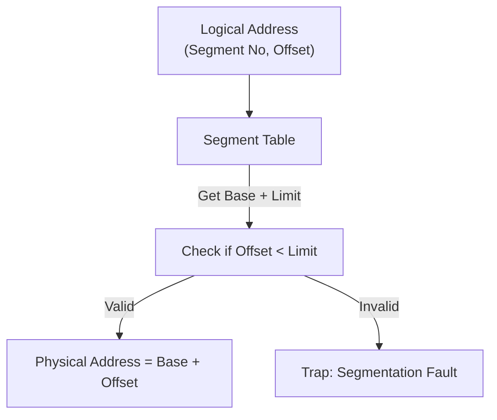
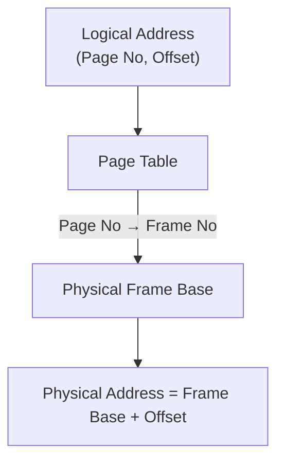
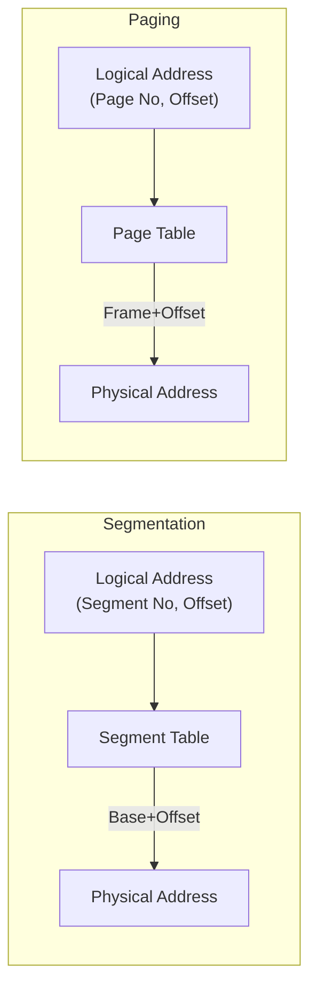
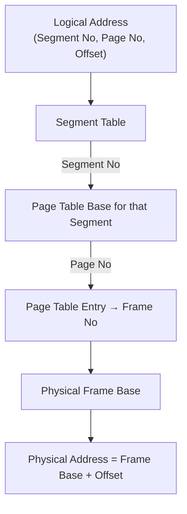

## **Paging**

* **Definition:** A memory management scheme where both physical and logical memory are divided into **fixed-size blocks**:

  * **Logical memory (process address space)** → divided into **pages**.
  * **Physical memory (RAM)** → divided into **frames**.
* Page size = frame size (fixed, usually power of 2 like 4KB).
* A process’s pages can be placed **anywhere** in RAM (not necessarily contiguous).


```
Logical Memory (Process): [Page 0][Page 1][Page 2][Page 3]
Physical Memory (RAM):    [Frame 5][Frame 9][Frame 2][Frame 7]
```

→ The **page table** keeps track of which page maps to which frame.


### **Fragmentation in Paging**

* No **external fragmentation** (since all frames are the same size).
* But **internal fragmentation** may occur (if a process’s last page doesn’t fully use the frame).


| Aspect               | **Partitioning**                                | **Segmentation**                                       | **Paging**                                                 |
| -------------------- | ----------------------------------------------- | ------------------------------------------------------ | ---------------------------------------------------------- |
| **Unit of division** | Physical memory into partitions                 | Logical memory into segments (code, data, stack, heap) | Logical memory into pages, physical memory into frames     |
| **Size**             | Fixed (static) or variable (dynamic) partitions | Variable (based on program’s structure)                | Fixed-size pages and frames                                |
| **Contiguity**       | Process needs a contiguous partition            | Each segment needs contiguous allocation               | Pages/frames need **not** be contiguous                    |
| **Mapping**          | Partition table (base + limit)                  | Segment table (segment number + offset)                | Page table (page number → frame number)                    |
| **Fragmentation**    | Fixed: internal, Dynamic: external              | External fragmentation                                 | Internal fragmentation (last page waste)                   |
| **View**             | OS resource allocation                          | Program’s logical structure                            | Purely physical/virtual memory management                  |
| **Sharing**          | No direct sharing                               | Segment-level sharing possible                         | Page-level sharing possible (shared frames, copy-on-write) |

---

### **Combined Approaches**

* **Paged Segmentation** → Each segment is divided into pages. This combines benefits:

  * Segmentation → matches program’s logical view.
  * Paging → avoids external fragmentation.

---


* **Partitioning**: Early scheme, splits physical memory into partitions.
* **Segmentation**: Splits process memory logically (code/data/stack). Needs contiguous space per segment.
* **Paging**: Splits everything into fixed-size blocks (pages/frames). No contiguous requirement.


## **address translation** (logical → physical) for paging vs segmentation

 

###   Segmentation Address Translation**

Logical Address = `(Segment Number, Offset)`
Physical Address = `Base(Segment) + Offset`



 

###   Paging Address Translation**

Logical Address = `(Page Number, Page Offset)`
Physical Address = `Frame(Page) + Offset`



 

### Side-by-Side View**



 

* **Segmentation** → Works with **variable-sized segments** (logical program structure).
* **Paging** → Works with **fixed-size pages/frames** (no contiguous requirement).

 

This scheme is a **hybrid**:

* Logical memory is first divided into **segments**.
* Each segment is further divided into **pages**.
* Pages are mapped to **frames** in physical memory.

 

## **Paged Segmentation Address Translation**

Logical Address = `(Segment No, Page No, Offset)`
Translation steps:

1. Use **segment number** → locate the segment’s **page table**.
2. Use **page number** → get the corresponding **frame number**.
3. Add **offset** to frame base → physical address.

 



 
* **Segmentation** gives program structure (code, stack, heap).
* **Paging inside each segment** avoids **external fragmentation**.
* This approach is used in systems like **x86 protected mode (before 64-bit long mode)**.

 


