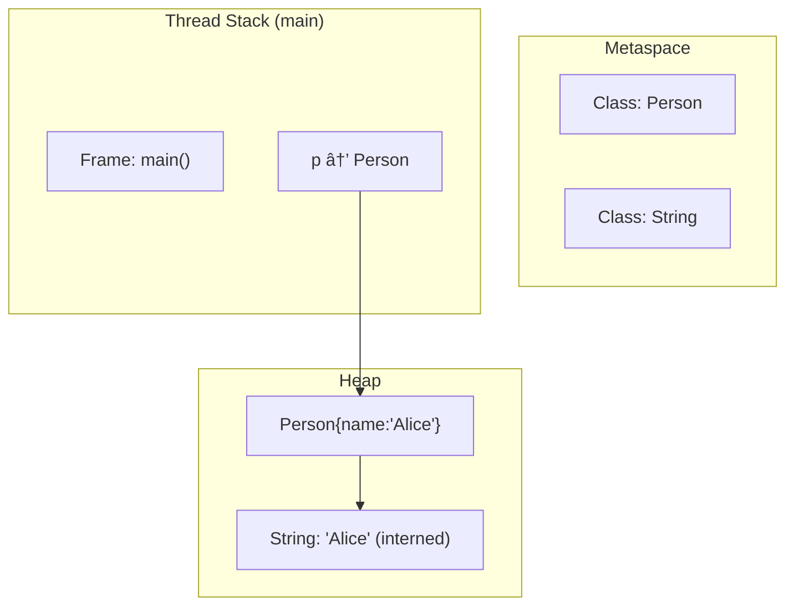
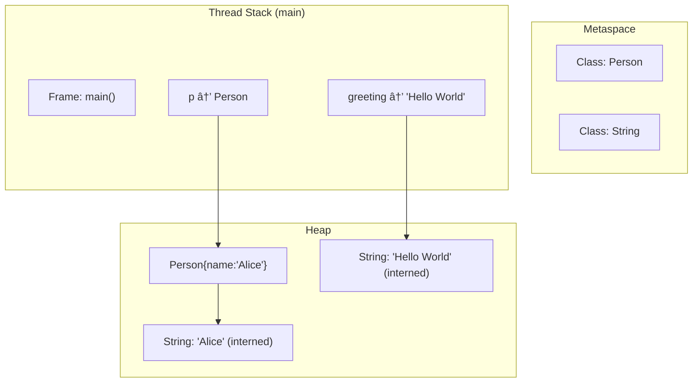
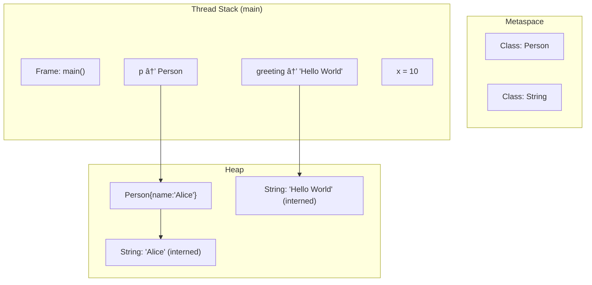

 Let’s draw a **diagram of Java Memory Management** and label all the memory areas managed by the JVM.

---

# 🔹 Java Memory Management Overview

```
          +-----------------------------------+
          |          JVM Memory Model         |
          +-----------------------------------+
                       |
  +-------------------------------------------------------+
  |                  Runtime Data Areas                   |
  +-------------------------------------------------------+
  |                                                       |
  | 1. Method Area (MetaSpace in Java 8+)                 |
  |    - Class definitions, metadata, static variables    |
  |                                                       |
  | 2. Heap (Shared, GC-managed)                          |
  |    - Young Generation                                 |
  |        * Eden Space                                   |
  |        * Survivor Space (S0, S1)                      |
  |    - Old Generation (Tenured)                         |
  |    - Stores objects & arrays                          |
  |                                                       |
  | 3. Stack (per thread)                                 |
  |    - Stack Frames                                     |
  |        * Local Variables                              |
  |        * Operand Stack                                |
  |        * Frame Data                                   |
  |    - One stack per thread                             |
  |                                                       |
  | 4. PC Register (per thread)                           |
  |    - Stores address of current JVM instruction        |
  |                                                       |
  | 5. Native Method Stack (per thread)                   |
  |    - Supports JNI (C/C++ native code)                 |
  |                                                       |
  +-------------------------------------------------------+
```

---

# 🔹 Explanation of Each Memory Type

### 1. **Method Area (MetaSpace in Java 8+)**

* Stores class metadata, method info, runtime constant pool, and static variables.
* Shared across all threads.

### 2. **Heap**

* Main area managed by **Garbage Collector (GC)**.
* Divided into:

  * **Young Generation**

    * Eden Space: New objects are created here.
    * Survivor Spaces (S0, S1): Objects that survive GC move here.
  * **Old Generation (Tenured)**

    * Long-lived objects move here after surviving multiple GCs.
* Also includes **String Pool** (interned strings).

### 3. **JVM Stack**

* Each thread has its own stack.
* Contains **stack frames**:

  * Local variables (ints, refs, doubles, etc.)
  * Operand stack (intermediate calculations)
  * Frame data (method return addresses, exception handling).

### 4. **PC Register**

* Per-thread register.
* Holds the current instruction address of the thread’s executing bytecode.

### 5. **Native Method Stack**

* Supports execution of native (non-Java) methods.
* Used when calling code through JNI (Java Native Interface).

---

📌 **Summary**:

* **Heap & Method Area** → Shared by all threads.
* **Stack, PC Register, Native Method Stack** → Created per-thread.

---
### Memory usage in **simple Java application**
---

##  Memory Areas in JVM

1. **Heap (shared across all threads)**

   * Stores **objects** (instances of classes).
   * Also contains runtime data like String pool, arrays, and static fields.

2. **Thread Stack (per thread)**

   * Stores **method call frames** (local variables, references, partial results).
   * Each thread has its own stack.

3. **Metaspace (shared, native memory)**

   * Stores **class metadata** (class structure, methods, bytecode).
   * Outside the Java heap.

4. **Other Native Areas**

   * **Code Cache**: Stores compiled machine code from JIT.
   * **Direct Memory**: For NIO buffers (off-heap).

---
### Flow 


---

##  Example Walkthrough

For a simple app:

```java
public class Person {
    String name;
    Person(String n) { this.name = n; }
    
    public static void main(String[] args) {
        Person p = new Person("Alice");
        String greeting = "Hello World";
        int x = 10;
    }
}
```

* **Metaspace**: stores `Person` and `String` class metadata.
* **Heap**: stores the `Person` object (`p`), `"Alice"`, and `"Hello World"`.
* **Thread Stack**: stores local variable `x`, reference `p`, reference `greeting`.

---

## **step-by-step diagram showing what happens in memory when `main` runs** (loading class → creating object → assigning reference)
---


---

## 🔹 Example Program

```java
public class Person {
    String name;

    Person(String n) {
        this.name = n;
    }

    public static void main(String[] args) {
        Person p = new Person("Alice");
        String greeting = "Hello World";
        int x = 10;
    }
}
```

---

##  Step 1: Class Loading

When the JVM starts:

* **Metaspace**: Loads `Person` and `String` class metadata (fields, methods, bytecode).
* **No objects yet in Heap**.
* **Thread Stack**: `main` method frame created.


---

##  Step 2: Creating `Person p = new Person("Alice");`

* **Heap**: Allocates `Person` object with field `name → "Alice"`.
* `"Alice"` string literal stored in heap (string pool).
* **Stack**: Reference `p` points to Person object.



---

##  Step 3: Storing `String greeting = "Hello World";`

* `"Hello World"` literal stored in **string pool (heap)**.
* **Stack**: Reference `greeting` points to that string.



---

##  Step 4: Storing `int x = 10;`

* **Stack**: Primitive `x=10` stored directly in the stack frame.
* No new heap allocation for primitive types.



---

##  Final State Recap

* **Metaspace** → Class definitions (`Person`, `String`).
* **Heap** → Objects (`Person`, String literals).
* **Stack** → Local variables (`p`, `greeting`, `x`).

---

## On  **G1 Garbage Collector** run

---

## 🔹 Quick Recap of Our Program State

```java
Person p = new Person("Alice");
String greeting = "Hello World";
int x = 10;
```

* **Metaspace** → `Person` and `String` class metadata.
* **Heap** → `Person` object, `"Alice"`, `"Hello World"`.
* **Stack** → References: `p`, `greeting`, and primitive `x=10`.

---

##  G1 GC Key Points

* G1 divides the heap into **regions** (young + old).
* Collects garbage in **parallel** and **incrementally**.
* When GC runs, **reachable objects (from stack, static vars, metaspace roots) are kept**.
* **Unreachable objects are reclaimed**.

In our example:

* Both `p` and `greeting` are **reachable** → survive GC.
* Suppose we set `p = null;` before GC → the `Person` object may be collected.

---

##  Case 1: Before GC (`p` still pointing to Person)

```mermaid
flowchart TD
    subgraph Meta["Metaspace"]
        C1["Class: Person"]
        C2["Class: String"]
    end

    subgraph Heap["Heap (G1 regions)"]
        O1["Person{name:'Alice'} (reachable)"]
        S1["String: 'Alice' (reachable)"]
        S2["String: 'Hello World' (reachable)"]
    end

    subgraph Stack["Thread Stack (main)"]
        P["p → Person"]
        G["greeting → 'Hello World'"]
        X["x = 10"]
    end

    P --> O1
    O1 --> S1
    G --> S2
```



 GC runs → all objects are still referenced → **no cleanup happens**.

---

##  Case 2: After `p = null;` and then GC runs

* Now `Person{name:'Alice'}` and `"Alice"` string are no longer referenced.
* `"Hello World"` is still referenced by `greeting`.
* GC will **reclaim Person and "Alice"**.


✅ After GC completes →

* `Person` and `"Alice"` are **removed from heap**.
* `"Hello World"` remains.
* Metaspace still keeps class definitions.

---

##  Case 3: After method exits (`main()` ends)

* Stack frame for `main` is popped.
* No references to heap objects remain.
* GC eventually clears `"Hello World"`.
* Metaspace keeps class metadata until JVM shutdown.

---
## **G1 GC (and other generational collectors)** handle object movement between **Eden → Survivor → Old Gen**. 

---

## 🔹 Recap of Example

```java
Person p = new Person("Alice");
String greeting = "Hello World";
int x = 10;
```

* When objects are **newly created** (`Person`, `"Alice"`, `"Hello World"`) → they go to **Eden region** (young generation).
* If they **survive GC**, they move to **Survivor regions**.
* After surviving multiple collections, they get **promoted to Old Gen**.

---

## 🔹 Step 1: Allocation in Eden

All new objects start in **Eden**:

```mermaid
flowchart TD
    subgraph Young["Young Generation"]
        subgraph Eden["Eden Region"]
            O1["Person{name:'Alice'}"]
            S1["String: 'Alice'"]
            S2["String: 'Hello World'"]
        end
        subgraph Survivor["Survivor Region (empty)"]
            Empty1[" "]
        end
    end

    subgraph Old["Old Generation"]
        Empty2[" "]
    end

    subgraph Stack["Thread Stack (main)"]
        P["p → Person"]
        G["greeting → 'Hello World'"]
        X["x = 10"]
    end

    P --> O1
    O1 --> S1
    G --> S2
```



---

## 🔹 Step 2: Minor GC Runs

* GC checks **roots** (references from stack, static vars, metaspace).
* `Person`, `"Alice"`, `"Hello World"` are **reachable**, so they survive.
* They are **copied from Eden → Survivor**.
* Eden is cleared.

```mermaid
flowchart TD
    subgraph Young["Young Generation"]
        subgraph Eden["Eden Region"]
            Empty1["(cleared)"]
        end
        subgraph Survivor["Survivor Region"]
            O1["Person{name:'Alice'} (age=1)"]
            S1["String: 'Alice' (age=1)"]
            S2["String: 'Hello World' (age=1)"]
        end
    end

    subgraph Old["Old Generation"]
        Empty2[" "]
    end

    subgraph Stack["Thread Stack (main)"]
        P["p → Person"]
        G["greeting → 'Hello World'"]
        X["x = 10"]
    end

    P --> O1
    O1 --> S1
    G --> S2
```



---

## 🔹 Step 3: Survive More GC Cycles → Promotion to Old Gen

* After several GCs (depending on JVM thresholds, e.g., 15 by default but configurable), surviving objects are **promoted to Old Generation**.
* Now `"Hello World"` and `Person` may move into **Old Gen**.

```mermaid
flowchart TD
    subgraph Young["Young Generation"]
        subgraph Eden["Eden Region"]
            Empty1["(cleared)"]
        end
        subgraph Survivor["Survivor Region"]
            Empty2["(emptied after promotion)"]
        end
    end

    subgraph Old["Old Generation"]
        O1["Person{name:'Alice'} (promoted)"]
        S1["String: 'Alice' (promoted)"]
        S2["String: 'Hello World' (promoted)"]
    end

    subgraph Stack["Thread Stack (main)"]
        P["p → Person"]
        G["greeting → 'Hello World'"]
        X["x = 10"]
    end

    P --> O1
    O1 --> S1
    G --> S2
```



---

## 🔹 Summary of Movement

1. **New objects** → Eden.
2. **Minor GC** → live objects copied Eden → Survivor.
3. **Subsequent GC cycles** → objects age, eventually promoted to Old Gen.
4. **Dead objects** → reclaimed when not referenced.

---

👉 Do you want me to also extend this explanation to show what happens if `p = null;` (so `Person` and `"Alice"` die early in Eden/Survivor before reaching Old Gen)?


