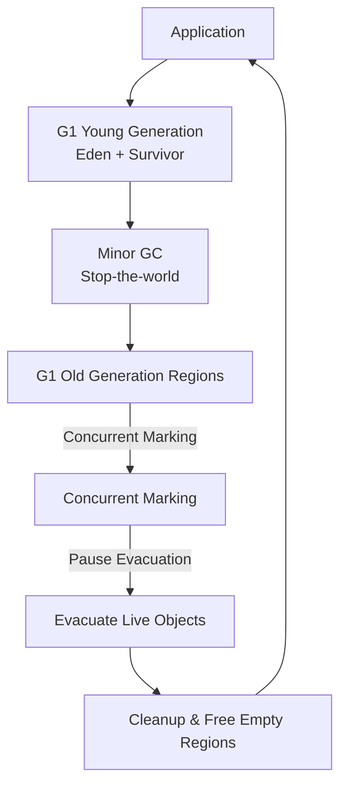
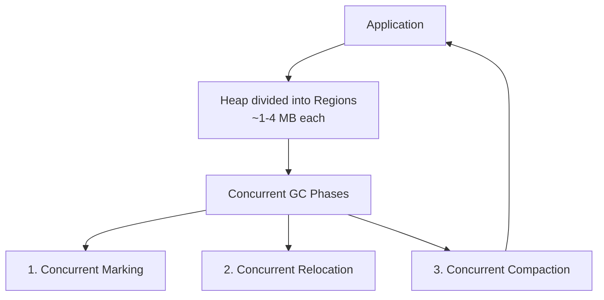
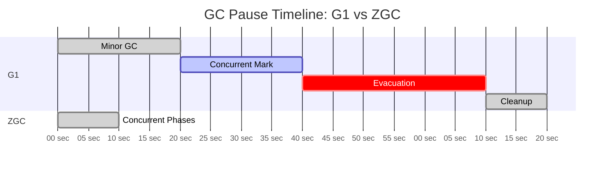

Great question 🚀 Let’s go deep into **Z Garbage Collector (ZGC)**, how it works, how the heap is structured, and what other memory areas exist in the JVM.

---

# 1. **ZGC Overview**

- “Z” stands for “Zero” pause
* **Option**: `-XX:+UseZGC`
* **Goal**: Ultra-low latency → GC pauses are typically **< 1ms**, even for heaps up to **multi-terabytes**.
* **Key properties**:

  * **Concurrent**: Most GC work runs alongside application threads.
  * **Region-based heap**: No fixed young/old generations.
  * **Colored pointers + load barriers**: Allows concurrent relocation of objects without long pauses.
  * **Compacting**: Always keeps heap defragmented (no fragmentation issues).
  * **Scalable**: Designed for very large heaps and multi-core CPUs.

---

# 2. **Heap Division in ZGC**

Unlike Serial, Parallel, or G1, ZGC does **not divide heap into Young/Old generations**.
Instead, it uses a **region-based heap** model:

### 📌 Heap Layout in ZGC

```
+----------------------------------------------------+
| Heap Regions (variable size: 2MB, 32MB, 256MB)     |
|   - Small Regions: for small objects               |
|   - Medium Regions: for medium objects             |
|   - Large Regions: for humongous objects           |
+----------------------------------------------------+
| Metaspace (for class metadata, since Java 8)       |
+----------------------------------------------------+
```

* **No generational split** → all objects are treated uniformly.
* Objects can be **relocated concurrently** between regions.
* Region size chosen dynamically based on heap size:

  * Up to 2TB heap → regions are 2MB, 32MB, 256MB.
  * This makes ZGC scalable to multi-terabyte heaps.

---

# 3. **How ZGC Works**

ZGC uses **concurrent phases** and **colored pointers**:

1. **Colored Pointers**

   * ZGC uses unused bits in 64-bit pointers to store metadata (mark state, remap info).
   * This avoids extra object headers → faster relocation.

2. **Concurrent Phases**

   * **Mark Phase**: Runs concurrently → identifies live objects using load barriers.
   * **Relocate Phase**: Live objects are moved to new regions while the app is still running.
   * **Remap Phase**: References to relocated objects are fixed **lazily** when accessed.

3. **Load Barriers**

   * Every object reference read by the application is intercepted by a **barrier**.
   * If the reference points to a moved object → ZGC updates it to the new location transparently.

4. **Pause Times**

   * Minimal STW pauses (\~sub-millisecond) for initial bookkeeping (like root scanning).
   * All heavy lifting (marking, relocation) is **concurrent**.

---

# 4. **Other JVM Memory Areas**

ZGC only changes how the **heap** is managed.
Other memory areas remain the same:

| Memory Area             | Description                                                      |
| ----------------------- | ---------------------------------------------------------------- |
| **Heap (ZGC regions)**  | Application objects; managed by ZGC with concurrent relocation.  |
| **Metaspace**           | Stores class metadata (replaces PermGen since Java 8).           |
| **Java Stack**          | Each thread’s stack: method frames, local variables, references. |
| **PC Register**         | Holds current instruction address for each thread.               |
| **Native Method Stack** | For JNI/native calls (C/C++ code).                               |
| **Code Cache**          | Stores JIT-compiled bytecode → native machine instructions.      |

---

# 5. **ZGC vs Traditional GCs**

| Aspect        | Traditional GCs (Serial, Parallel, G1) | ZGC                     |
| ------------- | -------------------------------------- | ----------------------- |
| Heap division | Young/Old (generational)               | Region-based (uniform)  |
| Pause time    | ms → seconds                           | Sub-ms                  |
| Relocation    | STW compaction                         | Concurrent compaction   |
| Fragmentation | Possible (needs compaction pauses)     | None (always compacted) |
| Scale         | GBs → 100s of GBs                      | Multi-TB heaps          |

---

✅ **In summary**:

* ZGC uses a **region-based heap (small, medium, large regions)** instead of Young/Old generations.
* Uses **colored pointers + load barriers** to allow **concurrent relocation** with **tiny pause times**.
* Other memory areas (Metaspace, Stacks, PC, Code Cache) are the same as in other collectors.

---

Would you like me to also create a **diagram showing ZGC heap regions + how an object moves between regions with load barriers**? That usually makes ZGC’s mechanism super clear.


Sure! Let’s do a detailed **comparison of ZGC vs G1 Garbage Collector in Java**. I’ll break it down carefully, covering architecture, performance, and use cases.

---

## **1️⃣ Overview**

| Feature             | **G1 (Garbage-First GC)**                         | **ZGC (Z Garbage Collector)**                                                  |
| ------------------- | ------------------------------------------------- | ------------------------------------------------------------------------------ |
| Introduced          | Java 7 (experimental), Java 9 (production)        | Java 11 (production)                                                           |
| GC Type             | **Concurrent, Parallel, Region-based**            | **Concurrent, Low-latency, Region-based, Load Barrier**                        |
| Pause Times         | Typically **tens to hundreds of ms**, predictable | Typically **<10 ms** even for multi-terabyte heaps                             |
| Heap Layout         | Divides heap into **regions** (\~1–32 MB)         | Divides heap into **regions** (\~1 MB–4 MB), supports **multi-terabyte heaps** |
| Focus               | Balanced throughput and pause times               | **Ultra-low latency** for applications requiring minimal pauses                |
| Concurrent Phases   | Evacuation, marking, cleanup                      | Marking, relocation, and pointer coloring happen concurrently                  |
| Supported Heap Size | Up to \~32 GB (older) / 50–100 GB+ (modern)       | Multi-terabytes                                                                |
| CPU Usage           | Moderate to high during concurrent cycles         | Moderate, designed to minimize CPU spikes                                      |
| Generational?       | Yes, uses Young + Old regions                     | Not strictly generational, but segregates regions logically                    |
| Compaction          | Yes, **concurrent evacuation**                    | Yes, fully concurrent **compaction without stop-the-world**                    |
| Tuning              | Needs tuning for pause time targets               | Minimal tuning; mostly auto-tuned                                              |

---

## **2️⃣ Design Differences**

### **G1**

* Divides heap into **regions**, tracks live object density.
* Collects **regions with most garbage first** → “garbage-first”.
* Uses **concurrent marking** to identify regions for evacuation.
* Evacuation (copying live objects) **pauses application** briefly.
* Predictable **pause time goals** (via `-XX:MaxGCPauseMillis`).

### **ZGC**

* Designed for **low-latency, large heaps**.
* Uses **colored pointers / load barriers** for concurrent memory management.
* **All GC work is mostly concurrent**: marking, relocating, and compacting.
* **Pause times <10 ms** regardless of heap size.
* Uses **region-based memory layout** but scales to **TBs**.

---

## **3️⃣ Pause Times**

| GC  | Typical Pause Time                   | Notes                                                                         |
| --- | ------------------------------------ | ----------------------------------------------------------------------------- |
| G1  | 10–200 ms (depending on heap & load) | Pause time goal configurable, may spike if heap is large or highly fragmented |
| ZGC | <10 ms                               | Almost independent of heap size; designed for extremely low latency           |

---

## **4️⃣ Heap & Scalability**

| Aspect                | G1                                       | ZGC                                  |
| --------------------- | ---------------------------------------- | ------------------------------------ |
| Max Heap              | Up to \~100 GB comfortably               | Multi-TB heaps supported             |
| Fragmentation         | Can occur; G1 compacts regions to reduce | Minimal; fully concurrent compaction |
| Young/Old Generations | Yes                                      | No strict generation, uses regions   |

---

## **5️⃣ Tuning**

**G1 Tuning**

* `-XX:MaxGCPauseMillis=<ms>` → pause target
* `-XX:ParallelGCThreads=<num>` → threads for parallel phases
* `-XX:InitiatingHeapOccupancyPercent=<percent>` → triggers concurrent marking

**ZGC Tuning**

* Minimal tuning required.
* Main options: `-Xmx`, `-Xms`, `-XX:MaxHeapSize`
* Other flags mostly for diagnostics, e.g., `-XX:+UnlockExperimentalVMOptions -XX:+UseZGC`

---

## **6️⃣ Use Cases**

| GC  | Best Suited For                                                                             |
| --- | ------------------------------------------------------------------------------------------- |
| G1  | General-purpose apps, moderate latency needs, mid-to-large heap apps (50–100 GB)            |
| ZGC | Ultra-low latency apps, large heaps (100 GB–multi-TB), trading systems, real-time analytics |

---

### **7️⃣ Summary**

* **G1**: Balanced GC; predictable pauses, moderate tuning; good for general server applications.
* **ZGC**: Ultra-low pause GC; mostly hands-off; scales to huge heaps; ideal for latency-sensitive systems.

💡 **Rule of thumb**:

* If your app is **latency-sensitive with >100GB heap**, go with **ZGC**.
* If your app is **general-purpose with moderate pause requirements**, **G1** is simpler and stable.

---

If you want, I can make a **diagram showing the architecture of G1 vs ZGC**, including **concurrent phases and pause points**, which makes it very clear why ZGC has sub-10ms pauses.

Do you want me to do that?
Absolutely! Here’s a **Mermaid version** of the G1 vs ZGC architectures and their GC phases. You can directly render this in Markdown or Mermaid live editors.

---

### **G1 Garbage Collector**



**Notes for G1:**

* Minor GC pauses the application.
* Evacuation pauses during copying.
* Concurrent marking is mostly parallel but may trigger small pauses.
* Pause time grows with heap size.

---

### **Z Garbage Collector (ZGC)**



**Notes for ZGC:**

* Almost all GC work is concurrent.
* Application pause times <10 ms regardless of heap size.
* Fully concurrent compaction reduces fragmentation.
* Scales to multi-terabyte heaps.

---

### **Optional: Timeline Comparison**



**Interpretation:**

* G1 has longer pauses for evacuation, especially as heap grows.
* ZGC completes all phases **mostly concurrently**, with very short stop-the-world pauses (<10 ms).

---

If you want, I can also **merge both architectures into a single Mermaid diagram** showing **application threads and GC phases simultaneously**. This gives a clear visual of why ZGC achieves ultra-low pause times.

Do you want me to do that?
