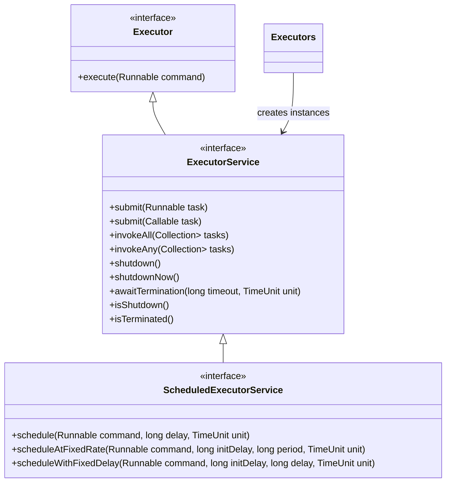

Excellent — this is a core Java concurrency topic 🔥
Let’s dive deep into **ExecutorService** — one of the most important abstractions in the `java.util.concurrent` package.

---

## 🧩 1. What is `ExecutorService`?

* `ExecutorService` is a **high-level framework** for managing and controlling threads.
* Instead of creating and managing threads manually, you **submit tasks** to an executor and let it handle **thread pooling, scheduling, and lifecycle**.

---

### ✅ Why use it?

Without it:

```java
new Thread(() -> doSomething()).start();
```

* You manually create and start threads.
* No control over reusing threads or limiting concurrency.

With `ExecutorService`:

```java
ExecutorService executor = Executors.newFixedThreadPool(5);
executor.submit(() -> doSomething());
```

* Efficient **thread reuse**.
* Built-in **thread pool management**.
* Supports **task cancellation, scheduling, and graceful shutdown**.

---

## ⚙️ 2. Hierarchy Overview



---

## 🧠 3. Common Implementations

| Executor Type             | Created Using                         | Description                                        |
| ------------------------- | ------------------------------------- | -------------------------------------------------- |
| **Single-threaded**       | `Executors.newSingleThreadExecutor()` | One thread executes tasks sequentially.            |
| **Fixed thread pool**     | `Executors.newFixedThreadPool(n)`     | Reuses a fixed number of threads.                  |
| **Cached thread pool**    | `Executors.newCachedThreadPool()`     | Creates threads as needed, reuses idle ones.       |
| **Scheduled thread pool** | `Executors.newScheduledThreadPool(n)` | Schedules tasks for future or periodic execution.  |
| **Work-stealing pool**    | `Executors.newWorkStealingPool()`     | Uses multiple queues; best for parallel workloads. |

---

## 🔹 4. Key Methods in `ExecutorService`

| Method                                                                   | Description                                                            |
| ------------------------------------------------------------------------ | ---------------------------------------------------------------------- |
| `void execute(Runnable task)`                                            | Runs a Runnable task (no return).                                      |
| `<T> Future<T> submit(Callable<T> task)`                                 | Submits a task that returns a result via `Future`.                     |
| `Future<?> submit(Runnable task)`                                        | Submits a Runnable (returns Future for tracking completion).           |
| `<T> List<Future<T>> invokeAll(Collection<? extends Callable<T>> tasks)` | Executes all tasks and waits for all to complete.                      |
| `<T> T invokeAny(Collection<? extends Callable<T>> tasks)`               | Executes all, returns the result of the first successful task.         |
| `void shutdown()`                                                        | Gracefully shuts down (no new tasks accepted, waits for running ones). |
| `List<Runnable> shutdownNow()`                                           | Immediately stops tasks (returns unstarted ones).                      |
| `boolean awaitTermination(long timeout, TimeUnit unit)`                  | Waits for termination after shutdown.                                  |
| `boolean isShutdown()`                                                   | True if shutdown initiated.                                            |
| `boolean isTerminated()`                                                 | True if all tasks completed after shutdown.                            |

---

## 💡 5. Example — Fixed Thread Pool

```java
import java.util.concurrent.*;

public class ExecutorExample {
    public static void main(String[] args) {
        ExecutorService executor = Executors.newFixedThreadPool(3);

        for (int i = 1; i < 6; i++) {
            final int taskId = i;
            executor.submit(() -> {
                System.out.println("Running Task " + taskId + " on " + Thread.currentThread().getName());
                try { Thread.sleep(1000); } catch (InterruptedException e) { Thread.currentThread().interrupt(); }
            });
        }

        executor.shutdown();
        try {
            if (!executor.awaitTermination(5, TimeUnit.SECONDS)) {
                executor.shutdownNow();
            }
        } catch (InterruptedException e) {
            executor.shutdownNow();
        }
    }
}
```

---

### Output (example)

```
Running Task 1 on pool-1-thread-1
Running Task 2 on pool-1-thread-2
Running Task 3 on pool-1-thread-3
Running Task 4 on pool-1-thread-1
Running Task 5 on pool-1-thread-2
```

➡️ Notice how only **3 threads** are reused — not one per task.

---

## 🧭 6. When to Use Each Type

| Executor Type               | Use Case                                         |
| --------------------------- | ------------------------------------------------ |
| `newFixedThreadPool()`      | CPU-bound tasks (limit concurrency).             |
| `newCachedThreadPool()`     | Short-lived, many small async tasks (I/O heavy). |
| `newSingleThreadExecutor()` | Sequential execution with task isolation.        |
| `newScheduledThreadPool()`  | Periodic jobs (e.g., heartbeat, cleanup).        |
| `newWorkStealingPool()`     | Divide & conquer parallelism (ForkJoin).         |

---

## 🔚 7. Graceful Shutdown Sequence

```java
executor.shutdown();              // stop accepting new tasks
executor.awaitTermination(...);   // wait for tasks to finish
if (!executor.isTerminated()) {
    executor.shutdownNow();       // force terminate
}
```

---

✅ **In summary:**
`ExecutorService` gives you:

* Thread pooling
* Task scheduling
* Graceful shutdown
* Future-based results
* Automatic management of concurrency

---

Would you like me to also show how **ExecutorService**, **ThreadPoolExecutor**, and **ForkJoinPool** relate internally (with Mermaid diagram and explanation of thread reuse)?
