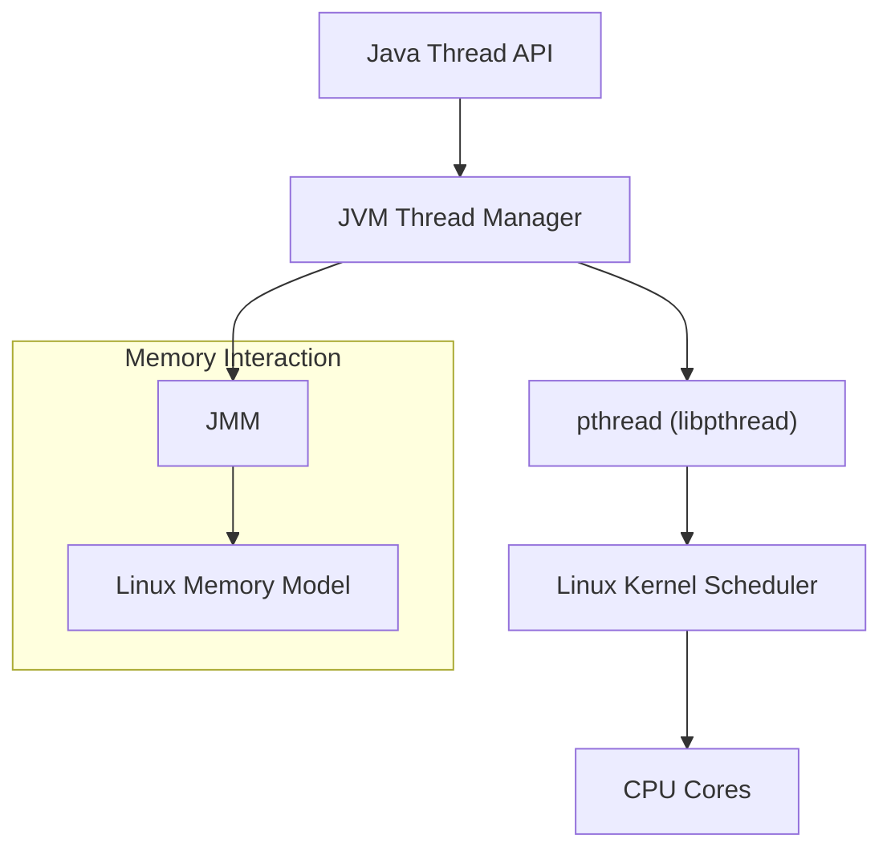

# Multithreading in Java

### Types of Thread 

In Java, threads can be classified as:

1. **User threads** – main application threads that keep the JVM alive.
2. **Daemon threads** – background service threads (e.g., GC).
3. **By execution type:**

   * **Single-threaded** (one task at a time)
   * **Multi-threaded** (concurrent tasks)
4. **By purpose:**

   * **Worker threads** (thread pools, executors)
   * **Timer/Scheduler threads** (e.g., `ScheduledExecutorService`)


| Concept                            | Explanation                                                                                                   |
| ---------------------------------- | ------------------------------------------------------------------------------------------------------------- |
| **Thread**                         | A lightweight unit of execution. In Java, created by extending `Thread` or implementing `Runnable`.           |
| **Thread Lifecycle**               | States: `New → Runnable → Running → Waiting/Blocked → Terminated`. Managed by JVM and OS.                     |
| **Thread Priorities**              | Each thread has a priority (`1` to `10`). JVM/OS uses it for scheduling (but not guaranteed).                 |
| **Runnable Interface**             | Defines the `run()` method. Preferred way to create threads (decouples task from thread).                     |
| **Callable & Future**              | `Callable<V>` returns a result and can throw exceptions. `Future` represents the result of async computation. |
| **Executor Framework**             | Provides a high-level API (`ExecutorService`, `ThreadPoolExecutor`) for managing thread pools.                |
| [**Synchronization**](synchronized.md)                | Mechanism to control access to shared resources. Done with `synchronized` keyword or locks.                   |
| [**Lock Interface (ReentrantLock)**](concurrent/lock) | Provides explicit locking/unlocking, more flexible than `synchronized`.                                       |
| [**Volatile Keyword**](volatile.md)               | Ensures visibility of variable updates across threads. Prevents caching in thread-local memory.               |
| [**Atomic Variables**](concurrent/Atomic.md)               | (`AtomicInteger`, `AtomicLong`, etc.) provide lock-free thread-safe operations.                               |
| **ThreadLocal**                    | Each thread has its own isolated copy of a variable. Useful for user sessions, request context.               |
| [**Wait, Notify, NotifyAll**](wait_notify)        | Methods used for inter-thread communication on objects’ monitors.                                             |
| **Deadlock**                       | Situation where two or more threads wait indefinitely for each other’s resources.                             |
| **Livelock**                       | Threads keep changing state in response to each other but never make progress.                                |
| **Starvation**                     | A thread never gets CPU time/resources due to low priority or scheduling.                                     |
| **Thread Pools**                   | Reuse fixed number of threads to improve performance (`Executors.newFixedThreadPool()`).                      |
| **Fork/Join Framework**            | Splits tasks into smaller subtasks (divide & conquer) and merges results (`ForkJoinPool`).                    |
| **Parallel Streams**               | High-level API for parallel data processing using the Fork/Join framework internally.                         |
| **CompletableFuture**              | Asynchronous, non-blocking computations with chaining (`thenApply`, `thenCombine`).                           |
| **Concurrency Utilities**          | Classes in `java.util.concurrent`: `CountDownLatch`, `CyclicBarrier`, `Semaphore`, `BlockingQueue`.           |


* **Thread Safety**: Avoid [race conditions](race_condition.md) using [synchronization](synchronized.md) , locks, atomics.
* **Executors**: Prefer over manual `Thread` creation for better scalability.
* **Avoid Deadlocks**: Use consistent lock ordering, timeouts, or try-lock.
* **Best Practice**: Use high-level concurrency utilities (Executor, CompletableFuture) instead of low-level `wait/notify`.


## **Locking mechanism**:  
 

1. **Object Monitor (Intrinsic Lock)**

   * Obtained via `synchronized` methods or blocks.
   * Every object has a built-in monitor lock.
   

     ```java
     synchronized (obj) { ... }
     ```

2. **ReentrantLock (java.util.concurrent.locks.Lock)**

   * More flexible than `synchronized`.
   * Allows **tryLock()**, **lockInterruptibly()**, and **fair locking**.
   * Fair Lock allows the longest waiting Thread to acquire Lock
   * An unfair lock allows a thread to potentially acquire the lock even if other threads have been waiting longer, if the lock becomes available at the exact moment the thread attempts to acquire it. This can lead to higher throughput in some scenarios but risks thread starvation.

     ```java
     Lock lock = new ReentrantLock(); //unfair
     lock.lock();
     try { ... } finally { lock.unlock(); }

     Lock fair = new ReentrantLock(true); //fair lock
     ```

3. **ReentrantReadWriteLock**

   * Provides **read lock** (shared, multiple readers allowed) and **write lock** (exclusive).
   * Good for scenarios with more reads than writes.

4. **StampedLock (Java 8+)**

   * Optimized for read-mostly use cases.
   * Supports **optimistic reads** (no blocking).
   * More scalable than `ReentrantReadWriteLock`.

5. **Semaphore (java.util.concurrent)**

   * Controls access to a resource pool with a set number of permits.
   * Example: limit to N concurrent threads.

6. **CountDownLatch**

   * Not a lock in the strict sense, but **blocks threads until a count reaches zero**.
   * Often used for **one-time synchronization**.

7. **CyclicBarrier**

   * Synchronizes a set of threads at a barrier point before continuing execution.
   * Useful for **multi-threaded algorithms**.

8. **Phaser (Java 7+)**

   * More flexible version of `CyclicBarrier` for **multi-phase synchronization**.

9. **Atomic Variables (java.util.concurrent.atomic)**

   * Lock-free thread-safe operations (CAS — Compare-And-Swap).
   * Example: `AtomicInteger`, `AtomicLong`.

10. **Volatile Keyword**

* Not a lock, but ensures **visibility** of changes across threads.
* Used to prevent caching issues in multi-threading.


##  Default Threads   in a fresh JVM 

Threads at startup, **depends on:**

* **JVM version** (Java 8, 11, 17, 21… may differ).
* **GC algorithm** in use.
* **JVM options** (`-XX:+UseParallelGC`, `-XX:CICompilerCount=2`, etc.).
* **OS & hardware** (more CPUs → more GC/JIT threads).:

1. **Main thread**

   * Runs your `public static void main(String[] args)` method.

2. **Reference Handler**

   * Cleans up references like `PhantomReference`, `WeakReference`, `SoftReference`.

3. **Finalizer**

   * Runs finalizers on objects that are about to be garbage-collected (deprecated in recent JDKs, but still present in some versions).

4. **Signal Dispatcher**

   * Handles signals sent to the JVM process (e.g., CTRL+C, or OS signals).

5. **GC threads**

   * Depends on the garbage collector chosen by the JVM.
   * For example:

     * **G1GC** (default since JDK 9) → multiple GC worker threads + concurrent marking threads.
     * **Parallel GC** → several GC threads.
     * **Serial GC** → just one GC thread.

6. **JIT compiler threads**

   * The JVM’s Just-In-Time compiler (C2, Tiered compilation, Graal) spins up background threads to compile bytecode into machine code.

7. **Attach Listener**

   * Used when tools (like VisualVM, JConsole, profilers) connect to the JVM.


You can print all threads at JVM startup with:

```java
public class ThreadCheck {
    public static void main(String[] args) {
        Thread.getAllStackTraces().keySet()
              .forEach(t -> System.out.println(t.getName()));
    }
}
```

On a simple run, you’ll usually see something like:

```
main
Reference Handler
Finalizer
Signal Dispatcher
Common-Cleaner
Attach Listener
GC Thread#0
GC Thread#1
...
C2 CompilerThread0
C2 CompilerThread1
```


## **hardware → OS kernel → JVM → Java threads** 


###  1. **Architecture Overview**

At a high level:

```
[ Hardware / CPU Cores ]
        ↓
[ Linux Kernel Scheduler ]
        ↓
[ pthreads (POSIX threads) ]
        ↓
[ JVM Native Threads ]
        ↓
[ Java Thread API (java.lang.Thread) ]
```


###   2. **Linux OS Thread Model**

Linux implements threads as **Lightweight Processes (LWPs)**.
All threads are essentially **tasks** managed by the same kernel scheduler.

Each thread has:

* Its own **stack**
* Its own **register set (CPU state)**
* Shared **memory space (heap, globals)** with sibling threads

###   Linux Thread API

At the kernel level, all threads are created with the **`clone()` system call**,
which allows selective sharing of resources (address space, file descriptors, etc.)

Example:

```c
clone(CLONE_VM | CLONE_FS | CLONE_FILES | CLONE_SIGHAND, 0);
```

This means:

* All threads share the same memory (so `static` variables are visible to all)
* The kernel scheduler treats them just like separate processes

###   3. **Scheduler: How Linux Manages Threads**

The **Completely Fair Scheduler (CFS)** in Linux is responsible for:

* Picking which thread runs next
* Time-slicing threads across cores
* Balancing load across CPUs

Each thread has its own **task_struct** in kernel memory.
The scheduler can preempt threads, save CPU context, and resume later.

###  4. **How Java Threads Map to Linux Threads**

The JVM (HotSpot and OpenJ9) implements **Java threads as 1:1 mapped native threads**:

| Java Thread                | Linux Thread                                           | Description                                       |
| -------------------------- | ------------------------------------------------------ | ------------------------------------------------- |
| `java.lang.Thread` object  | `pthread_t` (POSIX thread)                             | Managed by JVM, but scheduled by the Linux kernel |
| `Thread.start()`           | `pthread_create()`                                     | Creates a native thread in the OS                 |
| `Thread.sleep()`, `wait()` | Kernel puts thread in WAIT state                       |                                                   |
| `Thread.interrupt()`       | Sets interrupt flag; may cause signal to native thread |                                                   |

Each Java thread corresponds to **one native pthread**, which the OS kernel schedules.

### 5. **Thread Lifecycle Integration**

| Java Thread State       | Linux Kernel State                            | Description                             |
| ----------------------- | --------------------------------------------- | --------------------------------------- |
| NEW                     | Not created                                   | JVM object exists, no native thread yet |
| RUNNABLE                | `TASK_RUNNING`                                | Eligible for CPU, executing             |
| BLOCKED                 | `TASK_INTERRUPTIBLE` / `TASK_UNINTERRUPTIBLE` | Waiting on monitor or I/O               |
| WAITING / TIMED_WAITING | Sleeping / waiting for condition              | No CPU time, waiting for signal         |
| TERMINATED              | Exited                                        | Cleaned up by kernel and JVM            |


### 6. **Thread Context Switching**

When Java has multiple threads and few CPU cores:

* Linux scheduler **preempts** a running thread,
* Saves CPU registers (context switch),
* Restores another thread’s context.

This switching happens at **kernel level**, not inside the JVM.
That’s why Java’s `Thread.yield()` only *hints* — it depends on the OS scheduler.


### 7. **How JVM Interacts with Native Threads**

Each Java thread maintains:

* A **native thread handle**
* A **Java stack** for method frames
* A **native stack** for JNI calls
* Thread-local storage (TLS)
* A mapping in the **Thread Table** inside JVM

JVM manages the mapping but the OS kernel handles actual scheduling.

### 8. **JVM Synchronization & Linux**

When Java uses synchronization (`synchronized`, `Lock`, etc.):

* JVM uses **futexes (fast user-space mutexes)** on Linux.
* A futex allows threads to block only when needed.
* It avoids full kernel transitions when possible (spinning in user-space first).

So Java locks often map to **futex syscalls** (`futex(2)`),
which are highly optimized in Linux for thread synchronization.


### 9. **Memory Model Interaction**

Java Memory Model (JMM) defines what Java sees.
Linux memory model and CPU caches define what actually happens.

When Java uses:

* `volatile` → JVM inserts CPU **memory barriers**
* `synchronized` → JVM inserts lock/unlock semantics → futex + barriers

This ensures the **happens-before** guarantees are honored across threads
even though the Linux kernel itself doesn’t enforce Java semantics.

### 10. **Key Architecture Summary**

| Layer                  | Responsibility                                                                            |
| ---------------------- | ----------------------------------------------------------------------------------------- |
| **CPU**                | Executes machine instructions; provides atomic ops (CAS)                                  |
| **Linux Kernel**       | Schedules threads, handles syscalls, manages futexes                                      |
| **libpthread (glibc)** | Implements POSIX thread API used by JVM                                                   |
| **JVM (HotSpot)**      | Maps Java threads to native threads, manages memory model                                 |
| **Java API**           | Provides high-level abstractions like `Thread`, `ExecutorService`, `Lock`, `ForkJoinPool` |

### 11. **How to Inspect on a Linux System**

You can actually **see Java threads as Linux threads**:

```bash
ps -eLf | grep java
```

Each Java thread → separate LWP (Lightweight Process)


```
UID   PID   LWP  C NLWP STIME TTY  TIME CMD
user  1234  1234 0  10  ...  java ...
user  1234  1235 0  10  ...  java ...
```

Here, `PID=1234` is the JVM process,
`LWP` values (1235, 1236, …) are each Java thread.

### 12. **Recent Evolution: Virtual Threads**

From **Java 19+**, we have **virtual threads (Project Loom)**:

* They are **not** 1:1 mapped to OS threads.
* They are **scheduled by JVM**, not Linux kernel.
* They still eventually run **on top of a small pool of carrier threads** (native).

So:

| Type            | Mapped to OS Thread | Scheduled By         |
| --------------- | ------------------- | -------------------- |
| Platform Thread | 1:1                 | Linux kernel         |
| Virtual Thread  | Many:1              | JVM (Loom scheduler) |




### **how Java threads map to OS threads and CPU cores**.

* 4 **Java threads** (`Thread` objects in JVM)
* 4 **CPU cores**
* **Linux OS** with native threading model (`NPTL` — Native POSIX Thread Library)
* JVM using **1:1 thread mapping** (each Java thread → one native OS thread)

When you start 4 Java threads:

1. **JVM creates 4 native threads** via the OS (using `pthread_create()` in Linux).
2. Each native thread is eligible to be scheduled **independently** by the Linux scheduler.
3. Since there are 4 cores available, **the OS scheduler can assign each thread to one core**.

4. Even with 4 threads and 4 cores:

* **Context switching can still occur**:

  * Due to **kernel interrupts**, **I/O waits**, **page faults**, or **thread priorities**.
  * The OS might preempt a thread for short periods.
* But: if all threads are **CPU-bound**, **equal priority**, and the system is otherwise idle —
  then **each thread can continuously run on its own core**, meaning **minimal or no context switching**.
 
 
 5. **User-space scheduling (JVM)**

   * JVM doesn’t schedule threads — the **Linux scheduler** does.
   * JVM only cooperates by marking threads as blocked or runnable.

 
