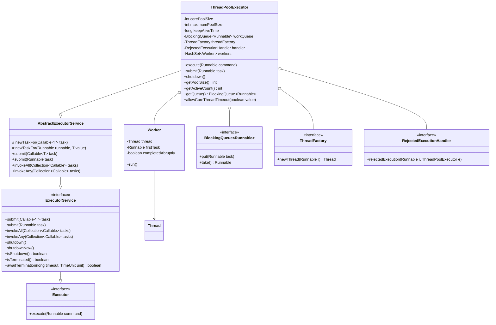

Perfect — the **UML diagram of `ThreadPoolExecutor`** in Java is one of the most useful to understand how concurrency is managed under the hood.

Let’s walk through it visually using **Mermaid UML**, showing how the classes relate — including `Executor`, `ExecutorService`, `AbstractExecutorService`, and the components like `Worker`, `BlockingQueue`, and `ThreadFactory`.

---

## 🧩 **ThreadPoolExecutor UML Diagram**



---

## 🧠 **Explanation of Key Components**

| Component                    | Role                                                                            |
| ---------------------------- | ------------------------------------------------------------------------------- |
| **Executor**                 | Root interface — defines `execute(Runnable)`                                    |
| **ExecutorService**          | Extends `Executor` — adds lifecycle management and submit methods               |
| **AbstractExecutorService**  | Base class providing default implementations of `submit()`, `invokeAll()`, etc. |
| **ThreadPoolExecutor**       | Core class implementing the thread pool — manages worker threads and task queue |
| **Worker**                   | Internal class wrapping a thread and its current task                           |
| **BlockingQueue**            | Task queue (e.g., `LinkedBlockingQueue`) that holds pending tasks               |
| **ThreadFactory**            | Creates new threads when needed                                                 |
| **RejectedExecutionHandler** | Handles tasks rejected when the queue is full or pool is shut down              |

---

## ⚙️ **ThreadPoolExecutor Internal Flow (Simplified)**

```text
submit(task)
   ↓
execute(task)
   ↓
if (workerCount < corePoolSize) → new Worker(thread)
else → queue.offer(task)
if queue full and workerCount < maxPoolSize → new Worker
if still full → reject via handler
```

---

## 🧩 Typical Collaborating Objects

| Component                | Example Implementation                                                    |
| ------------------------ | ------------------------------------------------------------------------- |
| BlockingQueue            | `LinkedBlockingQueue`, `SynchronousQueue`                                 |
| ThreadFactory            | `Executors.defaultThreadFactory()`                                        |
| RejectedExecutionHandler | `AbortPolicy`, `CallerRunsPolicy`, `DiscardPolicy`, `DiscardOldestPolicy` |

---

Would you like me to add a **sequence diagram** next — showing the **flow of submitting a task to a ThreadPoolExecutor**, and how it gets queued and executed by a worker thread? That helps visualize runtime behavior.


In Java's concurrency framework, ExecutorService and ThreadPoolExecutor are closely related components, but they represent different levels of abstraction. 
ExecutorService: 

• ExecutorService is an interface that extends the Executor interface. 
• It provides a higher-level abstraction for managing and executing tasks asynchronously. 
• It offers methods for submitting tasks (both Runnable and Callable), managing the lifecycle of the executor (e.g., shutdown(), shutdownNow()), and retrieving results of Callable tasks via Future objects. 
• You typically obtain ExecutorService instances using factory methods from the Executors utility class, such as Executors.newFixedThreadPool(), Executors.newCachedThreadPool(), or Executors.newSingleThreadExecutor(). These methods internally create and configure ThreadPoolExecutor instances. 

ThreadPoolExecutor: 

• ThreadPoolExecutor is a concrete class that implements the ExecutorService interface. 
• It provides the actual implementation of a thread pool, allowing fine-grained control over its behavior. 
• Its constructor allows you to specify various parameters, such as: 
	• corePoolSize: The number of threads to keep in the pool, even if they are idle. 
	• maximumPoolSize: The maximum number of threads allowed in the pool. 
	• keepAliveTime: The time that excess idle threads will wait before terminating. 
	• unit: The time unit for keepAliveTime. 
	• workQueue: The queue used to hold tasks before they are executed. 
	• threadFactory: A factory for creating new threads. 
	• RejectedExecutionHandler: A handler for tasks that cannot be executed. 

Key Differences and Relationship: 

• Abstraction Level: ExecutorService is an interface providing a high-level API for task execution, while ThreadPoolExecutor is a concrete class offering the underlying implementation and detailed configuration options for a thread pool. 
• Instantiation: You typically use Executors factory methods to get an ExecutorService instance, which often returns a ThreadPoolExecutor internally. You can also directly instantiate a ThreadPoolExecutor if you need more control over its parameters. 
• Flexibility: ThreadPoolExecutor offers greater flexibility and control over the thread pool's behavior due to its extensive constructor parameters. ExecutorService provides a simpler, more standardized way to interact with thread pools. 

In essence, ThreadPoolExecutor is a specific implementation of the ExecutorService interface, providing the concrete mechanism for managing and executing tasks within a thread pool. You choose between using Executors factory methods (returning ExecutorService) or directly instantiating ThreadPoolExecutor based on the level of control and customization required for your thread pool. 

A ThreadPoolExecutor uses three parameters to control how tasks are executed. 

The core pool size defines the minimum number of threads that stay alive even if idle. When tasks arrive, the executor first uses these core threads. 

If all core threads are busy, new tasks go into the work queue. 

Only when the queue is full does the executor create additional threads—up to the maximum pool size. If both the queue and maximum threads are exhausted, new tasks are rejected based on the configured RejectedExecutionHandler. Together, these three settings control concurrency, task buffering, and rejection behavior.

