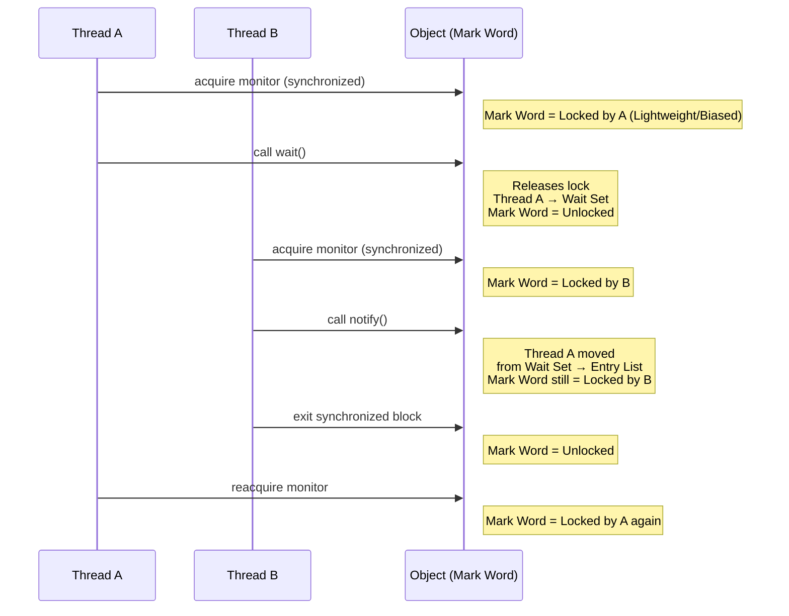

# WAIT and NOTIFY

##  Object Header 

Every Java object has a **header** stored in memory, which includes the **Mark Word**.
The **Mark Word** is a 32-bit (compressed oops, 64-bit in 64-bit JVM) field that encodes:

* Lock state (unlocked, biased, lightweight, heavyweight/monitor)
* Hashcode (if computed)
* Age (for GC)
* Biased lock metadata (thread id, epoch, etc.)

 When an object is used as a **monitor** (`synchronized`), the **Mark Word** changes to reflect the lock state.

###  `wait()`

1. **Thread calls `wait()`** inside a `synchronized` block:

   * The thread **must own the monitor** (object’s lock).
   * The JVM releases the monitor lock on the object.
   * The thread enters the **Wait Set** of the monitor (object-specific queue).
   * The object’s **Mark Word** changes from "owned by thread" (biased/lightweight lock) to an **unlocked state**, so other threads can acquire it.

2. While the thread is waiting:

   * It is **not runnable** (blocked).
   * The monitor is free for other threads.

###  `notify()` / `notifyAll()`

1. Thread calls `notify()` (or `notifyAll()`):

   * The calling thread must **own the monitor**.
   * One (or all) threads in the **Wait Set** are moved to the **Entry List** (ready to reacquire the monitor).

2. But:

   * They **don’t run immediately**.
   * They must **reacquire the monitor** (lock).
   * When they eventually reacquire, the **Mark Word** changes again to reflect "locked by thread X".


### Mark Word Transitions (simplified, 32-bit JVM view)

| State                     | Mark Word bits                               | Meaning                                |
| ------------------------- | -------------------------------------------- | -------------------------------------- |
| **Unlocked**              | `hash:25 age:4 biased:0 lock:01`             | Normal unlocked object                 |
| **Biased Lock**           | `threadId:23 epoch:2 age:4 biased:1 lock:01` | Biased toward one thread               |
| **Lightweight Lock**      | `ptr_to_lock_record:30 lock:00`              | CAS-based spin lock (fast path)        |
| **Heavyweight (Monitor)** | `ptr_to_monitor:30 lock:10`                  | OS monitor (when contention or wait()) |


### Transitions with `wait/notify`

Let’s assume object `obj` is used for synchronization:

1. **Thread A enters synchronized block**

   * Mark Word: lightweight lock or biased lock toward Thread A.

2. **Thread A calls `obj.wait()`**

   * JVM releases lock.
   * Mark Word reverts → **unlocked** or **monitor (contended)**.
   * Thread A goes to Wait Set.

3. **Thread B acquires `obj` monitor**

   * Mark Word → lightweight or heavyweight lock for Thread B.

4. **Thread B calls `obj.notify()`**

   * Wakes Thread A, moves it to Entry List.
   * Mark Word still shows Thread B owns the lock.

5. **Thread B exits synchronized block**

   * Mark Word unlocked.
   * Thread A competes to reacquire.
   * Once acquired, Mark Word reflects ownership by Thread A.


### ASCII Timeline of Events

```
Thread A (synchronized on obj)
 └── lock obj → Mark Word = Locked by A
 └── call wait()
       - releases obj lock
       - Mark Word = Unlocked
       - Thread A → Wait Set

Thread B (synchronized on obj)
 └── lock obj → Mark Word = Locked by B
 └── call notify()
       - moves Thread A → Entry List
       - Mark Word still Locked by B
 └── exit synchronized
       - Mark Word = Unlocked

Thread A resumes
 └── reacquire obj → Mark Word = Locked by A again
```


* `wait()` → releases monitor, puts thread into **Wait Set**, Mark Word changes to unlocked/contended.
* `notify()` / `notifyAll()` → signals waiting threads, but they **must reacquire lock** (so Mark Word transitions again).
* The **Mark Word keeps flipping** between states: unlocked ↔ lightweight ↔ heavyweight, depending on contention and wait usage.
* Using `wait()` almost always upgrades the lock into a **heavyweight monitor** (OS-level monitor), because the JVM must manage the Wait Set queue.




* **Thread A acquires monitor** → Mark Word encodes "locked by A".
* **`wait()`** → Thread A releases monitor, Mark Word back to unlocked, A goes into Wait Set.
* **Thread B acquires** → Mark Word changes to "locked by B".
* **`notify()`** → moves A into Entry List, but lock still held by B.
* **Thread B exits synchronized** → lock released, Mark Word unlocked.
* **Thread A reacquires** → Mark Word shows "locked by A" again.


Think of the **Mark Word** as a little "ownership tag" that flips around depending on which thread currently holds the monitor, and calling `wait()` essentially **forces the object into heavyweight monitor mode** because the JVM must track wait sets.

## Use Cases
| Use Case                                 | Explanation                                   |
| ---------------------------  | --------------------------------------------- |
| **Producer–Consumer**       | Coordinate producers & consumers using buffer |
| **Thread Sequencing**       | Ensure one thread runs after another          |
| **Worker Threads / Signal** | Many workers wait until a signal is sent      | 

##   Use Case 1: **Producer–Consumer Problem (Bounded Buffer)**

Classic problem where one thread produces data, another consumes it.

```java
import java.util.LinkedList;
import java.util.Queue;

class SharedBuffer {
    private final Queue<Integer> queue = new LinkedList<>();
    private final int CAPACITY = 5;

    public synchronized void produce(int value) throws InterruptedException {
        while (queue.size() == CAPACITY) {
            wait(); // buffer full, wait for consumer
        }
        queue.add(value);
        System.out.println("Produced: " + value);
        notifyAll(); // notify consumers waiting
    }

    public synchronized int consume() throws InterruptedException {
        while (queue.isEmpty()) {
            wait(); // buffer empty, wait for producer
        }
        int val = queue.poll();
        System.out.println("Consumed: " + val);
        notifyAll(); // notify producers waiting
        return val;
    }
}

public class ProducerConsumerExample {
    public static void main(String[] args) {
        SharedBuffer buffer = new SharedBuffer();

        // Producer thread
        Thread producer = new Thread(() -> {
            for (int i = 1; i <= 10; i++) {
                try {
                    buffer.produce(i);
                } catch (InterruptedException e) {
                    e.printStackTrace();
                }
            }
        });

        // Consumer thread
        Thread consumer = new Thread(() -> {
            for (int i = 1; i <= 10; i++) {
                try {
                    buffer.consume();
                } catch (InterruptedException e) {
                    e.printStackTrace();
                }
            }
        });

        producer.start();
        consumer.start();
    }
}
```

* `wait()` suspends producers if buffer is full, or consumers if empty.
* `notifyAll()` wakes up threads when buffer state changes.

## Use Case 2: **Thread Sequencing (Ordering Execution)**

Ensure threads execute in a particular order.

```java
class Task {
    private boolean firstDone = false;

    public synchronized void first() {
        System.out.println("First");
        firstDone = true;
        notifyAll();
    }

    public synchronized void second() throws InterruptedException {
        while (!firstDone) {
            wait(); // wait until first() is done
        }
        System.out.println("Second");
    }
}

public class SequencingExample {
    public static void main(String[] args) {
        Task task = new Task();

        Thread t2 = new Thread(() -> {
            try {
                task.second();
            } catch (InterruptedException e) {
                e.printStackTrace();
            }
        });

        Thread t1 = new Thread(task::first);

        t2.start();
        t1.start();
    }
}
```

 `wait()` ensures `second()` runs **after** `first()`.


## Use Case 3: **Worker Threads Waiting for a Signal**

Threads wait until a main thread signals them.

```java
class Signal {
    private boolean ready = false;

    public synchronized void waitForSignal() throws InterruptedException {
        while (!ready) {
            wait(); // wait for signal
        }
        System.out.println(Thread.currentThread().getName() + " received signal!");
    }

    public synchronized void sendSignal() {
        ready = true;
        notifyAll(); // wake all waiting threads
    }
}

public class SignalExample {
    public static void main(String[] args) throws InterruptedException {
        Signal signal = new Signal();

        for (int i = 1; i <= 3; i++) {
            new Thread(() -> {
                try {
                    signal.waitForSignal();
                } catch (InterruptedException e) {
                    e.printStackTrace();
                }
            }, "Worker-" + i).start();
        }

        Thread.sleep(2000);
        System.out.println("Main thread sending signal...");
        signal.sendSignal();
    }
}
```

* All worker threads **wait**.
* When `sendSignal()` is called, `notifyAll()` wakes them up.


 **Best Practices**:

* Always use `while` with `wait()` (not `if`) to avoid **spurious wakeups**.
* Prefer `notifyAll()` over `notify()` unless you’re sure only one waiting thread is enough.
* In modern Java, higher-level constructs (`BlockingQueue`, `CountDownLatch`, `Semaphore`, `CyclicBarrier`) are often preferred.


##  Exceptions in `wait()`, `notify()`, `notifyAll()`

### 1. **IllegalMonitorStateException**

* Thrown when a thread calls `wait()`, `notify()`, or `notifyAll()` **without owning the object’s monitor lock**.
* In other words: they must be called inside a `synchronized` block/method on the same object.

**Example:**

```java
public class IllegalMonitorExample {
    public static void main(String[] args) {
        Object lock = new Object();

        // Wrong usage -> not inside synchronized(lock)
        try {
            lock.wait();
        } catch (InterruptedException e) {
            System.out.println("Interrupted!");
        }
    }
}
```

Output:

```
Exception in thread "main" java.lang.IllegalMonitorStateException
```

---

### 2. **InterruptedException**

* Thrown when a thread is **waiting** (inside `wait()`) and another thread interrupts it (`thread.interrupt()`).
* This allows responsive cancellation of waiting threads.

**Example:**

```java
class Shared {
    public synchronized void doWait() {
        try {
            System.out.println(Thread.currentThread().getName() + " is waiting...");
            wait();  // will be interrupted
            System.out.println(Thread.currentThread().getName() + " resumed!");
        } catch (InterruptedException e) {
            System.out.println(Thread.currentThread().getName() + " was interrupted while waiting!");
        }
    }
}

public class InterruptedWaitExample {
    public static void main(String[] args) throws InterruptedException {
        Shared shared = new Shared();

        Thread t1 = new Thread(shared::doWait, "Worker");

        t1.start();
        Thread.sleep(2000);

        System.out.println("Main thread interrupting Worker...");
        t1.interrupt(); // causes InterruptedException in doWait()
    }
}
```

Output:

```
Worker is waiting...
Main thread interrupting Worker...
Worker was interrupted while waiting!
```

---

### 3. **Spurious Wakeups** (not exception but related)

* A thread waiting can **wake up without notify/notifyAll being called**.
* That’s why we **always use `while` loop with wait()** instead of `if`.

**Correct usage:**

```java
synchronized(lock) {
    while (!condition) {
        lock.wait();
    }
    // safe to proceed
}
```


| Method        | Possible Exception             | Scenario                         |
| ------------- | ------------------------------ | -------------------------------- |
| `wait()`      | `IllegalMonitorStateException` | Called without owning the lock   |
|               | `InterruptedException`         | Thread interrupted while waiting |
| `notify()`    | `IllegalMonitorStateException` | Called without owning the lock   |
| `notifyAll()` | `IllegalMonitorStateException` | Called without owning the lock   |


* call to `wait()` / `notify()` / `notifyAll()` is allowed from **inside `synchronized(object)`**.
* Always handle `InterruptedException` properly → either clean up and exit, or rethrow.
* Always use `while (condition == false)` instead of `if` to guard against spurious wakeups.

### real-world **scenario of intercepted exception**:

* Imagine a worker thread is waiting for new tasks in a buffer (`wait()`).
* The system is shutting down, so the main thread **interrupts** all workers.
* Workers immediately throw `InterruptedException`, exit their loop, and shut down gracefully.
