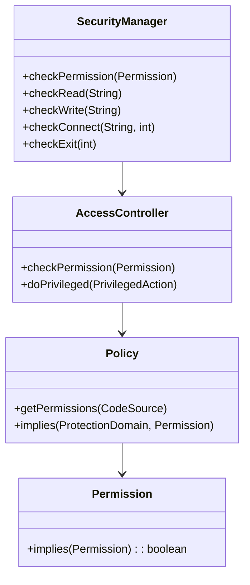

Here’s a **concise explanation** and **UML-style diagram** of the Java **SecurityManager** 👇

---

### 🔐 **Concise Explanation**

`SecurityManager` (deprecated since Java 17) was a JVM-level security layer that checked **permissions** before allowing potentially unsafe operations like file access, network calls, reflection, or system exit.
It worked with **`AccessController`** and **`Policy`** classes to enforce runtime security policies.

---

### 🧩 **Key Use Cases**

* Restrict untrusted code (e.g., applets, plugins) from performing I/O or network access.
* Sandbox server-side scripts or code downloaded at runtime.
* Control access to environment variables and system properties.
* Prevent `System.exit()` or reflection-based modification of core classes.

---

### ⭐ **Important Features**

* Centralized permission checks via `checkPermission()`.
* Policy-based control using `.policy` files.
* Integration with custom `Permission` classes.
* Worked closely with `AccessController.doPrivileged()` for scoped privileges.

---

### 🧱 **UML Diagram**

---

✅ **In short:**
SecurityManager = runtime gatekeeper → checks permissions before sensitive actions → uses `Policy` rules + `AccessController` for enforcement.

Would you like me to show a small Java code example where `SecurityManager` blocks file access?
