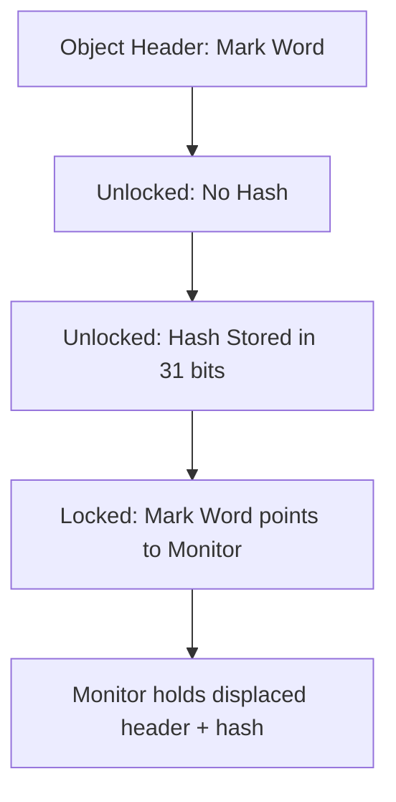

Good question 👍 You’re asking about how Java’s `Object.hashCode()` works **under the hood**, and specifically the **C++ (JVM native) implementation** that backs it.

---

## 🔎 Background

* In Java, every class inherits `hashCode()` from `java.lang.Object` unless overridden.
* The **default implementation** in HotSpot JVM is a **native method**:

```java
public native int hashCode();
```

* That means it’s implemented in **C++ inside the JVM source code**, not in Java.
* JVM uses the object’s **header (mark word)** to generate a hash code.

---

## 🖥️ Actual C++ Implementation (OpenJDK HotSpot)

In **OpenJDK HotSpot** (`object.cpp`), the core logic for `hashCode()` is:

```cpp
// From hotspot/src/share/vm/runtime/synchronizer.cpp

intptr_t ObjectSynchronizer::FastHashCode(Thread* current, oop obj) {
    // If hash is already computed and stored in the mark word
    markWord mark = obj->mark();
    if (mark.is_unlocked() && mark.hash() != 0) {
        return mark.hash();
    }

    // If no hash yet, generate one
    intptr_t hash = get_next_hash(current, obj);

    // Try to store hash into the object’s header (mark word)
    markWord new_mark = mark.copy_set_hash(hash);
    if (obj->cas_set_mark(new_mark, mark) == mark) {
        return hash;
    }

    // If unable to store in mark word (e.g., object is locked),
    // hash is stored elsewhere (in object monitor)
    return hash;
}
```

---

## ⚙️ Explanation of Code

1. **Mark Word in Object Header**

   * Every Java object has a **header** with metadata called the **mark word**.
   * It contains GC bits, lock state, age, and possibly the hash code.

2. **Check if hash already exists**

   * If the object’s header already contains a hash value, return it.
   * This avoids recomputation.

3. **Generate a new hash**

   * If the object has no hash, JVM generates one (using a thread-local counter or pseudo-random).
   * `get_next_hash()` does this.

   Example inside HotSpot:

   ```cpp
   intptr_t ObjectSynchronizer::get_next_hash(Thread* current, oop obj) {
       intptr_t value = os::random(); // or thread-local sequence
       return value;
   }
   ```

4. **CAS (Compare-And-Swap) store**

   * JVM attempts to store the generated hash into the object’s **mark word** atomically.
   * If successful, that hash becomes permanent for the object.

5. **Fallback (locked objects)**

   * If the object is locked (synchronized block), the mark word is used for lock state.
   * In that case, the JVM stores the hash in a separate structure (monitor).

---

## 📝 Summary

* Java’s `Object.hashCode()` is a **native C++ method**.
* Implemented in HotSpot’s `ObjectSynchronizer::FastHashCode`.
* Uses the object’s **header (mark word)** to cache the hash.
* If not present, it **generates a pseudo-random integer** and stores it.
* Guarantees:

  * Same object → same hash during lifetime
  * Different objects → usually different hashes (but collisions are possible)

---

✅ So in short:
Java’s `hashCode()` default implementation is **not memory address-based** in modern JVMs.
It’s **stored in the object header** (mark word), generated once, and reused.

---

👉 Do you also want me to show a **diagram of the object header (mark word)** with bits showing where the hash is stored (lock bits, GC age, hash bits)? That makes this much clearer.


Perfect 👌 — let’s draw the **Java Object Header (Mark Word)** layout and show where the **hash code** lives.

---

# 🏗 Java Object Header (Mark Word)

Every object in HotSpot JVM has a **header** made up of:

1. **Mark Word** (contains GC age, hash, lock info)
2. **Klass Pointer** (points to class metadata)
3. (Optional) Array length (if it’s an array object)

---

## 📦 Mark Word Layout (64-bit JVM, no compressed oops)

When object is **unlocked** and hash stored:

```
  64 bits total
  ----------------------------------------------------------------
  | hash code: 31 bits | age: 4 | biased_lock: 1 | lock: 2 | unused: 26 |
  ----------------------------------------------------------------
```

When object is **locked**, these bits are reused for lock pointer instead of hash.

---

## 📊 Mermaid Diagram

```mermaid
flowchart TD
    A[Java Object] --> B[Object Header]
    B --> C[Mark Word]
    B --> D[Klass Pointer]
    B --> E[Array Length (if array)]

    C --> C1[Hash Code (31 bits)]
    C --> C2[GC Age (4 bits)]
    C --> C3[Biased Lock Bit (1 bit)]
    C --> C4[Lock State (2 bits)]
    C --> C5[Unused / Reserved (26 bits)]
```

---

## 🔎 Example

* **Unlocked object**:

  * Mark word holds **hash code** (31 bits)
  * Lock bits = `01` (indicating unlocked)

* **Locked object (synchronized)**:

  * Mark word no longer holds hash — instead, it points to lock record (monitor).
  * Hash is then stored in monitor’s structure if needed.

---

## ✅ Summary

* `Object.hashCode()` is stored in the **mark word**.
* Only **31 bits** are used for hash.
* If the object is **locked**, JVM may relocate hash outside the mark word.
* This is why hash computation is **lazy** (not pre-assigned for all objects).

---

👉 Would you like me to also show you a **step-by-step flow diagram of how `hashCode()` is calculated and stored in the mark word** (including the CAS operation from the C++ code)? That way it ties together the earlier C++ explanation with the memory layout.


Awesome 🚀 Let’s connect all the dots:
We’ll show **step by step how `Object.hashCode()` is computed and stored in the Mark Word** with a **flow diagram + explanation**.

---

# 🔄 Flow of `Object.hashCode()` (HotSpot JVM)

1. **Call `hashCode()`**

   * The call goes to the JVM’s **native C++ method** (`ObjectSynchronizer::FastHashCode`).

2. **Check Mark Word**

   * JVM inspects the object’s **mark word** (part of the object header).
   * If a **hash code is already present** → return it immediately.

3. **Generate New Hash**

   * If no hash exists yet → JVM generates one (pseudo-random, not memory address).

4. **CAS (Compare-And-Swap)**

   * JVM attempts to atomically **store the hash into the mark word** (only possible if object is not locked).
   * If successful → the hash is “permanently” cached there.

5. **Fallback (Locked Object)**

   * If the object is locked (synchronized block), mark word cannot hold hash.
   * Hash is instead stored in the **monitor** (lock record) associated with the object.

6. **Return Hash**

   * Finally, the computed/stored hash is returned to the caller.

---

## 📊 Mermaid Flow Diagram

```mermaid
flowchart TD
    A[Call obj.hashCode()] --> B[Check Mark Word]
    B -->|Hash Present| C[Return Cached Hash]
    B -->|No Hash| D[Generate New Hash]
    D --> E[Try CAS Store in Mark Word]
    E -->|Success| F[Hash Stored in Mark Word]
    E -->|Failure (Object Locked)| G[Store Hash in Monitor]
    F --> H[Return Hash]
    G --> H[Return Hash]
```

---

## 📝 Example Scenario

* **First call to `hashCode()`**:

  * Mark word has no hash → JVM generates one (say `0x5A1C9D2`).
  * Stores it in mark word with CAS.

* **Subsequent calls**:

  * JVM sees the mark word already has `0x5A1C9D2`.
  * Returns it directly → constant per object.

* **If object is locked**:

  * Hash can’t fit in the mark word (used for lock).
  * JVM keeps hash in monitor.
  * Still consistent across calls.

---

✅ **Summary:**

* `hashCode()` is **lazy, computed once**.
* Stored in **mark word** if possible.
* If locked, moved to monitor.
* Guarantees:

  * Same object → same hash within its lifetime.
  * Different objects → different (but collisions possible).

---

👉 Do you also want me to show the **bit-level view of the mark word** before and after `hashCode()` is assigned (with lock bits + hash bits visualized)? That way you’ll see exactly how the 31-bit hash is packed.
Perfect 👍 Let’s go deeper and show **bit-level mark word layout** with and without hash.
This is exactly how **HotSpot JVM** stores `hashCode()` inside an object’s header.

---

# 🧩 Mark Word Layout in 64-bit JVM (HotSpot)

Each object has a **Mark Word** (part of header, 64 bits).
Its contents change depending on the object’s state (unlocked, biased lock, locked, GC, etc.).

---

## 1️⃣ Mark Word (Unlocked, No `hashCode()` yet)

```
  25 bits   | 31 bits      | 1 bit | 4 bits | 2 bits | 1 bit
------------------------------------------------------------
 unused     | unused       | bias  | epoch  | lock   | state
```

* **lock** (2 bits): 01 → unlocked
* **hash** not yet stored → free space

---

## 2️⃣ Mark Word (After `hashCode()` computed, Unlocked Object)

```
 25 bits   | 31 bits (identity hash) | 1 bit | 4 bits | 2 bits | 1 bit
------------------------------------------------------------------------
 unused    | hash = 0x5A1C9D2        | 0     | epoch  | 01     | state
```

Example:

* Hash = `0x5A1C9D2` → stored in 31-bit slot.
* Next call to `hashCode()` returns same value directly.

---

## 3️⃣ Mark Word (Object is Locked)

When object enters a `synchronized` block:

* Mark Word is **repurposed for lock info** (points to lock record / monitor).
* Hash **cannot stay inside mark word**.
* JVM moves hash to the **monitor (object monitor structure)**.

```
 62 bits (pointer to monitor) | 2 bits | state
-------------------------------------------------
  address of monitor          | 10     | locked
```

* The monitor holds both **lock metadata + displaced mark word + hash code**.

---

## 📊 Visual Diagram (Mermaid)



---

## ✅ Key Insights

* **Identity hash code is 31 bits**.
* Stored in **mark word if object is unlocked**.
* If object is **locked**, JVM moves hash into **monitor**.
* Once assigned, hash never changes for the lifetime of the object.

---

👉 Do you want me to also show you a **real HotSpot `markOop.hpp` source snippet** (with the exact bit masks for `hash` field, lock bits, etc.) so you see the C++ definitions JVM uses internally?

Good question 👍 Let’s carefully walk through **how `hashCode()` is computed for `java.lang.Object`** in the HotSpot JVM.

---

# 1️⃣ `Object.hashCode()` contract

* Every Java object inherits `hashCode()` from `Object`.
* By default, it provides a **hash value based on the object’s identity**, not its contents.
* That means two different objects usually have different hash codes, even if their fields are equal (unless overridden in a class).

---

# 2️⃣ How it works inside the JVM

The `hashCode()` for `Object` is **not written in Java** — it’s a **native method**:

```java
public native int hashCode();
```

That means the implementation is in the **JVM (C++ code in HotSpot)**.

---

# 3️⃣ HotSpot JVM implementation

In HotSpot, the identity hash code is stored in the **object header** (specifically in the *mark word*).

* The **first time** you call `hashCode()`, JVM generates a hash value (using various strategies depending on configuration).
* This value is **stored in the mark word** (or in the monitor object if the object is locked).
* **Subsequent calls** return the same stored value.

---

# 4️⃣ Hash computation strategies

HotSpot supports multiple strategies for generating the initial identity hash (controlled by the JVM flag `-XX:hashCode`):

* **Thread-based mixing** (default): Mix of memory address bits + thread state + randomization.
* **Global counter**: Incrementing counter ensures uniqueness.
* **Random number**: Assigns random 32-bit value.
* **Object address**: Uses the actual memory address (but this is rare, since objects move under GC).

By default, modern HotSpot uses a **randomized hash** (to avoid predictability).

---

# 5️⃣ C++ implementation (simplified HotSpot code)

In `hotspot/src/share/vm/runtime/objectMonitor.cpp` and `markOop.hpp`, you’ll find logic like this:

```cpp
uintptr_t mark = obj->mark();
if (!mark->has_hash()) {
    // Generate a new identity hash
    unsigned int hash = os::random();
    obj->set_mark(mark->copy_set_hash(hash));
    return hash;
} else {
    // Already has a hash
    return mark->hash();
}
```

* `markOop` = object header (mark word).
* If no hash is set, JVM generates one (randomized).
* If already set, returns stored value.

---

# 6️⃣ Example in action

```java
public class TestHash {
    public static void main(String[] args) {
        Object o1 = new Object();
        Object o2 = new Object();

        System.out.println(o1.hashCode()); // e.g. 12345678
        System.out.println(o1.hashCode()); // same as above
        System.out.println(o2.hashCode()); // different value
    }
}
```

---

✅ **Key takeaway:**

* The `Object.hashCode()` is an **identity hash code**, generated once and stored in the object’s header.
* It is **not derived from memory address directly** (since objects move during GC).
* It remains constant for the lifetime of the object.

---

👉 Do you want me to also show the **exact HotSpot mark word layout with hash bits** (bitwise representation before/after `hashCode()` is computed)?


Perfect 👍 let’s dive into the **mark word layout** in HotSpot and see how the **identity hash code** is actually stored.

---

# 🧩 Mark Word (Object Header) in HotSpot

Every object in the JVM has a header.
One part of that header is the **Mark Word** (used for GC, locking, hash code, etc.).

For a **64-bit JVM (compressed oops, no biasing)**, the Mark Word is 64 bits.

---

## 1️⃣ Mark Word before `hashCode()` is called (unlocked)

```
  unused (25 bits) | age (4) | biased_lock (1) | lock (2) | unused (32)
```

* **age** = GC age (how many collections survived).
* **lock bits** = 01 means unlocked.
* No hash code yet.

---

## 2️⃣ Mark Word after `hashCode()` is called (unlocked, hash stored)

When the JVM computes a hash, it writes it into the mark word.

```
  hash (31 bits) | unused (25 bits) | age (4) | biased_lock (1) | lock (2) | 01
```

* Hash = 31 bits (identity hash code).
* Stored directly in the mark word.
* Subsequent calls to `hashCode()` read from here.

---

## 3️⃣ When the object is locked (synchronized)

If you lock the object, the mark word can’t store the hash anymore —
it’s replaced with a **pointer to the monitor** (lock record).

```
  monitor address (62 bits) | lock (2 bits = 10)
```

* The monitor stores both lock metadata and (if needed) the displaced hash code.
* This way, hash is preserved even while locked.

---

# 📊 Visual Diagram (Mermaid)

```mermaid
flowchart TD
    A[Object Header\n(Mark Word)]
    A --> B[Unlocked\n(No hash yet)]
    B --> C[Unlocked\nHash stored in 31 bits of mark word]
    C --> D[Locked\nMark word points to Monitor]
    D --> E[Monitor stores displaced header + hash]
```

---

# ✅ Summary

* `hashCode()` of `Object` = **31-bit identity hash code**.
* Stored in **Mark Word** if object is unlocked.
* If locked, hash is stored in the **monitor**.
* Generated once (randomized by default in HotSpot) and constant for object lifetime.

---

👉 Do you also want me to show you the **real C++ HotSpot struct (`markOopDesc`) with the bit masks** that define these hash bits?


Excellent question 👍 — this is fundamental not just in Java but in computer science overall.

---

# 🔹 Random vs Pseudo-Random

### **1. True Random (TRNG)**

* Generated from **physical processes** that are fundamentally unpredictable.

  * Examples:

    * Radioactive decay
    * Thermal noise in electronics
    * Atmospheric noise
* **Non-deterministic**: you cannot reproduce the same sequence again.
* Used in **cryptography**, secure keys, lotteries, etc.

👉 Hardware devices that produce this are called **True Random Number Generators (TRNGs)**.

---

### **2. Pseudo-Random (PRNG)**

* Generated by an **algorithm** that simulates randomness.
* Deterministic:

  * Starts from a **seed value**.
  * Given the same seed → it produces the same sequence every time.
* Example: Java’s `Random` class, C++’s `rand()`, Python’s `random`.

👉 The sequence *looks* random, but it is **predictable if you know the seed**.

---

## 🔹 Key Differences

| Feature             | True Random                                 | Pseudo-Random                                 |
| ------------------- | ------------------------------------------- | --------------------------------------------- |
| **Source**          | Physical process (noise, entropy, hardware) | Mathematical algorithm                        |
| **Reproducibility** | Not reproducible                            | Reproducible (same seed → same numbers)       |
| **Speed**           | Slower (needs hardware sampling)            | Faster (just math operations)                 |
| **Use Cases**       | Cryptography, security, gambling            | Simulations, games, hashing, machine learning |
| **Predictability**  | Unpredictable                               | Predictable if seed known                     |

---

## 🔹 Example in Java

```java
import java.util.Random;

public class RandomDemo {
    public static void main(String[] args) {
        Random random1 = new Random(42); // fixed seed
        Random random2 = new Random(42); // same seed

        System.out.println(random1.nextInt(100)); // always prints same value
        System.out.println(random2.nextInt(100)); // same as above
    }
}
```

Output (always the same for seed 42):

```
81
81
```

👉 That’s **pseudo-random** — deterministic with a seed.
If we used a **true random hardware source**, the results would differ each run.

---

✅ **Summary:**

* **Random (TRNG)** = truly unpredictable, comes from nature/hardware.
* **Pseudo-random (PRNG)** = generated by an algorithm, predictable if seed is known, but good enough for most applications (like `hashCode()` in Java objects).

---

Do you want me to also show you **how Java’s `ThreadLocalRandom` and `SecureRandom` differ**, since one is pseudo-random for speed, and the other uses OS entropy for cryptographic randomness?


