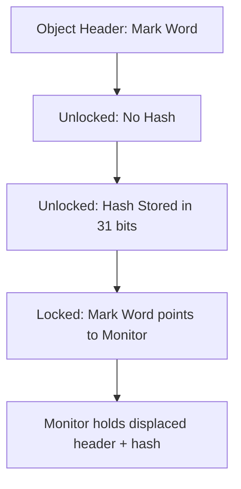

Good question 👍 You’re asking about how Java’s `Object.hashCode()` works **under the hood**, and specifically the **C++ (JVM native) implementation** that backs it.

---

## 🔎 Background

* In Java, every class inherits `hashCode()` from `java.lang.Object` unless overridden.
* The **default implementation** in HotSpot JVM is a **native method**:

```java
public native int hashCode();
```

* That means it’s implemented in **C++ inside the JVM source code**, not in Java.
* JVM uses the object’s **header (mark word)** to generate a hash code.

---

## 🖥️ Actual C++ Implementation (OpenJDK HotSpot)

In **OpenJDK HotSpot** (`object.cpp`), the core logic for `hashCode()` is:

```cpp
// From hotspot/src/share/vm/runtime/synchronizer.cpp

intptr_t ObjectSynchronizer::FastHashCode(Thread* current, oop obj) {
    // If hash is already computed and stored in the mark word
    markWord mark = obj->mark();
    if (mark.is_unlocked() && mark.hash() != 0) {
        return mark.hash();
    }

    // If no hash yet, generate one
    intptr_t hash = get_next_hash(current, obj);

    // Try to store hash into the object’s header (mark word)
    markWord new_mark = mark.copy_set_hash(hash);
    if (obj->cas_set_mark(new_mark, mark) == mark) {
        return hash;
    }

    // If unable to store in mark word (e.g., object is locked),
    // hash is stored elsewhere (in object monitor)
    return hash;
}
```

---

## ⚙️ Explanation of Code

1. **Mark Word in Object Header**

   * Every Java object has a **header** with metadata called the **mark word**.
   * It contains GC bits, lock state, age, and possibly the hash code.

2. **Check if hash already exists**

   * If the object’s header already contains a hash value, return it.
   * This avoids recomputation.

3. **Generate a new hash**

   * If the object has no hash, JVM generates one (using a thread-local counter or pseudo-random).
   * `get_next_hash()` does this.

   Example inside HotSpot:

   ```cpp
   intptr_t ObjectSynchronizer::get_next_hash(Thread* current, oop obj) {
       intptr_t value = os::random(); // or thread-local sequence
       return value;
   }
   ```

4. **CAS (Compare-And-Swap) store**

   * JVM attempts to store the generated hash into the object’s **mark word** atomically.
   * If successful, that hash becomes permanent for the object.

5. **Fallback (locked objects)**

   * If the object is locked (synchronized block), the mark word is used for lock state.
   * In that case, the JVM stores the hash in a separate structure (monitor).

---

## 📝 Summary

* Java’s `Object.hashCode()` is a **native C++ method**.
* Implemented in HotSpot’s `ObjectSynchronizer::FastHashCode`.
* Uses the object’s **header (mark word)** to cache the hash.
* If not present, it **generates a pseudo-random integer** and stores it.
* Guarantees:

  * Same object → same hash during lifetime
  * Different objects → usually different hashes (but collisions are possible)

---

✅ So in short:
Java’s `hashCode()` default implementation is **not memory address-based** in modern JVMs.
It’s **stored in the object header** (mark word), generated once, and reused.

---

👉 Do you also want me to show a **diagram of the object header (mark word)** with bits showing where the hash is stored (lock bits, GC age, hash bits)? That makes this much clearer.


Perfect 👌 — let’s draw the **Java Object Header (Mark Word)** layout and show where the **hash code** lives.

---

# 🏗 Java Object Header (Mark Word)

Every object in HotSpot JVM has a **header** made up of:

1. **Mark Word** (contains GC age, hash, lock info)
2. **Klass Pointer** (points to class metadata)
3. (Optional) Array length (if it’s an array object)

---

## 📦 Mark Word Layout (64-bit JVM, no compressed oops)

When object is **unlocked** and hash stored:

```
  64 bits total
  ----------------------------------------------------------------
  | hash code: 31 bits | age: 4 | biased_lock: 1 | lock: 2 | unused: 26 |
  ----------------------------------------------------------------
```

When object is **locked**, these bits are reused for lock pointer instead of hash.

---

## 📊 Mermaid Diagram

```mermaid
flowchart TD
    A[Java Object] --> B[Object Header]
    B --> C[Mark Word]
    B --> D[Klass Pointer]
    B --> E[Array Length (if array)]

    C --> C1[Hash Code (31 bits)]
    C --> C2[GC Age (4 bits)]
    C --> C3[Biased Lock Bit (1 bit)]
    C --> C4[Lock State (2 bits)]
    C --> C5[Unused / Reserved (26 bits)]
```

---

## 🔎 Example

* **Unlocked object**:

  * Mark word holds **hash code** (31 bits)
  * Lock bits = `01` (indicating unlocked)

* **Locked object (synchronized)**:

  * Mark word no longer holds hash — instead, it points to lock record (monitor).
  * Hash is then stored in monitor’s structure if needed.

---

## ✅ Summary

* `Object.hashCode()` is stored in the **mark word**.
* Only **31 bits** are used for hash.
* If the object is **locked**, JVM may relocate hash outside the mark word.
* This is why hash computation is **lazy** (not pre-assigned for all objects).

---

👉 Would you like me to also show you a **step-by-step flow diagram of how `hashCode()` is calculated and stored in the mark word** (including the CAS operation from the C++ code)? That way it ties together the earlier C++ explanation with the memory layout.


Awesome 🚀 Let’s connect all the dots:
We’ll show **step by step how `Object.hashCode()` is computed and stored in the Mark Word** with a **flow diagram + explanation**.

---

# 🔄 Flow of `Object.hashCode()` (HotSpot JVM)

1. **Call `hashCode()`**

   * The call goes to the JVM’s **native C++ method** (`ObjectSynchronizer::FastHashCode`).

2. **Check Mark Word**

   * JVM inspects the object’s **mark word** (part of the object header).
   * If a **hash code is already present** → return it immediately.

3. **Generate New Hash**

   * If no hash exists yet → JVM generates one (pseudo-random, not memory address).

4. **CAS (Compare-And-Swap)**

   * JVM attempts to atomically **store the hash into the mark word** (only possible if object is not locked).
   * If successful → the hash is “permanently” cached there.

5. **Fallback (Locked Object)**

   * If the object is locked (synchronized block), mark word cannot hold hash.
   * Hash is instead stored in the **monitor** (lock record) associated with the object.

6. **Return Hash**

   * Finally, the computed/stored hash is returned to the caller.

---

## 📊 Mermaid Flow Diagram

```mermaid
flowchart TD
    A[Call obj.hashCode()] --> B[Check Mark Word]
    B -->|Hash Present| C[Return Cached Hash]
    B -->|No Hash| D[Generate New Hash]
    D --> E[Try CAS Store in Mark Word]
    E -->|Success| F[Hash Stored in Mark Word]
    E -->|Failure (Object Locked)| G[Store Hash in Monitor]
    F --> H[Return Hash]
    G --> H[Return Hash]
```

---

## 📝 Example Scenario

* **First call to `hashCode()`**:

  * Mark word has no hash → JVM generates one (say `0x5A1C9D2`).
  * Stores it in mark word with CAS.

* **Subsequent calls**:

  * JVM sees the mark word already has `0x5A1C9D2`.
  * Returns it directly → constant per object.

* **If object is locked**:

  * Hash can’t fit in the mark word (used for lock).
  * JVM keeps hash in monitor.
  * Still consistent across calls.

---

✅ **Summary:**

* `hashCode()` is **lazy, computed once**.
* Stored in **mark word** if possible.
* If locked, moved to monitor.
* Guarantees:

  * Same object → same hash within its lifetime.
  * Different objects → different (but collisions possible).

---

👉 Do you also want me to show the **bit-level view of the mark word** before and after `hashCode()` is assigned (with lock bits + hash bits visualized)? That way you’ll see exactly how the 31-bit hash is packed.
Perfect 👍 Let’s go deeper and show **bit-level mark word layout** with and without hash.
This is exactly how **HotSpot JVM** stores `hashCode()` inside an object’s header.

---

# 🧩 Mark Word Layout in 64-bit JVM (HotSpot)

Each object has a **Mark Word** (part of header, 64 bits).
Its contents change depending on the object’s state (unlocked, biased lock, locked, GC, etc.).

---

## 1️⃣ Mark Word (Unlocked, No `hashCode()` yet)

```
  25 bits   | 31 bits      | 1 bit | 4 bits | 2 bits | 1 bit
------------------------------------------------------------
 unused     | unused       | bias  | epoch  | lock   | state
```

* **lock** (2 bits): 01 → unlocked
* **hash** not yet stored → free space

---

## 2️⃣ Mark Word (After `hashCode()` computed, Unlocked Object)

```
 25 bits   | 31 bits (identity hash) | 1 bit | 4 bits | 2 bits | 1 bit
------------------------------------------------------------------------
 unused    | hash = 0x5A1C9D2        | 0     | epoch  | 01     | state
```

Example:

* Hash = `0x5A1C9D2` → stored in 31-bit slot.
* Next call to `hashCode()` returns same value directly.

---

## 3️⃣ Mark Word (Object is Locked)

When object enters a `synchronized` block:

* Mark Word is **repurposed for lock info** (points to lock record / monitor).
* Hash **cannot stay inside mark word**.
* JVM moves hash to the **monitor (object monitor structure)**.

```
 62 bits (pointer to monitor) | 2 bits | state
-------------------------------------------------
  address of monitor          | 10     | locked
```

* The monitor holds both **lock metadata + displaced mark word + hash code**.

---

## 📊 Visual Diagram (Mermaid)



---

## ✅ Key Insights

* **Identity hash code is 31 bits**.
* Stored in **mark word if object is unlocked**.
* If object is **locked**, JVM moves hash into **monitor**.
* Once assigned, hash never changes for the lifetime of the object.

---

👉 Do you want me to also show you a **real HotSpot `markOop.hpp` source snippet** (with the exact bit masks for `hash` field, lock bits, etc.) so you see the C++ definitions JVM uses internally?
