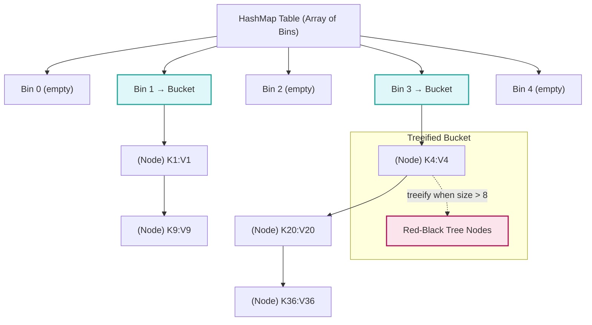
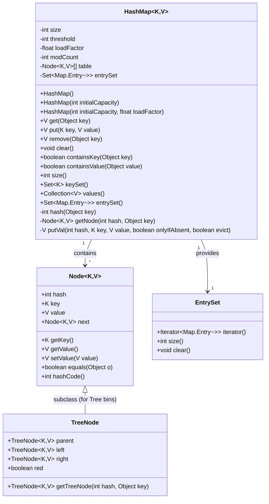
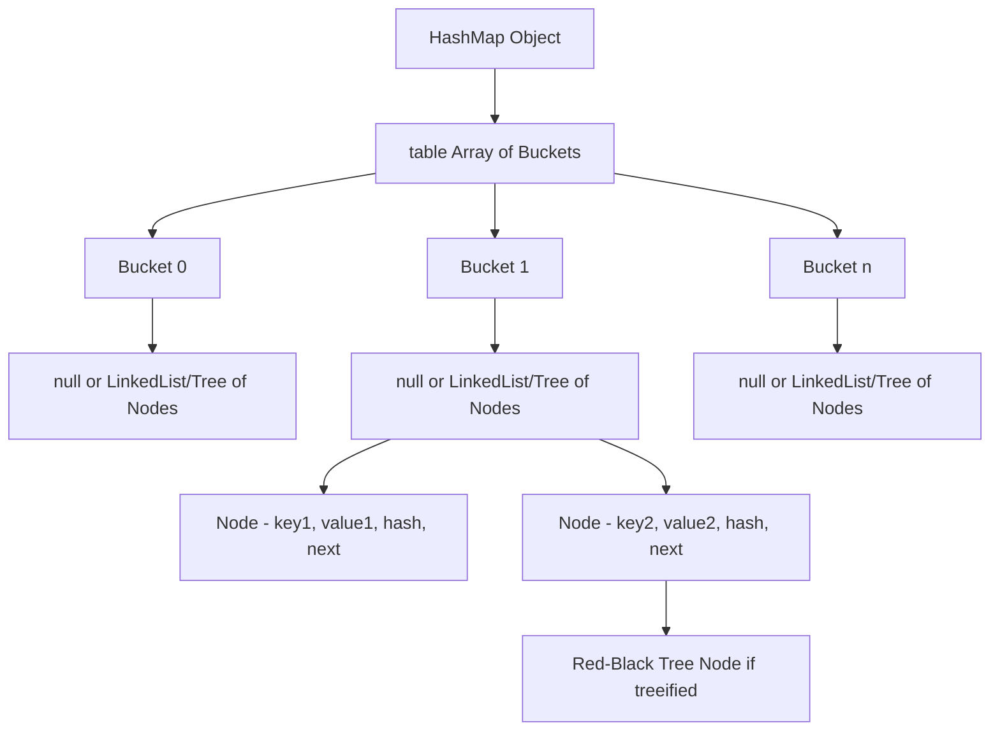
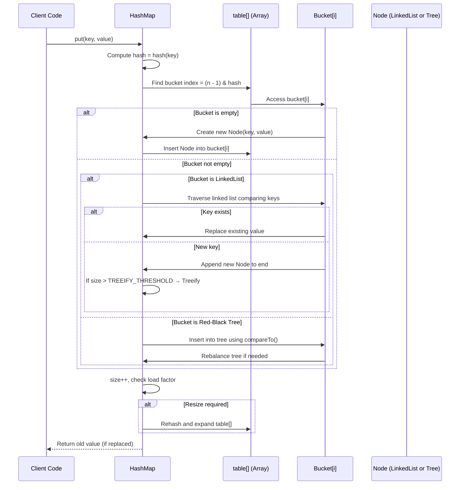
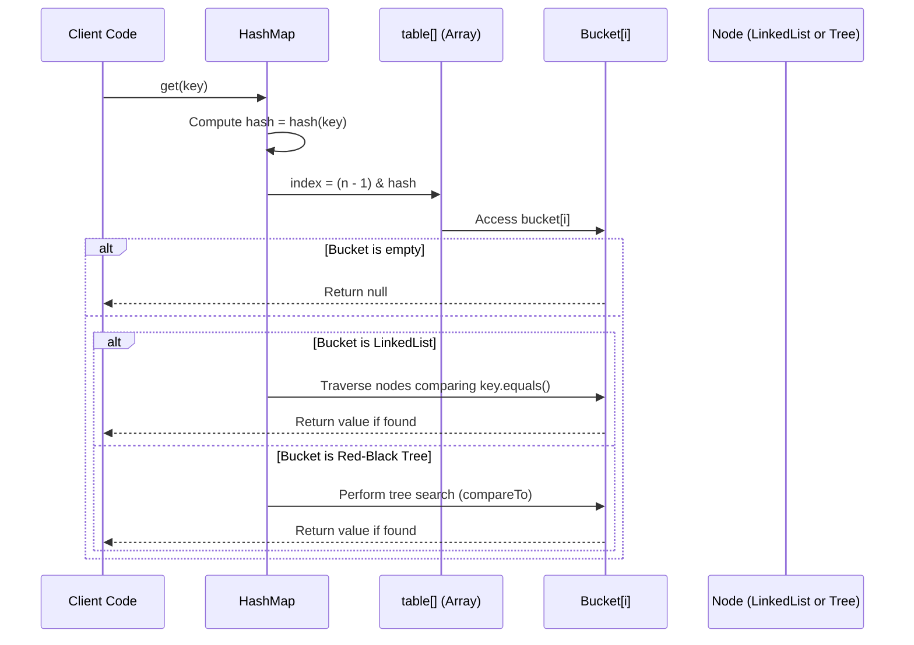
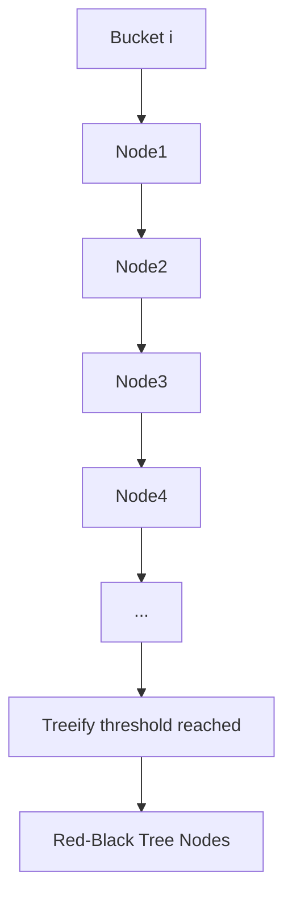

# HashMap

### UML 

###  HashMap Internal Structure Overview

**Explanation:**

* `table[]`: The main array where each slot (bucket) can hold a linked list or a red-black tree.
* Each **bucket** is determined by the **hash of the key**.
* If too many collisions occur in a bucket (typically >8 elements), it **treeifies** into a **Red-Black Tree** for faster lookup.

---

## `put(K, V)` Operation 

**Key components involved:**

* **Hash computation:** `hash = key.hashCode() ^ (hash >>> 16)`
* **Index calculation:** `(n - 1) & hash`
* **Node insertion:** Into linked list or tree
* **Resize:** If `size > capacity * loadFactor` (default 0.75)

 

A **resize (rehash)** occurs when:

> `size > capacity × loadFactor`

Where:

* **`size`** → Number of key-value pairs currently stored
* **`capacity`** → Current number of **buckets** (slots in the internal array)
* **`loadFactor`** → Threshold that controls when to resize (default **0.75**)

When this condition is met, the **HashMap doubles its capacity** and **rehashes** all existing entries.

##  **Default Values (in Java’s HashMap)**

| Property             | Default Value      |
| -------------------- | ------------------ |
| **Size**             | 0                 |
| **Initial Capacity** | 16                 |
| **Load Factor**      | 0.75f              |
| **Resize Threshold** | 16 × 0.75 = **12** |

So:

* When the 13th key-value pair is inserted → **resize occurs**.

 

##  **How It Changes**

Let’s trace it step-by-step:

| Step                 | Capacity | Load Factor | Threshold (Capacity × LoadFactor) | Size After Insert | Resize?                  |
| -------------------- | -------- | ----------- | --------------------------------- | ----------------- | ------------------------ |
| Start                | 16       | 0.75        | 12                                | 0                 | No                       |
| Insert 1 → 12        | 16       | 0.75        | 12                                | 1 → 12            | No                       |
| Insert 13th Entry    | 16       | 0.75        | 12                                | 13                |   Yes (Resize Triggered) |
| After Resize         | **32**   | 0.75        | **24**                            | 13                | No                       |
| Insert More Up to 24 | 32       | 0.75        | 24                                | 14 → 24           | No                       |
| Insert 25th Entry    | 32       | 0.75        | 24                                | 25                |  Yes (Resize Triggered) |
| After Resize         | **64**   | 0.75        | **48**                            | 25                | No                       |

##   **What Happens During Resize**

1. **New Capacity** = `oldCapacity * 2`
2. **New Threshold** = `newCapacity * loadFactor`
3. A **new bucket array** is created.
4. Each entry from the old array is **rehashed** into the new array (based on new indices).
5. This operation is **O(n)** and happens occasionally.

 
 

* **Treeify:** When a bucket’s list exceeds threshold (8 nodes)

---

## `get(K)` Operation 

**Key points:**

* Only **bucket index** needs to be computed; no need to check entire table.
* Each lookup is O(1) average, O(log n) worst (if treeified).
* **No structural modification**, so no resizing.

##  Summary 

| Component          | Description                                 | Used in               |
| :----------------- | :------------------------------------------ | :-------------------- |
| **table[]**        | Main array storing buckets                  | Core structure        |
| **bucket**         | Slot in array holding a linked list or tree | Each hash index       |
| **Node<K,V>**      | Entry object storing key, value, hash, next | Linked list           |
| **Linked List**    | Used when few collisions                    | Default               |
| **Red-Black Tree** | Used when many collisions                   | After treeification   |
| **hash()**         | Mixes bits of key’s hashCode                | For even distribution |
| **resize()**       | Expands capacity when threshold exceeded    | After insertions      |

##  Visualization — HashMap Bucket Evolution

✅ **In summary:**

* `HashMap` combines **array + linked list + red-black tree** for optimal performance.
* `put()` adds or updates entries; may **treeify** or **resize**.
* `get()` traverses the corresponding **bucket** using key’s hash and equality.
* Average lookup/insertion time = **O(1)**; worst-case (treeified) = **O(log n)**.

---
#### Put operation 
> When a new key pair is added hashmap takes the hashCode of the key and pass it to hash function with gives the index of this entey in bins arrays,  if there is a bucket already present , that means there Is a hash collision , now hashmap check the type of the bucket,  is it single object,  linked list or red black tree , if it's a single object , hashmap uses equals to check if both keys are same , if yes the value is overwritten,  else single object is converted to linked list and new entry is added at the end , if it is already a linked list then hashmap iterates over the linked list and find the matching key , if key is found value is updated , else new entry added at the end , if the threshold is crossed , meaning linked list has more than 8 elements,  it's converted to red black tree , new element is added and tree is balanced , if it's already a red black tree , hashmap traverses the red black tree , finds the key and overwrite the value , if not found hashmap adds the element to the red black tree and Balances it

Would you like me to extend this diagram to include **ConcurrentHashMap’s segment/stripe structure** — showing how it differs internally from HashMap during `put()` and `get()`?
