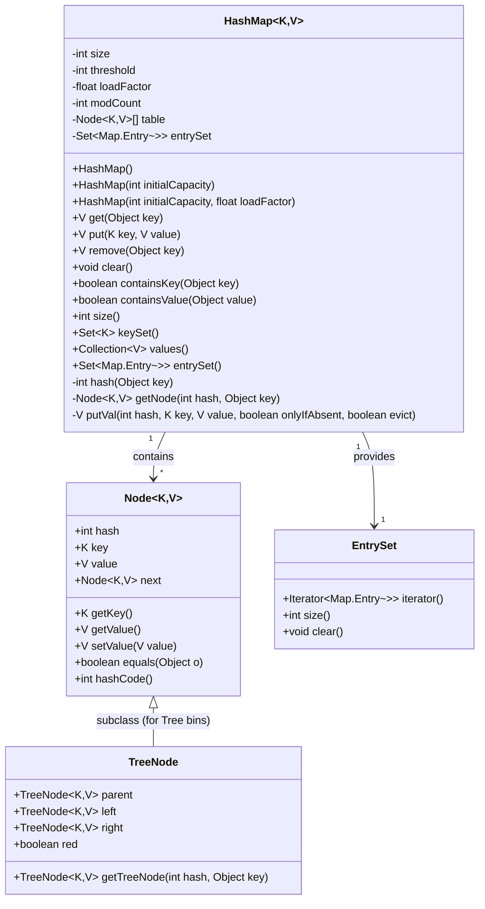
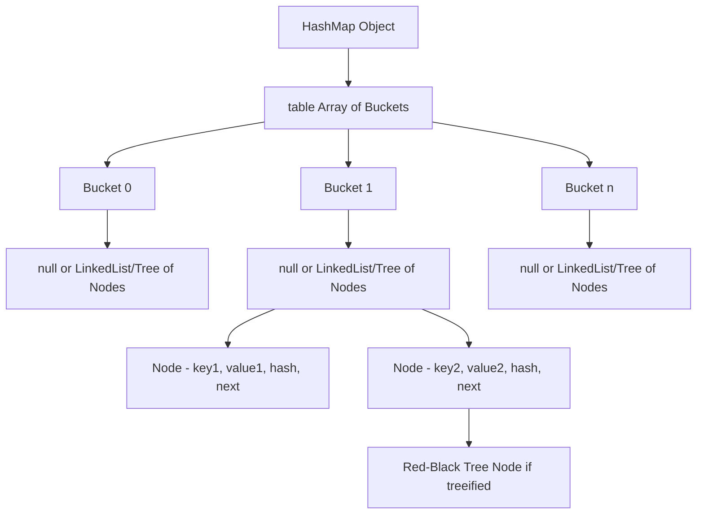
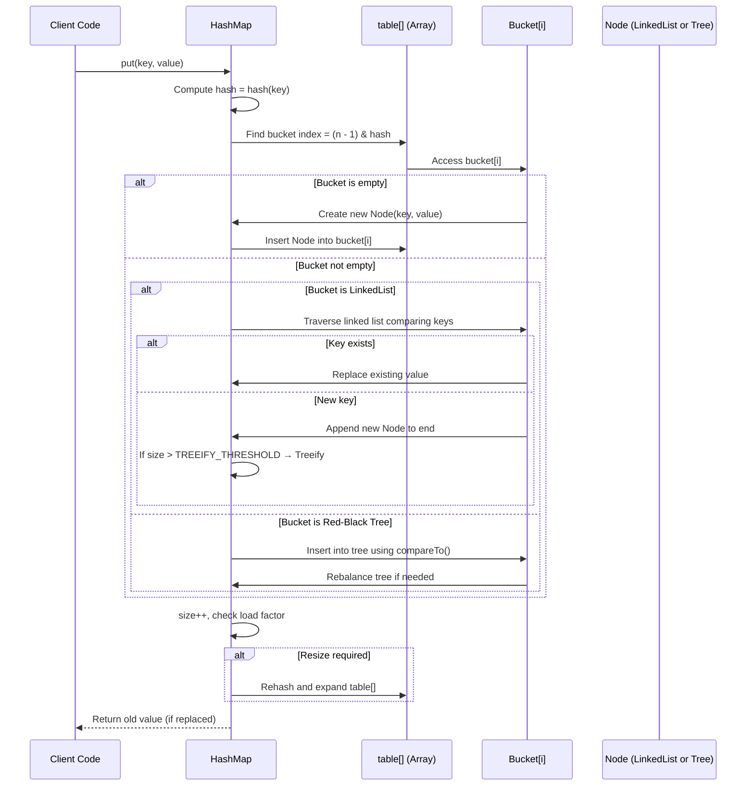
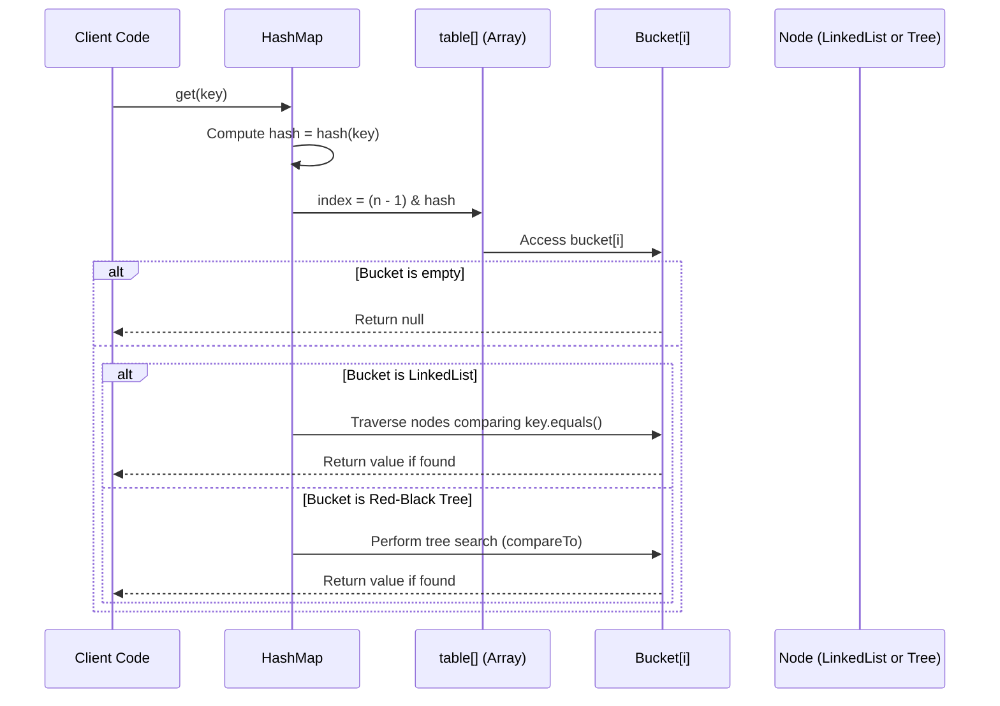
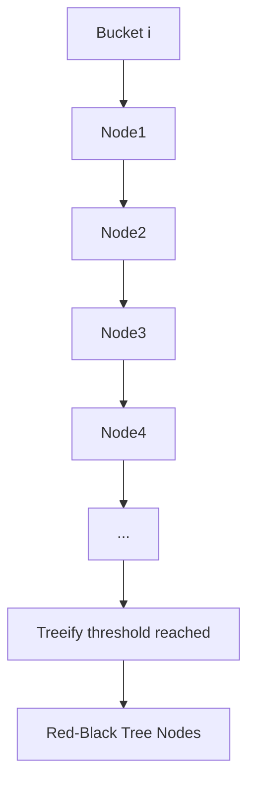

# HashMap

### UML 

###  HashMap Internal Structure Overview

**Explanation:**

* `table[]`: The main array where each slot (bucket) can hold a linked list or a red-black tree.
* Each **bucket** is determined by the **hash of the key**.
* If too many collisions occur in a bucket (typically >8 elements), it **treeifies** into a **Red-Black Tree** for faster lookup.

---

## `put(K, V)` Operation 

**Key components involved:**

* **Hash computation:** `hash = key.hashCode() ^ (hash >>> 16)`
* **Index calculation:** `(n - 1) & hash`
* **Node insertion:** Into linked list or tree
* **Resize:** If `size > capacity * loadFactor` (default 0.75)
* **Treeify:** When a bucket’s list exceeds threshold (8 nodes)

---

## `get(K)` Operation 

**Key points:**

* Only **bucket index** needs to be computed; no need to check entire table.
* Each lookup is O(1) average, O(log n) worst (if treeified).
* **No structural modification**, so no resizing.

##  Summary 

| Component          | Description                                 | Used in               |
| :----------------- | :------------------------------------------ | :-------------------- |
| **table[]**        | Main array storing buckets                  | Core structure        |
| **bucket**         | Slot in array holding a linked list or tree | Each hash index       |
| **Node<K,V>**      | Entry object storing key, value, hash, next | Linked list           |
| **Linked List**    | Used when few collisions                    | Default               |
| **Red-Black Tree** | Used when many collisions                   | After treeification   |
| **hash()**         | Mixes bits of key’s hashCode                | For even distribution |
| **resize()**       | Expands capacity when threshold exceeded    | After insertions      |

##  Visualization — HashMap Bucket Evolution

✅ **In summary:**

* `HashMap` combines **array + linked list + red-black tree** for optimal performance.
* `put()` adds or updates entries; may **treeify** or **resize**.
* `get()` traverses the corresponding **bucket** using key’s hash and equality.
* Average lookup/insertion time = **O(1)**; worst-case (treeified) = **O(log n)**.

---

Would you like me to extend this diagram to include **ConcurrentHashMap’s segment/stripe structure** — showing how it differs internally from HashMap during `put()` and `get()`?
