Excellent 👏 — this is one of the best ways to visualize **Java’s HashMap internal structure** — especially how `put()` and `get()` interact with components like **array, buckets, nodes, linked lists, and red-black trees**.

Below are two detailed **Mermaid diagrams** showing both operations clearly.

---

## 🧱 1. HashMap Internal Structure Overview

```mermaid
graph TD
  A[HashMap Object] --> "B[table[] Array of Buckets]"
  B --> C1[Bucket 0]
  B --> C2[Bucket 1]
  B --> C3[Bucket n]
  C1 --> D1[null or LinkedList/Tree of Nodes]
  C2 --> D2[null or LinkedList/Tree of Nodes]
  C3 --> D3[null or LinkedList/Tree of Nodes]
  D2 --> E1[Node<K,V> - key1, value1, hash, next]
  D2 --> E2[Node<K,V> - key2, value2, hash, next]
  E2 --> E3[Red-Black Tree Node<K,V> if treeified]
```

**Explanation:**

* `table[]`: The main array where each slot (bucket) can hold a linked list or a red-black tree.
* Each **bucket** is determined by the **hash of the key**.
* If too many collisions occur in a bucket (typically >8 elements), it **treeifies** into a **Red-Black Tree** for faster lookup.

---

## ⚙️ 2. `put(K, V)` Operation — Step by Step

```mermaid
sequenceDiagram
    participant C as Client Code
    participant H as HashMap
    participant A as table[] (Array)
    participant B as Bucket[i]
    participant N as Node (LinkedList or Tree)

    C->>H: put(key, value)
    H->>H: Compute hash = hash(key)
    H->>A: Find bucket index = (n - 1) & hash
    A->>B: Access bucket[i]

    alt Bucket is empty
        B->>H: Create new Node(key, value)
        H->>A: Insert Node into bucket[i]
    else Bucket not empty
        alt Bucket is LinkedList
            H->>B: Traverse linked list comparing keys
            alt Key exists
                B->>H: Replace existing value
            else New key
                B->>H: Append new Node to end
                H->>H: If size > TREEIFY_THRESHOLD → Treeify
            end
        else Bucket is Red-Black Tree
            H->>B: Insert into tree using compareTo()
            B->>H: Rebalance tree if needed
        end
    end

    H->>H: size++, check load factor
    alt Resize required
        H->>A: Rehash and expand table[]
    end
    H-->>C: Return old value (if replaced)
```



**Key components involved:**

* **Hash computation:** `hash = key.hashCode() ^ (hash >>> 16)`
* **Index calculation:** `(n - 1) & hash`
* **Node insertion:** Into linked list or tree
* **Resize:** If `size > capacity * loadFactor` (default 0.75)
* **Treeify:** When a bucket’s list exceeds threshold (8 nodes)

---

## 🔍 3. `get(K)` Operation — Step by Step


**Key points:**

* Only **bucket index** needs to be computed; no need to check entire table.
* Each lookup is O(1) average, O(log n) worst (if treeified).
* **No structural modification**, so no resizing.

---

## 🧮 4. Summary Table

| Component          | Description                                 | Used in               |
| :----------------- | :------------------------------------------ | :-------------------- |
| **table[]**        | Main array storing buckets                  | Core structure        |
| **bucket**         | Slot in array holding a linked list or tree | Each hash index       |
| **Node<K,V>**      | Entry object storing key, value, hash, next | Linked list           |
| **Linked List**    | Used when few collisions                    | Default               |
| **Red-Black Tree** | Used when many collisions                   | After treeification   |
| **hash()**         | Mixes bits of key’s hashCode                | For even distribution |
| **resize()**       | Expands capacity when threshold exceeded    | After insertions      |

---

## 🌳 5. Visualization — HashMap Bucket Evolution

```mermaid
graph TD
  A[Bucket[i]] --> B1[Node1 (k1,v1)]
  B1 --> B2[Node2 (k2,v2)]
  B2 --> B3[Node3 (k3,v3)]
  B3 --> B4[Node4 (k4,v4)]
  B4 --> B5[...]
  B5 --> C[Treeify threshold reached (>8)]
  C --> D[Red-Black Tree Nodes]
```

---

✅ **In summary:**

* `HashMap` combines **array + linked list + red-black tree** for optimal performance.
* `put()` adds or updates entries; may **treeify** or **resize**.
* `get()` traverses the corresponding **bucket** using key’s hash and equality.
* Average lookup/insertion time = **O(1)**; worst-case (treeified) = **O(log n)**.

---

Would you like me to extend this diagram to include **ConcurrentHashMap’s segment/stripe structure** — showing how it differs internally from HashMap during `put()` and `get()`?
