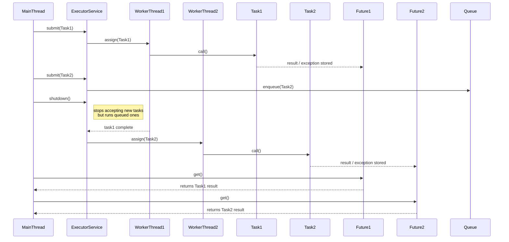

 **sequence diagram** 

* Submit two `Callable` tasks to an `ExecutorService`,
* Then call `shutdown()`, and
* Later call `future1.get()` and `future2.get()`.

---

---

### 🧩 Explanation:

* `submit()` returns a `Future` immediately.
* The executor assigns tasks to available worker threads.
* `shutdown()` only prevents **new** submissions; existing and queued tasks still execute.
* `Future.get()` blocks until the corresponding task is done.

Would you like me to add what happens if you call `shutdownNow()` instead (with interrupts shown in the same diagram)?
