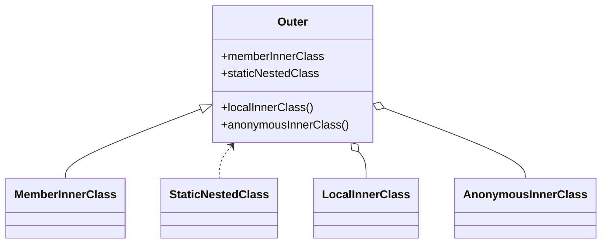

### Member Inner Class

A non-static class defined inside another class. It has access to all outer class members (including private).

**Use case**: When the inner class logically belongs to an instance of the outer class, such as modeling parts of an object.

**Example**:

```java
class Car {
    private String model;

    class Engine {
        int getHorsePower() {
            return 120;
        }
    }
}
```

**Component performing access**: JVM resolves synthetic accessor methods to allow private field access.

### Static Nested Class

A static class inside another class. Does not require an instance of the outer class.

**Use case**: Useful for grouping utility classes or builders logically without requiring an outer instance.

**Example (Builder pattern)**:

```java
class Employee {
    private String name;
    private int age;

    static class Builder {
        private String name;
        private int age;

        Builder name(String n){ this.name=n; return this; }
        Builder age(int a){ this.age=a; return this; }

        Employee build(){
            Employee e=new Employee();
            e.name=this.name;
            e.age=this.age;
            return e;
        }
    }
}
```

**Component performing access**: JVM treats the static inner class as a normal top-level class with a name prefix.

### Local Inner Class

A class defined inside a method. Can access effectively final variables of the method.

**Use case**: When a helper class is needed only within a specific method, such as request validation inside a controller method.

**Example**:

```java
void processRequest(String request) {
    class Validator {
        boolean isValid() { return request != null && !request.isBlank(); }
    }
    Validator v = new Validator();
}
```

**Component performing access**: JVM creates the class with name outerClass$1Validator and captures method variables.

### Anonymous Inner Class

A class created without a name, typically to implement an interface or extend a class inline.

**Use case**: Very common in Spring Boot for callbacks, especially before Java 8 lambdas.

**Example (Spring Boot WebClient response handler)**:

```java
Runnable task = new Runnable() {
    @Override
    public void run() {
        System.out.println("Processing async task");
    }
};
```

**Component performing instantiation**: JVM dynamically instantiates a synthetic class with naming like Outer$1.

### Protected Inner Class Access Rules

Protected inner classes can be accessed by subclasses even in different packages.

**Use case**: Framework extension points.

### Private Inner Class

Used to hide implementation details.

**Use case**: Useful in encapsulating algorithms inside services.

**Example**:

```java
class PasswordService {
    private class HashAlgo {
        String hash(String input) { return "hash-" + input; }
    }
}
```

### Mermaid Diagram of Relationship



If you want, I can also generate a comparison table, bytecode details, or how each is used in Spring Boot source code.
