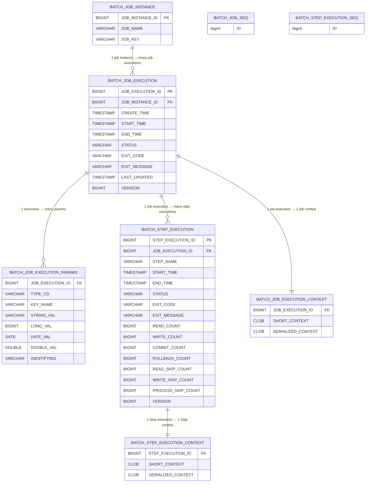

Here’s a complete example of a Spring Batch microservice that:

1. Uploads a CSV file,
2. Reads employee data,
3. Processes each line,
4. Sends a POST request to an employee API,
5. Uses `ItemReader`, `ItemProcessor`, and `ItemWriter`.

### 1. CSV File Sample (`employees.csv`)

```
name,email,department
John Doe,john@example.com,Engineering
Jane Smith,jane@example.com,Marketing
```


### 2. Spring Batch Configuration

```java
@Configuration
@EnableBatchProcessing
public class BatchConfig {

    @Autowired private JobBuilderFactory jobBuilderFactory;
    @Autowired private StepBuilderFactory stepBuilderFactory;
    @Autowired private RestTemplate restTemplate;

    @Bean
    public Job employeeJob() {
        return jobBuilderFactory.get("employeeJob")
                .start(employeeStep())
                .build();
    }

    @Bean
    public Step employeeStep() {
        return stepBuilderFactory.get("employeeStep")
                .<EmployeeInput, EmployeeInput>chunk(10)
                .reader(fileItemReader(null))
                .processor(employeeProcessor())
                .writer(employeeWriter())
                .build();
    }

    @Bean
    @StepScope
    public FlatFileItemReader<EmployeeInput> fileItemReader(@Value("#{jobParameters['filePath']}") String path) {
        FlatFileItemReader<EmployeeInput> reader = new FlatFileItemReader<>();
        reader.setResource(new FileSystemResource(path));
        reader.setLinesToSkip(1);
        reader.setLineMapper((line, lineNumber) -> {
            String[] fields = line.split(",");
            return new EmployeeInput(fields[0], fields[1], fields[2]);
        });
        return reader;
    }

    @Bean
    public ItemProcessor<EmployeeInput, EmployeeInput> employeeProcessor() {
        return item -> {
            // Add validation or transformation logic here
            return item;
        };
    }

    @Bean
    public ItemWriter<EmployeeInput> employeeWriter() {
        return items -> {
            for (EmployeeInput emp : items) {
                restTemplate.postForEntity("http://localhost:8081/employees", emp, Void.class);
            }
        };
    }

    @Bean
    public RestTemplate restTemplate() {
        return new RestTemplate();
    }
}
```


### 3. Domain Class

```java
@Data
@AllArgsConstructor
@NoArgsConstructor
public class EmployeeInput {
    private String name;
    private String email;
    private String department;
}
```


### 4. Triggering the Job

Use Spring Boot controller to upload the file and trigger the batch job:

```java
@RestController
@RequestMapping("/upload")
public class FileUploadController {

    @Autowired private JobLauncher jobLauncher;
    @Autowired private Job employeeJob;

    @PostMapping
    public String upload(@RequestParam("file") MultipartFile file) throws Exception {
        String path = "uploads/" + file.getOriginalFilename();
        file.transferTo(new File(path));

        JobParameters params = new JobParametersBuilder()
                .addString("filePath", path)
                .addLong("time", System.currentTimeMillis())
                .toJobParameters();

        jobLauncher.run(employeeJob, params);
        return "Batch job triggered";
    }
}
```


### 5. Auto-generated Tables

Spring Batch auto-creates the following tables (if `JdbcJobRepository` is used):

- `BATCH_JOB_INSTANCE`
- `BATCH_JOB_EXECUTION`
- `BATCH_JOB_EXECUTION_PARAMS`
- `BATCH_STEP_EXECUTION`
- `BATCH_STEP_EXECUTION_CONTEXT`
- `BATCH_JOB_EXECUTION_CONTEXT`

Make sure your schema is initialized from the Spring Batch SQL files (available in the Spring Batch GitHub repo or starter JAR).

Below is the **correct Spring Batch metadata ER diagram** for the tables you listed.
These tables are generated automatically when you enable **Spring Batch JDBC JobRepository**.

All diagrams are provided in **Mermaid ER format**, matching your preferred style.

 

### **Spring Batch Metadata ER Diagram**




### **1. `BATCH_JOB_INSTANCE`**

Represents a logical job instance:

* Identified by: **jobName + jobParameters**
* E.g., “importEmployeesJob with parameter date=2024-01-01”

A new row is created only when the **job parameters change**.


### **2. `BATCH_JOB_EXECUTION`**

Represents **one run** of a job instance.

Example:

* First attempt → status STARTED → COMPLETED
* Retry after failure → NEW execution record

Relations:

* `JOB_INSTANCE_ID` → belongs to one job instance


### **3. `BATCH_JOB_EXECUTION_PARAMS`**

Stores the **actual job parameters** as passed on execution.

Includes type codes:

* STRING
* LONG
* DATE
* DOUBLE


### **4. `BATCH_STEP_EXECUTION`**

Represents the execution of a **Step** within a Job execution.

Contains all counters:

* read_count
* write_count
* skip_count
* commit_count

Relations:

* One job execution → many step executions


### **5. `BATCH_STEP_EXECUTION_CONTEXT`**

Attributes stored via:

```java
chunkContext.getStepContext().getStepExecution().getExecutionContext()
```

One-to-one with StepExecution.

### **6. `BATCH_JOB_EXECUTION_CONTEXT`**

Attributes stored at job level via:

```java
jobExecution.getExecutionContext()
```

One-to-one with JobExecution.


### BATCH_JOB_SEQ and BATCH_STEP_EXECUTION_SEQ 
are simple sequence tables used by Spring Batch’s Jdbc*Dao implementations to generate primary keys.


Here's a `curl` command to call the `/upload` endpoint and upload the `employees.csv` file:

```bash
curl -X POST http://localhost:8080/upload \
  -H "Content-Type: multipart/form-data" \
  -F "file=@/path/to/employees.csv"
```

**Replace** `/path/to/employees.csv` with the actual path to your CSV file.

Example:

```bash
curl -X POST http://localhost:8080/upload \
  -H "Content-Type: multipart/form-data" \
  -F "file=@employees.csv"
```

 
### Built-in Error Handling in Spring Batch

Spring Batch provides **multiple, layered error-handling mechanisms** out of the box. These work at **step**, **chunk**, **item**, **job**, and **infrastructure** levels and are designed so you rarely need custom try/catch logic.


### 1. Chunk-Oriented Error Handling (Most Important)

Spring Batch processes data in **chunks**:

```
read → process → write → commit
```

If an error occurs, Spring Batch can **retry**, **skip**, or **fail** automatically.

#### Retry (Transient errors)

Used for:

* DB deadlocks
* Network glitches
* Temporary service failures

```java
.step("step1")
.<Input, Output>chunk(100)
.faultTolerant()
.retry(SQLException.class)
.retryLimit(3)
```

Behavior:

* Same item retried up to `retryLimit`
* Transaction rolled back and retried
 

#### Skip (Bad data / poison records)

Used for:

* Invalid data
* Parsing errors
* Business validation failures

```java
.faultTolerant()
.skip(ParseException.class)
.skipLimit(10)
```

Behavior:

* Item is skipped
* Step continues
* Counted in `SKIP_COUNT`
 

### 2. Combined Retry + Skip (Common Pattern)

```java
.faultTolerant()
.retry(DeadlockLoserDataAccessException.class)
.retryLimit(3)
.skip(FlatFileParseException.class)
.skipLimit(100)
```

Meaning:

* Retry transient DB issues
* Skip bad input records
* Fail only if limits exceeded

 

### 3. Skip & Retry Listeners (Observability)

Spring Batch gives listeners to **react** to failures.

#### SkipListener

```java
public class MySkipListener implements SkipListener<Input, Output> {

    public void onSkipInRead(Throwable t) {}
    public void onSkipInProcess(Input item, Throwable t) {}
    public void onSkipInWrite(Output item, Throwable t) {}
}
```

Use cases:

* Write skipped records to error table
* Send alerts
* Audit failures
 

#### RetryListener

```java
public class MyRetryListener extends RetryListenerSupport {

    @Override
    public <T, E extends Throwable> void onError(
        RetryContext context, RetryCallback<T, E> callback, Throwable throwable) {
    }
}
```
 

### 4. Step-Level Error Handling

#### StepExecutionListener

```java
public class MyStepListener implements StepExecutionListener {

    public ExitStatus afterStep(StepExecution stepExecution) {
        if (stepExecution.getFailureExceptions().size() > 0) {
            return ExitStatus.FAILED;
        }
        return ExitStatus.COMPLETED;
    }
}
```

Used to:

* Override exit status
* Trigger compensation logic
 

### 5. Job-Level Error Handling

#### JobExecutionListener

```java
public class MyJobListener implements JobExecutionListener {

    public void afterJob(JobExecution jobExecution) {
        if (jobExecution.getStatus() == BatchStatus.FAILED) {
            // notify / rollback / alert
        }
    }
}
```
 

### 6. Item-Level Error Handling Hooks

Spring Batch lets you intercept failures at each stage.

#### ItemReadListener

```java
onReadError(Exception ex)
```

#### ItemProcessListener

```java
onProcessError(Input item, Exception ex)
```

#### ItemWriteListener

```java
onWriteError(Exception ex, List<? extends Output> items)
```
 

### 7. Skip Policy (Advanced Control)

Instead of listing exceptions:

```java
.step("step1")
.faultTolerant()
.skipPolicy((throwable, skipCount) -> {
    return throwable instanceof ValidationException && skipCount < 10;
})
```

Gives full programmatic control.
 

### 8. Retry Policy (Advanced Control)

```java
.retryPolicy(new SimpleRetryPolicy(3,
    Map.of(SQLException.class, true)))
```

Or backoff:

```java
.backOffPolicy(new FixedBackOffPolicy())
```
 
### 9. Transaction Rollback Rules

By default:

* Any `RuntimeException` → rollback
* Any `Error` → fail job

You can customize:

```java
.noRollback(ValidationException.class)
```
 

### 10. Restart & Recovery (Built-in Safety Net)

Spring Batch automatically supports **restartability**.

If a job fails:

* State is stored in metadata tables
* Job can restart from last committed chunk

```java
preventRestart() // disables this
```

 
### 11. Built-in Failure Metadata Tracking

Spring Batch automatically records:

* Failure exceptions
* Exit codes
* Retry counts
* Skip counts
* Read/write counts

Stored in:

* `BATCH_STEP_EXECUTION`
* `BATCH_JOB_EXECUTION`

No custom code required.

 
 

| Level         | Mechanism              |
| ------------- | ---------------------- |
| Item          | Skip, Retry            |
| Chunk         | Transaction rollback   |
| Step          | Listeners, ExitStatus  |
| Job           | JobExecutionListener   |
| Infra         | Restart, persistence   |
| Observability | Skip & Retry listeners |

 

* Use **Retry** for transient infra issues
* Use **Skip** for data issues
* Never use try/catch inside ItemReader/Processor/Writer
* Always enable **restartability**
* Log skipped items via SkipListener

 


### More

✔ ER diagram including all Spring Batch metadata tables (including `BATCH_JOB_SEQ`, `BATCH_STEP_EXECUTION_SEQ`)
✔ A full architecture diagram of Spring Batch flow (`Job → Step → Chunk → Reader/Processor/Writer`)
✔ Example queries for monitoring job runs
✔ Queries to find stuck batch jobs
✔ Example Spring Batch code with ItemReader, ItemProcessor, ItemWriter

* Real production configuration examples
* How to send failed records to DLQ / error table
* How Spring Batch handles DB deadlocks
* How to debug stuck batch jobs


Good question — this is a fundamental Spring Batch concept, and interviewers often use it to check whether you understand the framework internals or just usage.


---

Short, crisp answer (start with this)

> ItemReader is a Spring Batch abstraction that reads one logical item at a time,
while a LineReader reads raw lines of text from a file and is usually an internal, lower-level component.


---

Detailed explanation

1️⃣ ItemReader

Level: Spring Batch API (high level)

Core interface in Spring Batch:


public interface ItemReader<T> {
    T read() throws Exception;
}

Responsibilities:

Reads one item at a time (row, record, object)

Knows where to resume on restart

Integrates with:

Chunk processing

Transactions

ExecutionContext


Examples:

FlatFileItemReader<Employee>

JdbcPagingItemReader<Order>

JpaPagingItemReader<Task>

PoiItemReader<ExcelRow>


📌 From Spring Batch’s point of view:

> Everything is an Item.


---

2️⃣ LineReader

Level: Lower-level / internal abstraction

Not commonly used directly in job configuration

Reads raw text lines from a file

No knowledge of:

Chunks

Transactions

Job restartability

Item mapping


Common usage:

Inside FlatFileItemReader

Reads String lines from file

Then passes them to:

LineTokenizer

FieldSetMapper


📌 LineReader just answers:

> “Give me the next line.”


---

How they work together (very important)

File
 ↓
LineReader  → reads raw text line
 ↓
LineTokenizer → splits columns
 ↓
FieldSetMapper → maps to object
 ↓
ItemReader<T> → returns domain object
 ↓
Chunk processing

👉 LineReader is an implementation detail of ItemReader.


---

Interview-level comparison table

Aspect	ItemReader	LineReader

Abstraction level	High (Spring Batch API)	Low (file I/O)
Returns	Domain object (T)	Raw String
Chunk-aware	✅ Yes	❌ No
Restartable	✅ Yes	❌ No
Used directly in jobs	✅ Yes	❌ Rarely
Example	FlatFileItemReader	BufferedReader


---

Strong closing line (Bar Raiser signal)

> In Spring Batch, ItemReader defines what is read and participates in job lifecycle, while LineReader defines how raw data is read. We work with ItemReader directly; LineReader is an internal building block.


---

If you want next, I can:

Ask a Bar Raiser follow-up like “How does restartability actually work in ItemReader?”

Compare FlatFileItemReader vs PoiItemReader

Explain why ItemReader.read() must return null at EOF

Map this to AWS S3-based ingestion
