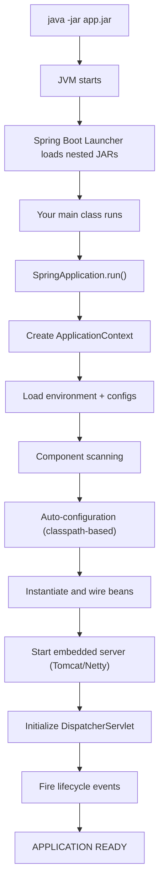
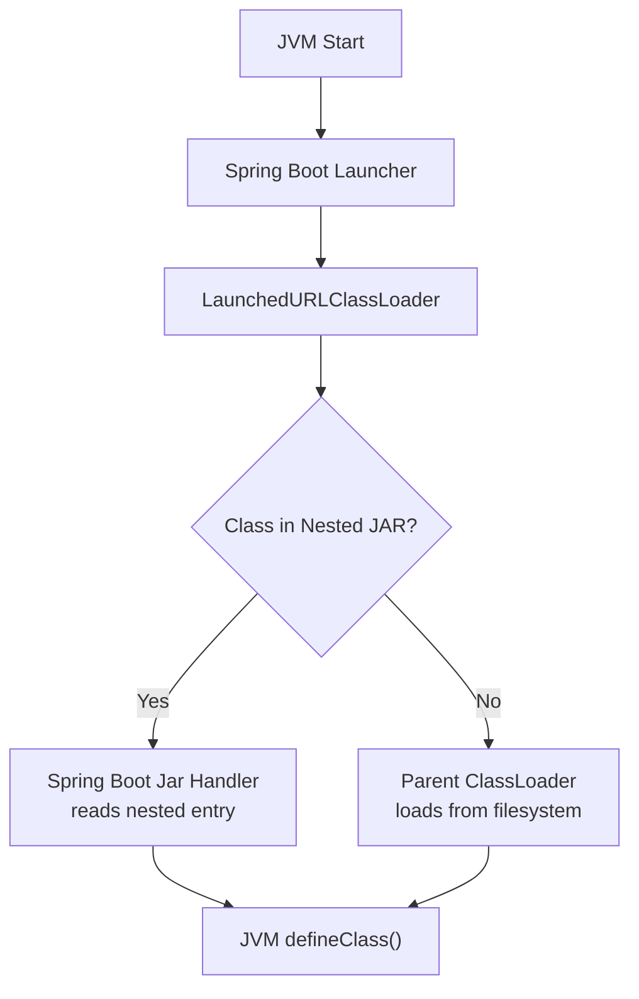
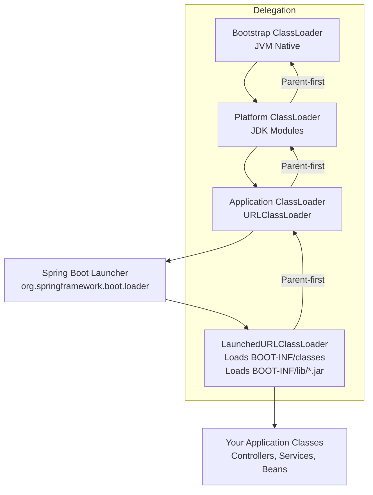

# Spring Boot

 
Running a Spring Boot JAR triggers:

| Step No. | Boot Process Step                                |
| -------- | ------------------------------------------------ |
| 1        | JVM starts                                       |
| 2        | Spring Boot custom classloader loads nested JARs |
| 3        | `@SpringBootApplication` main class runs         |
| 4        | Spring initializes environment                   |
| 5        | Component scanning                               |
| 6        | Auto-configuration                               |
| 7        | Bean creation + dependency injection             |
| 8        | Embedded server startup                          |
| 9        | `DispatcherServlet` initialization               |
| 10       | `ApplicationReadyEvent`                          |
| 11       | App runs and serves requests                     |
 


 

```
java -jar myapp-1.0.jar
```

###   **1. JVM Starts**

* The JVM starts a new process.
* It loads the JAR file.
* Finds the `Main-Class` in `META-INF/MANIFEST.MF`.
 
```
Main-Class: org.springframework.boot.loader.JarLauncher
Start-Class: com.example.MySpringBootApp
```

This is different from normal jar file where `Main-Class: com.example.MainApp` is mentioned in `META-INF/MANIFEST.MF` .
A normal jar has No support for nested JARs.


For fat JARs, Spring Boot uses its custom launcher.
JarLauncher creates LaunchedURLClassLoader, a custom loader that understands Spring Boot’s fat JAR format.
It loads:
```
BOOT-INF/classes/
BOOT-INF/lib/*.jar (nested JARs)
```
###  **2. Spring Boot Launcher Kicks In**

Spring Boot has a custom **classloader**:
`org.springframework.boot.loader.LaunchedURLClassLoader`

It:

* Loads your app classes
* Loads dependency JARs nested inside `BOOT-INF/lib/`
* Loads your application main class from `BOOT-INF/classes/`

This works because Boot JARs are **nested JARs**, not standard.

### Difference Between JVM Standard ClassLoader and Spring Boot LaunchedURLClassLoader

 

A normal Java application uses the JVM’s built-in class loaders (Bootstrap, Platform, Application) which load classes directly from the filesystem or classpath.
Spring Boot uses **`org.springframework.boot.loader.LaunchedURLClassLoader`** when running a **fat JAR**, enabling loading classes from nested JARs.

### Standard JVM ClassLoader

* Managed entirely by the **JVM**.
* Loads classes from OS filesystem paths resolved from **`CLASSPATH`**.
* Delegation model: Parent → Child (Bootstrap → Platform → App).
* Cannot read nested JARs inside a fat JAR without extraction.
* Class resolution uses Linux kernel I/O APIs via `open()`, `read()`.

### Bootstrap ClassLoader

The **Bootstrap ClassLoader** is the root class loader inside the **JVM**.

* Implemented in **C/C++ inside the JVM**, not a Java class.
* Loads core Java classes from the `$JAVA_HOME/lib` directory (e.g., `java.lang.*`, `java.util.*`, `java.security.*`).
* Uses direct **Linux kernel file I/O** (`open()`, `mmap()`) performed by the JVM.
* Has no parent; all other class loaders delegate to it first.

### Platform ClassLoader

The **Platform ClassLoader** (introduced in Java 9) loads essential but non-core API classes.

* Loads modules such as `java.sql`, `java.xml`, `java.desktop`.
* Implemented in Java but controlled by the JVM.
* Parent = Bootstrap; Child = Application class loader.
* Ensures core platform modules remain isolated from user application classes.

### Application (System) ClassLoader

The **Application ClassLoader** loads all application-level classes.

* Loads classes from the **classpath** (`-cp`, JARs, directories).
* Parent = Platform ClassLoader.
* Responsible for user-defined packages (`com.example.*`).
* Most frameworks (Spring, Hibernate, Kafka clients) run under this loader unless they use custom classloaders.

If you want, I can also give a Mermaid diagram showing all three and their delegation model, or show how Spring Boot inserts `LaunchedURLClassLoader` into this hierarchy.


### Spring Boot LaunchedURLClassLoader

* Created by **Spring Boot Launcher** before transferring control to JVM user classes.
* Extends `URLClassLoader` to load **nested JARs from within a single fat JAR** using in-memory “jar-in-jar” lookups.
* Reads entries using `JarFile` + custom indexes instead of plain filesystem paths.
* Overrides `findClass()` for nested JAR resolution performed by Spring Boot launcher, not JVM.
* Avoids unpacking dependency JARs to disk.
 

| Feature           | JVM ClassLoader             | Spring Boot LaunchedURLClassLoader            |
| ----------------- | --------------------------- | --------------------------------------------- |
| Loading Source    | Filesystem JARs             | Nested JARs inside fat JAR                    |
| Who Creates It    | JVM                         | Spring Boot launcher                          |
| Delegation Model  | Standard parent-first       | Parent-first but with custom nested-jar logic |
| Performance       | Fast disk lookup            | Slight overhead for nested JAR indexing       |
| Linux Interaction | Direct JVM → Linux syscalls | Boot loader → Jar handlers → Linux syscalls   |
| Use Case          | Standard Java apps          | Spring Boot executable JARs                   |

###   How JVM Loads a Class

```java
Class<?> clazz = Class.forName("com.example.App");
```

Execution Path:
JVM → ApplicationClassLoader → Linux filesystem (`open/read`) → bytecode → defineClass()

###  How Spring Boot Loads a Class (Nested JAR)

```java
Class<?> clazz = Class.forName("org.example.MyService",
                               true,
                               new LaunchedURLClassLoader(urls, parent));
```

Execution Path:
LaunchedURLClassLoader → Spring Boot JarFile Handler → Locate entry inside nested JAR
→ Read bytes → defineClass() in JVM
 


 

* **Normal JVM ClassLoader** → standard Java apps, no nested packaging.
* **LaunchedURLClassLoader** → Spring Boot fat JARs requiring nested JAR loading.

### Delegation model 


More : show the bytecode path inside the JVM (HotSpot) or the layout of a Spring Boot executable JAR.


## **3. Main Application Class Runs**

Spring Boot finds your `@SpringBootApplication` class:

```java
@SpringBootApplication
public class MyApp {
    public static void main(String[] args) {
        SpringApplication.run(MyApp.class, args);
    }
}
```


The @SpringBootApplication annotation simplifies Spring Boot setup by combining three annotations under the hood:

1. @Configuration → Marks the class as a source of bean definitions.


2. @EnableAutoConfiguration → Enables Spring Boot’s auto-configuration mechanism, which automatically configures beans based on classpath and properties.


3. @ComponentScan → Scans the package of the annotated class and its sub-packages for Spring components (@Component, @Service, @Repository, @Controller) so they are registered as beans.


```java
@SpringBootApplication = @Configuration + @EnableAutoConfiguration + @ComponentScan
```


➤ `ApplicationStartingEvent` triggered 
- Fired immediately when the SpringApplication starts, before environment or context are created.


➤ `ApplicationEnvironmentPreparedEvent` triggered
- Environment is prepared (properties, profiles loaded), but ApplicationContext is not created yet.

### Loading configuration 


Configuration is specified as 

 

### 1. Using Command-Line Arguments

Pass properties directly when running the application:

`java -jar app.jar --server.port=8081 --app.datasource.url=jdbc:mysql://localhost/db`

Spring Boot automatically maps these to @Value or @ConfigurationProperties.

 

### 2. Using Environment Variables

Spring Boot maps environment variables to properties using relaxed binding:
```
export SERVER_PORT=8081
export APP_DATASOURCE_URL=jdbc:mysql://localhost/db
java -jar app.jar
```
 

### 3. Using an External Properties or YAML File

Specify a custom file with --spring.config.location:

`java -jar app.jar --spring.config.location=file:/path/to/external-config.yml`

Can be .properties or .yml

Overrides default application.properties or application.yml


 
### 4. Using Profiles

Activate a profile-specific configuration:

`java -jar app.jar --spring.profiles.active=dev`

Loads application-dev.properties or application-dev.yml

Allows different configurations per environment

 

> Spring Boot merges properties in the above order (later overrides earlier):


This is how you can provide configuration properties at startup for both @Value and @ConfigurationProperties.


Use it as : 

```java
@ConfigurationProperties(prefix = "app.datasource")
public class DataSourceConfig {
    private String url;
    private String username;
    private String password;
    // getters and setters
}

```


### **4. SpringApplication Bootstraps the Application**

`SpringApplication.run()` performs many tasks:

### 4.1 Create ApplicationContext

Depending on the app type:

* Web app → `AnnotationConfigServletWebServerApplicationContext`
* Reactive app → `ReactiveWebServerApplicationContext`
* Non-web app → `AnnotationConfigApplicationContext`
  
➤ `ApplicationContextInitializedEvent` triggered
- ApplicationContext object is created ✓ , but no beans have been loaded yet. ⟳

### 4.2 Start Spring Environment

Loads:

* `application.properties` or `.yaml`
* OS env variables
* JVM parameters
* Profiles (`spring.profiles.active`)
* External config files

### **5. Component Scanning**

Spring scans your package:

```
com.example.myapp.*
```

Finds:

* `@Component`
* `@Service`
* `@Repository`
* `@Controller`
* `@RestController`
* `@Configuration`
* `@Bean` methods

Registers them into the **IoC container**.

➤ `ApplicationPreparedEvent` triggered 
- Bean definitions are loaded ✓ BUT no beans are created yet. ⟳

### **6. Auto-Configuration Starts (`@EnableAutoConfiguration`)**

Spring Boot now checks the classpath and applies auto-configurations.

Example:

* `spring-boot-starter-web` → setup Tomcat + MVC
* `spring-boot-starter-data-jpa` → Hibernate + DataSource
* `spring-boot-starter-security` → Security auto-setup
* `spring-boot-starter-actuator` → Monitoring endpoints

These are triggered by `spring.factories` (Spring Boot 2) or `META-INF/spring/org.springframework.boot.autoconfigure.AutoConfiguration.imports` (Boot 3).

Spring Boot’s auto-configuration works by inspecting the classpath and the application context at startup. When a dependency (like a Spring Boot starter) is present in the POM, Spring Boot loads the matching auto-config class. Each auto-config class defines beans guarded by conditions such as 
- @ConditionalOnClass 
- @ConditionalOnMissingBean 
- @ConditionalOnProperty. 


If the classpath contains the required classes and the application context does not already define a conflicting bean, Spring Boot creates the bean automatically—otherwise it backs off and lets your custom configuration take priority.


### **7. Beans Are Instantiated (Dependency Injection)**

Spring now creates all beans:

* Constructor injection
* Setter injection
* Field injection (not recommended)

[Bean lifecycle](../core/bean_lifecycle.md)

1. Instantiate object - Constructor called 
2. Populate dependencies - @Autowired 
3. BeanPostProcessors .postProcessBeforeInitialization
   - Common method to be called for each and every bean initialization 
   - modifying bean properties
   - injecting additional metadata
   - wrapping with helper decorators
```java
import org.springframework.beans.BeansException;
import org.springframework.beans.factory.config.BeanPostProcessor;
import org.springframework.stereotype.Component;

@Component
public class CustomBeanPostProcessor implements BeanPostProcessor {

    private static final Logger logger = LoggerFactory.getLogger(CustomBeanPostProcessor.class);

    @Override
    public Object postProcessBeforeInitialization(Object bean, String beanName) throws BeansException {
        logger.info("{} Before initialization: {}",beanName);
        return bean;
    }

    @Override
    public Object postProcessAfterInitialization(Object bean, String beanName) throws BeansException {
        logger.info("{} After initialization: {}",beanName);
        return bean;
    }
}
```
postProcessBeforeInitialization and postProcessAfterInitialization are call before and after each and every bean initialization
```log
2025-11-29 22:25:32.369  INFO 47554 --- [           main] c.e.config.CustomBeanPostProcessor       :  Before initialization: org.springframework.boot.autoconfigure.web.servlet.ServletWebServerFactoryConfiguration$EmbeddedTomcat
2025-11-29 22:25:32.369  INFO 47554 --- [           main] c.e.config.CustomBeanPostProcessor       :  After initialization: org.springframework.boot.autoconfigure.web.servlet.ServletWebServerFactoryConfiguration$EmbeddedTomcat
2025-11-29 22:25:32.381  INFO 47554 --- [           main] c.e.config.CustomBeanPostProcessor       :   Before initialization: tomcatServletWebServerFactory
2025-11-29 22:25:32.382  INFO 47554 --- [           main] c.e.config.CustomBeanPostProcessor       :   Before initialization: org.springframework.boot.autoconfigure.websocket.servlet.WebSocketServletAutoConfiguration$TomcatWebSocketConfiguration
2025-11-29 22:25:32.382  INFO 47554 --- [           main] c.e.config.CustomBeanPostProcessor       :   After initialization: org.springframework.boot.autoconfigure.websocket.servlet.WebSocketServletAutoConfiguration$TomcatWebSocketConfiguration
```
5. Call `@PostConstruct` methods
    - Calls the bean method which is annotated with `import javax.annotation.PostConstruct;`
    - properties are visible 
```java
@Value("${server.port:8080}")
private int port;

@PostConstruct
public void postConstruct() {
    logger.info("{}   Post construct , prop : {}",port);
}
```
7. Initialize bean : InitializingBean.afterPropertiesSet()
8. @Bean(initMethod="...")
   - For Manually configured beans , the init and destroy method can be specified using the @Bean annotation
```java
import org.springframework.context.annotation.Bean;
import org.springframework.context.annotation.Configuration;

@Configuration
public class BeanConfig {

    @Bean(initMethod = "customInit", destroyMethod = "customDestroy")
    public DataService dataService() {
        return new DataService();
    }
}
```
The custom init and destroy methods will be triggered 
```java

public class DataService {

    private static final Logger logger = LoggerFactory.getLogger(DataService.class);

    public void customInit() {
        logger.info("DataService initialized via @Bean initMethod");
    }

    public void customDestroy() {
        logger.info("DataService destroyed via @Bean destroyMethod");
    }
}
```

10.  BeanPostProcessor.postProcessAfterInitialization() : This is usually where actual bean replacement happens (proxying).
    - This is again for each and every Bean , after initializing each and every bean the control goes to `postProcessAfterInitialization`
    - Spring AOP creates proxies
    - @Transactional proxies are generated
    - @Async proxy wrappers added
    - Security proxy layers added
      


➤ `ContextRefreshedEvent` triggered 
- Bean factory setup ✓
- BeanPostProcessors registered ✓
- All singleton beans created ✓
- Web server not started yet ⟳

  
### **8. Web Server Starts (for web apps)**

If your app is a web application, Spring Boot starts embedded servers

* `MVC` : Tomcat (default) , Jetty , Undertow
* `WebFlux` : Netty  

Server steps:

* Create server instance
* Bind port (default: **8080**)
* Initialize servlet context
* Register DispatcherServlet

➤ `ServletWebServerInitializedEvent` (Spring MVC)
<br/> OR <br/>
➤ `ReactiveWebServerInitializedEvent` (WebFlux)
 Fired when embedded Tomcat/Jetty/Netty is ready.

### **9. DispatcherServlet Initialization (Spring MVC)**

Spring MVC configures:

* Handler mappings
* Interceptors
* Argument resolvers
* Message converters (JSON via Jackson)
* Exception handlers

Your REST endpoints are registered:

```java
@GetMapping("/hello")
public String hello() { return "Hello!"; }
```

### **10. Application Started Event Fired**

Spring publishes:

 ➤ `ApplicationStartedEvent`
 - ApplicationContext is refreshed. ✓
 - Web server is started. ✓
 - But CommandLineRunner and ApplicationRunner have not run yet ⟳


### ApplicationRunner and CommandLineRunner Hooks

These runners are optional extension points. Only if a Bean of this type is implemented it comes to action during the startup, else no action is taken.

If you run your Spring Boot app like this:

```shell
java -jar app.jar user=admin mode=fast --debug
```

Then CommandLineRunner receives:

```java
@Override
public void run(String... args) {
    // args contains raw arguments
    // ["user=admin", "mode=fast", "--debug"]
}
```

ApplicationRunner receives a parsed structure:

```java
@Override
public void run(ApplicationArguments args) {
    args.getNonOptionArgs();   // ["user=admin", "mode=fast"]
    args.getOptionNames();     // ["debug"]
    args.containsOption("debug"); // true
}
```


Anything starting with -- becomes an option.Everything else is a non-option argument.


  
 ➤ `ApplicationReadyEvent`
 - Application is fully started, all runners executed. ✓
 - The app is ready to serve requests.  ✓
Any `@EventListener` for these will run.

### **11. Your Application Is Now Running**

The logs will show:

```
Started MyApp in 3.254 seconds (JVM running for 3.8)
```

Spring is now ready:

* Web server accepting requests
* Background scheduled tasks running
* Database connections established

### 12. Error Scenario 
➤ `ApplicationFailedEvent`

 Spring Boot has **only ONE official failure event**: **`ApplicationFailedEvent`**

 

1. **ApplicationStartingEvent Stage**

 

* Incorrect JVM flags
* Classpath issues
* Bootstrap initialization error
 

2. **ApplicationEnvironmentPreparedEvent Stage**

Environment preparation failures:

 

* Invalid `application.properties`
* YAML parsing error
* Missing environment variables
* Invalid profile activation
 

3. **ApplicationContextInitializedEvent Stage**

Context is created but no beans are loaded.

 

* Bad ApplicationContext initializer
* Incorrect custom context logic

 

4. **ApplicationPreparedEvent Stage**

Bean definitions are loaded, but beans are NOT created.

 

* Invalid bean definition
* Circular bean reference detected early
* Problem in BeanFactoryPostProcessor
* Error in @Configuration parsing

 

5. **ContextRefreshedEvent Stage**

Beans are being created and autowired.

 

* Missing @Autowired dependency
* Bean creation exception
* Proxy creation failure (AOP)
* Transaction manager missing
* JPA/Hibernate initialization error

 

6. **Web Server Initialization Stage**

Web server (Tomcat/Jetty/Netty) is starting.

 

* Port already in use
* Missing servlet container
* Invalid server config

 
7. **ApplicationStartedEvent Stage**

Context refresh completed, server running, BUT runners not executed.

 

* CommandLineRunner exception
* ApplicationRunner exception

 

8. **ApplicationReadyEvent Stage**

App is ready; final step.

 

* Triggered by code running *after* app startup
  (e.g., scheduled job, background init)
 

| Startup Stage       | Success Event                       | Failure Event          | Typical Failure Causes               |
| ------------------- | ----------------------------------- | ---------------------- | ------------------------------------ |
| Start               | ApplicationStartingEvent            | ApplicationFailedEvent | Bootstrapping errors                 |
| Environment Ready   | ApplicationEnvironmentPreparedEvent | ApplicationFailedEvent | YAML errors, invalid config          |
| Context Initialized | ApplicationContextInitializedEvent  | ApplicationFailedEvent | Bad initializers                     |
| Context Prepared    | ApplicationPreparedEvent            | ApplicationFailedEvent | Invalid bean definitions             |
| Beans Created       | ContextRefreshedEvent               | ApplicationFailedEvent | Autowiring/AOP/Bean creation errors  |
| Server Started      | ServletWebServerInitializedEvent    | ApplicationFailedEvent | Port issues, server misconfiguration |
| App Started         | ApplicationStartedEvent             | ApplicationFailedEvent | Runner exceptions                    |
| App Ready           | ApplicationReadyEvent               | ApplicationFailedEvent | Post-startup failures                |

 
