Excellent — this is a deep and important topic 🔥

Let’s break down everything about **Spring Cloud Gateway Rate Limiting** — including **configurations**, **internal working**, and **recommended setups** for production.

---

# 🚦 1️⃣ What Is Rate Limiting in Spring Cloud Gateway?

Rate limiting ensures that a **client (IP, user, token, etc.) cannot exceed a defined request rate** — for example, “no more than 10 requests per second.”

Spring Cloud Gateway provides a **RateLimiter abstraction**, mainly implemented via the:

* `RedisRateLimiter` (default & most common)
* `Bucket4jRateLimiter` (custom integration)
* `RequestRateLimiter` filter (the actual gateway filter)
* You can also write **custom rate limiters** by implementing `RateLimiter` interface.

---

# ⚙️ 2️⃣ Core Configuration (YAML / Properties)

Here’s a basic **RedisRateLimiter** configuration:

```yaml
spring:
  cloud:
    gateway:
      routes:
        - id: user-service
          uri: http://localhost:8081
          predicates:
            - Path=/users/**
          filters:
            - name: RequestRateLimiter
              args:
                redis-rate-limiter.replenishRate: 10     # tokens added per second
                redis-rate-limiter.burstCapacity: 20     # max bucket size
                redis-rate-limiter.requestedTokens: 1    # tokens per request
                key-resolver: "#{@ipKeyResolver}"        # bean to identify client
```

---

# 🔑 3️⃣ Key Configurations Explained

| Property             | Description                                                     |
| -------------------- | --------------------------------------------------------------- |
| **replenishRate**    | Number of tokens generated per second (rate).                   |
| **burstCapacity**    | Maximum number of tokens that can be accumulated in the bucket. |
| **requestedTokens**  | Number of tokens consumed per request.                          |
| **key-resolver**     | Determines what identifies a client (IP, userId, API key).      |
| **deny-empty-key**   | If true, request is denied when no key is resolved.             |
| **empty-key-status** | HTTP status when deny-empty-key triggers (default 403).         |

---

# 🔍 4️⃣ Example of a Custom `KeyResolver`

```java
import org.springframework.cloud.gateway.support.ServerWebExchangeUtils;
import org.springframework.context.annotation.Bean;
import org.springframework.stereotype.Component;
import org.springframework.web.server.ServerWebExchange;
import reactor.core.publisher.Mono;

@Component
public class CustomKeyResolver {

    @Bean
    public org.springframework.cloud.gateway.filter.ratelimit.KeyResolver ipKeyResolver() {
        return exchange -> Mono.just(
            exchange.getRequest()
                    .getRemoteAddress()
                    .getAddress()
                    .getHostAddress()
        );
    }
}
```

This resolver ensures each **client IP** has its own rate limit bucket.

---

# 🧠 5️⃣ Internal Working (Under the Hood)

Let’s go deep 👇

### 🧩 5.1 Request Flow Diagram

```mermaid
flowchart LR
    A[Incoming HTTP Request] --> B[RequestRateLimiter Filter]
    B --> C[KeyResolver (IP/User/Token)]
    C --> D[RateLimiter (Redis/Bucket4j)]
    D -->|Allowed| E[Forward to Downstream Service]
    D -->|Denied| F[Return 429 Too Many Requests]
```

---

### ⚙️ 5.2 Step-by-Step Flow

1. **Request enters the Gateway**

   * The `RequestRateLimiter` filter is applied to the route.

2. **Key Resolution**

   * Gateway uses your configured `KeyResolver` (IP, userId, etc.) to identify the client.

3. **Token Bucket Algorithm**

   * `RedisRateLimiter` uses **token bucket** algorithm:

     * Each key has a “bucket” in Redis.
     * Tokens are replenished every second (per `replenishRate`).
     * Each request consumes `requestedTokens`.
     * If bucket < requestedTokens → request denied (HTTP 429).

4. **Redis Backend**

   * Redis stores token counts using atomic Lua scripts:

     * Script ensures atomic increment/decrement.
     * Returns both the remaining tokens and whether the request is allowed.

5. **Response**

   * If allowed → request forwarded to downstream microservice.
   * If denied → `HTTP 429 Too Many Requests`.

---

# 🧰 6️⃣ Internal Data Structure in Redis

Example Redis keys per client:

```
request_rate_limiter.{key}.tokens
request_rate_limiter.{key}.timestamp
```

Each contains:

* **tokens**: remaining tokens.
* **timestamp**: last refill time.

Refill happens using a Lua script like:

```lua
-- pseudo logic
tokens = tokens + (currentTime - lastRefillTime) * replenishRate
tokens = min(tokens, burstCapacity)
if tokens >= requestedTokens then
  tokens = tokens - requestedTokens
  allowed = true
else
  allowed = false
end
```

All operations happen **atomically** in Redis.

---

# 💡 7️⃣ Alternative Implementations

### ✅ **RedisRateLimiter**

Default, production-grade, distributed.

### ✅ **Bucket4jRateLimiter**

Java-only, in-memory or distributed with external store.

Example:

```yaml
spring:
  cloud:
    gateway:
      filters:
        - name: RequestRateLimiter
          args:
            rate-limiter: "#{@bucket4jRateLimiter}"
            key-resolver: "#{@userKeyResolver}"
```

### ✅ **CustomRateLimiter**

Implement the interface:

```java
public interface RateLimiter<C> {
    Mono<Response> isAllowed(String routeId, String id);
}
```

You can use MongoDB, Hazelcast, or PostgreSQL for state storage.

---

# 🔒 8️⃣ SSL Termination and Rate Limiting

When you use **SSL termination at the Gateway**, rate limiting still works normally.
The order of operations:

```mermaid
sequenceDiagram
    participant Client
    participant Gateway (SSL + RateLimiter)
    participant BackendService

    Client->>Gateway (TLS Handshake)
    Gateway->>Client: TLS established (HTTPS)
    Gateway->>Gateway: RequestRateLimiter filter checks Redis
    alt Allowed
        Gateway->>BackendService: Forward request (HTTP or HTTPS)
        BackendService->>Gateway: Response
        Gateway->>Client: Return response
    else Denied
        Gateway->>Client: 429 Too Many Requests
    end
```

---

# 🚀 9️⃣ Production Recommendations

| Aspect             | Best Practice                                                                   |
| ------------------ | ------------------------------------------------------------------------------- |
| **Redis setup**    | Use a dedicated Redis cluster with low latency (<1 ms).                         |
| **Metrics**        | Enable Spring Actuator metrics for rate limiter.                                |
| **Burst tuning**   | Set `burstCapacity` slightly higher than `replenishRate` to allow short spikes. |
| **Per-route keys** | Use `routeId` + `userId` in key resolver for fine-grained limits.               |
| **Async timeout**  | If Redis fails, decide: deny or allow (via config).                             |

---

# ✅ 10️⃣ Example Java Config (instead of YAML)

```java
@Bean
public RouteLocator customRoutes(RouteLocatorBuilder builder, KeyResolver keyResolver) {
    return builder.routes()
        .route("product-service", r -> r.path("/products/**")
            .filters(f -> f.requestRateLimiter(c -> {
                c.setRateLimiter(redisRateLimiter());
                c.setKeyResolver(keyResolver);
            }))
            .uri("http://localhost:8082"))
        .build();
}

@Bean
public RedisRateLimiter redisRateLimiter() {
    return new RedisRateLimiter(10, 20); // replenishRate=10, burstCapacity=20
}
```

---

# 🧠 TL;DR Summary

| Concept                | Description                             |
| ---------------------- | --------------------------------------- |
| **Filter**             | `RequestRateLimiter`                    |
| **Algorithm**          | Token Bucket                            |
| **Backend**            | Redis                                   |
| **Configurable via**   | YAML, Java config                       |
| **Customizable parts** | KeyResolver, RateLimiter implementation |
| **Internals**          | Atomic Lua scripts in Redis             |
| **Result if exceeded** | 429 Too Many Requests                   |

---

Would you like me to include a **Mermaid sequence diagram showing the internal Redis Lua script logic** (refill + token consume) to visualize how Spring Gateway decides to allow or deny?


Perfect — here’s a clear and complete **Mermaid sequence diagram** showing what happens **inside Spring Cloud Gateway’s RedisRateLimiter**, including the **Lua script logic**, **token bucket updates**, and **decision-making** 👇

---

### 🧩 **TLS + Rate Limiting + Redis Internal Flow**

```mermaid
sequenceDiagram
    participant Client
    participant Gateway as 🌐 Spring Cloud Gateway
    participant Redis as 🧠 Redis (Token Store)
    participant Backend as ⚙️ Backend Service

    Client->>Gateway: 1️⃣ HTTPS Request (TLS Handshake)
    Note right of Gateway: TLS handshake terminates here (SSL termination)
    Gateway->>Client: TLS session established

    Note over Gateway: RequestRateLimiter filter starts
    Gateway->>Gateway: Resolve client key (via KeyResolver)<br/>e.g. IP = 192.168.1.10

    Gateway->>Redis: 2️⃣ Run Lua script<br/>with key = "request_rate_limiter.{IP}"
    activate Redis
    Redis->>Redis: Compute tokens = tokens + (now - lastRefill) * replenishRate
    Redis->>Redis: Clamp tokens ≤ burstCapacity
    Redis->>Redis: If tokens ≥ requestedTokens<br/>→ tokens -= requestedTokens<br/>allowed = true<br/>else allowed = false
    Redis-->>Gateway: Return { allowed, remainingTokens }
    deactivate Redis

    alt allowed == true
        Gateway->>Backend: 3️⃣ Forward request (HTTP)
        Backend-->>Gateway: Response 200 OK
        Gateway-->>Client: ✅ 200 OK
    else allowed == false
        Gateway-->>Client: ❌ 429 Too Many Requests
    end
```



---

## 🧠 Explanation of Each Step

| Step                                  | Description                                                                                               |
| ------------------------------------- | --------------------------------------------------------------------------------------------------------- |
| **1️⃣ TLS Handshake**                 | The gateway terminates HTTPS — decrypting traffic before any filters (like rate limiter) execute.         |
| **2️⃣ Rate Limit Check (Lua Script)** | The gateway sends an atomic Lua script to Redis to check & update the token count for the client’s key.   |
| **Lua Script Tasks**                  | Refill bucket, deduct tokens if enough available, deny otherwise — all atomically in Redis.               |
| **3️⃣ Forward or Deny**               | If allowed, the request continues to the backend service; otherwise, `429 Too Many Requests` is returned. |

---

## ⚙️ Pseudo Lua Logic (Simplified)

```lua
local tokens_key = KEYS[1]
local timestamp_key = KEYS[2]

local rate = tonumber(ARGV[1])         -- replenishRate
local burst = tonumber(ARGV[2])        -- burstCapacity
local tokens_requested = tonumber(ARGV[3])
local now = tonumber(ARGV[4])

local tokens = tonumber(redis.call("get", tokens_key)) or burst
local last_refill = tonumber(redis.call("get", timestamp_key)) or 0

local delta = math.max(0, now - last_refill)
local new_tokens = math.min(burst, tokens + delta * rate)
local allowed = new_tokens >= tokens_requested

if allowed then
    new_tokens = new_tokens - tokens_requested
    redis.call("set", tokens_key, new_tokens)
    redis.call("set", timestamp_key, now)
end

return { allowed and 1 or 0, new_tokens }
```

---

## 🧩 Rate Limiting Lifecycle Summary

| Phase              | Component        | Description                                   |
| ------------------ | ---------------- | --------------------------------------------- |
| **Handshake**      | Gateway          | TLS termination (if enabled).                 |
| **Key Resolution** | KeyResolver      | Determines unique client key.                 |
| **Rate Check**     | RedisRateLimiter | Executes Lua script for atomic bucket update. |
| **Decision**       | Gateway          | Allows or rejects request.                    |
| **Response**       | Client           | `200 OK` or `429 Too Many Requests`.          |

---

Would you like me to also draw a **second diagram** showing how **multiple gateway instances share the same Redis rate-limiting state** (i.e., how it works in a **clustered / horizontal scaling** setup)?
