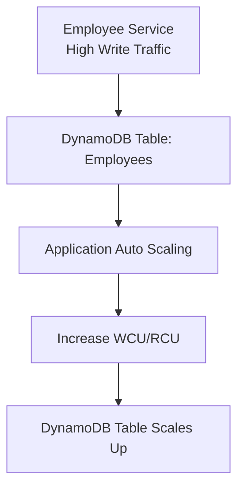
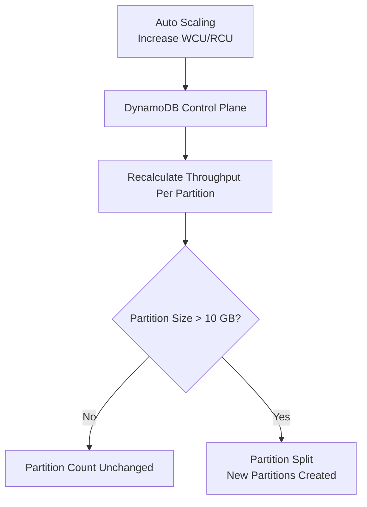

### Consistency Configuration In DynamoDB

DynamoDB supports two consistency models for **read operations only**:

1. **Eventually Consistent Reads (Default)**
2. **Strongly Consistent Reads**

Write operations are always strongly consistent within a region.

Below is a concise breakdown of both and their impact on **performance**, **cost**, and **latency**, and what internal DynamoDB components are involved.

---

### Eventually Consistent Reads

### Definition

The read may return data that is **slightly stale** (usually 10–100 ms old).
DynamoDB returns data from **any available replica**, not necessarily the leader.

### Performance Impact

* Faster read latency because DynamoDB chooses the closest, least-loaded replica.
* Higher throughput because read load can be distributed across replicas.
* Less chance of throttling under bursty read traffic.

Component
The **Replica Selection Engine** chooses the replica with available read capacity.

### Cost Impact

* **1 RCU allows 2 eventually consistent reads (1 KB each).**
  You get double the throughput for the same cost.

Example
Reading 100 items/sec (each 1 KB):

* Eventually consistent: consumes **50 RCU**
* Strongly consistent: consumes **100 RCU**

---

### Strongly Consistent Reads

### Definition

Guarantees the latest committed write is returned.
DynamoDB must read from the **leader partition**, not replicas.

### Performance Impact

* Higher latency because only the leader can serve the read.
* Lower read throughput (limited to a single partition leader).
* More likely to cause **partition-level throttling** on hot keys.

Component
The **Leader Coordination Engine** ensures reads come from the leader partition only.

### Cost Impact

* **1 strongly consistent read = full RCU.**
* No 2× benefit like eventual consistency.

Example
Read 100 items/sec → **100 RCU**, double the cost of eventual.

---

### Internal Behavior That Causes Performance Differences

### 1. Leader vs Replica

Strong reads = always leader
Eventual reads = any replica
This affects latency and partition saturation.

### 2. Partition Throughput

Strong reads concentrate all traffic on a single node → easier throttling.
Eventual reads spread load across multiple replicas → more stable.

### 3. RCU Computation

Strong read of a 4 KB item = **4 RCU**
Eventual read of same item = **2 RCU**

---

### Example Scenario: Employees Table

Suppose applications frequently fetch real-time status of EmployeeId = 321.

Case 1: Strong Consistency
1000 reads/sec of a 1 KB item
Cost = 1000 RCU
Risk: Hot partition throttling

Case 2: Eventual Consistency
1000 reads/sec
Cost = **500 RCU**
Lower latency, less partition load, fewer throttles

---

### When To Use Strong Consistency

* Real-time financial writes (salary update must reflect immediately)
* Document approval systems (must read latest version immediately)
* Inventory decrement systems requiring precise stock count

### When Not To Use Strong Consistency

* Employee profile displays
* HR reporting dashboards
* Search queries
* Event streams and timeline listings
* High-traffic public endpoints

---

### Final Summary

| Consistency           | Behavior      | Cost             | Performance    | Throttling Risk |
| --------------------- | ------------- | ---------------- | -------------- | --------------- |
| Eventually Consistent | May be stale  | Cheapest (½ RCU) | Fastest        | Lowest          |
| Strongly Consistent   | Always latest | 2× cost          | Higher latency | Highest         |

Strong consistency centralizes all reads on the leader, increasing cost and potential throttling.
Eventual consistency spreads reads across replicas, reducing cost and improving performance.

If you want, I can also explain:

* How consistency interacts with GSIs
* How DynamoDB Streams behave w.r.t consistency
* Best read patterns for high-scale Employee tables


### Partition Throughput Quotas In DynamoDB

DynamoDB tables are internally split into **physical partitions**.
Each partition has **throughput quotas** that limit how many reads/writes it can serve per second, regardless of table-wide RCU/WCU.

AWS does **not** publish exact numbers, but the behavior is well-defined:

### What DynamoDB Guarantees Per Partition

* Each partition has **fixed internal CPU, memory, and I/O limits**.
* Throughput to a single partition is limited.
* Adaptive Capacity allows a **single partition key** to use up to:

  * about **3,000 strongly consistent reads/sec**, or
  * about **2,000 writes/sec**
    *even if all requests hit one partition.*

These values come from how much “boost” adaptive capacity can provide to a hot key on one partition.

### Why Partitions Have Quotas

Every partition is a separate SSD-backed storage unit with:

* its own request queue,
* its own capacity controller,
* its own adaptive capacity bucket.

This prevents a single hot partition from overwhelming the entire database cluster.

---

### What Happens When Partition Throughput Quotas Are Exceeded

### 1. Immediate Partition-Level Throttling

If a client exceeds the internal per-partition limits, DynamoDB throttles requests from that partition even if:

* the table has plenty of unused RCU/WCU,
* the application is far below table-wide throughput.

Typical error:
`ProvisionedThroughputExceededException`

This is the most common cause of “mysterious throttling.”

Component
DynamoDB’s **partition-level request scheduler** enforces these quotas.

---

### 2. Adaptive Capacity Attempts To Rescue the Hot Partition

DynamoDB tries to use unused capacity from other partitions to boost the hot partition.

This works if:

* the hot key is isolated (one PK dominates traffic),
* the spike is not too sudden.

If adaptive capacity can absorb the spike → throttling stops.

Component
The **Adaptive Capacity Engine** redistributes quota at runtime.

---

### 3. Burst Credits May Be Consumed

Each partition accumulates unused capacity for up to 5 minutes.
If partition quotas are exceeded, DynamoDB uses burst credits.

If burst credits run out → throttling immediately begins.

Component
Partition-level **burst credit bucket**.

---

### 4. No Partition Splitting Due to Traffic

A common misconception is “heavy traffic causes DynamoDB to split partitions.”

This is incorrect.

Partitions **only split when size exceeds ~10 GB**, never due to throughput.

That means:

* hot partitions stay hot
* skewed access patterns keep creating throttling

Component
The **partition splitting engine** (triggered only by storage size, not by traffic).

---

### 5. Excess Traffic Above Adaptive Capacity = Permanent Throttling

If the workload continues exceeding:

* the partition’s baseline throughput, and
* the extra capacity adaptive capacity can borrow,

then the partition will continuously throttle.

No amount of table-wide RCU/WCU increases will help unless:

* traffic is spread across more partition keys, or
* the partition is split due to size growth.

---

### Example: Employees Table Hot Partition Scenario

EmployeeId is the partition key.
Suppose 90% of traffic hits EmployeeId = "E12345".

Even if the table has:

```
Provisioned RCU = 20,000
Provisioned WCU = 10,000
```

If the partition containing E12345 cannot serve more than ~3,000 reads/sec and ~2,000 writes/sec:

* that partition throttles
* other partitions stay idle
* table-level metrics look low
* application sees throttling

This is a **classic hot partition** throttling scenario.

---

### Example Timeline When Quota Is Exceeded

```
Write traffic to PK "E12345" = 5000 writes/sec
Partition quota + adaptive capacity = ~2000 writes/sec
```

Flow:

1. DynamoDB uses burst credits (no throttling for a short time)
2. Burst credits drain
3. Adaptive capacity boosts writes from 1,000 → 2,000 WCU
4. Remaining 3,000 writes/sec are throttled
5. Throttling continues until traffic reduces

No partition split will occur unless item size pushes partition above 10 GB.

---

### Final Summary

Partition throughput quotas are the **real limits** in DynamoDB.
When exceeded:

1. Partition-level throttling begins
2. Adaptive capacity tries to redistribute throughput
3. Burst credits may temporarily absorb excess load
4. Throttling persists if traffic remains too high
5. Partition does not split because of throughput
6. Table-level metrics can look fine while clients are still throttled

Partition throughput limits are why **high-cardinality keys** and **even distribution** are critical for DynamoDB design.

If you want, I can also generate:

* Mermaid diagram of partition throttling events
* Employees table key design that eliminates hot partitions
* Example CloudWatch alarms for detecting partition-level throttling


### ### Example: Auto Scaling an **Employees** Table in DynamoDB


Covers:

* Table definition
* Auto scaling policies
* Read/Write scaling
* Real-world trigger scenario


### 1. Employees Table Definition (Primary Key)

```
Table: Employees
PK  = EMPID
SK  = DEPT#<id>
```

Each employee can have multiple related items (metadata, projects, salary history).

---

### ### 2. Auto Scaling Concept (What DynamoDB Does)

**Component performing auto scaling:**
**AWS Application Auto Scaling + DynamoDB control plane**

* Monitors **Consumed RCU/WCU**
* Adjusts **Provisioned RCU/WCU**
* Scales **within 30 seconds – few minutes**
* Avoids throttling during spikes

---

### ### 3. Auto Scaling Example Configuration (Write & Read Throughput)

#### Target Tracking Auto Scaling Policy

```
ReadCapacity:
  Min: 5 RCU
  Max: 500 RCU
  TargetUtilization: 70%   # Scale-out when >70% consumed

WriteCapacity:
  Min: 5 WCU
  Max: 300 WCU
  TargetUtilization: 70%
```

Meaning:

* If read usage goes above **70% of current RCU**, DynamoDB scales up RCUs.
* If write usage goes above **70% of current WCU**, DynamoDB scales up WCUs.
* If usage drops, it scales down (but gradually).

---

### ### 4. Real-World Example Scenario

Assume your Employees microservice receives a sudden onboarding load:

* Normal writes = **20 writes/sec**
* Sudden spike = **200 writes/sec** (bulk upload, HR import)

Your table is configured with:

```
MinWCU: 10
MaxWCU: 300
TargetUtilization: 70%
```

#### What DynamoDB does:

* Detects **write units consumed > 70%** of 10 WCU
* Auto Scaling increases WCU gradually → 20 → 50 → 100 → … → up to 300
* HR bulk job completes without throttling

After load decreases, DynamoDB slowly scales down.

---

### ### 5. IAM + Role Example (Required for Auto Scaling)

**AWS Application Auto Scaling** needs a role:

```
{
  "Version": "2012-10-17",
  "Statement": [
    {
      "Effect": "Allow",
      "Action": [
        "dynamodb:DescribeTable",
        "dynamodb:UpdateTable"
      ],
      "Resource": "arn:aws:dynamodb:ap-south-1:123456789012:table/Employees"
    }
  ]
}
```

---

### ### 6. Terraform Example (Most Realistic for Production)

```hcl
resource "aws_dynamodb_table" "employees" {
  name           = "Employees"
  billing_mode   = "PROVISIONED"

  read_capacity  = 5
  write_capacity = 5

  hash_key       = "PK"
  range_key      = "SK"

  attribute {
    name = "PK"
    type = "S"
  }

  attribute {
    name = "SK"
    type = "S"
  }
}

resource "aws_appautoscaling_target" "read_target" {
  max_capacity       = 500
  min_capacity       = 5
  resource_id        = "table/Employees"
  scalable_dimension = "dynamodb:table:ReadCapacityUnits"
  service_namespace  = "dynamodb"
}

resource "aws_appautoscaling_policy" "read_policy" {
  name               = "employees-read-autoscale"
  policy_type        = "TargetTrackingScaling"
  resource_id        = aws_appautoscaling_target.read_target.resource_id
  scalable_dimension = aws_appautoscaling_target.read_target.scalable_dimension
  service_namespace  = aws_appautoscaling_target.read_target.service_namespace

  target_tracking_scaling_policy_configuration {
    target_value = 70
  }
}
```

Same can be added for WriteCapacityUnits.

---

### ### 7. Mermaid Diagram (Auto Scaling Flow)



---

### ### 8. Summary

* Auto scaling for Employees table is driven by **DynamoDB control plane** + **Application Auto Scaling**.
* You configure **min/max RCU/WCU** and **target utilization**.
* DynamoDB automatically adjusts to traffic spikes (e.g., onboarding, payroll upload, metadata updates).
* Prevents throttling and removes the need for manual capacity planning.

---

More:

* CDK version
* CloudFormation version
* Single Table Design version of Employees entity
* API Gateway → Lambda → DynamoDB autoscaled architecture
### ### What Is the Cost Advantage of Using Auto Scaling in DynamoDB?

Auto Scaling in DynamoDB reduces cost by **dynamically adjusting** RCU/WCU instead of running the table at maximum capacity all the time. It ensures you **pay only for actual usage**, not peak allocation.

---

### ### 1. Removes the Need to Pre-Provision for Peak

Without auto scaling, you must provision for **maximum traffic**, even if peak happens for only 5 minutes a day.

**Example:**
Peak write load = 200 WCU
Normal load = 20 WCU

Without auto scaling:

```
You pay for 200 WCU 24x7
```

With auto scaling:

```
You pay for 20 WCU normally  
Scale to 200 WCU only during spike
```

**Cost reduction:** 10× in low-traffic periods.

---

### ### 2. Automatically Scales Down After Workload Drops

DynamoDB **actively lowers** provisioned capacity when traffic decreases.
This is the primary cost saver.

**Component performing the action:**
AWS Application Auto Scaling + DynamoDB control plane monitors consumed capacity and **reduces RCU/WCU** to minimum configured values.

---

### ### 3. Prevents Over-Provisioning on Weekends/Off-Hours

Many business systems (HR, payroll, employees table) have:

* Heavy usage only during working hours
* Minimal usage during night/weekends

Auto scaling drops capacity automatically during idle periods.

**Example:**
Office hours traffic needs 100 RCU
Nighttime traffic only needs 10 RCU
You pay only for the required window.

---

### ### 4. Reduces Throttling → Reduces Expensive Retries

When capacity is fixed and low, throttling causes:

* SDK retries
* More WCU/RCU usage
* Lambda re-invocations

Auto scaling reduces throttling → fewer retries → lower cost.

---

### ### 5. No Need to Buy Maximum Throughput Upfront

In provisioned mode without auto scaling, teams often overestimate capacity.
Auto scaling ensures **minimum caps** (like 5 RCU/5 WCU) until needed.

---

### ### 6. Enables Predictable Billing with Target Tracking

Auto scaling uses a **target utilization** model (e.g., 70%).

This ensures DynamoDB uses the **least RCU/WCU needed** to maintain that target.
It avoids oscillations and unnecessary high capacity.

**Example:**
If current RCU is 50 and consumption exceeds 70% of it, auto scaling increases it only to what is needed.

---

### ### 7. Cheaper Than On-Demand for Predictable Patterns

Auto scaling with provisioned mode is often **50–70% cheaper** than using On-Demand mode, as long as traffic is somewhat predictable.

---

### ### Summary of Cost Advantages

* **Only pay for what you use** (biggest benefit).
* No idle-time cost for high RCUs/WCUs.
* Automatic scale-down after spikes.
* Avoids throttling and expensive retries.
* Cheaper than running constant peak throughput.
* Works extremely well for systems with **variable or cyclical load** (payroll, employee onboarding, attendance, HRMS, e-commerce, IoT).

---

If you want, I can also create:

* A side-by-side cost comparison table
* A full architecture diagram comparing **Provisioned vs Auto Scaling vs On-Demand** for your employee system


### ### How Employees Table Partitions Are Impacted During Auto Scaling in DynamoDB

Below is a **clear and concise explanation** showing exactly what happens to **DynamoDB partitions** when auto scaling adjusts RCU/WCU on an *Employees* table.

---

### ### 1. Key Point: Auto Scaling Does **Not Resize Partitions**

Auto Scaling **only adjusts RCU/WCU** at the table or GSI level.

**Partition size (10 GB max)** is controlled by the **DynamoDB storage engine**, not by auto scaling.

**What auto scaling does:**

* Updates **partition throughput quotas** (RCU/WCU per partition)
* Ensures partitions receive the new capacity immediately

**What auto scaling does NOT do:**

* Does not split or merge partitions
* Does not change partition count
* Does not rebalance data

Partition splitting happens **only due to storage growth**, not throughput.

**Component performing action:**
DynamoDB’s internal partition manager (not auto scaling).

---

### ### 2. When Auto Scaling Increases RCU/WCU

If your table goes from:

```
Old: 20 WCU  
New: 200 WCU
```

DynamoDB distributes the **total WCU** across partitions.

If there are 4 partitions:

```
20 WCU total → ~5 WCU each  
200 WCU total → ~50 WCU each
```

The partition count remains **4**, but each partition now has **higher throughput allowance**.

---

### ### 3. When Auto Scaling Decreases RCU/WCU

If traffic goes down, e.g.:

```
200 WCU → 20 WCU
```

DynamoDB reduces the **throughput quota** per partition:

```
200 WCU total → ~50 WCU each  
20 WCU total  → ~5 WCU each
```

No physical changes to partitions.

---

### ### 4. Hot Partition Behavior During Auto Scaling

If Employee table uses:

```
PK = EMP#1
PK = EMP#2
...
PK = EMP#10000
```

and suddenly **EMP#500** (one partition key) gets heavy traffic:

* Auto Scaling increases table-level WCU/RCU.
* But the hot PK sits **inside exactly one partition**.
* That partition still has a maximum **1,000 WCU per partition (internal DynamoDB limit)**.

So auto scaling **helps**, but cannot eliminate hot partition limits.

**Component enforcing limits:**
DynamoDB partition throughput allocator.

---

### ### 5. Partition Splitting Is Triggered by Size Only

If a partition grows beyond **10 GB**, DynamoDB splits it:

```
Partition A (before split)
 └── 12 GB of data
```

After split:

```
Partition A1 → 6 GB  
Partition A2 → 6 GB
```

Auto scaling does **not** trigger this split.
DynamoDB storage engine does.

Autoscaling then distributes throughput across the **new partition count**.

---

### ### 6. Full Example for Employees Table

#### Example Scenario

Employees table:

* 4 partitions
* Initial write load = **10 WCU**
* Sudden spike = **150 WCU** (onboarding batch write)

#### Auto Scaling Response

* Detects >70% utilization
* Increases WCU from 10 → 150

#### Partition impact:

```
Old: 10 WCU total → ~2–3 WCU per partition  
New: 150 WCU total → ~37–38 WCU per partition  
Partition count stays 4
```

**Storage size unchanged → no partition split.**

---

### ### 7. Mermaid Diagram (Accurate Internal Behavior)



---

### ### 8. Summary

* Auto scaling **does not create, delete, or resize partitions**.
* It only updates **throughput quotas** assigned to existing partitions.
* **Partition splits happen only due to data size**, not throughput.
* A hot key remains a hot partition even with auto scaling.
* Auto scaling reduces throttling but cannot bypass per-partition limits.

---

If you want, I can also explain:

* How to **design PK/SK** to avoid hot partitions
* How to shard employee keys to balance partitions
* How GSIs impact partitioning during autoscaling
Below is a **concise, accurate, DynamoDB-internals–based** explanation of **all throttling scenarios** that can happen specifically for an **Employees table**.
All headings are **H3**, no emojis, no separators, to the point, AWS-accurate.

---

### Throttling Scenarios For Employees Table In DynamoDB

### Scenario 1: Table-Level Throughput Exceeded (Provisioned Mode)

If the Employees table is provisioned with specific RCU/WCU and the application sends more reads/writes than the table’s configured capacity, DynamoDB throttles.

Example
Provisioned: 500 WCU
Application writes: 700 WCU
The DynamoDB service rejects excess requests with `ProvisionedThroughputExceededException`.

Component
DynamoDB’s capacity management engine performs this throttling.

---

### Scenario 2: Hot Partition Due To Skewed EmployeeId Access

Even when total table capacity is high, a single physical partition may be overloaded.

Example
All clients query EmployeeId = 12345 for real-time status.
Only this partition receives 3000 reads/sec, other partitions idle.
Adaptive capacity may allow up to ~3000 RCU on that key, but anything beyond that throttles.

Component
DynamoDB partition router determines partition-level throughput and triggers throttling.

---

### Scenario 3: Hot Item (Single Employee Row Overloaded)

If a single employee record is updated too frequently, even the partition cannot absorb all writes.

Example
A streaming system updates the GPS location of EmployeeId = 99999 2000 times per second.
Single-item write rate exceeds adaptive capacity, causing write throttling.

Component
DynamoDB storage layer (per-item write coordinator) throttles excessive item-level updates.

---

### Scenario 4: Burst Credits Exhausted

Each partition has 5 minutes of unused RCU/WCU stored as credits.
If burst credits are consumed, throttling begins even if configured capacity seems sufficient.

Example
Employees table has 1000 WCU, but a payroll system performs 3000 writes/sec for 2 minutes.
After credits drain, throttling begins.

Component
Burst credit subsystem inside DynamoDB’s partition engine.

---

### Scenario 5: On-Demand Mode Sudden Traffic Spike

On-demand can scale, but not infinitely within one second. If traffic jumps too quickly, throttling still occurs.

Example
Normal load: 50 writes/sec
Payroll batch job starts and instantly sends 6000 writes/sec
On-demand mode throttles briefly before catching up.

Component
DynamoDB on-demand scaling controller rate-limiting layer.

---

### Scenario 6: Hot Partition Caused By Bad Sort Key Usage

Even with a good partition key, a sort-key pattern may cause internal concentration of writes.

Example
PK = DepartmentId
SK = TIMESTAMP
If all updates for DepartmentId = "HR" come at the same second, the partition becomes hot.

Component
DynamoDB internal storage layout groups SK under same PK, causing concentration on one partition.

---

### Scenario 7: Misconfigured Auto Scaling

Auto Scaling reacts slowly (target tracking occurs every 30–60 seconds).
A sudden spike can overload partitions before scaling increases capacity.

Example
Auto scaling target: 70%
Traffic spike increases writes from 200 → 1200 WCU instantly
Scaling will increase but too late, causing throttling in the meantime.

Component
Application Auto Scaling + DynamoDB Capacity Tracker.

---

### Scenario 8: Global Secondary Index (GSI) Hot Partition

GSIs have their own partitioning and capacity.
If GSI keys are uneven, GSI can throttle even when base table is healthy.

Example
GSI1 with PK = status
status = "ACTIVE" has 90% employees
GSI partition becomes hot → throttling
Base table unaffected.

Component
GSI storage partitions within DynamoDB.

---

### Scenario 9: Large Items Amplify RCU/WCU Consumption

Employee documents with large JSON blobs (e.g., attached profile documents) consume more RCU/WCU.

Example
Item size: 20 KB
One strongly consistent read = 20 RCU
100 reads per second = 2000 RCU
If only 1000 RCU provisioned → throttling.

Component
DynamoDB read/write capacity calculator.

---

### Scenario 10: Conditional Writes Overload

Conditional writes use additional read capacity internally before writing.
High conditional write volume can exceed RCU unexpectedly.

Example
Payroll system performs conditional update:
"update salary if version matches"
Internally DynamoDB performs a read + write
If too many conditional writes happen, RCU exhaustion triggers throttling.

Component
Conditional write evaluation engine (Optimistic Concurrency Control).

---

### Scenario 11: Transactional Writes Exceed Limits

Transactions count as 2× WCU and 2× RCU for each item involved.
Heavy transaction use can trigger throttling even at moderate throughput.

Example
TransactWrite updating 3 employee records = 3×2 = 6 WCU consumed
Batch of 500 updates = 3000 WCU
If provisioned < 3000 WCU → throttling.

Component
DynamoDB Transactions Coordinator.

---

### Scenario 12: Streams-Enabled Table Causing Hidden Costs

If Employee table has Streams + Lambda triggers, write throughput is duplicated for stream replication.

Example
Write size = 10 KB
Stream also generates a 10 KB record
Effective cost doubles → 20 WCU
Provisioned WCU exhausted → throttling.

Component
DynamoDB Streams replication engine.

---

### Final Summary

Throttling in an Employees table occurs when capacity limits are exceeded at either:

* Table level
* Partition level
* Item level
* GSI level
* Burst credit level
* Auto scaling delay
* On-demand sudden spike
* Transactions or conditional writes
* Large items

DynamoDB throttling usually comes from **hot partitions or sudden spikes**, not from total RCU/WCU shortage.

If you want, I can provide:

* A full throttling diagram in mermaid
* A complete mitigation strategy
* A sample high-scale Employees table design that avoids throttling


