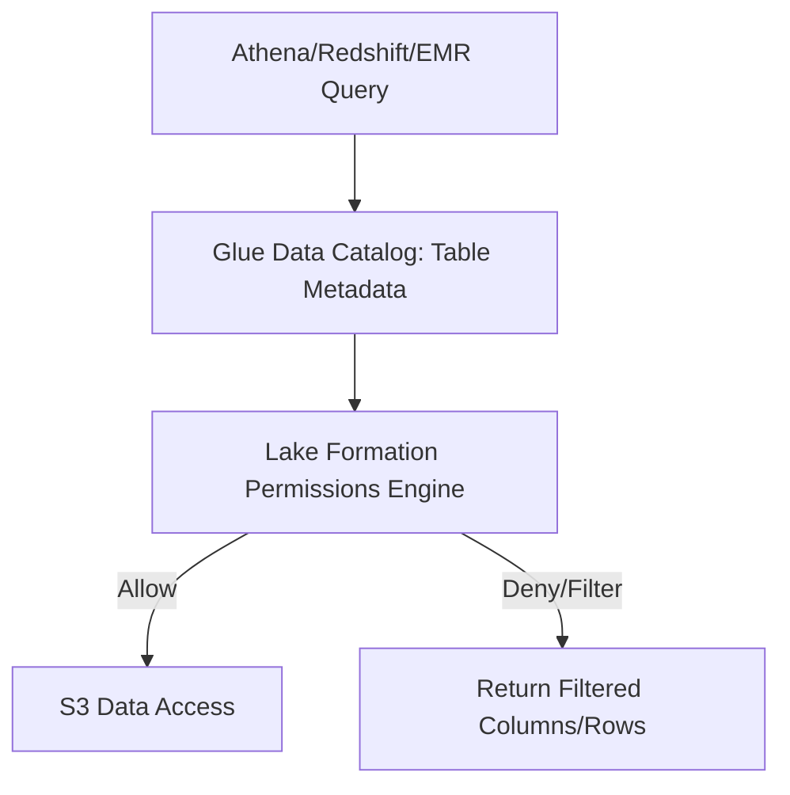
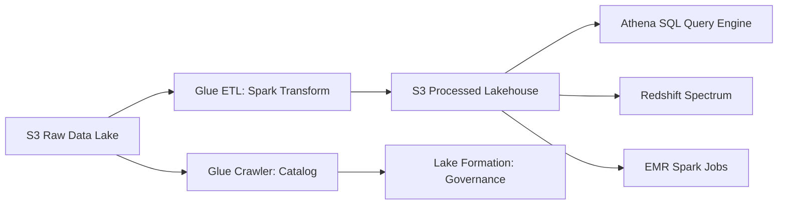

### AWS Lake Formation (Concise and To-the-Point)

AWS Lake Formation is a **data governance and security service** that helps you **build, secure, and manage** a data lake on **Amazon S3**.
It centralizes **permissions, auditing, access control, and metadata management** for all analytics engines that query S3 data.

### What Lake Formation Actually Does

### Centralized Access Control

* Controls access at **database, table, column, and row** level.
* Permissions apply across **Athena (Presto engine)**, **Redshift Spectrum**, **EMR Spark**, **Glue**, and **QuickSight**.

### Fine-Grained Permissions

* Column-level and row-level filters without copying data.
* Enforced by **Lake Formation policy engine**, not IAM alone.

### Data Catalog Integration

* Built on **AWS Glue Data Catalog**.
* Manages table metadata for S3 files (Parquet, ORC, JSON, Iceberg, Hudi).

### Simplified Data Lake Setup

* Automates:

  * S3 bucket setup
  * Glue Catalog creation
  * Security policies
  * Data ingestion workflows (optional blueprints)

### Governance and Auditing

* Tracks who accessed what data.
* Integrates with **CloudTrail**, **AWS IAM**, **KMS**, and **Glue**.

---

### Why Lake Formation Exists

Before Lake Formation:

* IAM permissions were too coarse (bucket-level only).
* No unified access control across Athena, Redshift, EMR, and Glue.
* Hard to enforce column/row filtering for sensitive data.

Lake Formation solves this by adding a **governance layer on top of S3 + Glue Catalog**.

---

### How Permissions Flow Works (Actual Components)

### Flow

1. User queries via **Athena**, **Redshift Spectrum**, or **EMR Spark**.
2. Query engine asks **Glue Catalog** for metadata.
3. Lake Formation checks **LF access control policies**.
4. If allowed, engine reads S3 objects.
5. If restricted, Lake Formation returns filtered columns/rows.

### Components that enforce the action

* **Lake Formation permissions engine**
* **Glue Data Catalog**
* **Presto/Athena**, **Redshift Spectrum**, **EMR Spark** compute engines
* **S3 storage layer**

---

### Real Example (Column-Level Permission)

Grant only `name` and `email` columns to an analyst:

```sql
GRANT SELECT(name, email)
ON TABLE customers
TO ROLE analyst_team;
```

Athena query:

```sql
SELECT name, email, salary FROM customers;
```

Returned result → only `name` and `email`, `salary` is automatically masked/denied.

Lake Formation enforces masking via the underlying **Athena/Presto engine**.

---

### Mermaid Diagram



---

### Summary (Concise)

* AWS Lake Formation = **unified governance + security layer** for S3 data lakes.
* Controls **table-level, column-level, row-level** permissions.
* Works with **Athena, Redshift Spectrum, EMR Spark, Glue, QuickSight**.
* Relies on **Glue Catalog + LF policy engine + S3**.
* Ensures secure, compliant, multi-team access to lakehouse data.

If you want, I can explain **Lake Formation vs Glue Catalog**, **how LF enforces row filters**, or a **full production-grade LF architecture**.


### Data Lakehouse Service in AWS (Concise and To-the-Point)

A **data lakehouse** on AWS is an architecture that **combines the low-cost storage of a data lake (S3)** with the **schema, ACID transactions, governance, and performance of a data warehouse**.

AWS does not have a single “lakehouse service.”
Instead, it provides a **set of components** that together form the **Lakehouse architecture**.

### Core AWS Components in a Lakehouse

### Amazon S3 (Data Lake Storage Layer)

* Stores **raw, processed, and curated** data.
* Supports structured, semi-structured, and unstructured data.
* Acts as the **single source of truth**.

### AWS Glue (Catalog + ETL)

* **Glue Data Catalog** stores table definitions for S3 data.
* **Glue ETL/Glue Spark Jobs** perform transformations.
* **Glue Crawlers** infer schema and partition structure.

### AWS Athena (Query Engine)

* Serverless **SQL engine (Presto)** that queries S3 directly.
* Performs analytics without moving data.
* Works with the Glue Catalog for schema info.

### Amazon Redshift + Redshift Spectrum (Warehouse + Lake Querying)

* Redshift stores highly structured analytical data.
* **Redshift Spectrum** allows Redshift to query **S3 data lake tables** directly.

### AWS EMR (Apache Spark Engine)

* Runs large-scale data processing on S3.
* Supports Spark, Hive, Presto, Flink—compute decoupled from storage.

### AWS Lake Formation (Governance)

* Centralized table-level, column-level, and row-level permissions.
* Integrates with Glue, Athena, EMR, Redshift.

### Apache Hudi / Delta Lake / Iceberg on AWS

* Implement **ACID transactions, time travel, schema evolution** on S3.
* Orchestrated by EMR, Glue, or Redshift Spectrum.

---

### Why the Lakehouse Model Exists in AWS

* S3 is cheap but lacks ACID and schema enforcement.
* Data warehouses are expensive but optimized.
* A **Lakehouse** gives the benefits of both by using:

  * Low-cost S3 storage
  * High-performance query engines (Athena/Redshift/EMR)
  * ACID table formats (Hudi/Iceberg/Delta)

---

### How AWS Implements a Lakehouse

### Storage Layer

* S3 buckets with partitioned Parquet/ORC files
* Optional ACID table formats (Iceberg/Hudi)

### Metadata Layer

* Glue Data Catalog (central metastore)

### Compute Engines

* Athena (Presto)
* EMR (Spark)
* Redshift Spectrum

### Governance Layer

* Lake Formation (permissions + data security)

---

### Simple Example Workflow (Close to Real Use Case)

1. Raw JSON logs land in **S3/raw** (from Kinesis/Firehose).
2. **AWS Glue Spark** converts them to Parquet, adds partitions.
3. Transformed data stored in **S3/processed**.
4. Glue Catalog registers tables.
5. **Athena** queries the data for reporting:

   ```sql
   SELECT user_id, COUNT(*) FROM logs WHERE event_date = '2025-11-22';
   ```
6. **Redshift Spectrum** joins lake data with warehouse tables.
7. **Lake Formation** controls access for teams and services.

---

### Mermaid Diagram



---

### Summary

* AWS Lakehouse = **S3 + Glue Catalog + Athena/Redshift/EMR + Lake Formation**.
* Supports both **big data (Spark)** and **SQL analytics (Athena/Redshift)**.
* Uses open table formats like **Iceberg, Hudi, Delta** to provide:

  * ACID transactions
  * Time travel
  * Schema evolution
* Reduces cost while keeping high performance.

If you want, I can also explain **Delta vs Iceberg vs Hudi in AWS**, or **a full production-grade lakehouse architecture**.


answer

Designing a secure, scalable data lake using AWS Lake Formation for multiple business units involves the following key components and best practices:

1. **Data Ingestion and Cataloging:**
   - Use AWS Glue to crawl data sources (on-premise, cloud, databases, IoT) and automatically extract schemas and metadata.
   - Store raw and curated data in Amazon S3 buckets organized with optimized partitions.
   - Lake Formation uses blueprints for orchestrating automated, incremental data loading and cataloging across various sources.

2. **Fine-Grained Permission Management:**
   - Define permissions at table, column, and row level within the AWS Glue Data Catalog objects.
   - Assign permissions to IAM users, roles, or federated Active Directory users using Lake Formation’s grant and revoke capability.
   - Lake Formation mediates all data access requests, returning temporary credentials for direct S3 object access without intermediaries, ensuring policy enforcement uniformly across analytics engines (Athena, Redshift, EMR).

3. **Cross-Account Data Sharing:**
   - Use Lake Formation resource links and AWS Resource Access Manager (RAM) to securely share table and database permissions across AWS accounts.
   - Centralize governance, while producers maintain domain-level control for schema evolution.
   - Supports tag-based access control (TBAC) to dynamically manage permissions by metadata attributes, such as cost center or data classification.

4. **Audit Logging and Compliance:**
   - Enable AWS CloudTrail to record all catalog access and modification operations.
   - Monitor data access metrics with Amazon CloudWatch and track lineage for traceability.
   - Lake Formation’s centralized policy management ensures adherence to compliance mandates such as GDPR or HIPAA.

5. **Performance and Cost Optimization:**
   - Lake Formation optimizes data layout in S3 using formats like Apache Parquet for efficient scanning.
   - Automatically partitions and indexes datasets to reduce query latency and cost.
   - Use lifecycle policies on S3 data to manage retention and archival.

This architecture enables a federated, governed data mesh approach where each business unit has autonomy within a centralized secure, compliant, and scalable data lake ecosystem.

References: AWS Lake Formation best practices and enterprise data lake architecture guidelines[1][2][3][4].

Citations:
[1] Build, secure, and manage data lakes with ... https://aws.amazon.com/blogs/big-data/building-securing-and-managing-data-lakes-with-aws-lake-formation/
[2] Design a data mesh architecture using AWS Lake ... https://aws.amazon.com/blogs/big-data/design-a-data-mesh-architecture-using-aws-lake-formation-and-aws-glue/
[3] Mastering Data Lake Best Practices with AWS https://www.techmango.net/data-lake-best-practices-for-aws/
[4] Lake Formation best practices, considerations, and ... https://docs.aws.amazon.com/lake-formation/latest/dg/lf-limitations.html
[5] Build a multi-Region and highly resilient modern data ... https://aws.amazon.com/blogs/big-data/build-a-multi-region-and-highly-resilient-modern-data-architecture-using-aws-glue-and-aws-lake-formation/
[6] 10 Data Lake Best Practices When Using AWS S3 https://www.chaossearch.io/blog/data-lake-best-practices
[7] Lake house architecture - Best Practices for Building a ... https://docs.aws.amazon.com/whitepapers/latest/best-practices-building-data-lake-for-games/lake-house-architecture.html
[8] Overview, Architecture, & AWS Lake Formation https://www.netcomlearning.com/blog/aws-data-lake
[9] A Comprehensive Guide to Building an Enterprise Data Lake ... https://hgs.tech/blog/a-comprehensive-guide-to-building-an-enterprise-data-lake-on-aws-cloud/

