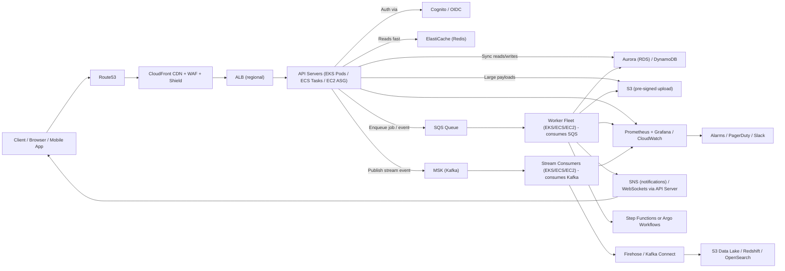

# AWS

AWS services are regional 

### List of [Global Services](GlobalServices.md)
  1. IAM
  2. Organizations
  3. Control Tower
  4. Artifact
  5. Support Center
  6. Account Manager
  7. Billing 
  8. Marketplace
  9. AWS IQ
  10. Cloudfront
  11. WAF
  12. Shield
  13. Certificate Manager
  14. Route 53

### [Well Architected](standards/well_architected/)
  1. Security
  2. Reliability
  3. Sustainability
  4. Operational Excellence
  5. Cost Optimization
  6. Performance Efficiency

## Serverless
 a **completely serverless, highly available, and massively burst-tolerant application on AWS**.
 It handles huge outbursts, availability and DR, resiliency patterns (backpressure / throttling / buffering), security/observability, deployment, and practical tradeoffs / next steps.

* Client → Route53 → CloudFront (cache) → API Gateway (+ Cognito) → SQS → Lambda → DynamoDB / S3
* For stream analytics: Lambda → Kinesis → Firehose → S3 / Redshift
* Orchestration: Step Functions (Express for high throughput)
* Notifications: SNS, EventBridge

```mermaid
flowchart LR

%% ================================
%% CLIENT + EDGE
%% ================================
A[Client / Browser / Mobile App] 
    --> B[Route 53 DNS]

B --> C[CloudFront CDN + WAF + Shield]

%% ================================
%% API LAYER
%% ================================
C --> D[API Gateway]

D -->|Auth via| E[Cognito User Pools / Federated Identity]

%% ================================
%% REQUEST HANDLING
%% ================================
D -->|Sync Ops| F["Lambda (Light API Logic)"]
F --> G["DynamoDB (On-Demand)"]
F --> H["S3 (Static / Large Payload)"]

D -->|Async Heavy Ops| I["SQS Queue (Absorb Bursts)"]

I --> J["Lambda Consumer (Scales Automatically)"]
J --> G
J --> H

%% ================================
%% STREAMING / EVENTS
%% ================================
G -.-> K[DynamoDB Streams]
K -.-> L[Lambda Stream Processor]
L -.-> M[EventBridge / SNS Fan-out]

%% ================================
%% ANALYTICS PIPELINE (Optional)
%% ================================
M --> N[Kinesis Stream / Firehose]
N --> O[S3 Data Lake / Redshift]

%% ================================
%% OBSERVABILITY
%% ================================
J --> P[CloudWatch Logs/Metrics/Alarms]
F --> P
D --> P
```

 

### 1) Architectural overview (logical components)

**Client / Edge**

* **Route 53** (DNS + failover)
* **CloudFront** (global CDN + TLS; cache static content, API caching, and reduce request load on origin)
* **WAF + AWS Shield** (protect against OWASP attacks and DDoS)

**Authentication & Edge Identity**

* **Amazon Cognito** (user sign-in, tokens, federated identity)
  *or* **AWS IAM + SigV4** for service-to-service

**API / Ingress**

* **Amazon API Gateway (HTTP / REST / WebSocket)** or **AWS AppSync** (GraphQL) as front door for client requests.

  * Enable throttling, usage plans, per-API keys, and caching.
  * Put CloudFront in front (API Gateway supports regional + edge optimized).

**Buffering & Messaging (absorbs spikes)**

* **Amazon SQS (Standard)** for loosely-coupled, burst-absorbing queueing.

  * For ordering or exactly-once semantics, use **SQS FIFO** where needed.
* **Amazon Kinesis Data Streams** or **Kinesis Data Firehose** for extremely high throughput streaming use cases (analytics / event stream) or if ordering / replay is needed.
* **Amazon SNS** for pub/sub fan-out notifications to many consumers (lambda topics, email, push).

**Compute (business logic)**

* **AWS Lambda** functions for processing events (triggered by API Gateway, SQS, Kinesis, DynamoDB Streams).
* **AWS Step Functions (Express Workflows)** for orchestrating complex or long-running workflows; use Express for high-throughput short tasks or Standard for durable long tasks.

**State & Storage**

* **Amazon DynamoDB** (NoSQL, on-demand mode or adaptive capacity, global tables for multi-region) for primary app state.
* **Amazon S3** for object storage (static assets, large payloads, event archive).
* **DynamoDB Streams** → Lambda for change capture.
* If caching is necessary and still “serverlessy”: use **DynamoDB DAX** (not fully serverless) — otherwise rely on TTL, caching via CloudFront, or client caching.

**Orchestration & Event Routing**

* **Amazon EventBridge** for event routing, schema registry, and integration with SaaS/AWS services.

**Monitoring, Observability & Ops**

* **Amazon CloudWatch** (metrics, logs, alarms)
* **AWS X-Ray** (traces)
* **AWS CloudTrail** (auditing)
* **AWS Config** (compliance)

**Secrets / Keys**

* **AWS Secrets Manager** / **AWS KMS** for secrets & encryption

**CI/CD**

* **AWS CodePipeline + CodeBuild** or **GitHub Actions** deploying via SAM / CDK / CloudFormation.

 
### 2) Data flow (typical write + burst-safe path)

1. Client ➜ Route53 ➜ CloudFront ➜ API Gateway.
2. API Gateway authenticates (Cognito) and immediately:

   * For synchronous light operations: invoke Lambda (short tasks) and return.
   * For heavy/slow work or to handle bursts: API Gateway accepts the request and places a message (pointer) into **SQS** (or posts event to **EventBridge** / **Kinesis**). Respond to client with 202 Accepted + job id.
3. **SQS** buffers traffic. One or many Lambda consumers poll SQS (concurrency controlled).
4. Lambda processors:

   * Validate message → write to **DynamoDB** or **S3** (payloads in S3 with S3 pointer in SQS for very large payloads).
   * Optionally orchestrate using **Step Functions** for multi-step processing.
   * On success: publish result via **SNS**, update a status in DynamoDB (client can poll or receive push).
5. For analytics: publish stream to **Kinesis** or Firehose (archive to S3, load into Redshift/Snowflake, etc.).

### 3) Handling huge outbursts / burst-tolerance patterns

* **Buffer requests**: Put **SQS** (or Kinesis) between API Gateway and Lambda. Queues absorb sudden spikes; Lambdas scale to consume at a controlled rate.
* **On-demand & adaptive capacity**:

  * Use **DynamoDB On-Demand** to avoid provisioning throughput limits during spikes.
  * Use **Lambda reserved concurrency** or **provisioned concurrency** for critical functions (reduce cold-start tail).
* **Lambda concurrency control**:

  * Use per-Lambda reserved concurrency to protect downstream resources (DynamoDB, external APIs).
  * Use **SQS** batch size and visibility timeout tuning to control processing rate.
* **Backpressure**:

  * If the queue grows beyond acceptable size, API Gateway can return 429 or a circuit-breaker style message; or implement exponential retry on the client.
  * Use CloudWatch alarms + automatic scaling of provisioned concurrency (or pre-warm) where needed.
* **Throttling & Rate limits**:

  * API Gateway usage plans and WAF rules to limit abusive traffic.
* **Large payloads**:

  * Upload big files directly to **S3 (pre-signed URLs)**; the API only handles metadata or pointers.
* **Fan-out processing**:

  * SNS + Lambda for parallel processing of the same event (multiple consumers).
 

### 4) High availability & multi-region / disaster recovery

* **Single-region HA**:

  * Use multi-AZ serverless services (DynamoDB, Lambda, SQS, API Gateway are regional and multi-AZ).
* **Cross-region DR / Active-Active**:

  * Use **DynamoDB Global Tables** for active-active data replication.
  * Deploy Lambda + API Gateway in multiple regions and use **Route 53 latency-based routing** or **AWS Global Accelerator** for routing and failover.
* **Stateful backups**:

  * S3 versioning + cross-region replication for critical objects.
* **RTO / RPO**:

  * Use the above to meet aggressive RTO/RPO; have runbook and automated failover.

### 5) Security & compliance essentials

* **Least privilege IAM** for Lambdas and services.
* **Data encryption** at rest (DynamoDB, S3) and in transit (HTTPS, TLS).
* **Secrets Manager** to store DB/API keys; KMS for encryption keys.
* **WAF + Shield** to prevent volumetric attacks; API Gateway throttling.
* **VPC endpoints** (Gateway/Interface) for secure connectivity to S3/DynamoDB if needed.

 

### 6) Observability & reliability

* Use **CloudWatch** metrics + dashboards for queue depth, Lambda concurrency, throttles, error rates.
* **X-Ray** for tracing API Gateway → Lambda → downstream.
* **CloudWatch Alarms** for high SQS length, Lambda errors, DynamoDB throttling.
* **Dead-Letter Queues (DLQ)** for SQS and Lambda failures; route failed events to DLQ + S3 for later replay.

 
### 7) Operational patterns & best practices

* **Use small, single-purpose Lambdas** (single responsibility) for easier scaling and deploys.
* **Idempotency**: make processors idempotent (use request IDs / DynamoDB conditional writes).
* **Batch processing**: set SQS batch size to efficiently use Lambda invocations.
* **Testing & chaos**: simulate spikes in a staging account; test chaos and recovery.
* **Cost control**: buffer with SQS and use Lambda duration optimization; consider pricing tradeoffs (DynamoDB on-demand costs vs provisioned).
* **Quotas**: be aware of account limits (Lambda concurrency, API Gateway RPS); request quota increases proactively for expected traffic profiles.

 
 

 

### 9) Deployment & CI/CD

* Define infra as code with **AWS CDK** / **SAM** / **CloudFormation**.
* Pipelines: **CodePipeline + CodeBuild** or GitHub Actions → run unit tests → deploy stacks with blue/green where relevant for Lambdas.
* Use feature flags and canary deploys (API Gateway stage variables + Lambda aliases).

 

### 10) Tradeoffs & when to choose Kinesis vs SQS

* **SQS**: simple buffering, at-least-once delivery, easy Lambda integration, near-infinite elasticity — great for job queues and buffering bursts.
* **Kinesis**: ordered streaming, replay, higher throughput per shard but needs shard management — great for analytics, event sourcing, and where strict ordering/replay is required.
* **EventBridge**: excellent for complex routing and connecting SaaS/AWS services; slower than SQS/Kinesis but powerful for event-driven architectures.

 

### 11) Implementation checklist (first 6 steps)

1. Model request flows: synchronous vs asynchronous endpoints.
2. Implement API Gateway + Cognito + CloudFront + WAF.
3. S3 presigned uploads for large payloads.
4. Set up SQS buffering and Lambda consumer prototypes (idempotent).
5. Store state in DynamoDB (on-demand) + configure Streams for downstream processing.
6. Add observability (CloudWatch, X-Ray), DLQs, and alarms.

 

### 12) Next steps

* Start with a **small pilot** of the pattern: API Gateway → SQS → Lambda → DynamoDB, and run load tests that simulate steady traffic + sudden spikes.
* Evaluate whether you need **Kinesis** for replay/ordering or **SQS** for simplicity.
* Identify the top 3 functions that need low-latency synchronous response and provision concurrency for them.
* Create runbooks for queue saturation, Lambda throttles, and cross-region failover.

 

 
* **CloudFront → API Gateway → (Sync Lambda / Async SQS) → Lambda → DynamoDB / S3 → EventBridge/SNS → Kinesis → S3/Redshift**
* SQS acts as the **burst absorber**.
* DynamoDB is **on-demand** for auto-scaling.
* Lambdas scale horizontally and consume SQS messages at a controlled rate.
* EventBridge or SNS gives **fan-out** and **event-driven extensibility**.
* CloudWatch provides observability + alarms.

## Distributed Systems 

 **cloud-native (serverful / distributed) implementation on AWS**, using *managed services and server-based components* (EKS/ECS/EC2, MSK, Aurora, ElastiCache, ALB, etc.).  high-level architecture, detailed component mapping, data-flow, scaling & HA patterns for burst-resilience, deployment/infra-as-code recommendations.

 
* API gateway → ALB → EKS/ECS/EC2
* Buffering → SQS (simple) / MSK (ordered, replay)
* Workers → EKS/ECS/EC2 consuming SQS/MSK
* DB → Aurora (RDS) / DynamoDB (if desired)
* Cache → ElastiCache (Redis)
* Storage → S3 (payloads, archives)
* Observability → CloudWatch + Managed Prometheus + Grafana + X-Ray
* Infra as code → Terraform / CDK; CI/CD via GitHub Actions / ArgoCD

cloud-native, managed or server-backed alternatives while preserving: buffering, high availability, burst resilience, observability, security, and operational patterns.

### 1) Architecture (logical components & AWS service choices)

* Edge / CDN / Security

  * Route 53 (DNS)
  * CloudFront (CDN + TLS)
  * AWS WAF + AWS Shield (edge protection)

* API / Ingress

  * ALB (Application Load Balancer) in front of HTTP endpoints (or use NLB for TCP/GRPC)
  * EC2 / ECS (Fargate) / EKS (Kubernetes) for API servers — choose EKS if you want Kubernetes ecosystem; ECS/Fargate for simpler container ops; plain EC2 ASG for traditional servers.

* Authentication / Identity

  * Amazon Cognito (managed) or an IdP (Auth0, Okta) integrated with ALB/OIDC.

* Buffering & Streaming

  * Apache Kafka (Amazon MSK) for high-throughput ordered streaming and replay.
  * Amazon SQS (standard or FIFO) as a simple managed queue option for job buffering. You can run both: SQS for simple job queueing, MSK for analytics, event sourcing, ordering, replay.

* Compute / Workers

  * EKS / ECS (Fargate) / EC2 ASGs run the worker services that consume from SQS or MSK.
  * Use Horizontal Pod Autoscaler (HPA) in EKS (based on CPU/custom metrics) or ECS Service AutoScaling, or EC2 Auto Scaling Groups.

* Orchestration / Workflows

  * Use Kubernetes (Argo Workflows) or AWS Step Functions (managed) depending on preference; Step Functions still usable as managed serverless orchestrator even when other parts are serverful.

* State & Storage

  * Amazon Aurora (MySQL/Postgres compatible, serverless v2 optional) or Amazon RDS for relational needs (transactions).
  * Amazon DynamoDB if you still want a managed NoSQL option (fully-managed hybrid).
  * Amazon S3 for object storage & archives.
  * Amazon EFS (for shared filesystem needs across pods/EC2), or FSx if you need performance.

* Cache / Low-latency store

  * Amazon ElastiCache (Redis/Memcached) — managed in-cluster or multi-AZ.

* Observability / Logging / Tracing

  * Amazon CloudWatch (metrics, logs, alarms), Amazon OpenSearch (for logs), AWS X-Ray or OpenTelemetry traces aggregated into X-Ray or a vendor.
  * Prometheus + Grafana inside EKS (or Amazon Managed Service for Prometheus and Amazon Managed Grafana).

* Secrets & Keys

  * AWS Secrets Manager and AWS KMS.

* CI/CD / Infra as Code

  * Terraform / AWS CDK / CloudFormation + GitHub Actions / CodePipeline / Argo CD for GitOps (if EKS).

# 2) Data-flow (write + burst-safe path)

Client → Route53 → CloudFront → ALB → API servers (EKS/ECS/EC2)

Two handling modes:

Synchronous (low-latency):

* API servers handle light requests directly, read/write to Aurora/DynamoDB or ElastiCache and return response.

Asynchronous (heavy / bursty):

* API servers accept request → enqueue a message:

  * Option A (simple): push to **SQS** (store large payloads to S3 and send pointer).
  * Option B (streaming/replay/ordering): publish to **Kafka (MSK)** topic.
* Worker fleet (EKS/ECS/EC2) consumes from SQS or MSK, processes jobs, updates DB (Aurora/DynamoDB) and object store (S3).
* On completion: notify via SNS (push), WebSockets (API servers), or write to DB + client polls.

Analytics:

* Use Kafka topics and Kafka Connect / Kinesis Firehose to route events to S3/Redshift/OpenSearch.

# 3) Mermaid data-flow diagram

# 4) Scaling & HA patterns (to handle bursts)

* Use **autoscaling** all the way:

  * EKS HPA (target CPU, memory, or custom metric: queue length / Kafka lag). Use KEDA for Kubernetes consumption-based autoscaling from SQS/Kafka.
  * ECS Service AutoScaling or EC2 ASG scaling policies (scale on CloudWatch metrics).
* Buffering:

  * Use **SQS** as a buffer between API servers and workers. Let queue depth drive worker scale.
  * For throughput/ordering/replay use **MSK** and scale consumers per partition; increase partitions to increase parallelism.
* Protect downstream DBs:

  * Use **connection pooling** (RDS Proxy) for Aurora to avoid connection storms.
  * Use read replicas for read-heavy workloads.
  * Use **ElastiCache** to offload reads.
* Graceful backpressure:

  * If queue grows beyond safe limits, API servers can degrade by returning 202 with queue position or 429 if unacceptable.
  * Implement retry with exponential backoff on client side.
* Provision capacity / warm pools:

  * Keep a minimum worker count or warm nodes to avoid long cold starts for heavy compute tasks.
* Storage & persistence:

  * Write large payloads to S3 directly (pre-signed URLs) and pass pointers to queue/stream.
* Partitioning:

  * Partition topics/queues by tenant / customer to avoid noisy neighbor.
* Kafka partitioning:

  * Increase partitions for higher throughput; ensure consumers scale to match.

# 5) Resilience & Disaster Recovery

* Multi-AZ for all managed services (Aurora multi-AZ, MSK multi-AZ, ElastiCache with replication, S3 cross-region replication for critical data).
* Active-passive or active-active across regions:

  * Use Aurora Global Database or cross-region read replicas for critical data.
  * MSK supports cross-cluster replication (or use MirrorMaker) if you need multi-region streaming.
  * Use Route 53 failover + global ALB / Global Accelerator to route between regions.
* Backups & retention:

  * Automated snapshots for Aurora & MSK; S3 lifecycle + replication.
* Recovery runbooks and automated failover tests.

# 6) Security & networking

* Run workloads in a VPC with private subnets for app & worker nodes, public subnets only for ALB.
* Use Security Groups + NACLs + IAM least privilege.
* Use PrivateLink / VPC Endpoints for S3, Secrets Manager, KMS, and MSK (if needed) to avoid internet egress.
* Use RDS Proxy and IAM authentication for DB access.
* Rotate secrets via Secrets Manager; encrypt with KMS.

# 7) Observability & troubleshooting

* Metrics: CloudWatch + Managed Prometheus (or self-hosted Prometheus) for app & infra metrics. Monitor queue depth, Kafka consumer lag, DB connections, CPU, memory.
* Logging: Centralize logs in CloudWatch or push to OpenSearch. Use structured logging.
* Tracing: OpenTelemetry -> X-Ray or Jaeger (deployed in EKS) to visualize request spans across ALB → API → workers → DB.
* Alerts: CloudWatch alarms + SNS → PagerDuty/Slack.

# 8) Deployment & infra-as-code

* Use Terraform or CDK to provision:

  * VPC, subnets, ALBs, EKS cluster / ECS services, MSK clusters, Aurora clusters, ElastiCache, S3, IAM roles.
* CI/CD:

  * Build container images, push to ECR.
  * Deploy to EKS with Argo CD (GitOps) or use CI pipelines (GitHub Actions / CodePipeline) to apply manifests.
* Configuration:

  * Use Helm charts and Kustomize for environment diffs.
  * Use feature flags for traffic shaping and gradual rollouts.

# 9) Trade-offs & guidance (serverful vs serverless)

* Serverful (EKS/ECS/EC2) gives finer control (better for complex networking, long-lived connections, binary dependencies, advanced stateful stream processing) but requires more ops effort (cluster management, patching, capacity planning).
* Managed services (MSK, Aurora, ElastiCache) reduce ops burden but still require capacity planning (partitions, instance sizes).
* Use a hybrid approach: keep streaming / heavy processing on managed distributed systems (MSK + EKS consumers), keep simple job-queuing via SQS and simple stateless workloads on Fargate if you want less infra friction.

# 10) Practical configuration recommendations for bursts (starting point)

* MSK: start with 3 broker nodes across AZs, 12 partitions for hot topics (adjust based on throughput). Enable encryption in transit & at rest.
* SQS: standard queue with DLQ; visibility timeout slightly larger than max processing time; monitor ApproximateNumberOfMessagesVisible.
* EKS: nodegroups with mixed instance types; set HPA with KEDA to scale based on Kafka lag or SQS visible messages; min nodes = 2–3 for redundancy.
* Aurora: instance class appropriate for load (e.g., db.r6g.large or equivalent) with writer + 2 read replicas; enable auto-scaling for replicas or Aurora Serverless v2 if variable.
* ElastiCache Redis: multi-AZ with replica and cluster-mode enabled for sharding if needed.
* RDS Proxy: enable for connection pooling.

More
- A **sequence diagram**
- A **Mermaid architecture diagram** instead of data flow
- A more detailed version with multi-region failover
  
* Produce a **Mermaid architecture diagram** showing deployments across AZs and indicate autoscaling triggers.
* Generate a **starter Terraform / CDK template** for an EKS + MSK + Aurora stack with basic networking and IAM (skeleton).
* Or convert the diagram to a **sequence diagram** showing enqueue → consume → notify flows with example metrics/thresholds.
 

 
