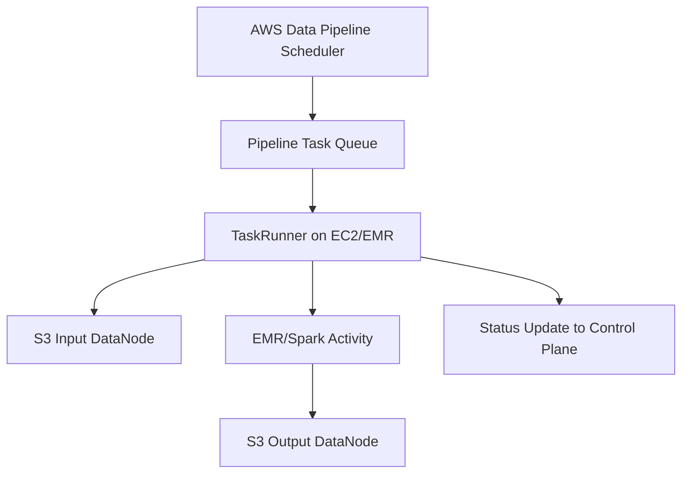

### What AWS Data Pipeline Is

AWS Data Pipeline is an **orchestration service** that automates the movement and transformation of data between AWS services and on-premise sources. It schedules, runs, and monitors data workflows using internal components such as **Pipeline Schedules**, **Activities**, **Preconditions**, and **TaskRunners**.

### Key Purpose

* Move data between S3, RDS, DynamoDB, EMR, Redshift
* Run scheduled ETL/processing jobs on EMR or EC2
* Enforce workflow dependencies and retries
* Handle failures and reprocessing automatically

### Core Components

* **Pipeline Definition**: JSON document defining data sources, activities, schedules.
* **Activities**: Steps such as running Hive/Spark on EMR, ShellCommandActivity on EC2.
* **Data Nodes**: S3 locations, RDS tables, DynamoDB tables, on-prem folders.
* **Preconditions**: Checks like S3 key existence.
* **TaskRunner**: A lightweight agent running on EMR/EC2 that polls AWS Data Pipeline to pick tasks and execute them.

### How It Works Internally

* AWS Data Pipeline service stores the **pipeline metadata**.
* On schedule triggers, the service creates **tasks** in its queue.
* **TaskRunner** (running on EC2/EMR) pulls the task via AWS APIs.
* EC2/EMR executes the actual work (Hive, Spark, Bash scripts).
* Status is pushed back to the AWS Data Pipeline control plane.

### Example Use Case

You want to run a daily Spark job on EMR to process logs and output cleaned results to another S3 bucket.

Conceptual flow:

1. S3 (raw logs) → DataNode
2. EMR cluster → Activity (EMRActivity)
3. Spark job → Transformation
4. S3 (processed output) → DataNode
5. Pipeline schedule runs daily at 1 AM

### Mermaid Diagram Showing Data Pipeline Execution

### Concise Summary

AWS Data Pipeline is mainly an orchestration layer.
It does not process data itself; EC2/EMR do the processing.
It provides scheduling, retries, dependency handling, and monitoring of data workflows across AWS services.
