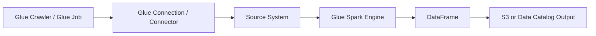

### Sources Supported for Data Ingestion via AWS Glue

AWS Glue can ingest data from **multiple AWS services**, **databases**, **file stores**, and **streaming systems**. Glue uses specific components to access these sources:

* **Glue Crawlers**
* **Glue Connectors**
* **Glue Studio / Glue Jobs (Spark, Python shell)**
* **Glue Data Catalog**
* **AWS SDK integration inside Glue Jobs**

Below is a concise list of all major source types.

---

### AWS Storage Sources

* **Amazon S3** (primary source; read/write via Glue Jobs and Crawlers)
* **Amazon DynamoDB** (Glue supports connectors + DynamoDB Export to S3)
* **Amazon Redshift** (JDBC + COPY/UNLOAD)
* **Amazon RDS** (MySQL, PostgreSQL, MariaDB, Oracle, SQL Server)

---

### AWS Analytics / Streaming Sources

* **Amazon Kinesis Data Streams**
* **Amazon Kinesis Data Firehose**
* **Amazon MSK (Managed Kafka)**
* **Self-managed Apache Kafka** via Glue Connector
* **Amazon Athena (as table metadata)**
* **Amazon OpenSearch** (via connector)

Glue Spark jobs read Kinesis/Kafka via **Spark Structured Streaming** APIs.

---

### On-Premise / External Databases (via JDBC)

* MySQL
* PostgreSQL
* Oracle
* SQL Server
* MariaDB
* DB2
* Any JDBC-supported RDBMS

These are accessed through the **Glue Connection** (JDBC connection stored in Glue Data Catalog).

---

### File-Based External Sources

* HDFS
* SFTP
* FTP
* FTPS
* NFS (when mounted through EC2 + Glue Job accessing it)
* Cloud storage APIs (Azure Blob, GCP Storage via connectors)

Glue reads these using **custom connectors** or **Spark I/O**.

---

### SaaS & Third-Party Sources (via Glue Connectors from AWS Marketplace)

Examples include:

* Salesforce
* Snowflake
* MongoDB Atlas
* SAP
* Teradata
* Google Analytics
* Workday
* ServiceNow
* Slack
* Zendesk
* JDBC-based SaaS databases

Glue loads these using **AWS Glue Marketplace Connectors**.

---

### Direct APIs (Custom Ingestion)

Using Glue Spark or Python Shell Jobs, you can ingest from:

* REST APIs
* GraphQL APIs
* gRPC endpoints (via custom client library)

Glue Spark job pulls data via **AWS SDK** or HTTP clients inside the job.

---

### How a Glue Job Reads Data (Internal Flow)

Glue uses the **Spark runtime** inside the Glue job to read, process, and write data.

---

### Concise Summary

AWS Glue can ingest data from:

* AWS services (S3, RDS, DynamoDB, Redshift, Kinesis, MSK)
* JDBC databases (on-prem and cloud)
* File systems (HDFS, SFTP, FTP)
* SaaS apps (Salesforce, Snowflake, etc.) via connectors
* APIs via custom Spark/Python code

If you want, I can generate a table mapping **source → Glue component used → required connector**.
