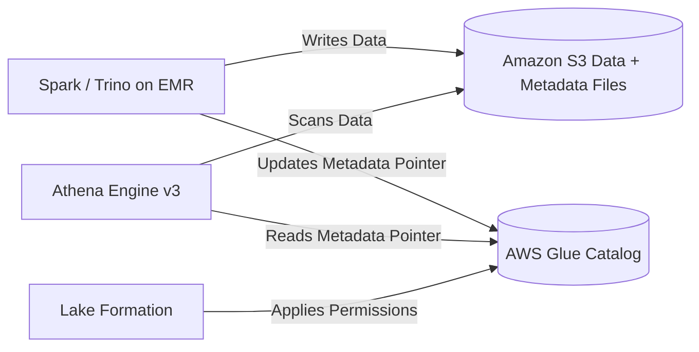
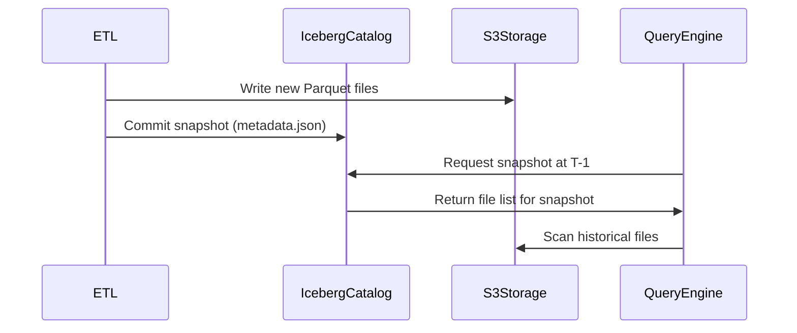
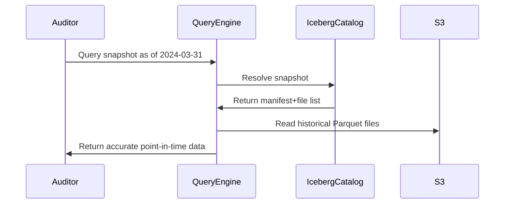
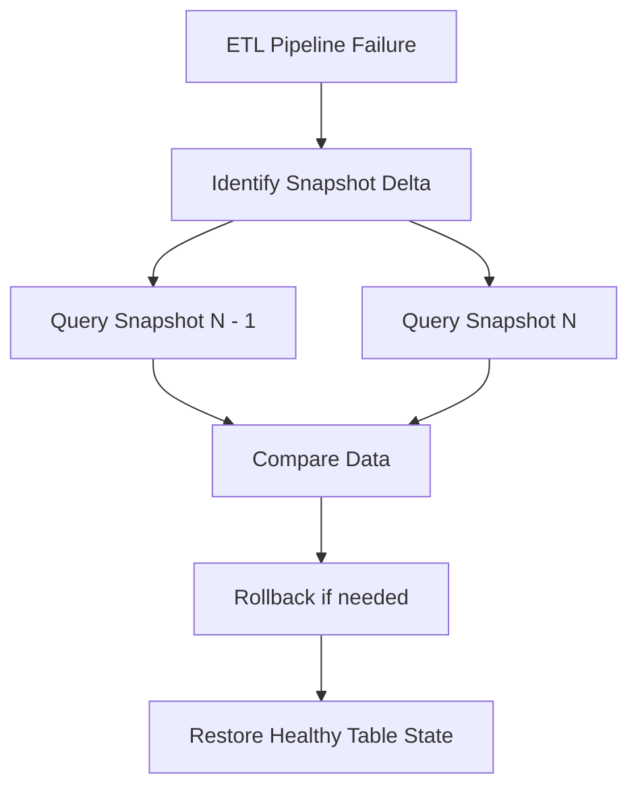

#  Apache Iceberg

Apache Iceberg is an open table format for analytic datasets stored in Amazon S3.
It provides ACID transactions, schema evolution, time-travel, and high-performance reads over large data lakes.

An open table format is a metadata layer that sits on top of data files (like [Parquet](/data-engineering/pyspark/formats/Parquet.md)
or [ORC]) in a data lake, providing database-like features such as 
- ACID transactions
- schema evolution
- time travel

It enables multiple tools to access the same data consistently by managing the table's structure and file history, and popular examples include
- Delta Lake
- Apache Iceberg
-  Apache Hudi


### How Iceberg Works Internally

Iceberg manages table metadata and data files stored in S3.
It organizes files into:

* **Metadata files** (JSON)
* **Manifest lists**
* **Manifests** (parquet metadata)
* **Data files** (Parquet/ORC/Avro)

Readers and writers use Iceberg’s metadata tree to find only the data files needed, improving performance.

### AWS Components Used With Iceberg

* **Amazon S3** stores table data + metadata
* **AWS Glue Catalog** stores Iceberg table metadata as a unified Hive-like catalog
* **Amazon EMR (Spark/Trino/Presto)** reads and writes Iceberg tables
* **AWS Athena** queries Iceberg using the Glue Catalog
* **AWS Glue ETL Jobs** perform batch processing with Iceberg
* **AWS Lake Formation** manages permissions for Iceberg tables

### Why Iceberg Is Needed

Traditional data lake files (e.g., plain Parquet in S3) cannot handle:

* ACID updates and deletes
* Concurrent writers
* Large-scale partition evolution
* Time-travel queries

Iceberg solves these by using metadata layers and snapshot isolation.

### Iceberg Table Example Structure

```
table/
  metadata/
    v1.metadata.json
    v2.metadata.json
  data/
    partition1/file1.parquet
    partition1/file2.parquet
    partition2/file3.parquet
  manifests/
    manifest1.avro
    manifest2.avro
```

### Example Query With Athena (Iceberg Table)

```
SELECT *
FROM iceberg_db.sales
WHERE date = '2025-02-21';
```

### Example Spark Write (Pseudo-Code)

```
spark.write()
  .format("iceberg")
  .mode("append")
  .save("glue_catalog.db.sales")
```

### Time Travel Query (Athena)

```
SELECT *
FROM iceberg_db.sales FOR SYSTEM_TIME AS OF '2025-01-01T00:00:00';
```

### ACID Operation Example (Update)

```
UPDATE iceberg_db.customers 
SET status = 'inactive'
WHERE last_login < '2024-01-01';
```

### How Iceberg Achieves ACID on S3

* Writers produce new data and manifest files
* A new snapshot metadata file is created
* The metadata file pointer is atomically updated in the Glue catalog
* Readers always see a consistent snapshot

### Which Component Performs Which Action

* **Spark/Trino/Presto (on EMR)** write new data + manifests
* **AWS Glue Catalog** stores the current metadata pointer
* **Iceberg Core Library** handles snapshot creation and validation
* **S3** stores data files
* **Athena Engine v3** reads Iceberg metadata + data via Glue Catalog
* **Lake Formation** applies table-level permissions

### When To Use Iceberg

* Large tables (TB–PB scale)
* Need for updates, deletes, merge operations
* Time-travel requirements
* ETL pipelines using Spark/Glue
* Data lakehouse architecture on AWS

### When Not To Use Iceberg

* Small datasets
* Low-latency OLTP queries
* Use cases that require row-level transactions beyond batch or micro-batch

### AWS Components With Iceberg



More : explain the differences between Iceberg vs Delta Lake vs Hudi, or provide a production architecture for a data lakehouse in AWS.


## Time Travel Requirement

Time travel allows a table to be queried at a specific historical version or timestamp.
It is required when users must see past states of data without restoring backups.

### Use Case 1

A data pipeline writes daily sales data.
On Monday, an incorrect ETL job corrupts the sales table.
With time travel, analysts can query the table as it existed on Sunday and run reports without waiting for full restoration.

### Why AWS Iceberg Fits This Requirement

Iceberg stores each commit as a snapshot in the table metadata.
Object storage files are immutable, so snapshots only reference the correct file set.
The Iceberg catalog in AWS (Glue Catalog or DynamoDB-backed catalog) provides fast snapshot lookup.
Engines such as Spark (JVM executors), Athena, and EMR read historical snapshots without rewriting files.
 



### Use Case 2

### Regulatory and Audit Compliance

Organizations often must reproduce the exact state of data as it existed at a specific time for legal, financial, or compliance audits.
Auditors may request:

* “Show customer balance as of 31-Mar-2024”
* “Show employee roster before the update on 01-Jan-2025”
  Time travel guarantees reproducible, point-in-time results without restoring backups.

 

Time travel enables legally required point-in-time data reconstruction, and Iceberg provides this reliably through immutable files, snapshot metadata, and fast catalog lookup.

### Immutable Data Files

Data files in S3 are immutable.
Iceberg only adds new files and never rewrites old ones unless explicitly requested.
Historical snapshots always point to the exact file list representing the table at that moment.

### Snapshot Metadata

Each snapshot contains:

* Manifest list
* Schema
* Partition specs
* Data file references
  The query engine (Spark/Flink/Trino/Athena) reads only the files referenced by the snapshot.

### Fast Lookup Through Catalog

Iceberg catalog (Glue Catalog or DynamoDB catalog) resolves historical snapshots instantly based on snapshot-id or timestamp.

### Example Query (Athena/Spark/Trino)

Query table as of a timestamp:

```sql
SELECT * FROM sales.version_as_of(TIMESTAMP '2024-03-31 23:59:59');
```

Query using snapshot-id:

```sql
SELECT * FROM sales.snapshot_id(7854321098);
```

### How Audit Teams Use It

1. A financial system updates balances daily.
2. An auditor asks for the end-of-quarter state.
3. Iceberg returns the exact data files from that day.
4. JVM inside Spark/Trino performs vectorized scans on those specific files.
5. No restore, no duplication, no downtime.

 



 
### Use Case 3 
### Next Important Use Case of Time Travel

### Debugging and Root-Cause Analysis

When a data pipeline produces incorrect outputs, teams must inspect the exact table state **before and after** the failure to identify what changed and why.

### Why This Matters

Pipelines on Spark/Flink/Kafka often run multiple times per day.
A single bad ETL run can:

* Insert corrupted rows
* Duplicate data
* Drop partitions
* Break metrics or dashboards

Without time travel, reproducing the “good” state is extremely difficult.

### How Iceberg Solves This

### Snapshot-by-Snapshot Comparison

Iceberg keeps a full list of snapshots with timestamps and operation types (append, overwrite, delete).
This lets engineers quickly identify the exact snapshot that introduced corruption.

### Query Before and After Snapshots

```sql
-- Good state (before pipeline failure)
SELECT * FROM sales.snapshot_id(12345);

-- Bad state (after pipeline failure)
SELECT * FROM sales.snapshot_id(12346);
```

### Minimal File Re-Scan

Iceberg manifests point to only the changed files.
Query engines such as Spark or Trino (JVM execution) scan only new/modified Parquet files, making comparison fast.

### Fast Rollback

Rollback restores the table pointer to the earlier snapshot without reloading data.

```sql
CALL iceberg.system.rollback_to_snapshot(
  table => 'sales',
  snapshot_id => 12345
);
```

 



### One-Line Summary

Time travel enables fast debugging by letting engineers compare table states across snapshots and instantly roll back bad pipeline writes using Iceberg’s snapshot system.


## Reducing Cost When Using Daily Snapshots in Iceberg

 

Control retention, compact files, avoid rewrites, and use cheaper S3 storage classes to minimize Iceberg snapshot storage costs.

### Problem Summary

Iceberg snapshots track metadata and file references.
Daily snapshots can accumulate many old data files, increasing S3 storage cost.

### Cost-Reduction Techniques

### Use Snapshot Expiration

Remove old snapshots while retaining only required history.
Iceberg automatically deletes unreferenced data files.

```sql
CALL iceberg.system.expire_snapshots(
  table => 'db.sales',
  older_than => TIMESTAMP '2024-10-01'
);
```

### Use Retention Policies Instead of Daily Full Snapshots

Keep only N days of history (ex: 7 or 30), not every snapshot.

```sql
ALTER TABLE db.sales SET TBLPROPERTIES (
  'history.expire.max-snapshot-age-ms'='604800000'
);
```

### Enable File-Level Compaction

Compaction merges many small Parquet files into fewer large files.
This reduces metadata and lowers S3 GET cost because query engines scan fewer files.

Using Spark on EMR:

```sql
CALL iceberg.system.rewrite_data_files(
  table => 'db.sales'
);
```

### Use Partition Evolution Instead of Rewrites

If daily partitions are rewritten, costs increase.
Partition evolution avoids rewriting historical partitions and lowers snapshot size.

### Use Position Delete Files Instead of Data File Rewrites

If corrections only delete or update rows, position-delete files avoid rewriting whole Parquet files.

This reduces S3 PUT costs and file churn.

### Enable Metadata Compaction

Iceberg supports metadata file cleanup to avoid large metadata chains.

```sql
CALL iceberg.system.rewrite_manifests('db.sales');
```

### Use S3 Storage Classes for Cold Data

Move historical partitions to lower-cost storage using lifecycle rules.

* S3 Standard → Frequent queries
* S3 Standard-IA → Less frequent
* S3 Glacier Instant Retrieval → Archival snapshots

### Example S3 Lifecycle Policy

Move files older than 30 days to Infrequent Access.

### When To Avoid Daily Snapshots

If the data is append-only and stable, keep fewer snapshots.
Snapshots are cheap; *old data files* cost money.


