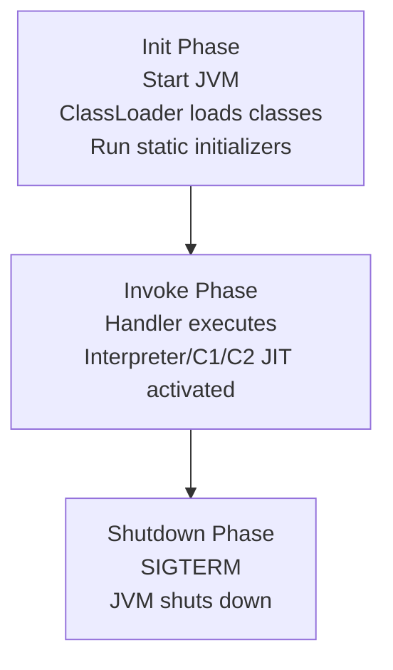

###  AWS Lambda question

Explain how AWS Lambda initializes and manages the execution environment lifecycle, including Init Phase, Invoke Phase, and Shutdown Phase, and describe how you would optimize a Java-based Lambda function to minimize cold start latency. Your answer should include exact JVM components involved in startup, class loading, and JIT behavior. Also provide a concise example showing how to move heavy initialization into the Init Phase.


### Lambda execution environment lifecycle

### Init phase

* Triggered when Lambda creates a new sandbox.
* Performs:

  * **Runtime bootstrap** (for Java: starts JVM).
  * **Class loading** using **JVM ClassLoader**.
  * **Static initializers** execution.
  * **Dependency loading** into JVM heap.
  * **JIT compiler warm-up** does not run here; JVM begins in interpreter mode.
* One-time per environment unless a new environment is created.
* Heavy work in this phase increases **cold start**.

### Invoke phase

* Lambda handler is executed.
* JVM switches between **interpreter**, **C1 compiler**, and **C2 compiler** depending on hotspot thresholds.
* Execution is fast if Init phase is optimized.
* Environment is reused for future invocations.

### Shutdown phase

* Triggered after a long idle period or scaling down.
* Lambda sends a SIGTERM to runtime.
* JVM shutdown hooks run if registered.
* Environment is destroyed along with heap, JIT cache, and class metadata.

### Optimizing Java Lambda for cold start

### Key improvements

* Reduce classpath size to minimize **ClassLoader tree traversal**.
* Avoid heavy static initializers; move to handler-level caching.
* Use **Provisioned Concurrency** to keep JVM warm.
* Use **GraalVM native-image** for lowest cold start (no JIT, no JVM).
* Keep dependencies minimal so **JVM bootstrap sequence** is shorter.
* Use AWS SnapStart (Java 11/17) which restores the JVM from a checkpoint, bypassing bootstrap, JIT warmup, and class loading.

### Pseudocode: moving heavy work to Init phase

```java
public class Handler implements RequestHandler<Input, Output> {

    private final ConnectionPool pool; // heavy initialization

    public Handler() {
        // Runs in Init phase once
        this.pool = new ConnectionPool(
            "jdbc:mysql://db.example.com",
            20         // prewarm connections
        );
    }

    @Override
    public Output handleRequest(Input input, Context context) {
        // Runs in Invoke phase
        var conn = pool.getConnection();
        return process(input, conn);
    }
}
```

### Mermaid diagram: Lambda lifecycle with JVM components



If you want, I can ask you the next difficult question on Lambda networking internals, file system behavior (/tmp), or async delivery retries.
