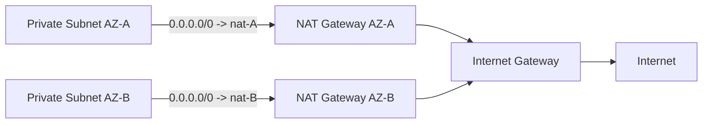

Here is a **difficult AWS networking question** suitable for a real AWS Solution Architect interview:

---

## **Difficult AWS Networking Question**

**You have a VPC with:**

* **CIDR:** `10.0.0.0/16`
* **Two private subnets:** `10.0.1.0/24` (AZ-A) and `10.0.2.0/24` (AZ-B)
* **Two public subnets:** `10.0.3.0/24` (AZ-A) and `10.0.4.0/24` (AZ-B)
* **A NAT Gateway only in AZ-A (public subnet 10.0.3.0/24)**
* **Route table for both private subnets points to this single NAT Gateway**
* **EC2 Auto Scaling Group spanning both private subnets**

### **Suddenly you observe that all instances in AZ-B start failing outbound traffic to the internet, but AZ-A instances work fine. Internal VPC communication works.**

### **Question:

Explain all possible reasons why this is happening, in detail, including AZ-level failure scenarios, NAT Gateway routing behavior, packet flow, and cross-AZ data path limitations. Also describe the correct AWS-recommended architecture to avoid this issue.**

---

If you want, I can also share:

✅ **A full, optimized answer**
✅ **A diagram**
✅ **Follow-up questions**

Just say **“share answer”**.

### Problem recap (concise)

Private instances in AZ-B cannot reach the internet; AZ-A instances work; internal VPC traffic works. The private subnets in both AZs point to a single NAT Gateway located in AZ-A.

### Key AWS components involved (explicit)

Route table (per private subnet), NAT Gateway (created in a subnet/ENI in a specific AZ), Internet Gateway, ENI of NAT Gateway, VPC regional backbone (AZ-to-AZ links), Network ACLs, Security Groups, VPC Flow Logs / CloudWatch, AWS control plane (partition/health status).

### Packet flow for an outbound packet (normal case)

1. EC2 (AZ-B, private subnet) sends packet → destination 0.0.0.0/0.
2. Route table lookup → next-hop = NAT Gateway (the NAT has an ENI in subnet in AZ-A).
3. Packet travels over the VPC regional network from AZ-B → AZ-A to NAT Gateway ENI.
4. NAT Gateway performs SNAT (source IP → Elastic IP) and forwards to Internet Gateway → internet.
5. Return packets follow reverse path: Internet → IGW → NAT Gateway → VPC backbone → target instance.

### All plausible root causes (detailed, ordered by likelihood)

### Route table / configuration errors

* Private subnet in AZ-B has the wrong route (e.g., missing/incorrect 0.0.0.0/0 entry or points to a non-existent NAT/instance). Component: **Route Table**.
* Route table accidentally associated only with AZ-A private subnet; AZ-B private subnet still uses default/local route.

### AZ-to-AZ networking issue (inter-AZ connectivity partial outage)

* The VPC regional backbone between AZ-B and AZ-A is degraded for that AZ pair; packets can’t reach the NAT ENI in AZ-A. Component: **VPC regional network / AWS fabric**.
* Symptoms: AZ-A instances (local to NAT) work; AZ-B cannot reach NAT even though route points to it.

### NAT Gateway outage or resource exhaustion (AZ-A side) with asymmetric effects

* NAT Gateway in AZ-A is unhealthy or overloaded causing it to drop connections that originate from remote AZs while local AZ traffic still succeeds (possible if internal path handling differs). Component: **NAT Gateway / its ENI**.
* NAT Gateway has hit connection-tracking or throughput limits (rare but possible at very high connection rates), causing new flows from AZ-B to be rejected.

### Network ACL or Security Group misconfiguration specific to AZ-B subnet

* A Network ACL on AZ-B private subnet denies outbound ephemeral ports or return traffic. Component: **Network ACL**.
* A Security Group was changed to block egress from instances in AZ-B or block traffic from the NAT ENI (unlikely because SGs are stateful, but mis-configured SGs on the NAT ENI can block return).

### Source/destination check or custom NAT instance misconfiguration

* If you used a NAT **instance** (not NAT Gateway) in AZ-A and Source/Dest check is enabled/incorrect or the instance has failed ENI routes, cross-AZ traffic could be broken. Component: **EC2 NAT instance / ENI / source/dest check**.

### Elastic IP / Internet Gateway or egress path problem local to AZ-B traffic

* If NAT GW has lost its Elastic IP mapping or IGW has transient failure that only impacts cross-AZ flows, you’ll see asymmetric behavior. Component: **Elastic IP / Internet Gateway**.

### AWS control-plane or AZ-level maintenance / hardware fault

* An AWS internal event affecting only cross-AZ networking or the NAT subsystem in that AZ. Check Personal Health Dashboard. Component: **AWS control plane / AZ health**.

### Mis-routed responses due to asymmetric routing or custom appliances

* If there is a transit appliance, firewall, or TGW attachment that treats AZ-B traffic differently, replies may be dropped. Component: **Network Firewall / Transit Gateway / route propagation**.

### How to verify quickly (debug checklist, concise)

* Verify route table for AZ-B private subnet: `0.0.0.0/0 -> nat-xxxx` (Route Tables console / CLI).
* Check NAT Gateway health/CloudWatch metrics: ActiveConnections, BytesOut, PacketsOut, Error metrics. Component: **CloudWatch + NAT metrics**.
* Inspect VPC Flow Logs for AZ-B private ENIs (rejects, RSTs, no-forwarding). Component: **VPC Flow Logs**.
* Check Network ACLs and Security Groups for AZ-B subnets and NAT ENI.
* Use Reachability Analyzer (VPC Reachability Analyzer) from an AZ-B instance to NAT ENI.
* Check AWS Personal Health Dashboard / Service Health for partial AZ outages.
* If using NAT instance, check instance routing, source/dest check, and instance system logs.

### What happens when partition/quotas are exceeded (brief)

If NAT Gateway is overloaded: new connections can be dropped; existing established flows may continue briefly; CloudWatch will show increased Errors/Rejected/Throttled; client retries see timeouts. Component: **NAT Gateway connection-tracking / throughput limits**.

### Immediate mitigations (fast, low friction)

* Re-associate AZ-B private subnet to a NAT Gateway **in the same AZ** (create NAT GW in AZ-B and change private route table to point to the AZ-local NAT). This is fastest mitigation. Components: **NAT Gateway per AZ + Route Table change**.
* If traffic is to S3/other AWS services, create **VPC Endpoints** (Gateway/Interface) so traffic bypasses NAT. Component: **VPC Endpoint (S3/GW or Interface)**.
* Use SQS/Kinesis buffer to absorb bursts so clients retry less frequently.

### Long-term recommended architecture (AWS best practice, explicit)

* **Provision one NAT Gateway per AZ** and configure each private subnet’s route table to use the NAT Gateway in its AZ. (Route tables are per subnet; associate private-subnet-A → nat-A, private-subnet-B → nat-B.) Components: **Route Tables, NAT Gateway per AZ**.
* Alternatively, use **NAT instances per AZ with Auto Scaling and Elastic IPs** if you need custom inspection (but NAT Gateway managed service is preferred). Components: **Auto Scaling group of NAT instances + ENIs**.
* For high-volume S3/ecr traffic, use **Gateway VPC Endpoint for S3** and **Interface Endpoints** for other services to eliminate NAT egress for those services. Components: **VPC Endpoint (Gateway/Interface)**.
* For central egress patterns across many VPCs, use **centralized egress VPC with Transit Gateway + NATs per AZ** with proper HA and scaling. Components: **Transit Gateway, TGW attachments, NAT per AZ**.
* Monitor CloudWatch metrics and configure alarms: `NatGatewayBytesOut`, `ActiveConnections`, `ThrottledRequests`, `NetworkAclRejects`. Components: **CloudWatch Alarms**.

### Preventive practices and cost/availability tradeoffs (concise)

* One NAT per AZ increases cost (Elastic IP + NAT hourly), but prevents single-AZ NAT failure from breaking cross-AZ subnets. This is the recommended HA pattern.
* Using VPC Endpoints reduces NAT costs and improves reliability for AWS service traffic.

### Small mermaid diagram of correct (recommended) design and packet flow

### Final concise recommendation

Create a NAT Gateway in every AZ and point each private subnet’s route table to the NAT in the same AZ. Add VPC Endpoints for heavy AWS-service egress. Use CloudWatch + Flow Logs + Reachability Analyzer to rapidly diagnose any future failures.
