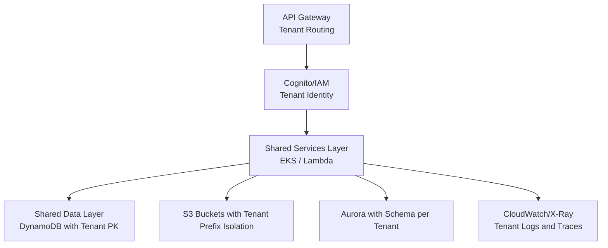

# What Is Multi Tenancy

Multi tenancy is an architecture where **multiple customers (tenants)** share the same infrastructure, compute, storage, and services—but **remain isolated in data, security, performance, and access control**. AWS provides patterns, services, and standards to implement tenant isolation at **network**, **storage**, **application**, and **identity** layers.

### Multi Tenancy Models In AWS

AWS recognizes three common models:

1. **Silo Model**
   Each tenant gets separate AWS resources.
   Highest isolation, highest cost.

2. **Pool/Shared Model**
   All tenants share the same infrastructure.
   Lower cost, requires stronger logical isolation.

3. **Bridge Model**
   Critical components isolated, others shared.
   Balanced cost and control.

### [System Design](cloud/aws/system-design/tenant_isolation.md)

multi-entity application supports multiple independent business entities

### Multi Tenancy Standards And AWS Components

Below are the AWS standards, with explicit mention of which AWS component performs the isolation action.

#### Identity and Access Isolation

* **AWS Cognito / IAM**
  Tenant identity separation via user pools, identity pools, IAM policies.
  Access scoped using IAM roles with **tenant-scoped permissions**.

#### Network Isolation

* **Amazon VPC**
  Separate [VPC per tenant](cloud/aws/ec2/tenant_isolation_vpc.md)   silo or shared VPC with tenant-defined **Security Groups**, **NACLs**, and **Routing rules**.
* **AWS Transit Gateway**
  Controls multi-tenant routing domains.

#### Data Isolation

* **Amazon DynamoDB**
  Tenant partition key strategy or per-tenant tables.
* **Amazon S3**
  [Tenant prefixes](cloud/aws/s3/tenant_isolation.md)  with IAM policies restricting access; optionally **S3 Access Points**.
* **Amazon RDS / Aurora**
  Schema-per-tenant (shared) or database-per-tenant (silo).

#### Compute Isolation

* **AWS EKS**
 [Tenant separation](devOps/kubernetes/multi_tenant.md) via **namespaces, NetworkPolicies, PodSecurityPolicies**, and **resource quotas**.
  Kubelet enforces namespace-level isolation.
* **AWS Lambda**
  Each invocation runs in its own micro VM via AWS Firecracker for tenant isolation.
* **EC2**
  Account-level isolation using separate instances and security groups.

#### Deployment and Configuration Isolation

* **AWS CloudFormation / CDK**
  Per-tenant stack deployment for silo model.
* **AWS Parameter Store / Secrets Manager**
  Tenant-specific secrets with IAM-scoped access.

#### Observability Isolation

* **CloudWatch Logs and Metrics**
  Tenant-specific log groups and metric namespaces.
* **AWS X-Ray**
  Tenant ID passed in segment annotations to isolate traces.


### Multi Tenancy Standards And Patterns Recommended By AWS

AWS publishes SaaS multi-tenancy standards, which map to common architectural best practices:

#### Standard 1: Tenant Identity Propagation

Every request carries a **tenant ID** through:

* JWT (Cognito-issued)
* HTTP headers
* Message metadata (Kafka headers, SQS message attributes)

Application enforces isolation via **tenant ID lookups**.

#### Standard 2: Fine-Grained IAM Policies

IAM policies use **tenant-scoped resource ARNs**:

```
"Resource": "arn:aws:s3:::myapp/tenant123/*"
```

#### Standard 3: Data Partitioning Standard

Use one of the following:

* **Silo**: Separate DB/schema per tenant
* **Shared**: Tenant key in each row
* **Shard**: Tenant → database node mapping

#### Standard 4: Performance Isolation

Use:

* Application-level rate limiting
* AWS API Gateway throttling per tenant
* EKS namespace resource quotas
* DynamoDB partition-key design for fair throughput

#### Standard 5: Logging and Monitoring Isolation

Include tenant ID in:

* CloudWatch log group names
* Metric namespaces
* X-Ray annotations

#### Standard 6: Deployment Isolation

Tenants classified by tier:

* Basic tenants → shared environments
* Premium tenants → dedicated DB, dedicated compute


### Multi Tenancy Architecture Diagram (Mermaid)



### Summary

AWS multi-tenancy relies on isolation provided by:

* IAM/Cognito for identity
* VPC/Security Groups/NACLs for network
* DynamoDB/S3/Aurora for data
* EKS/Lambda/EC2 for compute
* CloudWatch/X-Ray for observability

Choose **silo**, **shared**, or **bridge** architecture depending on cost, isolation, and operational needs.

