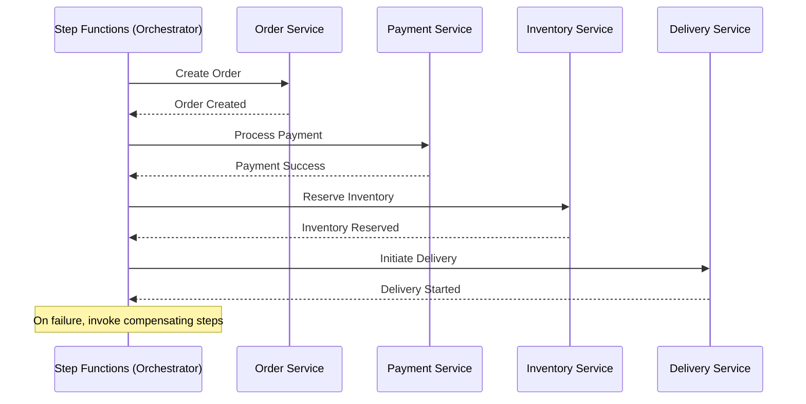

### Workflow

1. **Microservice orchestration** – Coordinate multiple AWS Lambda functions and ECS tasks with retries and error handling.
2. **ETL pipelines** – Orchestrate Glue jobs, EMR steps, and S3 data movement with clear state transitions.
3. **Saga pattern implementation** – Manage distributed transactions with compensating actions across services.
4. **Order processing workflows** – Validate orders, process payments, update inventory, and trigger delivery sequentially.
5. **Human approval workflows** – Pause execution and wait for manual approval using task tokens.
6. **Machine learning pipelines** – Chain data preprocessing, model training, evaluation, and deployment steps.
7. **Batch job coordination** – Control long-running batch jobs with timeouts and parallel execution.
8. **Event-driven workflows** – React to S3, EventBridge, or SNS events and route logic conditionally.
9. **Data validation pipelines** – Perform multi-step data quality checks before publishing datasets.
10. **Cross-account automation** – Orchestrate resource provisioning and operations across multiple AWS accounts.

### Saga Pattern 

1. **Saga pattern can be implemented using both orchestration and choreography**, depending on control requirements.
2. **Orchestration** uses a central controller (for example AWS Step Functions) to invoke services and trigger compensating actions.
3. **Choreography** relies on services reacting to events via Kafka producers, brokers, and consumers without a central coordinator.


### Saga Orchestration Using AWS Step Functions (Mermaid + Code)

#### Mermaid Diagram (Orchestration)



---

### Step Functions State Machine (Amazon States Language)

#### Orchestration with Compensation

```json
{
  "Comment": "Saga Orchestration using Step Functions",
  "StartAt": "CreateOrder",
  "States": {
    "CreateOrder": {
      "Type": "Task",
      "Resource": "arn:aws:lambda:region:acct:function:createOrder",
      "Next": "ProcessPayment",
      "Catch": [{ "ErrorEquals": ["States.ALL"], "Next": "FailSaga" }]
    },
    "ProcessPayment": {
      "Type": "Task",
      "Resource": "arn:aws:lambda:region:acct:function:processPayment",
      "Next": "ReserveInventory",
      "Catch": [{ "ErrorEquals": ["States.ALL"], "Next": "CancelOrder" }]
    },
    "ReserveInventory": {
      "Type": "Task",
      "Resource": "arn:aws:lambda:region:acct:function:reserveInventory",
      "Next": "StartDelivery",
      "Catch": [{ "ErrorEquals": ["States.ALL"], "Next": "RefundPayment" }]
    },
    "StartDelivery": {
      "Type": "Task",
      "Resource": "arn:aws:lambda:region:acct:function:startDelivery",
      "End": true
    },

    "RefundPayment": {
      "Type": "Task",
      "Resource": "arn:aws:lambda:region:acct:function:refundPayment",
      "Next": "CancelOrder"
    },
    "CancelOrder": {
      "Type": "Task",
      "Resource": "arn:aws:lambda:region:acct:function:cancelOrder",
      "Next": "FailSaga"
    },
    "FailSaga": {
      "Type": "Fail",
      "Cause": "Saga execution failed"
    }
  }
}
```

---

### Key Execution Details

* **AWS Step Functions** acts as the **Saga orchestrator**
* Each **Task state** invokes a service (Lambda / ECS / HTTP)
* **Catch blocks** define compensating actions
* State transitions are durable and replayable
* No service-to-service coupling; all coordination via Step Functions

If you want, I can also:

* Convert this to **ECS or HTTP-based services**
* Show the **choreography version using Kafka**
* Map this to a **Spring Boot microservices implementation**


1. Save the JSON as an **Amazon States Language** definition and create the state machine using the **AWS Step Functions console** or **AWS CLI**.
2. The Step Functions service validates the JSON and deploys it as a managed workflow.
3. Each `Task` state invokes the referenced AWS Lambda or service when the state machine executes.


1. **AWS Step Functions persists execution state** (current step, input, output) in its **managed internal state store** before invoking any Lambda.
2. Each state transition is **durably checkpointed**, so progress is never kept in memory.
3. On execution, Step Functions reads the **last persisted state** to determine the current state.
4. Only after state persistence does it invoke the Lambda for that state.
5. This guarantees **exactly-once state transitions** even across retries, failures, or restarts.


An **execution** in AWS Step Functions is a **single running instance of a state machine**.

1. When you start a state machine, Step Functions creates a **new execution** with a unique execution ID.
2. This execution contains the **current state name, input JSON, output JSON, and execution history**.
3. Step Functions persists this execution metadata in its internal state store.
4. When resuming, retrying, or moving to the next step, Step Functions reads the **execution’s stored state** to know exactly where it left off.
5. Each order, job, or request typically maps to **one execution** of the workflow.


You **start the state machine once per order** — each order maps to **one execution** of the Step Functions workflow.

### How many times to start it

1. For **every “Create Order” request**, start the state machine **exactly once**.
2. Retries, failures, and compensations happen **inside the same execution**, not by restarting it.

### Steps to start the state machine

1. **Client (API Gateway / service)** receives the Create Order request.
2. The client calls **`StartExecution`** on AWS Step Functions with the order payload.
3. Step Functions creates a **new execution ID** and persists the initial input.
4. The workflow begins at the **`StartAt` state** (`CreateOrder`).
5. Step Functions invokes the Lambda for that state and manages all subsequent transitions.


When a user calls the **Create Order API**, API Gateway starts the Step Functions state machine using a **direct AWS service integration** (or via Lambda).

### How API Gateway Starts the State Machine

1. **API Gateway receives the HTTP request** from the client and validates it (request mapping, auth).
2. API Gateway uses an **AWS service integration** to call **Step Functions `StartExecution` API**.
3. An **IAM role attached to API Gateway** authorizes `states:StartExecution` on the target state machine.
4. API Gateway maps the HTTP request body into the **execution input JSON**.
5. Step Functions creates a **new execution** and starts from the `StartAt` state.

### Typical Integration Setup

* API Gateway Integration Type: **AWS Service**
* AWS Service: **Step Functions**
* Action: **StartExecution**
* IAM Role: Allows `states:StartExecution`

### Execution Flow

```text
Client → API Gateway
       → AWS Step Functions (StartExecution)
       → Execution created
       → CreateOrder state invoked
```

### Alternative (Lambda in between)

* API Gateway → Lambda → Step Functions
  Used when:
* You need custom validation
* Dynamic state machine selection
* Pre-processing logic

### Key Point

API Gateway **does not manage workflow state**.
It only **starts the execution once**; Step Functions fully manages state, retries, and compensation afterward.


Below are **both ways to start an AWS Step Functions state machine**, with **exact code**.

---

### Case 1: API Gateway → Step Functions (Direct Integration, No Lambda)

**API Gateway integration request mapping (StartExecution)**
This is configured in **API Gateway → Integration Request**.

```json
{
  "stateMachineArn": "arn:aws:states:us-east-1:123456789012:stateMachine:OrderSaga",
  "input": "$util.escapeJavaScript($input.body)"
}
```

**IAM role for API Gateway**

```json
{
  "Effect": "Allow",
  "Action": "states:StartExecution",
  "Resource": "arn:aws:states:us-east-1:123456789012:stateMachine:OrderSaga"
}
```

Flow:

```
Client → API Gateway → Step Functions (StartExecution)
```

Used when:

* Simple request passthrough
* No preprocessing logic
* Lower latency

---

### Case 2: API Gateway → Lambda → Step Functions

**Lambda code (Java example)**

```java
import software.amazon.awssdk.services.sfn.SfnClient;
import software.amazon.awssdk.services.sfn.model.StartExecutionRequest;

public class StartOrderSaga {

    private static final SfnClient sfn = SfnClient.create();

    public void handleRequest(String inputJson) {

        StartExecutionRequest request =
            StartExecutionRequest.builder()
                .stateMachineArn("arn:aws:states:us-east-1:123456789012:stateMachine:OrderSaga")
                .input(inputJson)
                .build();

        sfn.startExecution(request);
    }
}
```

**Lambda IAM role**

```json
{
  "Effect": "Allow",
  "Action": "states:StartExecution",
  "Resource": "arn:aws:states:us-east-1:123456789012:stateMachine:OrderSaga"
}
```

Flow:

```
Client → API Gateway → Lambda → Step Functions
```

Used when:

* Validation or enrichment required
* Conditional saga selection
* Business logic before workflow start

---

### Key Difference

* **API Gateway direct** → fastest, simplest
* **Lambda intermediary** → flexible, extensible

In both cases, **each API call starts exactly one execution**, and **Step Functions fully manages state afterward**.


