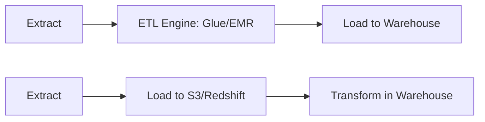

answer

Designing a secure, scalable, and cost-effective data lake on AWS to handle petabytes of structured and unstructured data involves the following components:

1. **Data Ingestion:** Use services like AWS Glue, AWS Data Pipeline, or Amazon Kinesis to ingest data from multiple heterogeneous sources into Amazon S3, the scalable storage layer for the data lake.

2. **Storage:** Store raw data in Amazon S3 with appropriate partitioning and lifecycle policies to optimize cost and performance. Use S3 Intelligent-Tiering and lifecycle rules for cost management.

3. **Data Cataloging and Governance:** Employ AWS Glue Data Catalog and AWS Lake Formation for metadata management, data classification, and fine-grained access controls. Lake Formation enforces security policies and access governance across data producers and consumers.

4. **Data Processing and Transformation:**
   - Use AWS Glue or Amazon EMR (with Apache Spark or Hive) to clean, transform, and curate the raw data.
   - Use ETL or ELT approaches depending on use case complexity, leveraging Amazon Redshift Spectrum or Athena for querying data directly in S3.

5. **Data Access and Analytics:**
   - Enable self-service analytics via Amazon Athena for ad-hoc querying.
   - Use Amazon Redshift for scalable data warehousing and Amazon SageMaker for machine learning workflows on curated datasets.

6. **Security and Compliance:** Implement encryption at rest and in transit using AWS KMS. Use IAM roles and policies for secure data access. Audit data activities via AWS CloudTrail and monitor with CloudWatch.

7. **Data Lifecycle Management:** Employ S3 object versioning, replication, and lifecycle transitions to manage data retention and archival automatically.

8. **Governance and Auditing:** Track data lineage, access, and modifications using Lake Formation and AWS CloudTrail to ensure compliance with regulatory standards.

This architecture allows for scalable, secure, and governed data lakes that support advanced analytics and machine learning while optimizing cost and operational complexity[1][2][3][4][5].

Citations:
[1] Design patterns for an enterprise data lake using ... https://aws.amazon.com/blogs/big-data/design-patterns-for-an-enterprise-data-lake-using-aws-lake-formation-cross-account-access/
[2] Data Lake Architecture: Components, Diagrams, & Layers https://estuary.dev/blog/data-lake-architecture/
[3] ETL and ELT design patterns for lake house architecture ... https://aws.amazon.com/blogs/big-data/etl-and-elt-design-patterns-for-lake-house-architecture-using-amazon-redshift-part-1/
[4] Design a data mesh architecture using AWS Lake ... https://aws.amazon.com/blogs/big-data/design-a-data-mesh-architecture-using-aws-lake-formation-and-aws-glue/
[5] Architectural Patterns for Data Lakes on AWS https://www.youtube.com/watch?v=XpTly4XHmqc
[6] Data lake design patterns and principles https://docs.aws.amazon.com/whitepapers/latest/best-practices-building-data-lake-for-games/data-lake-design-patterns-and-principles.html
[7] AWS Data Lake: Architecture, Best Practices and Tutorials https://www.upsolver.com/aws-data-lake
[8] Most Common Data Architecture Patterns For ... https://aws.plainenglish.io/most-common-data-architecture-patterns-for-data-engineers-to-know-in-aws-72bc6ea81ed
[9] A Guide to AWS Data Lakes https://pcg.io/insights/guide-aws-data-lakes/
### ETL vs ELT

### ETL (Extract → Transform → Load)

ETL means **data is transformed before loading into the target system**.
The transformation occurs inside a **dedicated ETL engine** such as:

* AWS Glue (Spark engine)
* Informatica
* Talend
* Apache NiFi
* On-prem ETL servers

#### Workflow

1. **Extract** data from source
2. **Transform** it in an ETL engine (Spark, Python, JVM-based tools)
3. **Load** transformed/cleaned data into target (usually a **data warehouse**)

#### Characteristics

* Used in **traditional data warehouses** (Oracle, Teradata, SQL Server)
* Requires **predefined schema** (schema-on-write)
* Works well for **smaller, structured datasets**
* Transformation happens before storage → slower ingestion but cleaner final data

#### When ETL is preferred

* Data warehouse cannot handle heavy transformations
* Strict compliance or data quality is needed upfront
* Targets like **Oracle, PostgreSQL, MySQL, SQL Server**
* Batch workflows with limited volume

---

### ELT (Extract → Load → Transform)

ELT means data is **first loaded into storage (data lake/warehouse) and then transformed**.
Transformations occur inside the **target system** like:

* AWS Athena (Presto)
* AWS EMR (Spark)
* Amazon Redshift (MASSIVELY PARALLEL PROCESSING)
* BigQuery / Snowflake

#### Workflow

1. **Extract** raw data
2. **Load** raw data directly into S3/Redshift
3. **Transform** using the warehouse/lake (SQL, Spark)

#### Characteristics

* Used in **modern data lakes & cloud warehouses**
* Follows **schema-on-read**
* Faster ingestion (dump raw data first)
* Suited for **big data** (TBs → PBs)
* Enables **reprocessing** using Spark or SQL

#### When ELT is preferred

* Using **S3 + Athena + Glue**, **Redshift**, **Snowflake**, **BigQuery**
* Large semi-structured data: JSON, logs, IoT, clickstream
* Need flexible schema evolution
* ML pipelines using S3 + EMR/Spark

---

### Key Differences

| Feature                      | ETL                              | ELT                                           |
| ---------------------------- | -------------------------------- | --------------------------------------------- |
| Where transformation happens | ETL engine (Spark, Informatica)  | Data warehouse/lake (Redshift, Athena, Spark) |
| Best for                     | Traditional DW                   | Big Data / Cloud DW                           |
| Schema                       | Schema-on-write                  | Schema-on-read                                |
| Speed                        | Slower ingestion, faster queries | Fast ingestion, transform later               |
| Cost                         | Higher ETL tool cost             | Efficient on cloud compute                    |
| Data type suitability        | Structured only                  | Works with structured + semi-structured       |

---

### Real Cloud Example (Relevant Components)

#### ETL Example (AWS Glue ETL Job)

* **AWS Glue Spark** extracts from RDS
* Cleans and transforms
* Loads into **Redshift fact tables**

#### ELT Example (Modern Lakehouse)

* Raw data dumped into **S3**
* Transform using:

  * **Athena (Presto engine)**
  * **EMR Spark executors**
  * **Redshift Spectrum**

---

### Mermaid Diagram

If you want, I can also cover **ETL vs ELT performance**, **cost comparison**, or **when companies choose one over the other**.
