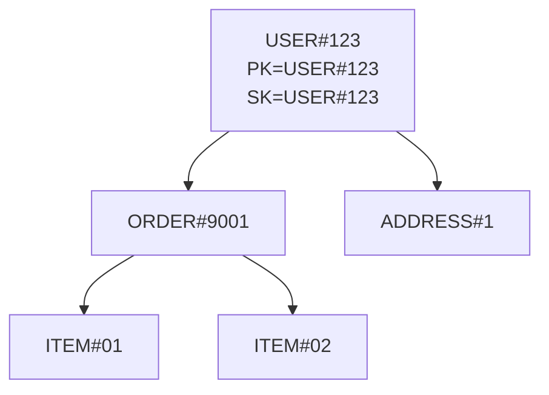

### ### What Is Single Table Design in DynamoDB

A **Single Table Design (STD)** is a modeling technique where **all entities of an application are stored in a single DynamoDB table**, using **composite keys**, **generic indexes**, and **item types** instead of separate tables.
It is a *design pattern*, not a DynamoDB feature.

The goal is to optimize for **access patterns**, not relational normalization.

---

### ### Why Amazon Recommends It

* DynamoDB is **not relational**; joins are expensive.
* STD allows **low-latency queries**, **fewer RCUs/ WCUs**, and **simpler scaling**.
* Enables fetching **all related data in a single query** (partition key = entity boundary).

---

### ### Core Concepts

DynamoDB items use:

```
PK  (Partition Key)
SK  (Sort Key)
```

Plus additional attributes.

In Single Table Design:

* **PK groups related entities**
* **SK defines ordering/time/type**
* **All item types share the same table**
* **GSI enables alternate query patterns**

---

### ### Item Structure (Generic)

```
PK      | SK             | EntityType | Attributes...
-------------------------------------------------------
USER#1  | USER#1         | User       | name, email
USER#1  | ORDER#100      | Order      | amount, date
USER#1  | ORDER#101      | Order      | amount, date
USER#1  | ADDRESS#10     | Address    | city, zip
```

PK = parent entity
SK = child entities ordered by creation or type

---

### ### Example: E-commerce Multi-Entity Application

#### Entities:

* User
* Order
* OrderItems
* Address

#### Access patterns:

1. Get user → user profile
2. List user orders
3. Get order + order items
4. List user addresses
5. Query by email (via GSI)

STD stores all in **one table**.

---

### ### Table Layout

```
PK           | SK              | Type        | Data ...
-----------------------------------------------------------------
USER#123     | USER#123        | User        | name=John, email=j@a.com
USER#123     | ORDER#9001      | Order       | total=2500, status=PAID
USER#123     | ORDERITEM#01    | OrderItem   | sku=ABC, qty=1
USER#123     | ORDERITEM#02    | OrderItem   | sku=XYZ, qty=2
USER#123     | ADDRESS#1       | Address     | city=DEL, zip=110001
```

---

### ### Query Examples

#### Fetch user + all details

```
Query:
PK = "USER#123"

Result:
- User
- Orders
- OrderItems
- Addresses
```

This is the reason STD exists.

---

### ### Using GSIs for Secondary Access Patterns

Example: Query user by email.

```
GSI1PK = "EMAIL#j@a.com"
GSI1SK = "USER#123"
```

So you can do:

```
GSI1PK = EMAIL#j@a.com → fetch USER#123
```

---

### ### Advantages

#### 1. **Related data in one partition**

Very fast **Query** instead of multiple table reads.

#### 2. **Scales automatically**

Partitions split by key distribution.

#### 3. **Cheaper than multiple tables**

One table → fewer read/write costs.

#### 4. **No joins required**

The table design itself models relationships.

#### 5. **Fit for event-driven microservices**

Entities stored with flexible attributes.

---

### ### Disadvantages

#### 1. **Schema complexity**

Developers must think in **access patterns**, not entities.

#### 2. **Harder to debug**

Mixing item types in one table requires good naming conventions.

#### 3. **Write amplification**

You may write duplicate data to support GSIs.

#### 4. **Not ideal for ad-hoc analytics**

DynamoDB is OLTP, not OLAP.

---

### ### Design Guidelines

#### 1. Use **entity prefixes**

```
USER#id
ORDER#id
ADDRESS#id
```

#### 2. Define access patterns **before** writing schema

DynamoDB is *query-driven design*.

#### 3. Add GSIs only for necessary queries

Avoid many GSIs → cost.

#### 4. Store denormalized data

Instead of joins, copy required fields.

---

### ### Example Mermaid Diagram



---

### ### When to Use Single Table Design

Use it when:

* You have **defined access patterns**
* Hierarchical or parent-child relationships
* High scale OLTP use cases
* Microservices event-based apps

Avoid when:

* Complex ad-hoc queries
* Heavy analytics on the same store (use S3/Glue instead)

---

### If you want, I can generate:

* A full **production-grade Single Table Design** for your multi-entity HR system
* Java Spring Boot DynamoDB repositories
* Access pattern diagrams
* Naming conventions + GSIs for each entity


List common access patterns and corresponding GSIs for single table design

Common access patterns and their corresponding Global Secondary Indexes (GSIs) in DynamoDB single-table design include:

| Access Pattern                                  | Example Query                                     | Corresponding GSI Design                                                |
|------------------------------------------------|-------------------------------------------------|------------------------------------------------------------------------|
| Retrieve all items for a specific entity type  | Get all orders for a customer                     | GSI with `GSI_PK = CUSTOMER#<id>` and `GSI_SK = ORDER#<order-date>`    |
| Reverse lookup by a different attribute        | List all orders by product                         | GSI with `GSI_PK = PRODUCT#<id>`, `GSI_SK = ORDER#<order-date>`        |
| Filter by status or state                        | Get all jobs/items in a certain status            | GSI with `GSI_PK = STATUS#<status>`, `GSI_SK = <timestamp or id>`        |
| Query by date ranges                             | List orders placed within a date range            | Sort key using ISO date format enabling efficient range queries        |
| Many-to-many relationships                       | Find all employees assigned to a territory        | GSI with `GSI_PK = TERRITORY#<id>`, `GSI_SK = EMPLOYEE#<id>`           |
| Lookup by non-key attribute (e.g., username)   | Retrieve user by username                          | GSI with `GSI_PK = USERNAME#<username>`                                |
| Aggregation or summary items                     | Count of players per team                          | GSI with a static partition key (e.g., `GSI_PK = TEAM#<id>`, static SK) to hold aggregated data |
| Event sourcing or history tracking               | Retrieve audit logs or event history for entity   | GSI with `GSI_PK = ENTITY#<id>` and `GSI_SK = EVENT#<timestamp>`        |

GSIs create alternate composite keys (partition key + sort key) that facilitate efficient queries for specific access patterns without scanning the main table. They allow denormalizing and reorganizing data logically to cover diverse querying needs while maintaining single-table design.

Each GSI is populated automatically and asynchronously in DynamoDB, and they each have separate read/write capacity units, enabling isolated scaling for different query workloads.

Choosing the right GSIs depends on anticipated query patterns and balancing efficient access with partition key distribution to prevent hot partitions.

This strategic use of GSIs enhances the query flexibility and scalability of DynamoDB single-table designs[1][2][4][6][7].

Citations:
[1] DynamoDB Single Table Design - How to use a GSI? https://dev.to/aws-builders/dynamodb-single-table-design-how-to-use-a-gsi-26eo
[2] Part 1: Refactoring to single-table design in Amazon DynamoDB https://emshea.com/post/part-1-dynamodb-single-table-design
[3] DynamoDB Single-Table Design for Advanced Set of ... https://stackoverflow.com/questions/75866418/dynamodb-single-table-design-for-advanced-set-of-access-patterns
[4] Example of modeling relational data in DynamoDB https://docs.aws.amazon.com/amazondynamodb/latest/developerguide/bp-modeling-nosql-B.html
[5] Creating a single-table design with Amazon DynamoDB https://aws.amazon.com/blogs/compute/creating-a-single-table-design-with-amazon-dynamodb/
[6] What Are the Best Practices for DynamoDB Relational ... https://hevodata.com/learn/dynamodb-relational-modeling/
[7] From relational DB to single DynamoDB table https://www.trek10.com/blog/dynamodb-single-table-relational-modeling
[8] The What, Why, and When of Single-Table Design with ... https://alexdebrie.com/posts/dynamodb-single-table/
[9] DynamoDB Single Table Design: Strategic Key Design and ... https://pravin.dev/posts/dynamodb-single-table-design/
next difficult question on DynamoDB

A difficult DynamoDB question could be:

"What are the key challenges and trade-offs when implementing advanced single-table designs in DynamoDB? How do you handle issues like hot partitions, large item sizes, write amplification due to denormalization, and maintaining transactional integrity across multiple entity types in a single table? Additionally, discuss strategies to balance read/write capacity units and optimize for both latency and cost."

This question probes the candidate's deep understanding of DynamoDB internals, data modeling challenges, and real-world trade-offs when designing scalable, performant NoSQL applications [1][3][4][8].

Citations:
[1] DynamoDB deep dive: Advanced design patterns https://www.youtube.com/watch?v=xfxBhvGpoa0
[2] Advanced Single Table Design Patterns With DynamoDB https://dev.to/urielbitton/advanced-single-table-design-patterns-with-dynamodb-4g26
[3] Advanced data modeling with Amazon DynamoDB https://reinvent.awsevents.com/content/dam/reinvent/2024/slides/dat/DAT404_Advanced-data-modeling-with-Amazon-DynamoDB.pdf
[4] AWS re:Invent 2018: Amazon DynamoDB Deep Dive https://www.youtube.com/watch?v=HaEPXoXVf2k
[5] DynamoDB Deep Dive for System Design Interviews https://www.hellointerview.com/learn/system-design/deep-dives/dynamodb
[6] LADV: Advanced Design Patterns for Amazon DynamoDB https://000039.awsstudygroup.com/3-ladv/
[7] Best practices for designing and architecting with DynamoDB https://docs.aws.amazon.com/amazondynamodb/latest/developerguide/best-practices.html
[8] DynamoDB Design Puzzlers | AWS Events https://www.youtube.com/watch?v=RXYfm2OMFbc


answer

Single-table design in DynamoDB offers significant advantages in scalability and query efficiency but introduces several challenges and trade-offs:

### 1. Complexity and Application Logic
- Managing all entities in a single table can get complex as the application grows.
- Requires careful upfront planning of access patterns to model data efficiently.
- Application code must handle the interpretation of overloaded keys (e.g., partition and sort keys that represent multiple entity types).
- Harder to evolve and extend with new features or access patterns without table redesign or data migration.

### 2. Index Overhead and Management
- Use of Global Secondary Indexes (GSIs) increases cost and complexity.
- GSIs have separate throughput capacity and asynchronous replication causing eventual consistency issues.
- Overloaded GSI keys can make it difficult to track what each index field means, increasing cognitive load.
- GSI pollution: unrelated item types can intermingle in the same index, complicating queries and maintenance.

### 3. Partition Key Selection and Hot Partitions
- Poor partition key design leads to uneven data distribution, causing hot partitions and performance bottlenecks.
- Needs strategies like key sharding and distribution patterns to mitigate.

### 4. Schema Evolution Challenges
- DynamoDB’s schemaless nature aids flexibility but changing access patterns often requires significant application and data migration efforts.
- Adding new entity types or query capabilities might require extensive refactoring.

### 5. Limited Query Flexibility
- Although powerful for intended access patterns, DynamoDB queries cannot perform full relational joins and complex ad-hoc queries like SQL.
- Requires denormalization or item duplication for certain use cases, trading off storage and write amplification.

### 6. Consistency and Transactional Integrity
- Handling transactional operations across multiple related items can be complicated and expensive performance-wise.
- DynamoDB supports transactions but with limitations in throughput and latency.

### Summary
Single-table design excels for applications with well-known, stable query patterns requiring high throughput and low latency. However, it requires expertise in NoSQL modeling and careful consideration of trade-offs in complexity, maintainability, and flexibility. It is not always the best fit if query flexibility or ease of analytics is a priority[1][2][3][7].

Citations:
[1] Mastering Single Table Database Design with DynamoDB https://www.datacamp.com/tutorial/single-table-database-design-with-dynamodb
[2] The What, Why, and When of Single-Table Design with ... https://alexdebrie.com/posts/dynamodb-single-table/
[3] Problems with DynamoDB Single Table Design https://nordcloud.com/tech-community/problems-with-dynamodb-single-table-design/
[4] Advanced Single Table Design Patterns With DynamoDB https://dev.to/urielbitton/advanced-single-table-design-patterns-with-dynamodb-4g26
[5] Common Single-Table design modeling mistakes with ... https://www.youtube.com/watch?v=XMEkNZby95M
[6] On DynamoDB's Single Table Design - madhead https://madhead.me/posts/std/
[7] Best practices for designing and architecting with DynamoDB https://docs.aws.amazon.com/amazondynamodb/latest/developerguide/best-practices.html
[8] When To Use And Not To Use The Single Table Design ... https://aws.plainenglish.io/when-to-use-and-not-to-use-the-single-table-design-in-dynamodb-67a77bc9238e
[9] Lessons learned using Single-table design with ... https://www.rwilinski.me/blog/dynamodb-single-table-design-lessons/
