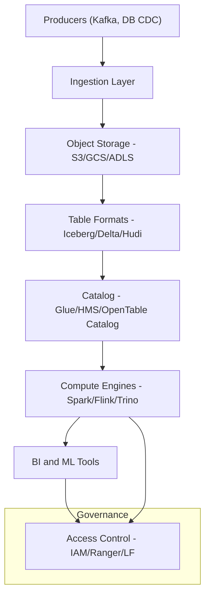
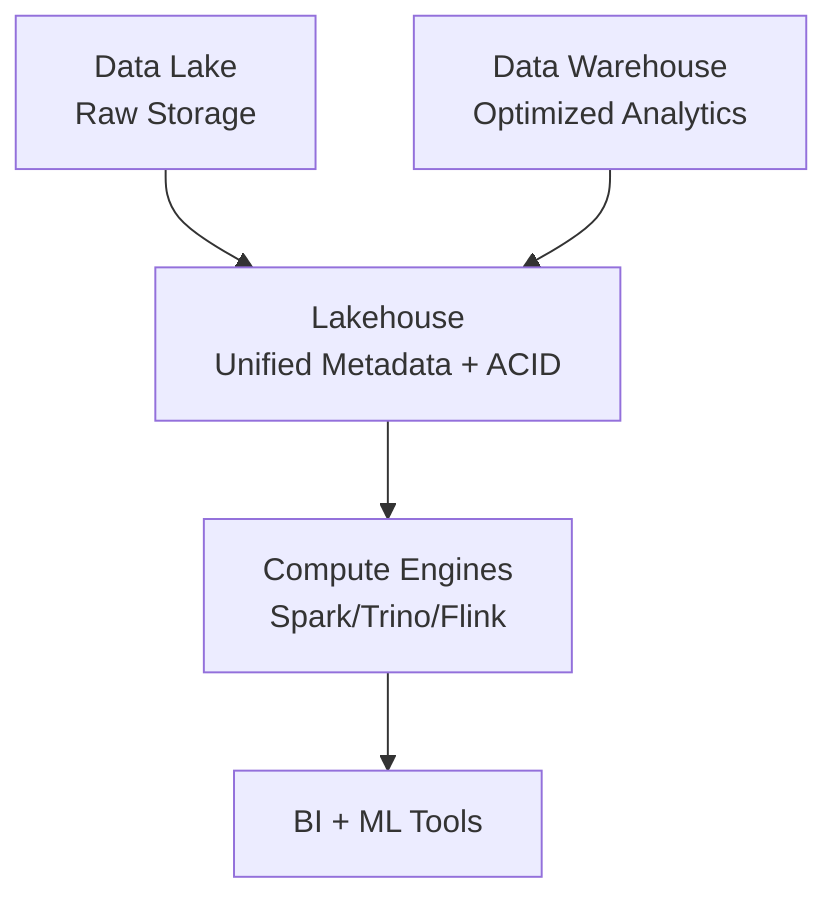

### Lakehouse Architecture

A Lakehouse is a unified architecture that combines the low-cost scalable storage of a data lake with the ACID guarantees and schema management of a data warehouse.
It stores raw, processed, and analytical data in a single object store (S3, ADLS, GCS) while enabling SQL analytics, ML, and streaming workloads.

### Core Layers

### Storage Layer

Object storage (S3, ADLS, GCS) stores raw files such as Parquet, ORC, Avro.
It is immutable and handles durability and replication using the underlying cloud storage API.

### Metadata and Table Format Layer

Defines how tables store schemas, partitions, snapshots, indexes, and statistics.
Common table formats include Iceberg, Delta Lake, Hudi, OpenTable.
Metadata enables features such as ACID transactions, time travel, and predicate pushdown.

### Compute Layer

Engines such as Spark (driver and executors), Flink (task managers), Trino (workers), and Presto query data via table format APIs.
JVM inside these engines applies query plans, vectorized reads, and operators during execution.

### Governance and Security Layer

Includes IAM policies, Ranger, Lake Formation, Kerberos.
Controls column-level permissions, auditing, and access logs.

### Ingestion Layer

Captures data from Kafka brokers, Kinesis, database CDC, or batch ETLs.
Writers perform record-level commits and handle schema evolution.

### Catalog Layer

Stores table definitions in a central service such as Glue Catalog, Hive Metastore, or Iceberg REST catalog.
Compute engines contact this catalog to resolve table paths and schemas.

### Consumption Layer

BI tools like Athena, Trino, Presto, Spark SQL, and DuckDB read data directly from object storage through the table format.

 

### Workflow 

1. Kafka broker receives streaming events.
2. Spark Structured Streaming writes Parquet files to S3 using Iceberg writer.
3. Iceberg writes metadata and commits snapshots in the catalog.
4. Trino or Athena queries S3 data using the Iceberg table metadata.
5. JVM inside these engines performs predicate pushdown and vectorized scans.

### Data Lake vs Data Warehouse vs Data Lakehouse

A data lake is raw storage, a warehouse is optimized analytics, and a lakehouse merges both by adding warehouse features (ACID, schema, performance) directly on top of lake storage.

### Data Lake

Stores raw, semi-structured, and unstructured data cheaply on object storage such as S3/ADLS/GCS.
No built-in ACID transactions, weak schema enforcement, and relies on engines like Spark for processing.

### Data Warehouse

Stores fully structured, cleaned, and optimized data inside proprietary storage engines such as Snowflake, Redshift, BigQuery.
Provides ACID, indexing, cost-based optimizers, and very fast SQL analytics.

### Data Lakehouse

Combines the low-cost storage of lakes with the ACID guarantees and analytical capabilities of warehouses.
Uses table formats such as Iceberg, Delta, Hudi, and OpenTable to add schema enforcement, time travel, and transactions on object storage.

### Feature Comparison Table

| Feature            | Data Lake                    | Data Warehouse               | Data Lakehouse                |
| ------------------ | ---------------------------- | ---------------------------- | ----------------------------- |
| Storage            | Object storage (S3/GCS/ADLS) | Proprietary columnar storage | Object storage                |
| Data Types         | Raw and unstructured         | Structured only              | Structured + semi-structured  |
| ACID Support       | None                         | Full                         | Full via table formats        |
| Schema Enforcement | Weak                         | Strong                       | Strong                        |
| Query Performance  | Medium                       | Very high                    | High with pushdown/metadata   |
| Cost               | Low                          | High                         | Low–Medium                    |
| Optimizer          | Engine-dependent (Spark)     | Integrated CBO               | Engine CBO + metadata         |
| Time Travel        | No                           | Yes                          | Yes                           |
| Streaming Writes   | External tools               | Limited                      | Built-in (Hudi/Iceberg/Delta) |
| Use Cases          | Raw storage, ML              | BI, dashboards               | Unified ML + BI               |

### Conceptual Diagram

 
