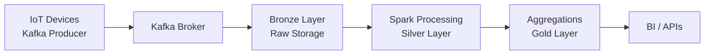

### What Is Medallion Data Architecture

Medallion architecture is a **layered data design** that incrementally improves data quality and structure as data flows from **raw ingestion to business-ready analytics**. It is commonly used in data lakes and lakehouses.

---

### Core Layers Overview

The architecture is organized into **Bronze, Silver, and Gold layers**, each with a clear responsibility and data contract.

---

### Bronze Layer (Raw Data)

Purpose: **Ingest data as-is with minimal transformation**

Characteristics:

* Append-only
* Schema-on-read
* Full fidelity of source data
* Used for replay and audits

Example use case:
IoT devices sending telemetry via Kafka

Components involved:

* Kafka producer (device gateway)
* Kafka broker (log storage)
* Kafka consumer (ingestion service)
* JVM (deserialization)
* Linux kernel (network I/O, epoll)
* Object store API (S3 / HDFS)

Example schema:

```sql
device_id STRING
event_ts  TIMESTAMP
payload   JSON
ingest_ts TIMESTAMP
```

Pseudo ingestion logic:

```java
KafkaConsumer.poll()
  -> JVM deserializes bytes
  -> write raw JSON to bronze storage
```

---

### Silver Layer (Cleansed & Enriched Data)

Purpose: **Validate, clean, deduplicate, and normalize data**

Characteristics:

* Structured schema
* Data quality checks
* Deduplication
* Enrichment with reference data

Example use case:
Validating IoT signal ranges and removing duplicates

Components involved:

* Spark executor (data processing)
* JVM (Spark runtime)
* Kafka consumer (optional reprocessing)
* PostgreSQL CBO (query optimization on lookup tables)
* Linux file system cache

Example transformation:

```sql
SELECT
  device_id,
  event_ts,
  CAST(payload->>'temp' AS DOUBLE) AS temperature
FROM bronze_events
WHERE payload->>'temp' IS NOT NULL
```

Pseudo processing flow:

```text
Spark task reads bronze files
-> JVM executes transformations
-> invalid records filtered
-> output written to silver tables
```

---

### Gold Layer (Business-Ready Data)

Purpose: **Optimized data for analytics and reporting**

Characteristics:

* Aggregated
* Denormalized
* Query-optimized
* SLA-backed datasets

Example use case:
Hourly average temperature per device

Components involved:

* Spark SQL engine
* PostgreSQL / Greenplum CBO
* BI query engine
* JVM (SQL execution)
* Linux memory manager (page cache)

Example aggregation:

```sql
SELECT
  device_id,
  date_trunc('hour', event_ts) AS hour,
  AVG(temperature) AS avg_temp
FROM silver_signals
GROUP BY device_id, hour
```

---

### Data Flow Diagram



---

### Data Quality Responsibility by Layer

* Bronze: None (trust the source)
* Silver: Validation, deduplication, normalization
* Gold: Business rules, KPIs, metrics correctness

---

### Schema Evolution Handling

* Bronze: Store raw JSON, no schema enforcement
* Silver: Versioned schemas, backward compatibility
* Gold: Controlled schema changes only

---

### Performance Optimization Strategy

* Bronze: Sequential writes, no indexes
* Silver: Partitioning, minimal indexes
* Gold: Aggregations, columnar formats, heavy indexing

---

### Kubernetes Deployment Mapping

Components involved:

* kubelet mounts volumes and manages pods
* Spark driver pod coordinates jobs
* Spark executor pods process partitions
* Container runtime executes JVM processes

Execution flow:

```text
kubelet -> starts Spark executor container
-> JVM runs task
-> reads partition
-> writes transformed data
```

---

### Kafka Role in Medallion Architecture

* Kafka producer: emits raw events
* Kafka broker: durable commit log
* Kafka consumer: feeds Bronze or Silver pipelines
* Consumer group: enables horizontal scaling

---

### Oracle / PostgreSQL Usage Pattern

* Bronze: rarely queried
* Silver: validation joins using CBO
* Gold: star-schema style analytics
* CBO chooses hash joins and parallel scans

---

### Why Medallion Architecture Works

* Clear separation of concerns
* Easy reprocessing from Bronze
* Scales with data volume
* Enables governance and observability
* Aligns with batch and streaming systems

---

### Common Mistakes

* Applying business logic in Bronze
* Skipping Silver and going straight to Gold
* Over-aggregating Gold data
* Not defining data contracts per layer

---

### When Medallion Architecture Is Best

* Streaming + batch workloads
* IoT, clickstream, logs
* Analytics-heavy platforms
* Regulated data environments

---

### Key Takeaway

Medallion architecture provides **predictable data quality, scalability, and operational clarity** by progressively refining data from raw events to business-grade insights using well-defined layers and responsibilities.
